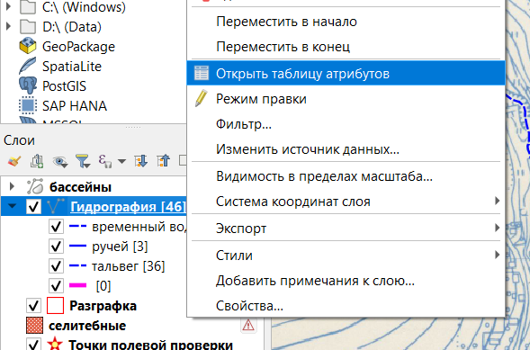
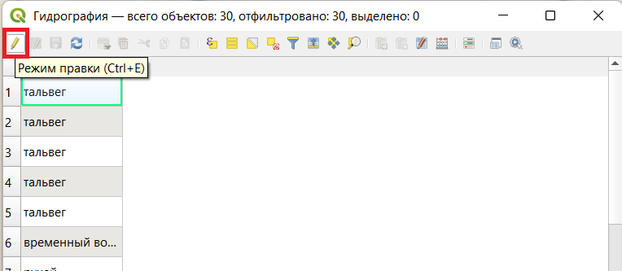
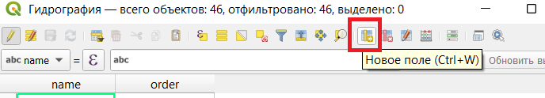
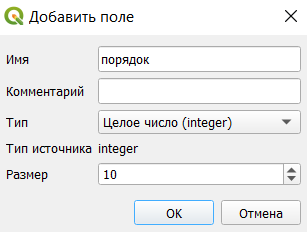

## Добавление нового поля в таблицу атрибутов

Нажимаем правой кнопкой мыши на нужный слой и открываем таблицу атрибутов.

Включаем режим правки.

Нажимаем на кнопку создания нового поля.

Откроется окно где можно настроить свойства поля по заданию.

