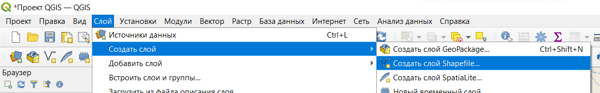
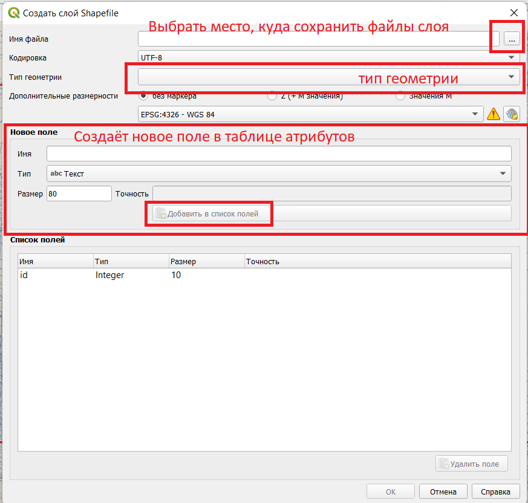
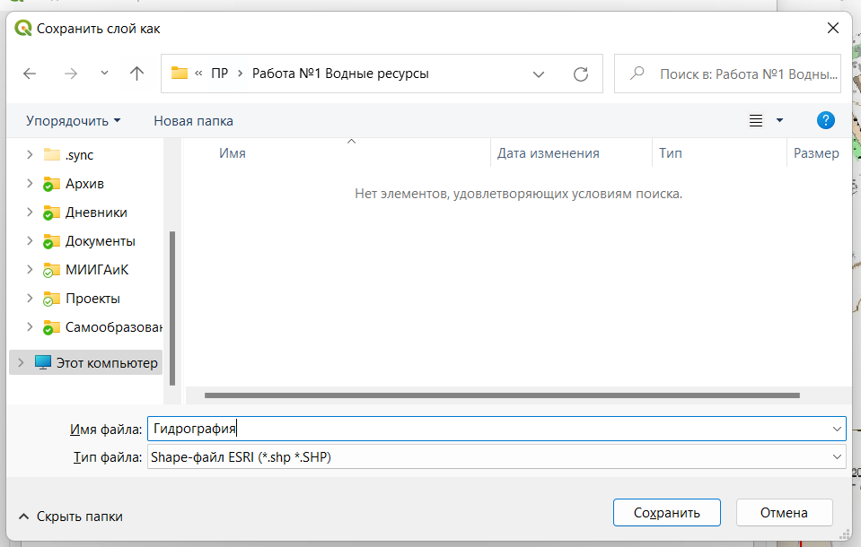

## Создание слоя

Для того чтобы создать слой, нужно в верхнем меню выбрать вкладку "Слой" и раскрыть меню "Создать слой". Затем выбрать тип слоя. В большинстве случаев это будет слой Shapefile.

Затем откроется окно свойств слоя. В нём можно указать имя слоя или путь, тип геометрии, задать поля таблицы атрибутов.

Лучше указать не просто имя слоя, но и путь для сохранения файлов слоя, так как QGIS по умолчанию может сохранять файлы на рабочий стол или в Документы.
