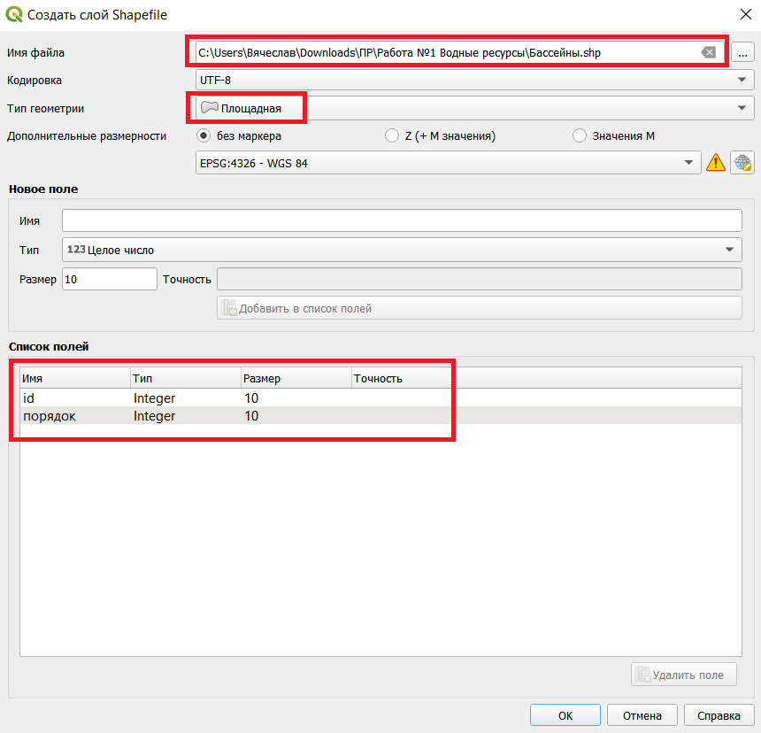
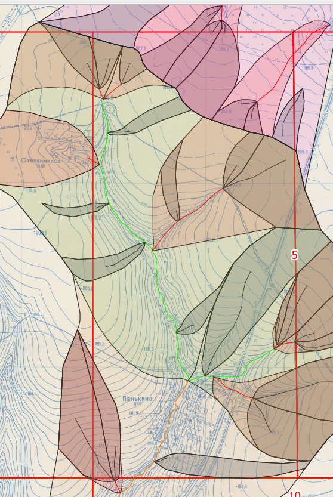
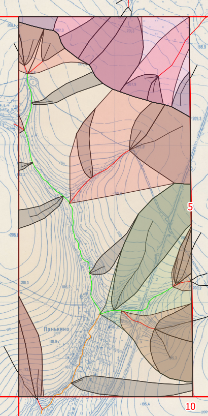

## Выделение бассейнов

### Теория

**Бассейн** – это участок, с которого вода стекает в водоток. 

### Лабораторная

[Создаём новый слой](../other/add-layer.html) с названием "Бассейны" и типом геометрии "Площаная". Ещё создаём поле "порядок" (тип целое число). 

Теперь нужно начать выделять бассейны. Начинать нужно от "устья" каждого водотока и идти наверх, перпендикулярно горизонталям, пока линии не сойдутся или пока не дойдут до водораздела.

Порядок бассейна соответствует порядку его водотока.

- На полуквадрате не должно остаться пустых мест;

- Линии должны быть плавными;

В итоге должно получиться что-то подобное:

За границами своего полуквадрата можно конечно и не рисовать.

