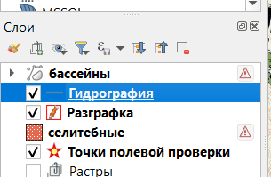
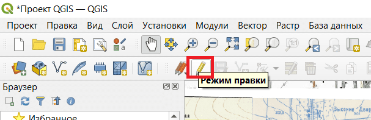
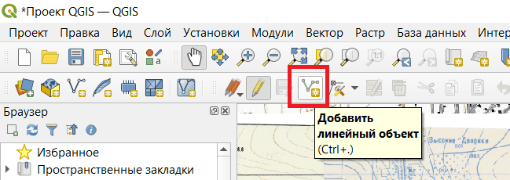
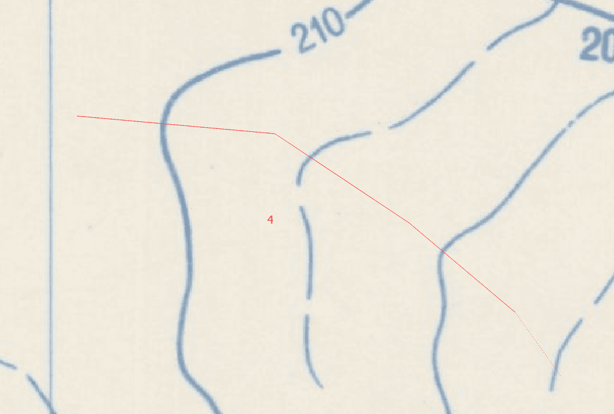
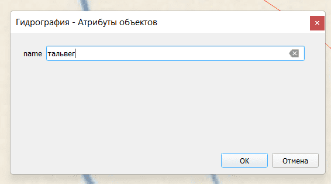
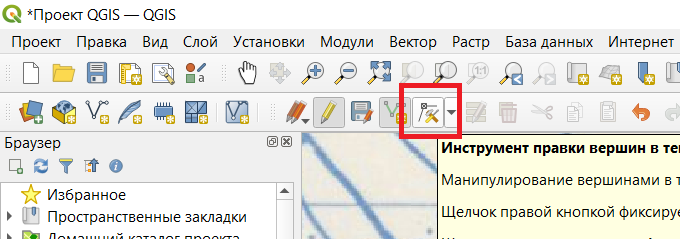

## Создание и изменение линии в слое

Нужно сначала выделить слой.

Далее включить режим правки.

### Создание линии

Нужно включить режим добавления линейных объектов. Добавлять линии можно только на слои с линейным типом.

С помощью кликов левой кнопокой мыши создаём ломаную линию. Чтобы завершить создание, нужно нажать правую кнопку мыши.

После создания линии откроется окно для задания атрибутов объекта. Заполнять поля нужно по заданию.

### Изменение линии

Чтобы изменить уже созданную линию, нужно включить режим правки вершин.

- Чтобы переместить вершину, нужно кликнуть на неё левой кнопкой мыши и затем кликнуть на то место, куда эту вершину нужно переместить.

- Чтобы удалить вершину, нужно кликнуть на неё левой кнопкой мыши и затем нажать клавишу Backspace или Delete.

- Чтобы добавить вершину в отрезок, нужно навестись мышью на середину отрезка. Появится знак плюса. Нужно на него кликнуть. Затем кликнуть на то место, где должна быть новая вершина.

- Чтобы добавить вершину к концу линии, нужно навестись мышью на конец линии. Появится знак плюса. Нужно на него кликнуть. Затем кликнуть на то место, где должна быть новая вершина.
