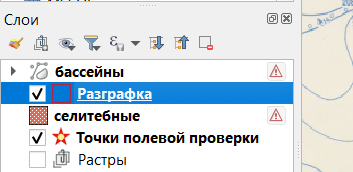
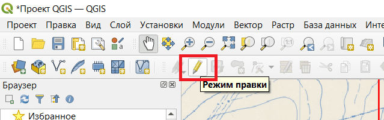
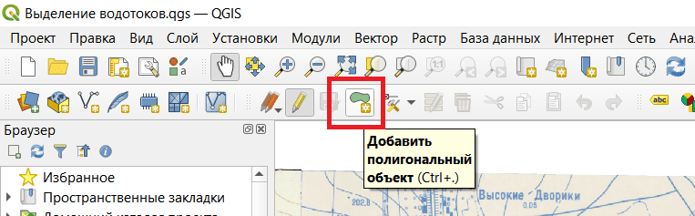
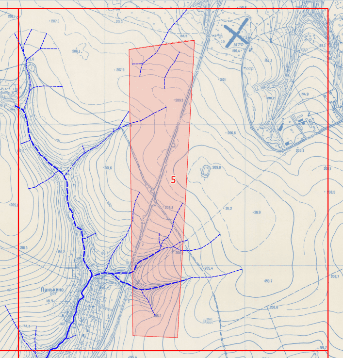
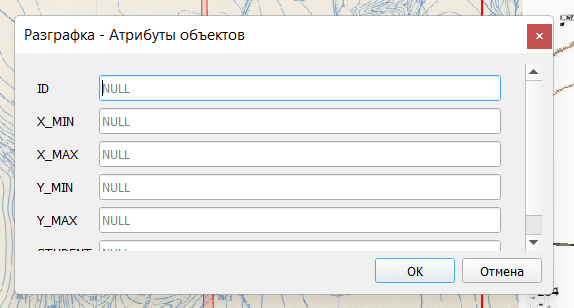
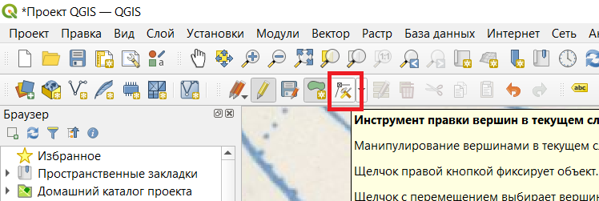

## Создание и изменение полигона в слое

Нужно сначала выделить слой.

И включить режим правки.

### Создание полигона

Чтобы создать полигон, нужно включить режим добавления объектов

С помощью кликов левой кнопокой мыши создаём полигон. Чтобы завершить создание, нужно нажать правую кнопку мыши.

После создания полигона откроется окно для задания атрибутов объекта. Заполнять поля нужно по заданию.

### Изменение полигона

Чтобы изменить уже созданный полигон, нужно включить режим правки вершин.

- Чтобы переместить вершину, нужно кликнуть на неё левой кнопкой мыши и затем кликнуть на то место, куда эту вершину нужно переместить.

- Чтобы удалить вершину, нужно кликнуть на неё левой кнопкой мыши и затем нажать клавишу Backspace или Delete.

- Чтобы добавить вершину в отрезок, нужно навестись мышью на середину отрезка. Появится знак плюса. Нужно на него кликнуть. Затем кликнуть на то место, где должна быть новая вершина.
