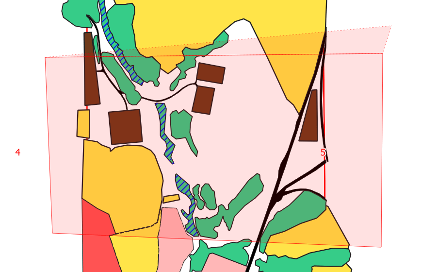

# Avoid Intersections

## Зачем нужна

Опция Avoid Intersections говорит программе, что площадные объекты не должны накладываться друг на друга.

Она полезна в двух случаях:

1. Когда объекты должны быть расположены вплотную друг к другу, но не пересекаться.
   
   
   
   Можно вручную проводить линию по точкам на границе, но удобнее будет использовать вышеназванную функцию.
   
   Она позволит заходить на другие объекты при обводке, но затем вырежет ненужные части:
   
   
   
   

2. Когда нужно добавить объект на всю область, но в этой области уже есть другие объекты, и ничего не должно пересекаться:
   
   
   
   Можно сначала добавить объект, а потом с помощью инструмента ["Добавить отверстие"](../add-hole/page.html) вырезать всё ненужное. Удобнее будет использовать Avoid Intersections:
   
   
   
   Все наложения будут вырезаны автоматически:
   
   

## Как включить

Опция находится в параметрах привязки:

Опция Avoid Intersections может быть в нескольких состояниях:

1. Разрешить наложения &mdash; функция отключена;

2. Вычитать наложения на текущем слое &mdash; при создании объекта будут вырезаны все части, которые накладываются на уже созданные объекты (со всех слоёв);

3. Согласно расширенной настройки &mdash; при создании объекта будут вырезаны все части, которые накладываются на уже созданные объекты (с выбранных слоёв). Выбрать слои, которые будут учитываться при вырезании, можно с помощью полей "Вырезать наложения" (4 на рисунке)

