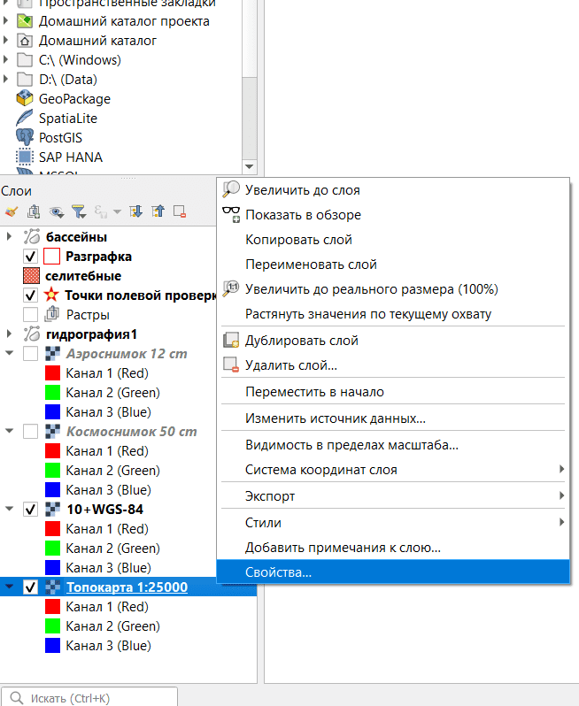
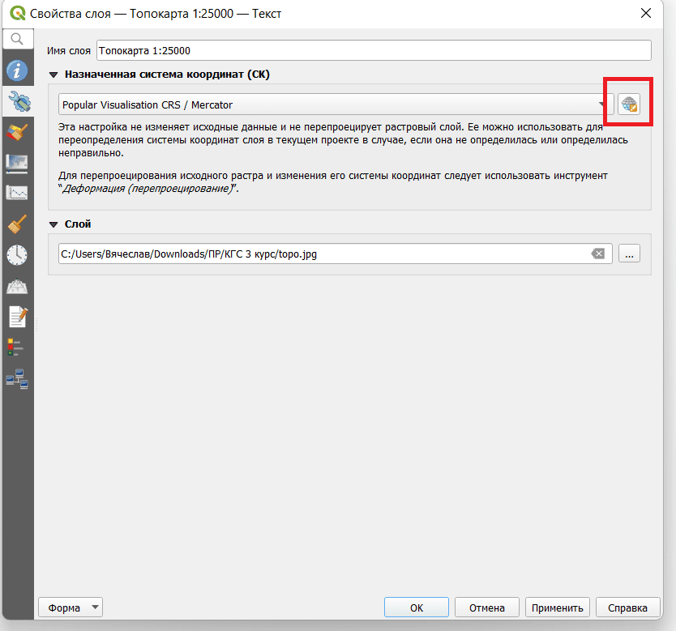
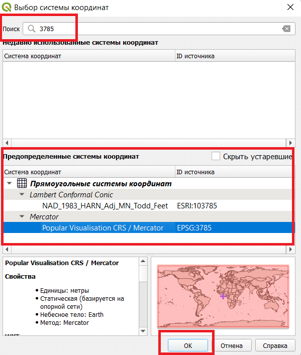

## Изменение проекции слоя

Для того, чтобы изменить проекцию слоя, нужно зайти в свойства слоя.

Затем нужно нажать на кнопку поиска нужных систем координат.

Откроется окно. В поиск нужно вбить название системы координат и в среднем окне появятся результаты поиска.

Выделяем нужную систему координат и нажимаем ок.
