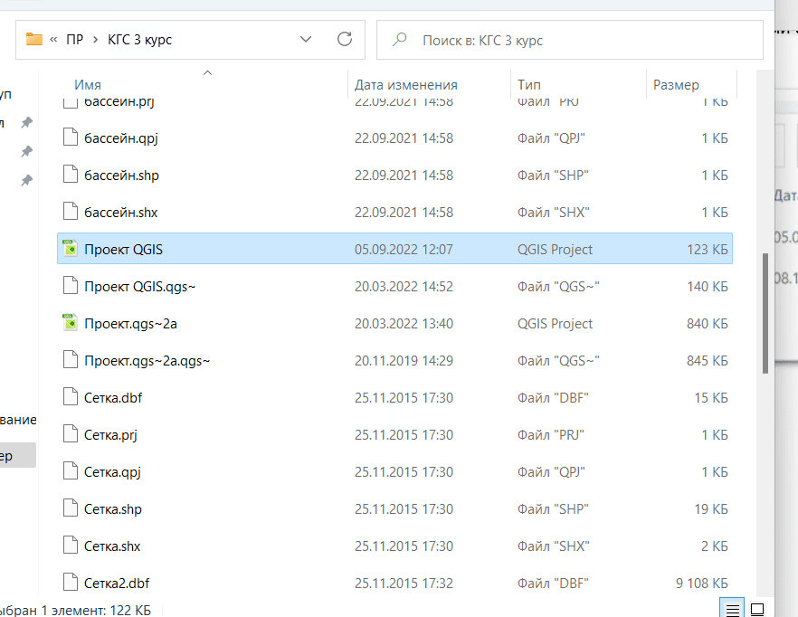
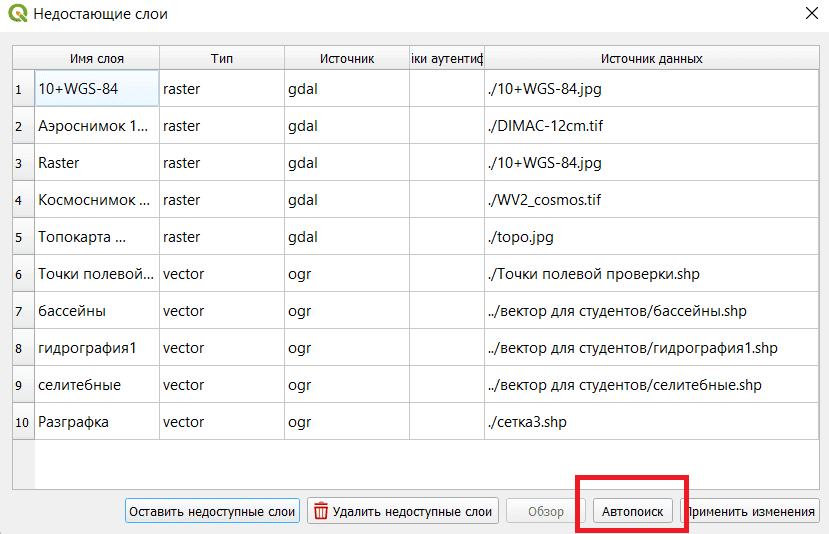
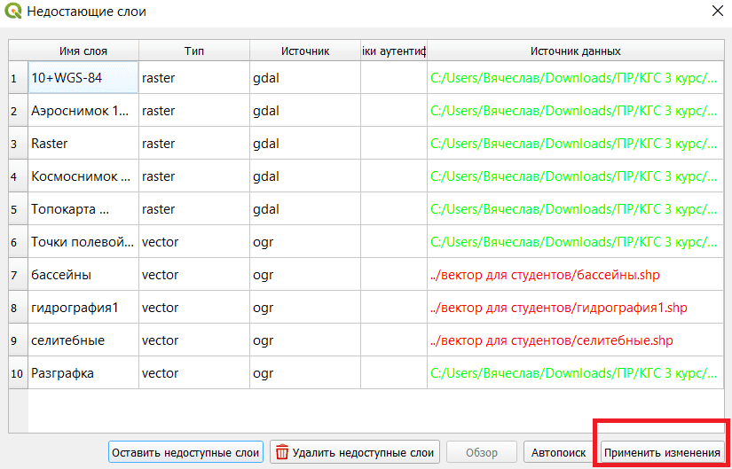
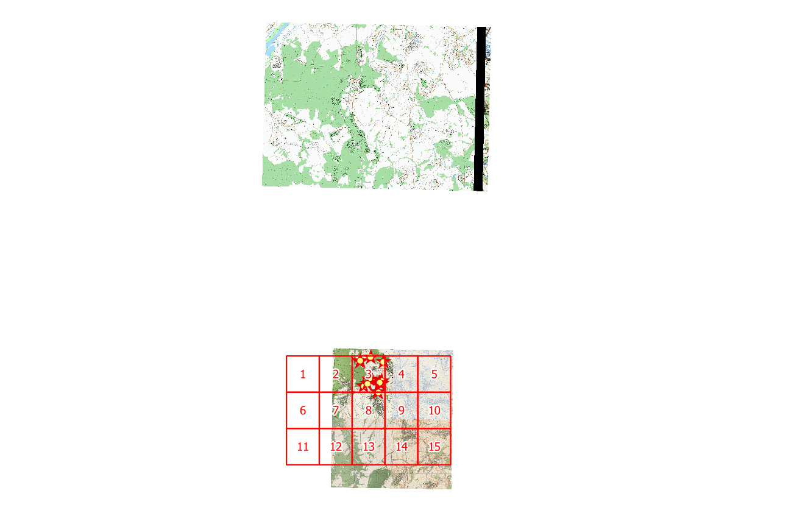

## Копирование файла проекта

Открываем папку «КГС 3 курс».

Файл проекта был сохранён в устаревшей версии, и чтобы его можно было свободно скопировать, его нужно сохранить в новой версии.

Открываем файл «Проект QGIS», нажимаем Ctrl+S и закрываем.

После этого файл "Проект QGIS" можно скопировать куда надо.

Открываем файл и видим сообщение о недостающих слоях. Нажимаем кнопку «Автопоиск».

После этого Кугис должен найти все слои кроме трёх. Нажимаем применить изменения и закрываем окно.

Может оказаться, что топокарта находится не там, где надо.

Нужно [поменять проекцию слоя «Топокарта 1:25000» на EPSG:3785](../other/change-layer-projection.html).
