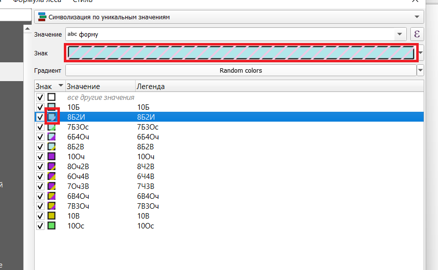
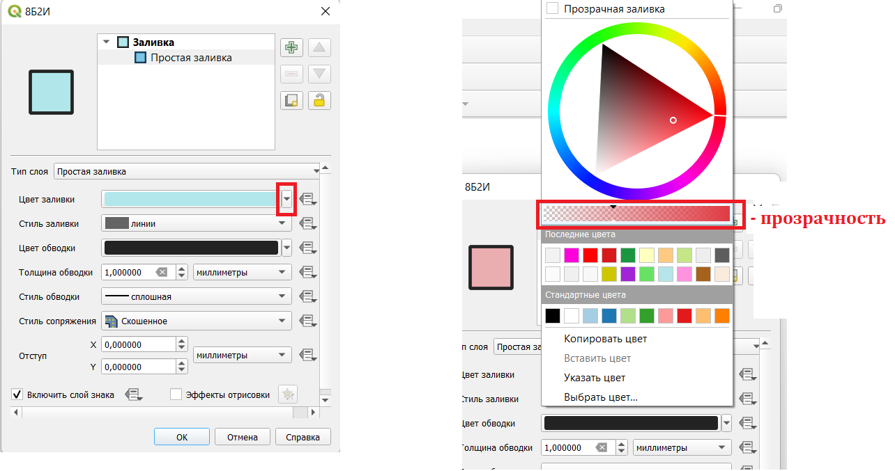
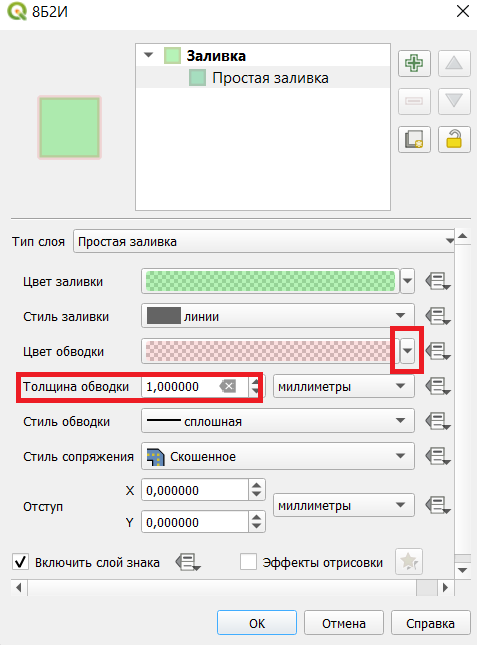
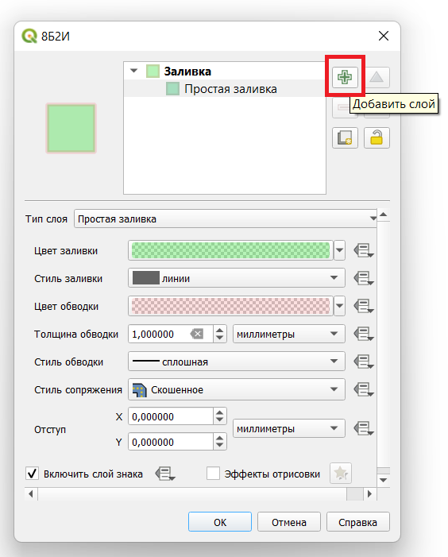
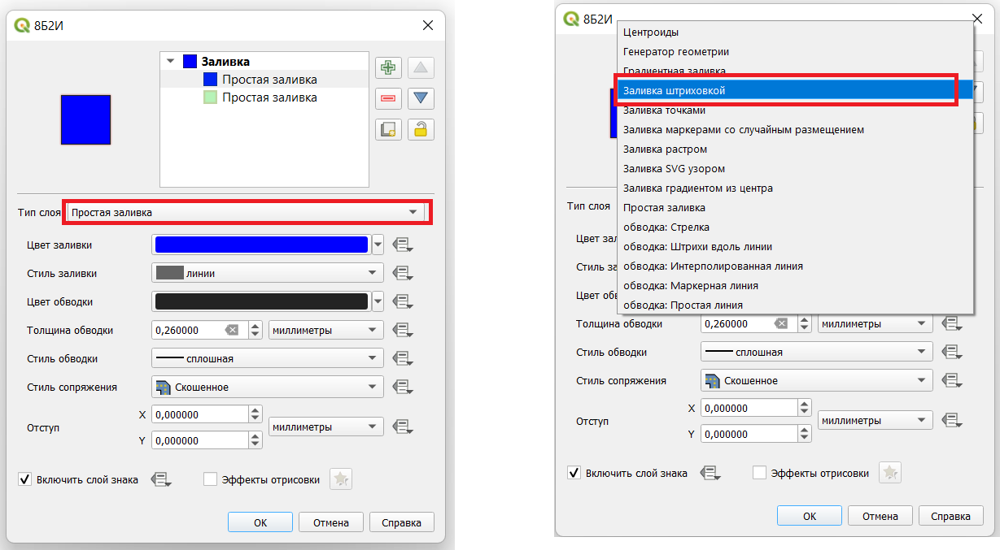
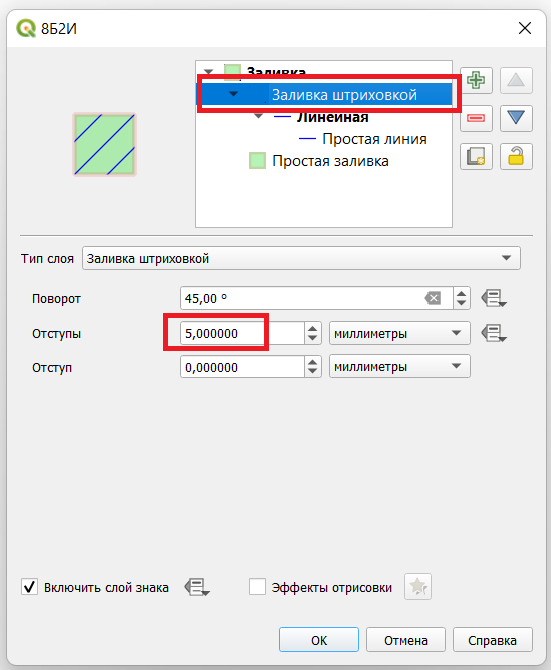
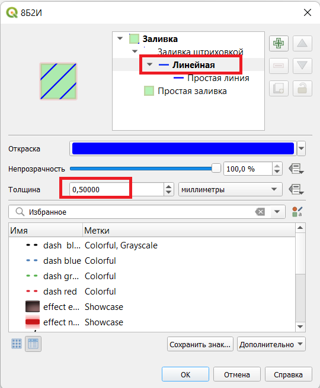
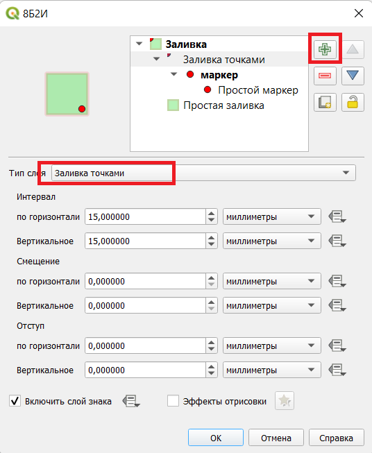

## Создание цвета знака

Чтобы открыть настройки цвета, нужно дважды кликнуть левой кнопкой мыши по одной из следующих областей:

## Фон

В настройках можно установить цвет и прозрачность фона:

## Граница

Там же можно настроить толщину, цвет и прозрачность границы:

## Штриховка

Чтобы добавить штриховку, можно добавить новый слой:

Затем типом слоя установить заливку штриховкой:

Расстояние между линиями настраивается следующим способом:

Толщина линий настраивается следующим образом:

## Украшения

Чтобы добавить, например, равномерно расставленные кружки, нужно добавить новый слой с типом "Заливка точками"

