## Выделение земельных угодий

### Теория

В проекте мы будем выделять следующие категории земельных угодий:

- Лесные
  
  - хвойные, на снимке тёмные;
  
  - смешанные;
  
  - лиственные, на снимке более светлые;
  
  - гари (горельники), на снимке чаще всего несколько сторон являются линиями, остальные стороны &ndash; кривыми;
    
    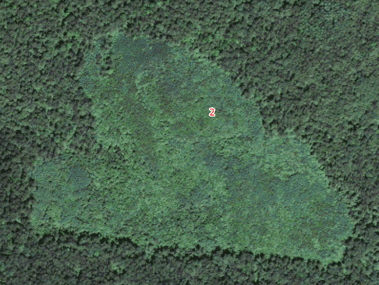
  
  - вырубки.

- Пахотные
  
  - Пахотные (действующие). На спутниковых снимках это не всегда явно распашенные области. Часто пахотные угодья определяются только по следам распашки
  
  - Пахотные зарастающие. Заброшенные участки можно определить по наличию на них деревьев.
    
    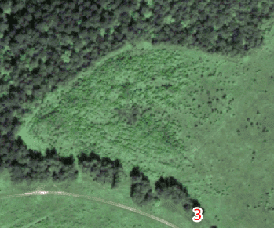

- Луговые (что не пашня — то луг; в отличие от пахотных угодий, луг имеет крупно-пятнистую структуру)
  
  - Пастбищные;
  
  - Кормовые (в отличие от пастбищных находятся на поймах и надпойменных террасах);
  
  - Неудобья. Например территория с могильниками около птицефабрики.

- Водоохранные
  
  - Ленточные леса. Это леса которые растут вдоль рек.
    
    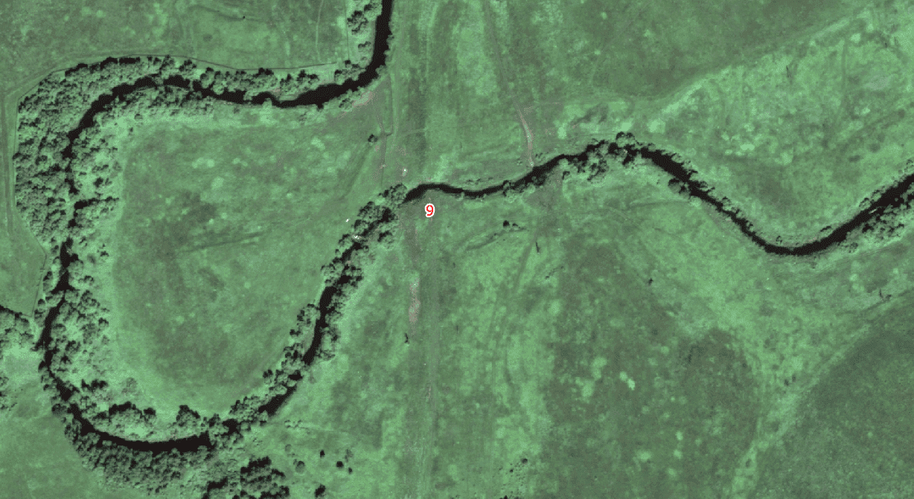

- Селитебные
  
  - Постоянного проживания
    
    - Сельского типа: наличие огородов, дома немногоквартирные;
      
      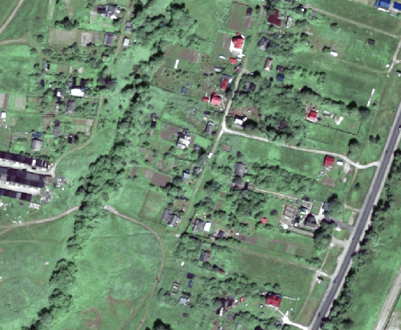
    
    - Городского типа: отсутствуют огороды, дома многоквартирные.
      
      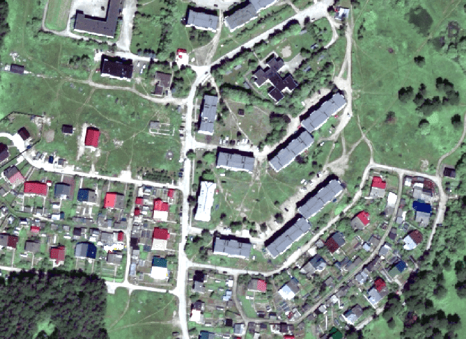
  
  - Сезонного проживания
    
    - Дачного типа: обычно маленькие участки одинаковых размеров
      
      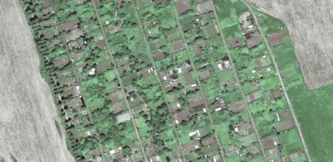
    
    - Коттеджи: дома находятся далеко друг от друга
      
      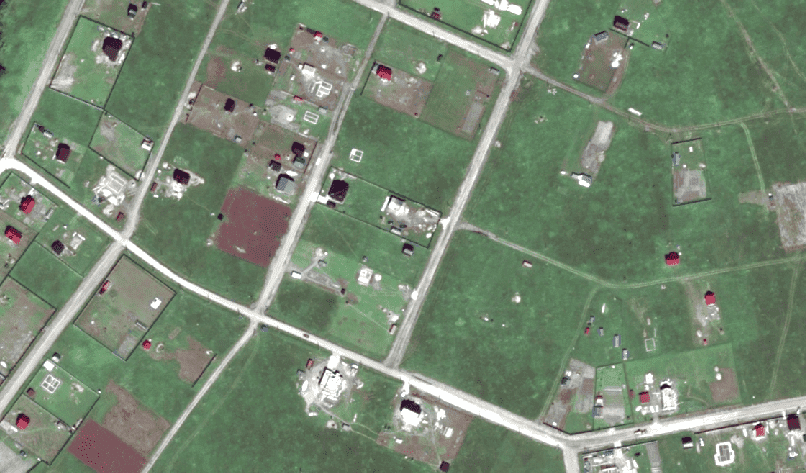

- Промышленные

- Дорожная инфраструктура
  
  - Автодорожные (только с покрытием). К области относятся также обочины и лесополосы.
  
  - Железнодорожные.

- Рекреационные (например санатории, пионерлагеря, туристические объекты, старые усадьбы, Заокский геополигон МИИГА\*К);

- Малоиспользуемые (например болота)

### Лабораторная

Каждый участок на поверхности земли является каким-либо угодьем. Определить тип угодья в нашем проекте можно по топокарте и космоснимку. Также можно использовать аэроснимок, если он дотягивается до нужного полуквадрата.

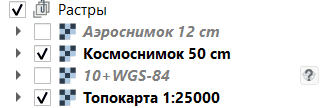

На топокарте можно определить, например, состав крупных лесов, луговые территории и некоторые объекты, которые неразличимы на космоснимке.

Теперь приступим к выделению угодий.

1. Так как некоторые угодья могут содержать в себе угодья другого типа, то удобнее будет сначала выделять те угодья, внутри которых нет других угодий.
   
   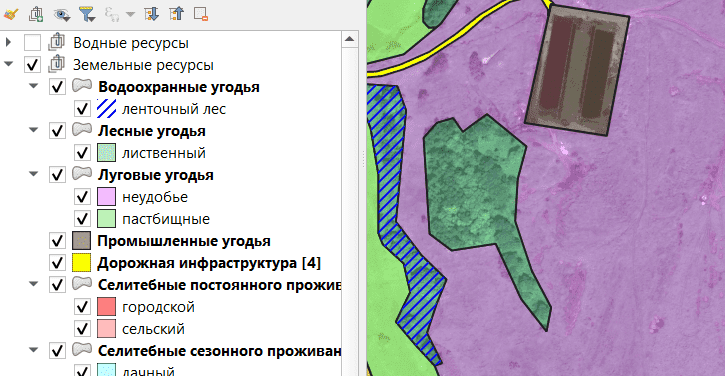
   
   Например, в данном случае, луговое угодье (неудобье) содержит в себе лесное угодье, дорожную инфраструктуру и промышленное угодье. Удобнее будет сначала выделить их, и только после – луг.

2. [Создаём слой](../other/add-layer/page.html) для лесных угодий, тип "Площадная". В список полей добавляем поле типа (чтобы разделить хвойные, лиственные и смешанные леса).
   
   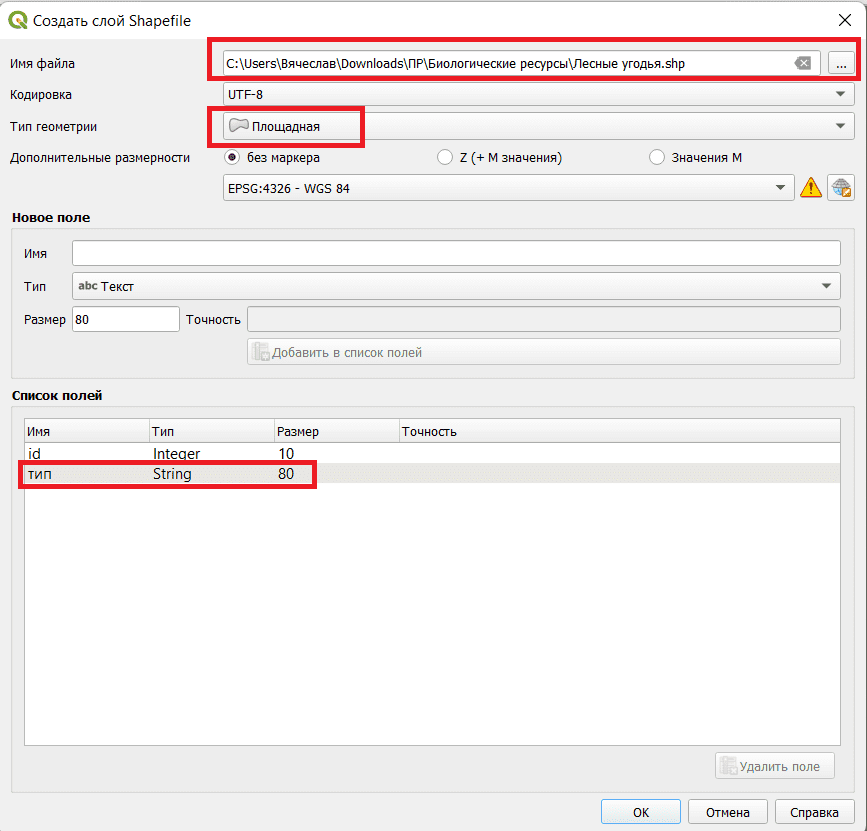Тип лесных угодий (хвойные, лиственные или смешанные) нужно определять по топографической карте или по цвету крон на космоснимке.

3. После выделения внутренних угодий, приступаем к выделению луговых угодий. Чтобы можно было выделить луговое угодье, не накладывая его на внутренние угодья, необходимо включить функцию "вырезать наложение".
   
   Заходим в [параметры привязки](../other/binding-parameters/page.html), включаем режим "Согласно расширенной настройки". Затем включаем привязку и "Вырезать наложение" для внутренних слоёв.
   
   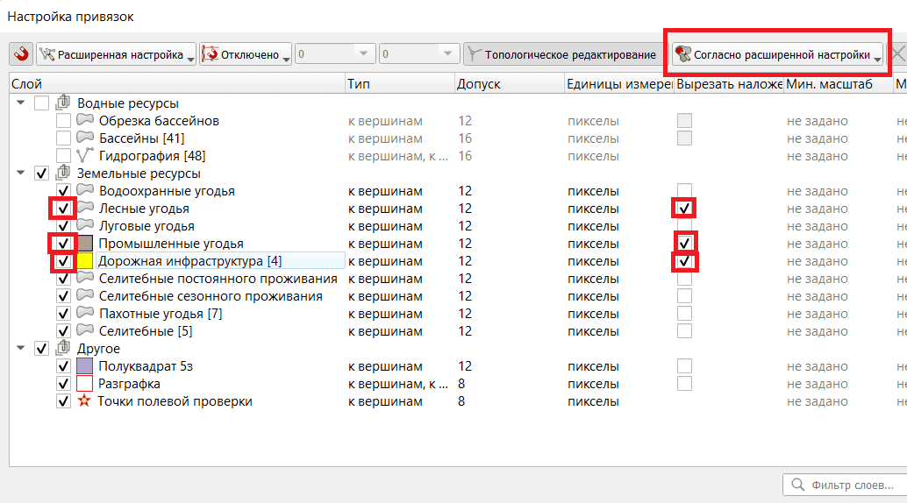

4. После этого можно создать новый слой "Луговые угодья" и выделить луг следующим образом: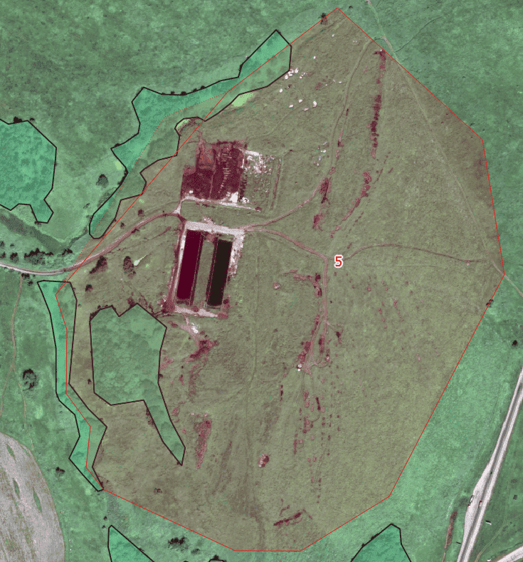Если всё сделано правильно, то должно получиться подобное:
   
   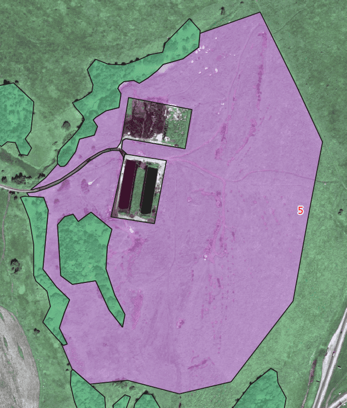
   
   Если при попытке создать новый объект вылезает ошибка о недействительной геометрии, нужно проверить, чтобы "Вырезать наложение" было включено только в тех слоях, в которых это нужно.
   
   

5. Продолжаем выделять угодья. На полуквадрате не должно остаться невыделенных мест.

В результате должно получиться что-то подобное:

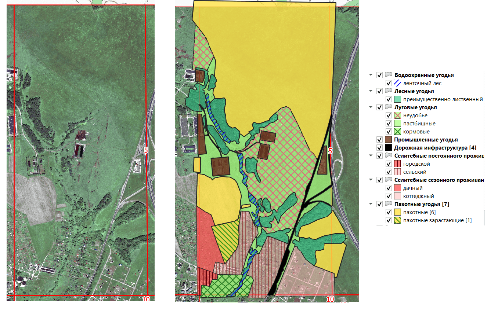

Замечания:

- Внутри селитебных не нужно выделять дороги;
- Пахотные угодья лучше выделять жёлтыми;
- Нарушенные участки (селитебные) лучше выделять красноватыми;
- Леса лучше выделять зелёными.

[Следующая часть](../p5-forest-formula/page.html)

[На главную](../index.html)
