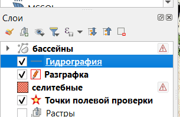
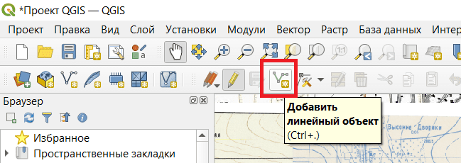
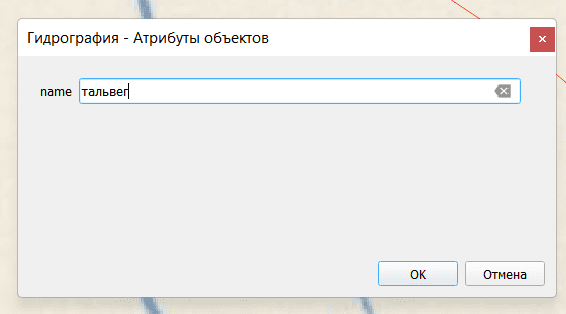

## Добавление объекта на слой с полигонами

Чтобы добавить объект на слой, нужно сначала выделить слой.

Далее нужно включить режим правки.

И включить режим добавления объектов

С помощью кликов левой кнопокой мыши создаём линию. Чтобы завершить создание, нужно нажать правую кнопку мыши.

После создания линии откроется окно для задания атрибутов объекта. Заполнять поля нужно по заданию.

