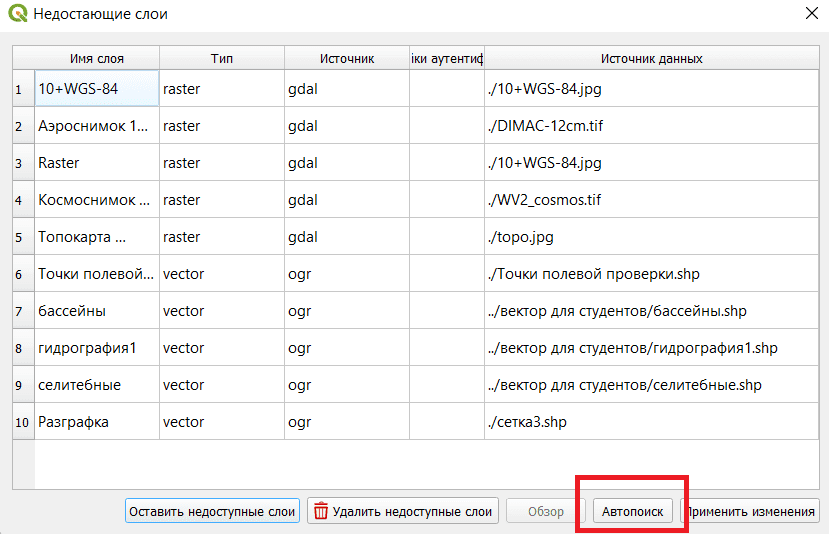

## Организация рабочей папки

При написании методички использовалась следующая структура папок. Сначала была создана рабочая папка (на картинке это "ПР") и в неё распакован скачанный архив ("КГС 3 курс"). Ещё была создана папка для первой работы.

Открываем папку «КГС 3 курс». Файл проекта был сохранён в устаревшей версии, и чтобы его можно было свободно скопировать, его нужно сохранить в новой версии.

Открываем файл «Проект QGIS», нажимаем Ctrl+S и закрываем.

После этого файл "Проект QGIS" можно скопировать в папку первой работы.

Открываем файл и видим сообщение о недостающих слоях (рис 4). Нажимаем кнопку «Автопоиск».

После этого Кугис должен найти все слои кроме трёх. Нажимаем применить изменения и закрываем окно.

Может оказаться, что топокарта находится не там, где надо. Это не помешает работе.

Если захочется исправить, то нужно [поменять проекцию слоя «Топокарта 1:25000» на EPSG:3785](../other/change-layer-projection.html).
