## Выделение поряков водотоков

### Теория

**Водоток первого порядка** – это элементарный водоток, который не принимает ни одного водотока, то есть является начальным.

**Водоток второго порядка** образуется при слиянии двух водотоков первого порядка.

- При слиянии водотоков первого и второго порядков результирующий водоток сохраняет второй порядок.

- Порядок водотоков повышается при слиянии двух водотоков с одинаковыми порядками.

Есть схема выделения водотоков разными цветами:
1 - чёрный, 2 - красный, 3 - зелёный, 4 - коричневый, 5 - жёлтый.
Но следовать этой схеме необязательно.

Если водоток берёт начало вне карты, то он называется водотоком **неопределённого порядка**. Такой водоток должен быть выделен отдельным цветом.
Например, река Скнига является водотоком неопределённого порядка, так как исток реки по карте найти нельзя.

### Лабораторная

Для начала работы нужно [создать новое поле](../other/add-attribute.html) "порядок" в таблице атрибутов слоя "Гидрография".

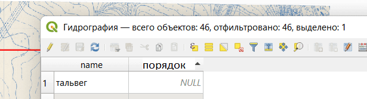

Теперь нужно присвоить каждому водотоку свой порядок. Это можно сделать двумя способами:

1. Если выделить объект в таблице атрибутов, то он подсветится на карте. Тогда можно посчитать порядок водотока и вписать значение в таблицу.
   
   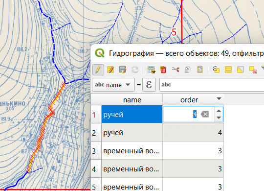

2. С помощью инструмента "Определить объекты" можно кликать на водотоки на карте, а затем изменить значения в их полях.
   
   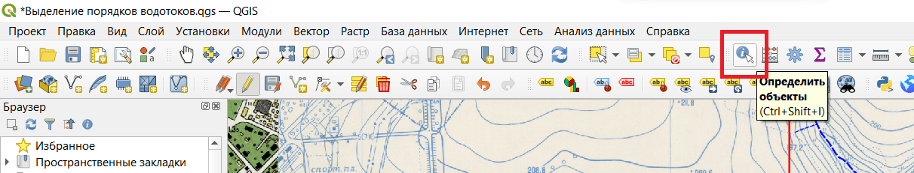
   
   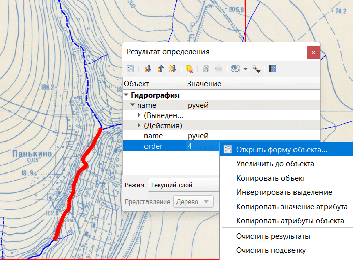

Если водоток нужно разделить на два, то можно использовать инструмент "Разделить объекты". Сначала нужно выделить слой и войти в режим редактирования. Затем должен стать доступным инструмент "Разделить объекты".

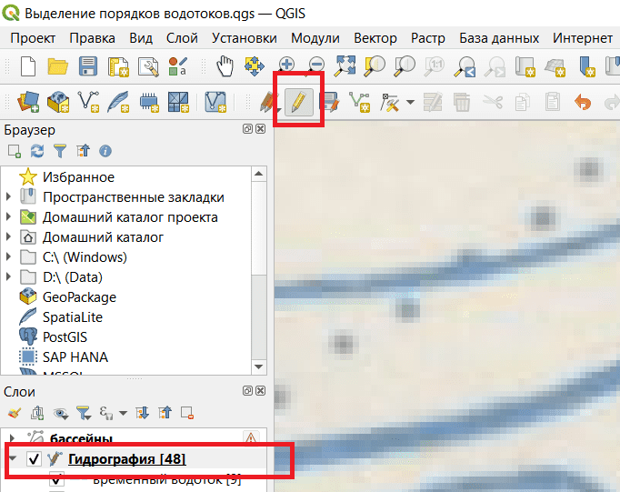

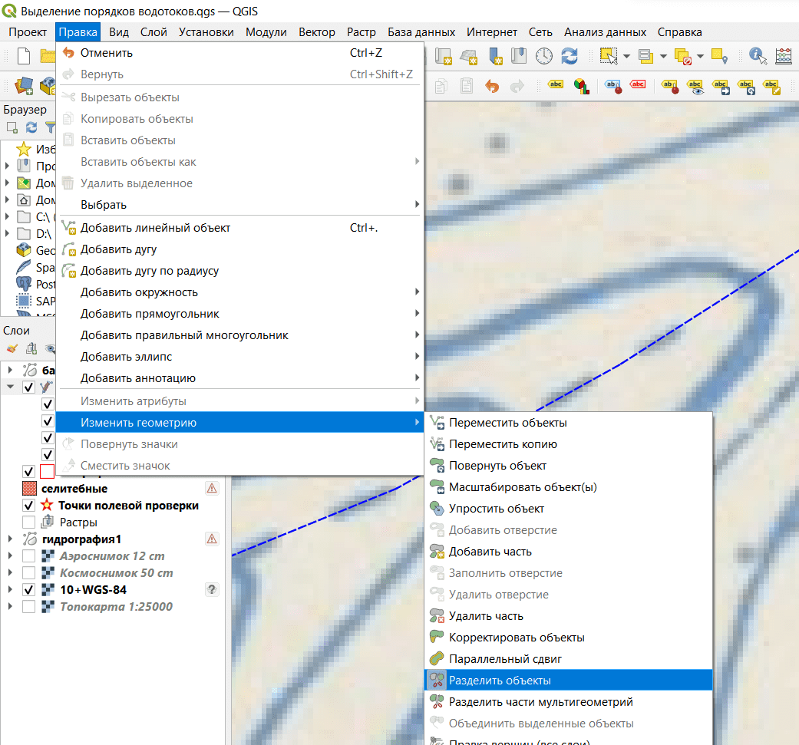

Лучше не разделять линии в местах пересечения с другим объектом того же слоя. Здесь что-то криво работает: либо QGSI либо моя голова.

Если [включена привязка](../other/binding-parameters.html) к вершинам, то можно кликать на вершину и в ней произойдёт разделение линии на две. Если нужно разделить линию по середине, то с помощью кликов левой кнопкой мыши нужно провести секущую линию и нажать правую кнопку мыши.

В результате поле "порядок" должно быть заполнено полностью.

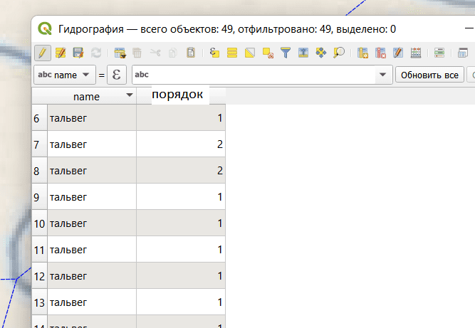

Создаём новый стиль с названием "порядки".

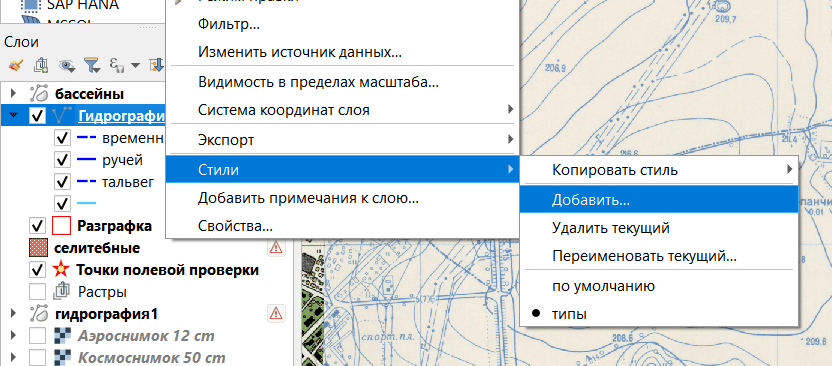

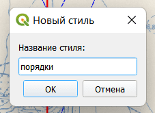

Убедитесь, что стилей теперь два. Изменение нового стиля не должно повлиять на предыдущий.

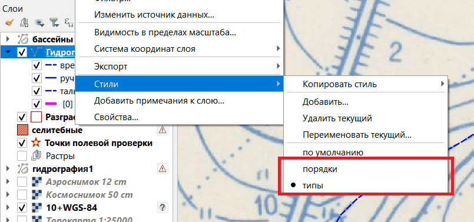

Заходим в свойства слоя, удаляем все знаки, выбираем значение "порядки". Нажимаем классифицировать. Можно изменить стили знаков. Нажимаем ок.

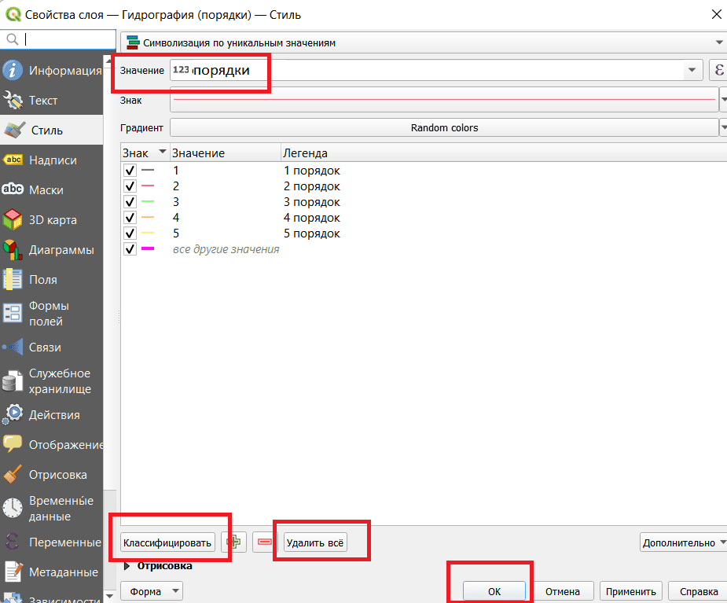

В итоге должно получиться что-то подобное:

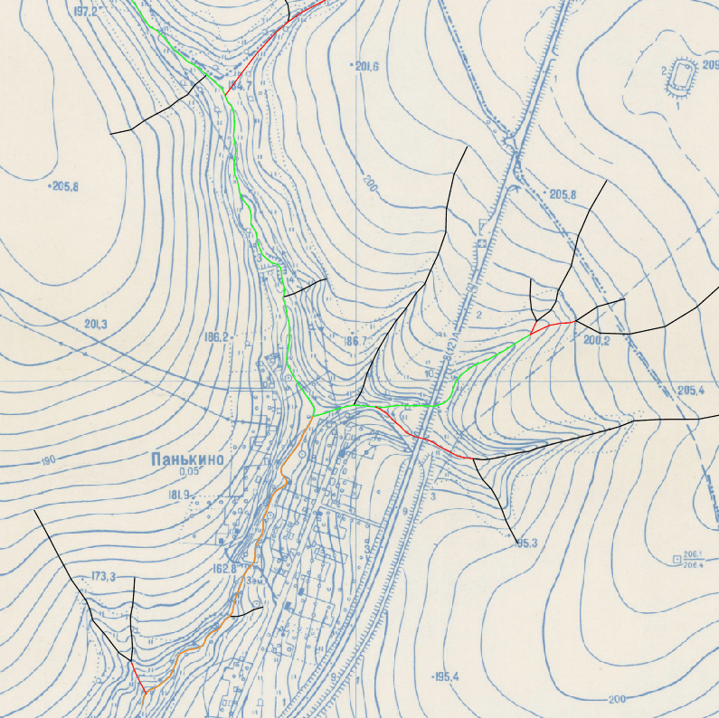

[Следующая часть](./pools.html)
