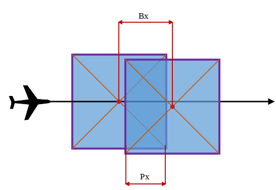
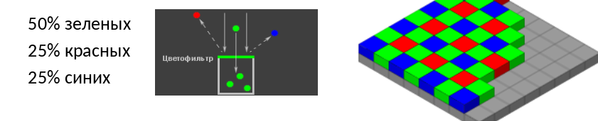
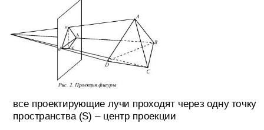

## Аэрокосмические съёмки.

### ДЗЗ, АКС, АФС. Классификация, приложения и актуальные проблемы АКС.

**ДЗЗ** (дистанционное зондирование Земли) — это совокупность методов получения информации по результатам измерений без прямого контакта с объектом. Включает два этапа: получение и обработка изображений.

Атмосфера прозрачна более всего для видимого света, ближних УФ и ИК лучей, а также в радиодиапазоне.

**АКС** — это совокупность методов исследований атмосферы, земной поверхности, океанов, верхнего слоя земной коры с воздушных и космических носителей путём дистанционной регистрации и последующего анализа идущего от Земли электромагнитного излучения.

- По типу носителя:
    - космическая съёмка (искусственные спутники, пилотируемые космические корабли) и аэросъёмка (самолёты, вертолёты, беспилотные воздушные судна).
- По спектральному диапазону:
    - Оптические методы: фотосъёмка (видимый диапазон от 0,4 до 0,76 мкм), ИК съёмка (ближний 0,76–3 мкм; средний 3–50 мкм), Тепловизионная съёмка, УФ, рентген;
    - Радиотехнические методы: радиолокационная съёмка (0,01 до 1 м).
        
- По типу принимаемого излучения:
    - пассивные (фото, ик, тепло) и активные (ЛС, РЛС)
- По пространственному разрешению:
    - Очень низкого разрешения (более 10 км), Низкого (1 - 10 км), Среднего (50 м - 1 км), Высокого (2,5 - 50 м), Очень высокого (1 - 2,5 м), Сверхвысокого (менее 1 м)

**АФС** — это аэрофотосъёмка, основной вид АКС, которую выполняют с помощью аэрофотоаппаратов и специального оборудования в видимом диапазоне электромагнитного излучения

Прикладное значение АКС:
- Создание 3D моделей для визуального или программного анализа, реконструкции, документации и популяризации. Например модели города, картин, музейных экспонатов;
- Обеспечение пространственными данными предприятий горнодобывающей отрасли, сопровождение разведывательных и земляных работ, фиксация местоположения объектов, вычисление разницы объёмов, проектирование автомобильных и железнодорожных съездов, маркшейдерия;
- Экологический мониторинг, мониторинг утечек тепла, обследование теплотрасс, диагностика промышленных объектов, анализ поверхности на движение поверхностных вод, метеосъёмка, охрана и планирование земель.

Результаты обработки материалов аэрофотосъёмки:
- ортофотоплан, цифровая модель рельефа + цифровая модель местности (первое не учитывает деревья, дома и др.), 3D модель, текстурированная 3D модель

Актуальные проблемы АКС: различные форматы, различная детализация, масштабы, платформы, доступность.

### Стереоэффект и его виды. Фотограмметрия. Виды стереосъёмки. Перекрытие снимков, триплет, базис фотографирования.

**Стереоэффе́кт** — ощущение протяжённости пространства и рельефности, возникающие при наблюдении реальных объектов, при бинокулярном оптическом наблюдении, рассматривании стереопар, автостереограмм и голограмм.
-   "Качающаяся" стереоскопия;
-   Анаглиф: в красном канале изображена картина для левого глаза, в бирюзовом — для правого;
-   Затворное стекло: мигание правого и левого изображений синхронизировано с закрытием левого и правого глаза;
-   Поляризационное стерео: правое изображение перпендикулярно поляризовано относительно левого изображения;
-   Метод чередования (интерлейса): в одном кадре происходит чересстрочное смешение двух ракурсов;
-   Метод параллельного взгляда: за счёт сведения глаз дальше плоскости изображения;
-   Метод перекрёстного взгляда: за счёт сведения глаз перед плоскостью изображения;
-   Попеременные стереопары;
-   Лентикулярные технологии и австостереоскопия;

**Фотограмметрия** — направление, занимающееся определением формы, размеров, положения и иных характеристик объектов по их фотоизображениям. Одним из современных направлений фотограмметрии является создание трёхмерных копий объектов по фотографиям.

Глаз человека:
- Глазной базис — расстояние между глазами;
- Конвергенция — угол, под которым сходятся оптические лучи глаз;
- Аккомодация — глазной "автофокус".

Классификация стереофотосъёмки (СС):
- Воздушная съёмка (АФС) выполняется для создания карт и планов, СС установлена на воздушном носителе;
- Наземная съёмка (короткобазисная) — выполняется для создания обмерных чертежей зданий, СС установлена на штативе);
- Предметная съёмка выполняется для создания трёхмерных моделей объектов, СС установлена на штативе или является элементом съёмочного стенда.

Площадная АФС состоит из ряда параллельных маршрутов. Этим видом съёмки покрывают большие территории. Обычно залёты имеют широтную ориентировку. Это наиболее часто используемый вид съёмки.

**Перекрытие снимка** — доля площади снимка (аэроснимка), перекрываемая смежным снимком.

**Триплет** — зона тройного продольного перекрытия. Используется для связи смежных стереопар по общим точкам и передачи от одной из них к другой системе координат и масштаба фотограмметрических построений.

**Базис фотографирования** — расстояние между соседними точками фотографирования.
$$Bx=Lx\cdot\frac{100-Px}{100}$$

### Фотоаппарат и фотография. Классификация фотоаппаратов. Кроп-фактор. Экспозиция.

**Фотография** — это изображение, полученное в результате фотографического процесса, получение и сохранение изображения при помощи светочувствительного материала или светочувствительной матрицы в фотокамере.

Первым прототипом фотоаппарата была **камера-обскура** — светонепроницаемый ящик с отверстием в одной из стенок. Лучи света, проходя через отверстие, создают перевёрнутое изображение.

Первые качественные цветные фотографии смог получить в 1910-х гг. Проскудин-Горский. Он совместил три фотографии, сделанные с разными фильтрами: красный, синий и зелёный.

**Классификация фотоаппаратов:**

- По назначению:
    - общего и специального (медицинские, панорамные,...)
- По типу приёмника излучения:
    - плёночный, пластиночный, матричный, линейка ПЗС (прибор с зарядовой связью)
- По спектральному диапазону:
    - панхроматические, мультиспектральные, гиперспектральные
- По размеру сенсора:
    - среднеформатные (>36x24 mm), полнокадровые (36x24 mm), APS-H, APS-C (23x16 mm), 4/3", 1" (13x9 mm), 2/3", 1/2.5" и т.д.

**Кроп фактор** — это условный коэффициент, отражающий изменение поля зрения объектива при его использовании с кадровым окном уменьшенного размера (отношение диагонали стандартного кадра к диагонали используемого)

Режимы съёмки:
- Автоматический (Auto)
- Режим программной линии (P)
- Приоритет диафрагмы (Av или A)
- Приоритет выдержки (Tv или S)
- Ручной (M)
- Выдержка от руки (B)

**Экспозиция** — количество излучения, получаемого светочувствительным элементом. Для видимого излучения может быть рассчитана как произведение освещённости на выдержку, в течение которой свет воздействует на светочувствительный элемент (матрицы). Треугольник экспозиции: диафрагма, выдержка, ISO.

Основные элементы фотоаппарата: матрица, объектив, затвор, процессор, устройство хранения.

### Матрица фотоаппарата и её характеристики.

**Матрица (ПИ)** — прибор, преобразующий световой поток в электрический сигнал. Сенсор выполняет пять операций: поглощает фотоны, преобразует их в заряд, накапливает его, преобразует в напряжение, передаёт его. Характеристики матрицы:
- Тип матрицы (устарело): ПЗС (CCD), КМОП (CMOS)
- Физический размер
- Разрешение
- Соотношение сигнал/шум. Шум матриц: темновой ток, тепловой шум
    - структурный шум: длинная выдержка, малое число ISO;
    - случайный шум: длинная выдержка, большое число ISO;
    - Линейчатый шум: отдельные камеры, осветлённые тени.
- Чувствительность матриц — способность определённым образом реагировать на световое излучение, характеризуется значением освещённости на объекте в люксах, обеспечивающее заданные параметры качества (полная разрешающая способность) выходного сигнала. Светочувствительность может быть определена на основе соотношения уровня полезного сигнала к уровню шума 40:1 (отношение числа зарегистрированных электронов к числу упавших на поверхность сенсора фотонов)
- Экспозиционный индекс EI, эквивалентная светочувствительность ISO — зависимость между значениями сигналов матрицы и соответствующими параметрами цветового пространства. Значения EI выбираются таким образом, чтобы получаемое цифровое изображение было сопоставимо с получаемым на плёнке такой же чувствительности ISO, с теми же экспозиционными параметрами.
- Динамический диапазон — величина, характеризующая способность фотоприёмника воспроизводить с одинаковой степенью контрастности различия яркостей участков оптического изображения объекта. ДД принято выражать в единицах освещённости (EV). У человека он равен 14 (EV).
- Кроп-фактор — условный коэффициент, отражающий изменение поля зрения объектива при его использовании с кадровым окном уменьшенного размера (отношение диагонали стандартного кадра к диагонали используемого).
    $КРОП=\frac{d_{35}}{d_{\phi}} d_{35}$ — диагональ кадра размером 24x36 мм (43,27 мм) $D_{\phi}$ — диагональ светочувствительного элемента
- Оптическое разрешение матрицы — способность оптического прибора воспроизводить изображение близко расположенных объектов. Линейное разрешение — минимальное расстояние между различимыми объектами. Характеризуют размером в пикселях по горизонтали и по вертикали, или общим количеством пикселей.
- Глубина цвета — величина, показывающая, сколькими полутонами может быть представлен каждый из цветов, определяет максимальное число цветовых оттенков по каждому цвету. Указывается в количестве бит на пиксель или бит на канал для данной цветовой модели. $I=2^{kn}$, $k$ — количество каналов изображения, $n$ — разрядность АЦП.
- Цветопередача: две камеры, смотрящие на одну и ту же цель, могут отображать разные значения цвета, даже если обе одинаково сбалансированы по белому.

Методы получения цветного изображения:
- Трёхматричные системы 3CCD;
- Матрицы с мозаичными фильтрами (RGG, RGBW, X_Trans, ...);
- Матрицы с полноцветными пикселами.

**Фильтр Байера** — это двумерный массив цветных фильтров, которыми накрыты фотодиоды фотоматриц.

### Объектив фотоаппарата и его характеристики. Аберрации.

**Объектив** — это оптическое устройство, служащее для построения изображения в плоскости пространства изображений по закону центральной проекции (действительное изображение) **Фокусировка** — процесс регулирования положения объектива или иной оптической системы, для достижения совпадения плоскости сопряжённого фокуса с плоскостью матрицы.

Объектив состоит из:
1.  Линз/зеркал. Линза — это кусок стекла или другого прозрачного материала со сферическими или плоскими поверхностями. Параметры линзы: радиусы, главные плоскости, узловые и фокальные точки, фокусное расстояние и др.
2.  Диафрагма. Диафрагма — это элемент оптической системы, ограничивающий проходящие через нее световые пучки. Диафрагмирование увеличивает глубину резкости.
3.  Оправы

А также:
1.  **Бленда** — трубчатое приспособление, устанавливающееся перед входным окном оптических приборов для защиты от попадания постороннего света. Бленды бывают лепестковые, цилиндрические, пирамидальные и конические;
2.  **Байонет объектива** — разновидность быстрого соединения, предназначенная для крепления оправы объектива к корпусу фотоаппарата с целью поддержания точного положения оптических элементов объектива относительно матрицы. В современной аппаратуре байонет является также электронным интерфейсом, осуществляя соединения микропроцессоров объектива и камеры с помощью электрических контактов.

Характеристики объектива:
1. Главное фокусное расстояние — это расстояние вдоль оптической оси от задней главной точки объектива до задней фокальной плоскости. Может быть постоянным (фиксированным) или переменным;
2. Эквивалентное фокусное расстояние — это условная характеристика системы из объектива и светочувствительного элемента, дающая информацию об угле обзора этой системы. Она показывает, какое фокусное расстояние имел бы объектив для широко распространённого размера кадра 24×36 мм $$f_{efl}=f\cdot\frac{d_{35}}{d}$$   
3.  **Сопряжённое фокусное расстояние** — расстояние от передней или задней главных плоскостей объектива до переднего или заднего сопряжённого фокуса соответственно. $$\frac{1}{f}=\frac{1}{R}+\frac{1}{d}$$ $$\frac{d}{f}=\frac{\frac{R}{f}}{\frac{R}{f}-1}$$ $$d=\frac{R}{R-1}$$
4. Кратность вариообъективов — это диапазон между наименьшим и наибольшим фокусным расстоянием. $Zoom=\frac{f_{max}}{f_{min}}$;
5. Диапазон относительных отверстий. Относительное отверстие — это отношение диаметра входного отверстия, ограниченного диафрагмой, к фокусному расстоянию оптической системы. Относительное отверстие бывает геометрическое: $\frac1n=\frac{d_{вх}}{f}$ и эффективное (учитывает потери на поглощение и рассеяние света в стекле):
	1. $\tau=(1-P)^n\cdot(1-\alpha)^m$
	2. $P$ — доля света, теряемая при отражении одной поверхностью раздела сред;
	3. $n$ — число поверхностей раздела воздух/стекло;
	4. $\alpha$ — удельное поглощение света в 1 сантиметре стекла;
	5. $m$ — суммарная толщина линз объектива в сантиметрах.
	6. Значения диафрагменных чисел гравируются на оправе: 0.7, 1.4, 2, 2.8... (с шагом $\sqrt2$ из формулы $S=\pi r^2$);
6. *ГРИП* — глубина резко изображаемого пространства — расстояние вдоль оптической оси объектива между двумя плоскостями в пространстве предметов, в пределах которого объекты отображаются в сопряжённой фокальной плоскости субъективно резко. $$P=R_2-R_1;$$
	1. $R_1=\frac{R\cdot f^2}{f^2-K\cdot f\cdot z+K\cdot R\cdot z}$
	2. $R_2=\frac{R\cdot f^2}{f^2+K\cdot f\cdot z-K\cdot R\cdot z}$
	3. $R_1$ — дистанция до передней границы резко изображаемого пространства; $R$ — дистанция фокусировки; $R_2$ — дистанция до задней границы резко изображаемого пространства; $f$ — заднее главное фокусное расстояние объектива; $K$ — диафрагменное число; $z$ — диаметр кружка нерезкости или допустимый кружок рассеяния.
    
7.  Гиперфокальное расстояние — расстояние, на которое сфокусирован объектив, когда задняя граница резко изображаемого пространства лежит в "бесконечности" для заданного геометрического относительного отверстия. $$H=\frac{f^2}{Kz}+f$$
	1. $f$ — фокусное расстояние;
	2. $K$ — знаменатель относительного отверстия;
	3. $z$ — диаметр кружка рассеяния;
	4. $H$ — гиперфокальное расстояние.
	5. $R_1=\frac{HR}{H+R}$
	6. $R_2=\frac{HR}{H-R}$
8.  Светосила объектива — величина, характеризующая соотношение освещённости изображения, даваемого оптической системой и яркости отображаемого объекта, определяет её световую эффективность. Светосила показывает способность объектива строить яркое изображение при плохой освещённости. $$Q_e=\frac{E}{B}=\tau(\frac{D}{f'})^2$$
9.  Угол поля зрения — это часть пространства предметов, которая видна с помощью данной оптической системы. Угловое поле зрения объектива понимается как телесный (конический) угол, образованный линиями, соединяющими переднюю главную точку объектива с краями изображаемого пространства.
10. Поле изображения объектива — центральная часть поля зрения объектива, в пределах которой изображение обладает достаточной степенью резкости и освещенности.
11. Угловое поле изображения объектива — угол, образованный лучами, соединяющими крайние точки поля изображения с задней главной точкой объектива.
12. Разрешающая способность
13. Уровень оптических искажений (аберраций). Искажения объектива: искажение перспективы, виньетирование, хроматические аберрации, потеря контраста, размытие.
14. Рабочий отрезок — расстояние от опорной торцевой поверхности оправы объектива до его главной фокальной плоскости (плоскости матрицы).

**Аберрации** — ошибки или погрешности изображения в оптической системе, вызываемая отклонением луча от того направления, по которому он должен был бы идти в идеальной оптической системе.
- Хроматические
- Геометрические: пять аберраций Зейделя:
    - SI — сферическая аберрация: возникает из-за несовпадения фокусов для лучей света, проходящих на разных расстояниях от оптической оси;
    - SII — коматическая аберрация: нарушение гомоцентричности широких световых пучков, входящих в систему под углом к оптической оси;
    - SIII — астигматизм: нарушение гомоцентричности широких световых пучков, входящих в систему под углом к оптической оси;
    - SIV — кривизна поля изображения: изображение плоского объекта, перпендикулярного к оптической оси объектива, лежит на поверхности, вогнутой либо выпуклой к объективу. Эта аберрация вызывает неравномерную резкость по полю изображения;
    - SV — дисторсия: аберрация оптических систем, при которой коэффициент линейного увеличения изменяется по мере удаления отображаемых предметов от оптической оси.

**Ортоскопичность** — объектив или оптическая система, свободные от дисторсии, или такие, в которых дисторсия пренебрежимо мала и не влияет на характер изображения.

### Затвор и его характеристики.

**Затвор** — устройство, ограничивающее продолжительность действия света на светочувствительный слой (матрицу). Определяет время выдержки. Выдержка — интервал времени, в течение которого свет экспонирует участок светочувствительного материала или светочувствительной матрицы. Стандартные ряды выдержки: 2с, 1с, 1/2с, 1/4с, 1/8с, 1/15с, 1/30с, 1/60с, 1/125с, 1/250с... Основные характеристики затворов:
- КПД $\eta=\frac{t_e}{t_0}$
- Точность и диапазон выдержек
- Степень искажения изображения
- Надёжность работы затвора в различных условиях

Классификация затворов:
- По расположению в камере: фокальные и апертурные, межлинзовые, залинзовые, фронтальные; 
- По принципу действия и способу пропускания света:  
    - Механические центральные: минимум искажений, равномерное распределение освещённости, синхронизация со вспышкой, термоустойчивость, ограниченная максимальная скорость затвора 1/4000с;   
    - Механические шторные (шторно-щелевые/ламельные): ограниченная максимальная скорость затвора 1/8000с, искажения по полю изображения, сложности синхронизации со вспышкой.
    - Электронно-механические: уменьшение вибрации при съёмке, уменьшение износа механизма, искажения и ошибки экспозиции на коротких выдержках (1/2000);
    - Электронный шторный: бесшумный, не изнашивается, искажения по полю изображения, максимальная скорость до 1/32000с;
    - Электронный глобальный: не имеет искажений по полю кадра;
- По принципу действия: механические, электронные, электронно-механические, ЖК.

### Процессор

Процессор: управление фокусировкой объектива, АЦП, формирование файла и сжатие изображения, запись на карту памяти. АЦП:
- Дискретизация — преобразование исходного аналогового сигнала в последовательность дискретных значений, получаемых через заданные временные интервалы. В цифровой фотографии дискретизация характеризуется количеством пикселей на кадр;
- Квантование — замена действительного мгновенного значения сигнала округлённым значением, равным ближайшему фиксированному значению; 
- Кодирование — образование кодовых комбинаций импульсов.

Сигналы: аналоговые, дискретные, цифровые.

### Графический формат. Метаданные снимков. Основные алгоритмы сжатия. Основные графические форматы. RAW.

**Алгоритм** — набор инструкций, который в конечное число шагов приводит к преобразованию исходного кода цифрового изображения в код меньшего объёма за счёт устранения избыточности. Алгоритмы, в отличие от методов, приводят к одинаковому результату.

**Формат файла** — это структура (порядок) данных, записанных на этом файле.

**Графический формат** — это способ записи графической информации.

**Кодирование** — представление информации в виде кода.

Способы хранения информации в файле: растровый, векторный, смешанный, двумерный, трёхмерный.

Метаданные: производитель камеры, модель, выдержка, диафрагма, светочувствительность в ед. ISO, использование вспышки, разрешение кадра, фокусное расстояние, размер матрицы, эквивалентное фокусное расстояние, дата и время съёмки, ориентация камеры, тип баланса белого, географические координаты и адрес места съёмки и др.

Видео:
-   Кодеки (КОдировщик, ДЕКодировщик) — программа, реализующая алгоритм кодирования;
-   Контейнеры — определяет структуру файла, возможные кодеки и их параметры, состав потоков и дополнительных данных, например, субтитры;
-   Стандарты: PAL: 50i, 25p, 50p, NTSC: 60i, 29,97p, 30p, 59.94p, 60p и т. д.;
-   Потоки — аудио, видео, текст
-   форматы, алгоритмы, методы...

Сжатие бывает:
- недеструктивное — сжатие графики без потерь (lossless): HEIF, ILBM, LDCT, PCX, PDF, PNG, TIFF, TGA, FLIF...
- деструктивное — сжатие изображений с потерями (lossy). Большинство lossy форматов имеют свою lossless версию.

RAW — это не формат файла. Из-за технических особенностей матриц и АЦП разных производителей всеобщего стандарта RAW не существует. С RAW нельзя работать напрямую, без интерпретации.

Основные алгоритмы сжатия:
- RLE (run-length encoding) — кодирование длин серий или кодирование повторов — алгоритм сжатия данных, заменяющий повторяющиеся символы (серии) на один символ и число его повторов.
	- Ориентирован на однобитные изображения, работает по строкам.
- LZW - алгоритм Лемпеля-Зива-Велча.
	- Не требует вычисления вероятностей встречаемости символов или кодов;
	- Для декомпрессии не надо сохранять таблицу строк в файл для распаковки;
	- Данный тип компрессии не вносит искажений в исходный графический файл, и подходит для сжатия растровых данных любого типа;
	- Алгоритм не проводит анализ входных данных;
	- Не более 256 значений;
	- Анимация — разница с предыдущим кадром.
	- Ориентирован на работу с индексированным цветом.
- Deflate:
	- Замена повторяющихся строк указателями (алгоритм LZ777);
	- Замена символов новыми символами, основываясь на частоте их использования (алгоритм Хаффмана).
- FLIF (Free Lossless Image Format)^
	- использует арифметическое кодирование, один из алгоритмов энтропийного сжатия;
	- Коэффициент сжатия выше других существующих.
- JPEG lossy
	- Перевод RGB в YCbcr;
	- Цветовая субдискретизация — технология кодирования изображений со снижением цветового разрешения, при котором частота выборки цветоразностных сигналов может быть меньше частоты выборки яркостного сигнала.
	- Дискретное косинусное преобразование;
	- Квантование — деление матрицы коэффициентов на матрицу квантования (матрицу весов). На этом этапе можно управлять степенью сжатия и определять, что именно будет сжато;
	- Линейный вид: преобразование матрицы в строку. Начиная с левого верхнего угла, записываются разности коэффициентов (дельта-кодирование) при движении по диагоналям;
	- RLE — замена повторяющихся символов на один символ и число его повторов;
	- Алгоритм Хаффмана: часто используемым значениям присваиваются короткие коды, а редко встречающимся — длинные.
- Вейвлет
	- Нет дробления на блоки (эффекта Гиббса);
	- Постепенное декодирование (удобно передавать по сети);
	- Наличие миниатюры изображения;
	- Регулируемая степень сжатия;
	- Артефакты на контурах объектов;
	- Используется в JPEG2000.
- Фрактальное сжатие
	- Оптимален для сжатия самоподобных изображений;
	- Коэффициент сжатия до 20 000 раз;
	- Сжимает лучше обычных алгоритмов;
	- Крайне медленное кодирование;
	- Декодирует быстрее, чем JPEG;
	- Избегает пикселизации при масштабировании.

Основные графические форматы:
- JPEG - Joint Photographic Experts Group (.jpg, .jtiff, .jpe, .jpeg)
	- Особенности:
		- Сжатие JPEG и lossless JPEG;
		- Цветовые модели;
		- До 32 бит/пиксель;
		- Нет прозрачности;
		- Метаданные.
	- Применяется в фотографии для просмотра и в цветной графике в web.
	- Недостатки:
		- Блочная структура изображения (8x8);
		- Отсутствие прозрачности;
		- Малый коэффициент сжатия;
		- Прямая последовательность кодирования.
- DNG - Digital Negative Specification — открытый формат для RAW-файлов изображений, используемый в цифровой фотографии. Попытка компании Adobe стандартизировать бредовый хаос.
- BMP - bitmap picture
	- Простая структура файла: заголовок, информация об изображении, само изображение.
	- RGB 1-8 бит на канал;
	- Сжатие RLE;
	- Нет прозрачности;
- GIF - Graphics Interchange Format
	- 8 бит/пиксель;
	- Сжатие LZW;
	- 1 значение прозрачности;
	- Анимация.
- PNG - Portable Network Graphics (.png)
	- lossless Deflate;
	- Цветовые модели;
	- До 32 бит/канал;
	- Канал прозрачности;
	- Метаданные;
	- Служебная разметка.
- TIFF - Tagged Image File Format (.tif)
	- Цветовые модели;
	- Цветовые профили;
	- Многослойная прозрачность (маски);
	- Метаданные;
	- Служебная разметка;
	- Алгоритмы сжатия: lossless RLE, LZW, JPEG, ZIP, LZ777, JBIG, CCITT Group 3, CCITT Group 4.
- GeoTIFF by NASA
	- Вид картографической проекции;
	- Система географических координат;
	- Параметры (датум) земного геоида;
	- Дискреты разрешения изображения;
	- Матрицу полиномиального, сплайнового или аффинного преобразования;
	- Характерные параметры изображения.
- PSD - Photoshop Document
	- Рабочий формат Adobe Photoshop;
	- Поддержка слоёв, масок, текста, вектора, 3D, видео.
- SVG - Scalable Vector Graphics
	- Основной векторный формат в web;
	- Поддерживает анимацию;
	- Отслеживает события на странице;
	- Открытый;
	- Текстовый (XML);
	- Много весит (есть сжатый SVGZ -zip).
- Autodesk Autocad (.dwg)
	- Основной формат для чертежей 2D и 3D.
- PDF - Portable Document Format
	- Создаётся многими программами;
	- Вёрстка и цвета передаются без искажений;
	- Способ посмотреть .PS файлы (через Distiller);
	- Электронная распечатка;
	- Редактируемый (через Acrobat и не только);
	- Поддерживает интерактивные элементы;
	- Поддерживает звук и видео;
	- Встроенные средства шифрования.
- DjVu
	- Программно зависим;
	- Сжатие варьируется от типов данных;
	- При этом, кодировщик работает на входе с растровыми изображениями.
- RIFF (WebP)
	- Согласно данным Google, в среднем изображения WebP на 25-40% меньше, чем сопоставимые JPEG, и на 26% меньше, чем сопоставимые PNG;
	- Для работы с данным форматом существует открытое программное обеспечение;
	- Прозрачность;
	- Анимация;
	- Сжатие без потерь;
	- Только 8 бит на канал;
	- YUV 4:2:0
- BPG
	- Поддержка в большинстве браузеров, благодаря наличию декодировщика на языке JavaScript;
	- Методы кодирования основаны на подмножестве стандарта сжатия видео HEVC/H.265;
	- Использование идентичных с JPEG форматов цветовой субдискретизации, что позволяет исключить потери при преобразовании из JPEG;
	- Поддержка слоя прозрачности;
	- Поддержка от 8 до 14 битов на цветовой канал;
	- Наличие режима сжатия без потерь;
	- Поддержка анимации.
