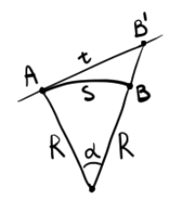
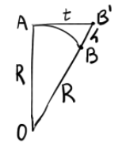

## О форме Земли

### Предмет и задачи геодезии.

**Геодезия** (с гр. "землеразделение") — это наука, изучающая форму, размеры и гравитационное поле Земли, а также правильное изображение её на плоскости в виде карт и планов при помощи специальных геодезических измерений. В настоящее время геодезия рассматривает методы и способы измерения горизонтальных и вертикальных углов, расстояний и внешнего гравитационного поля Земли при помощи новых электронных приборов. Искусство измерять землю и графически изображать отдельные фрагменты её возникли в Египте приблизительно 3000 лет до н.э. В России геодезия получила наибольшее развитие при Петре I. Так, в 1715 году была открыта морская академия с классом геодезии. А в 1745 г. был издан первый атлас России. В Москве по указу Екатерины II в 1799 году была открыта Константиновская землемерная школа. В 1819 переименованная в Константиновское училище. В 1835 году преобразованная в Константиновский межевой институт. После революции в 1936 г. был переименован в МИИГАиК. В 1993 г. – в МУГК.

Основная задача геодезии — это определение плановых координат и высот точек местности на земле, которые и являются основой для создания топографических карт и решения различных инженерно-технических задач.

### Понятие о форме и размерах Земли.

Знания фигуры и размеров Земли необходимы для определения положения объектов на земной поверхности и правильного её изображения в виде карт, планов и цифровых моделей местности. Физическая поверхность Земли состоит из разных форм рельефа. Описать такую фигуру очень сложно. Поэтому предлагается использовать такую геометрическую фигуру, которая соответствует фигуре Земли, и которую можно использовать для различных вычислений. Следовательно, определение формы Земли разделено на две части: определение правильной фигуры, которая соответствует форме Земли, и определение уклонений физической поверхности Земли от заданной модели.

Направление силы тяжести называется *отвесной линией* или *нормалью*. В природе нормаль можно наблюдать при помощи отвеса.

Поверхность Земли на 71% покрыта водой и только 28% занимает суша. Поверхность открытых морей и океанов, находящихся в спокойном состоянии, характерна тем, что она в любой своей точке перпендикулярна к отвесной линии. Следовательно, такую поверхность назвали уровнем.

**Уровенная поверхность** — это поверхность открытых морей и океанов в спокойном состоянии, мысленно продолженная под материками. Такую фигуру в 1871 г. немецкий учёный Иоганн Листинг назвал геоидом (с гр. "землеподобный").

**Геоид** — это геометрическое тело, образованное уровенной поверхностью. Это очень сложная математическая фигура, применяющаяся для некоторых задач. Похож на эллипсоид вращения.

По спутниковым измерениям отклонение уровенной поверхности Земли от геоида составляет 0.1 до 0.3 м. А на суше 2-3 м. Для решения геодезических задач для данной страны или ряда стран применяется референц-эллипсоид, поверхность которого совпадает с поверхностью страны или ряда стран.

**Референц эллипсоид** – это земной эллипсоид с определёнными размерами и положением в теле Земли. С 1946 г. в России используется референц-эллипсоид Красовского, у которого большая полуось равна 6 378 245 м. Сжатие Земли $\alpha=\frac{(a-b)}{b}$ часто используется сфера. Объём сферы соответствует объёму эллипсоида. Радиус вычисляется по формуле $\sqrt[3]{a^2\cdot b}$. Для сферы Красовского радиус составляет 6 371 110 м. В настоящее время используется трёхосный эллипсоид.

### Влияние кривизны Земли на горизонтальные расстояния.

Пусть $\Delta S$ - искажение при замене дуги сферы отрезком касательной, $S$ - длина дуги, $t$ - длина отрезка касательной, $\alpha$ - центральный угол.
$$\Delta S=t-S=R\tan\alpha-R\alpha\approx R(\alpha+\frac{\alpha^3}{3})-R\alpha=R\frac{\alpha^3}{3}$$
Относительная ошибка составит:
$$\frac{\Delta S}{S}=\frac{R\frac{\alpha^3}{3}}{R\alpha}=\frac{\alpha^2}{3}=\frac{1}{3}\left(\frac{S}{R}\right)^2$$
Приняв радиус Земли за постоянную ( 6 371 км), получим, что при расстояниях $R<11$ км относительная ошибка составит менее 1см на 1км. 

### Влияние кривизны Земли на вертикальные расстояния.

Обозначим разность между $OB'$ и $OB$ как $h$. Из прямоугольного треугольника $OAB'$ определим $h$:
$$(R+h)^2=R^2+t^2$$
$$R^2+2Rh+h^2=R^2+t^2$$
$$t^2=h(2R+h)$$
$$h=\frac{t^2}{2R+h}$$
Так как $2R\gg h$ даже на Эвересте, то:
$$h\approx\frac{t^2}{2R}$$
Приняв радиус Земли $R=6 371$ км, получим, что ошибку в 1см мы получим при расстояниях, меньших чем 350 м.

