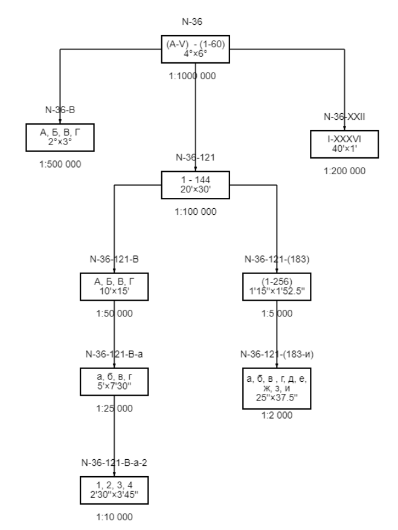
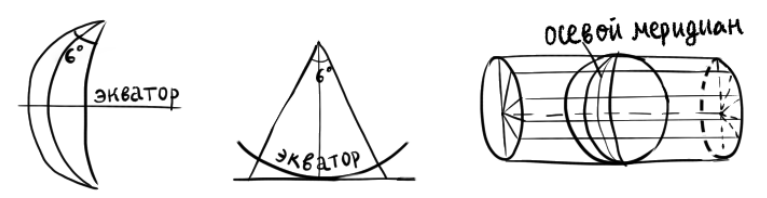
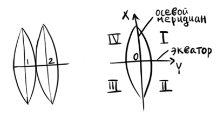

### Предмет и задачи геодезии.

**Геодезия** (с гр. "землеразделение") — это наука, изучающая форму, размеры и гравитационное поле Земли, а также правильное изображение её на плоскости в виде карт и планов при помощи специальных геодезических измерений. В настоящее время геодезия рассматривает методы и способы измерения горизонтальных и вертикальных углов, расстояний и внешнего гравитационного поля Земли при помощи новых электронных приборов. Искусство измерять землю и графически изображать отдельные фрагменты её возникли в Египте приблизительно 3000 лет до н.э. В России геодезия получила наибольшее развитие при Петре I. Так, в 1715 году была открыта морская академия с классом геодезии. А в 1745 г. был издан первый атлас России. В Москве по указу Екатерины II в 1799 году была открыта Константиновская землемерная школа. В 1819 переименованная в Константиновское училище. В 1835 году преобразованная в Константиновский межевой институт. После революции в 1936 г. был переименован в МИИГАиК. В 1993 г. – в МУГК.

Основная задача геодезии — это определение плановых координат и высот точек местности на земле, которые и являются основой для создания топографических карт и решения различных инженерно-технических задач.

### Понятие о форме и размерах Земли.

Знания фигуры и размеров Земли необходимы для определения положения объектов на земной поверхности и правильного её изображения в виде карт, планов и цифровых моделей местности. Физическая поверхность Земли состоит из разных форм рельефа. Описать такую фигуру очень сложно. Поэтому предлагается использовать такую геометрическую фигуру, которая соответствует фигуре Земли, и которую можно использовать для различных вычислений. Следовательно, определение формы Земли разделено на две части: определение правильной фигуры, которая соответствует форме Земли, и определение уклонений физической поверхности Земли от заданной модели.

Направление силы тяжести называется *отвесной линией* или *нормалью*. В природе нормаль можно наблюдать при помощи отвеса.

Поверхность Земли на 71% покрыта водой и только 28% занимает суша. Поверхность открытых морей и океанов, находящихся в спокойном состоянии, характерна тем, что она в любой своей точке перпендикулярна к отвесной линии. Следовательно, такую поверхность назвали уровнем.

**Уровенная поверхность** — это поверхность открытых морей и океанов в спокойном состоянии, мысленно продолженная под материками. Такую фигуру в 1871 г. немецкий учёный Иоганн Листинг назвал геоидом (с гр. "землеподобный").

**Геоид** — это геометрическое тело, образованное уровенной поверхностью. Это очень сложная математическая фигура, применяющаяся для некоторых задач. Похож на эллипсоид вращения.

По спутниковым измерениям отклонение уровенной поверхности Земли от геоида составляет 0.1 до 0.3 м. А на суше 2-3 м. Для решения геодезических задач для данной страны или ряда стран применяется референц-эллипсоид, поверхность которого совпадает с поверхностью страны или ряда стран.

**Референц эллипсоид** – это земной эллипсоид с определёнными размерами и положением в теле Земли. С 1946 г. в России используется референц-эллипсоид Красовского, у которого большая полуось равна 6 378 245 м. Сжатие Земли $\alpha=\frac{(a-b)}{b}$ часто используется сфера. Объём сферы соответствует объёму эллипсоида. Радиус вычисляется по формуле $\sqrt[3]{a^2\cdot b}$. Для сферы Красовского радиус составляет 6 371 110 м. В настоящее время используется трёхосный эллипсоид.

### Влияние кривизны Земли на горизонтальные расстояния.

Пусть $\Delta S$ - искажение при замене дуги сферы отрезком касательной, $S$ - длина дуги, $t$ - длина отрезка касательной, $\alpha$ - центральный угол.
$$\Delta S=t-S=R\tan\alpha-R\alpha\approx R(\alpha+\frac{\alpha^3}{3})-R\alpha=R\frac{\alpha^3}{3}$$
Относительная ошибка составит:
$$\frac{\Delta S}{S}=\frac{R\frac{\alpha^3}{3}}{R\alpha}=\frac{\alpha^2}{3}=\frac{1}{3}\left(\frac{S}{R}\right)^2$$
Приняв радиус Земли за постоянную ( 6 371 км), получим, что при расстояниях $R<11$ км относительная ошибка составит менее 1см на 1км. 

### Влияние кривизны Земли на вертикальные расстояния.

Обозначим разность между $OB'$ и $OB$ как $h$. Из прямоугольного треугольника $OAB'$ определим $h$:
$$(R+h)^2=R^2+t^2$$
$$R^2+2Rh+h^2=R^2+t^2$$
$$t^2=h(2R+h)$$
$$h=\frac{t^2}{2R+h}$$
Так как $2R\gg h$ даже на Эвересте, то:
$$h\approx\frac{t^2}{2R}$$
Приняв радиус Земли $R=6 371$ км, получим, что ошибку в 1см мы получим при расстояниях, меньших чем 350 м.

### Понятие о плане и карте. Масштабы топографических карт, принятые России.

Топографические материалы, являющиеся уменьшенным обобщённым условно-знаковым изображением участков местности на плоскости, подразделяются на планы и карты.

**План** — это уменьшенное, подобное изображение на плоскости в горизонтальной проекции небольших участков земной поверхности ($R\leq10$ км). Составляются в масштабах 1:5000, 1:2000, 1:1000, 1:500. Составляются в ортогональной проекции.

**Карта** — это уменьшенное изображение значительного участка земной поверхности, при котором учитывается кривизна Земли. Карты строятся с помощью определённого математического закона, который называют картографической проекцией.

Топографические карты в России создаются в равноугольной проекции, при использовании которой осевой меридиан и линия экватора переносятся без искажения.

Масштабы карт по масштабу делятся на:
1. *Топографические* (до 1:200 000):
	1. *Крупномасштабные* (1:10 000 - 1:50 000);
	2. *Среднемасштабные* (1:100 000 - 1:200 000);
2. *Обзорно-топографические*, или *Мелкомасштабные* (1:500 000 - 1: 1000 000);
3. *Обзорные* (мельче 1:1000 000).

Обязательными компонентами карт являются: картографическое изображение, математическая основа и легенда. Если на карте не указан масштаб, то такая карта называется *картосхемой*.

### Условные знаки топографических карт и планов.

Для обеспечения на планах и картах различных предметов (ситуаций) местности, применяются условные знаки. Условные знаки на топографических картах представляют собой систему графического, цветного, буквенного и цифрового обозначения. Перечень и расшифровка условных знаков обязательно приводятся в легенде карты. 

Условные знаки состоят из:
- Графические знаки – система различных фигур и линий;
- Цветовое обозначение и штриховки – разнообразная цветовая гамма, позволяющая более наглядно обозначать ситуацию и рельеф;
- Буквенное обозначение – подпись географических названий и объектов;
- Цифровое обозначение – указание различных характеристик.

Условные знаки в основном делятся на три группы:
1. Контурные (масштабные), обозначающие объекты на карте, которые точно соответствуют данным объектам на местности (можно измерить длину, ширину или площадь);
2. Внемасштабные условные знаки, которые изображают малоразмерные объекты, не выраженные в масштабе карты. Главная точка условного знака точно соответствует данной точке на местности. Их можно разделить на четыре группы:
	1. Знаки, в которых главная точка находится в центре фигуры;
	2. В середине основания; (c) В вершине прямого угла у основания знака;
	3. В геометрическом центре нижней фигуры.
3. Линейные условные знаки являются масштабными по длине и внемасштабными по ширине. Ось середины знака является геометрическим местом главных точек знака;
4. Пояснительные условные знаки применяются для дополнительных качественных и количественных характеристик изображаемых условных знаков.

Рельеф на топографических картах изображается горизонталями.

**Заложение** - расстояние между смежными горизонталями на топографической карте, зависящее от принятой высоты сечения рельефа на данной карте и крутизны ската в данном месте.

**Шкала сечения рельефа** - это последовательность чисел, которые определяют прирост высоты сечения рельефа с увеличением абсолютных высот или глубин рельефа.

**Гипсометрическая шкала** - это последовательность цветов или оттенков одного цвета, используемая на карте для окраски разных высотных ступеней.

### Основные понятия о координатах точек земной поверхности. Система высот, принятая в геодезии.

Для определения положения точек на местности применяются угловые и линейные величины, которые называются координатами. В геодезии применяются следующие системы координат:
- Географические координаты;
	- *Меридиан* — это линия пересекающая уровенную поверхность эллипсоида плоскости через ось его вращения (плоскости долгот);
	- *Параллель* — это линия, пересекающая уровенную поверхность плоскостями перпендикулярно оси вращения Земли (плоскости широт).
	- *Широта* — это угол, образованный отвесной линией и плоскостью экватора (к южному полюсу угол отрицательный).
	- *Долгота* — это двугранный угол, образованный начальным меридианом (Гринвичский меридиан, который принят с 1 ноября 1884 г.) и плоскостью меридиана, проходящего через определённую точку. К востоку от 0 до +180 градусов , к западу от 0 до −180 градусов .
- Зональная система плоских прямоугольных координат Гаусса-Крюгера;
- Система полярных и биполярных координат и др.

Для определения положения точки на местности необходимо знать плановые координаты ($\varphi$, $\lambda$ или X, Y) а также высоту точки, которая определяется наикратчайшим расстоянием по отвесной линии до заданной уровенной поверхности. Если применяется уровенная поверхность эллипсоида вращения, то такая высота называется абсолютной. Следовательно, абсолютная высота — это наикратчайшее расстояние по отвесной линии между точкой на земной поверхности и уровенной поверхностью эллипсоида вращения. В России и странах СНГ используется балтийская система высот, то есть уровенная поверхность Балтийского моря. Отсчёт абсолютных высот ведётся от штриха на металлической пластине (от нуля кронштадтского футштока). Наблюдение ведётся с 1707 года. Абсолютная высота может иметь знак плюс, если выше уровенной поверхности, и знак минус – если ниже.

Если за начало уровенной поверхности принимается какая-либо другая поверхность, то такая высота называется относительной (условной). За относительную высоту при строительстве дома принимается пол первого этажа. Но при производстве топографо-геодезических работ условная высота привязывается к Балтийской системе высот. На топографических картах высота часто показывается цифрами (отметки).

Кроме условной высоты, имеется местная система высот. Например, на Дальнем Востоке все отметки определяются в тихоокеанской системе высот, которая отличается от балтийской на −1873 мм.

Разность высот точек местности называется превышением. Превышение может быть как положительным, так и отрицательным. Если измерение идёт по направлению, то такое превышение называется прямым. Иначе – обратным.

Для определения высот точек местности на территории России заложены знаки, которые называются реперами, высоты которых определены в балтийской системе высот.

### Масштабы топографических карт и планов. Точность масштаба.

Масштабом карты называется отношение длины линии на плане к соответствующей длине горизонтального проложения этой линии на местности.
$$\frac{1}{M}=\frac{S_{плановое}}{S_{местности}}$$
*Чтобы понять, сколько километров местности укладывается в 1 сантиметр карты, нужно мысленно зачеркнуть 5 нулей.*

Так как план является небольшим участком, то в любой точке масштаб будет постоянен. А на картах масштаб зависит от кривизны линий.

Масштабы подразделяются на:
- Численный. Выражается аликвотной дробью. В числителе единица, в знаменателе число, показывающее, во сколько раз горизонтальное проложение линии местности уменьшена при перенесении её на план или карту. Численный масштаб может быть любым, но чаще используют их стандартные величины;
- Именованный масштаб. Представляет собой словесное содержание численного масштаба и указывает какая величина горизонтального проложения соответствует одному сантиметру на карте. Например: 1 см соответствует 100 м;
- Графический линейный масштаб. Представляет собой графическое изображение численного и именованного масштабов в виде линии, разделённой на определённое количество отрезков по 2 см. Крайний левый отрезок разделён на 20 отрезков.
- Графический поперечный масштаб. Представляют в виде номограммы в виде металлической пластины. Её построение основано на пропорциональности частей параллельных линий, которые пересекаются трансверсалями.

Расстояние от карты до глаза составляет 35 см. Критический угол человеческого зрения равен одной минуте. Тогда графическая точность масштаба составляет 0.1 мм.
$$t=S\cdot\frac{1'}{S'}=\frac{350 мм\cdot 1'}{3438'}=0.1 мм$$

### Разграфка и номенклатура топографических карт и планов разных масштабов. Цифровая номенклатура карт России.

Границы листов топографических карт с востока и запада ограничены меридианами. С севера и юга – параллелями. Они образуют рамки листов карты.

Для удобства пользования картой введены разграфка и номенклатура топографической карты.

Разграфка — это система деления листа карты одного масштаба на листы карты более крупного масштаба.

Номенклатура — это система обозначения листов карт разных масштабов. nl В основу деления карт на листы в России принята международная разграфка карт масштаба 1:000 000 (в 1 см 12 10 км), так называемые "миллионки" размером φ = 4◦ , λ = 6◦ . Для этого всю поверхность земного шара делят параллелями и меридианами и обозначают их рядами (поясами) и колоннами.

Разбивка на ряды (пояса) параллелями производится параллелями от экватора каждые 4 ◦ . Ряды обозначают буквами латинского алфавита: A, B, C, D, E, F, G, H, I, J, K, L, M, N, O, P, Q, R, S, T, U, V.

Колонны в своих границах совпадают с шестиградусными зонами проекции Гаусса. Нумерация их ведётся от меридиана ±180◦ на восток. Номер колонны отличается от номера зоны на 30 единиц. Колонны обозначаются арабскими цифрами.

Номенклатура листа топографической карты масштаба 1:000 000 составлена из латинской буквы ряда и арабской цифры номера колонны. Например, N-38. Для карт южного полушария после номенклатуры в скобках указывают (Ю.П.).

Общая схема разграфки и номенклатур топографических карт, принятых в России:

Недостаток этой разграфки — изменение линейных размеров северных и южных рамок листов карт в зависимости от топографической широты. В результате при удалении от экватора листы приобретают вид всё более узких полос, вытянутых вдоль меридианов. Поэтому топографические карты России всех масштабов от 60◦ до 76◦ издаются сдвоенные по долготе. А в пределах 76◦ -84◦ – счетверяются. А в масштабах 1:200 000 – страиваются (соединяются три карты по долготе).

Цифровая номенклатура карт применяется для учёта карт и составления заявок на карты с использованием ЭВМ. Каждая буква, обозначающая пояса (ряды) заменяется двузначными цифрами: A – 01, B – 02, C – 03, ...

Каждый лист карты масштаба 1:200 000 обозначается двузначным числом от 01 до 36, а масштаба 1:100 000 – тремя цифрами от 001 до 144. Буквы АБВГ заменяются на 1, 2, 3, 4.

Перед цифровой номенклатурой листов карт южного полушария ставят цифру 9. Например, F-36-A(Ю.П.) примет вид 9-6-36-1.

### Проекция Гаусса-Крюгера.

Для определения зональной системы плоских прямоугольных координат, сферу разбивают на зоны с шириной 6 ◦ . Нумерация сквозная от начального меридиана. Таких зон будет 60.

Меридиан, делящий зону пополам, называется осевым меридианом.

Основная задача заключается в: необходимо спроецировать сферу или зону на плоскость. Самым простым способом проецирования является перенос сферы или зоны в цилиндр. Для этого зону мысленно помещают внутрь цилиндра так, чтобы осевой меридиан касался внутренней поверхности цилиндра.

После этого проецируют сферическую поверхность зоны на внутреннюю поверхность цилиндра. Цилиндр разрезают и получают плоское изображение зоны. При этом ширина зоны на плоскости будет больше чем на сфере.

Основное достоинство этой проекции заключается в:
1. Осевой меридиан спроецирован без искажений;
2. Углы также не искажаются. Поэтому такая проекция называется равноугольной поперечно-цилиндрической.

Согласно рисунку длины линий имеют искажения. При этом чем дальше от осевого меридиана, тем искажение больше. Относительная ошибка искажений длины линий определяется по формуле:
$$\frac{\Delta S}{S} = \frac{1}{2}\left(\frac{Y}{R}\right)^2$$
где $S$ - искажение (увеличение) длин линий; S — длина линий; Y — расстояние от осевого меридиана до определяемой линии; R — средняя длина радиуса кривизны. Для России примерно 6370 км.

Ширина зоны составляет 6 ◦ , тогда 1 ◦ = 110.6 км. Следовательно, общая длина зоны составляет 664 км на экваторе.

Средняя относительная ошибка для территории России составляет 1/1000 на краях зоны. Такая относительная ошибка достаточна для создания карт масштаба 1:10 000 и мельче. Для создания карт масштаба 1:5000 и крупнее необходимо сферу разделить на трёхградусные зоны.

### Зональная система плоских прямоугольных координат. Преобразованные координаты.

Каждая зона имеет вою прямоугольную систему координат, где осевой меридиан является осью абсцисс, а экватор – осью ординат.

Точка пересечения ординаты и абсциссы является началом отсчёта координат. В геодезии применяется правая система координат. Так как знаки приращения координат четвертят в геодезии и математике одинаково, то тригонометрические формулы применяются без изменений.

Так как территория России лежит в северном полушарии, то на всех топографических картах иксы имеют знак плюс. Ордината в восточной части зоны имеет знак плюс, а в западной – минус, что не очень удобно при решении геодезических задач. Поэтому было предложено мысленно снести осевой меридиан на 500 км к западу. В этом случае полученные ординаты называются преобразованными. Чтобы не спутаться, в какой зоне это происходило, перед преобразованной ординатой ставится номер зоны.

Определение номера зоны выполняется следующим способом: к долготе в градусах прибавляют шесть градусов, и сумму делят на 6.

Топографические карты на краях двух зон имеют полосы перекрытий, которые равняются четырём градусам. Два градуса на одной и два – на другой. Это делается для исключения разрыва зон. Основное достоинство данной проекции – переход от одних координат к другим в данной точке на карте.

### Понятие об ориентировании линий.

При проведении геодезических работ возникает необходимость в определении положения линий на местности относительно какого-либо направления, принятое за начальное.

**Ориентировать линию** — значит определить её направление относительно исходного. За исходное направление принимается истинный магнитный или осевой меридианы.

**Истинным меридианом** называется линия, пересекающая уровенную поверхность плоскостью через точку и ось вращения Земли. Изображается линией со звездой на конце;

**Магнитный меридиан** — это проекция оси магнитной стрелки компаса на точке уровенной поверхности. Изображается линией со стрелкой.

**Осевой меридиан** — средний меридиан зоны в виде прямой линии. Изображается в виде линии с раздвоенным концом.

