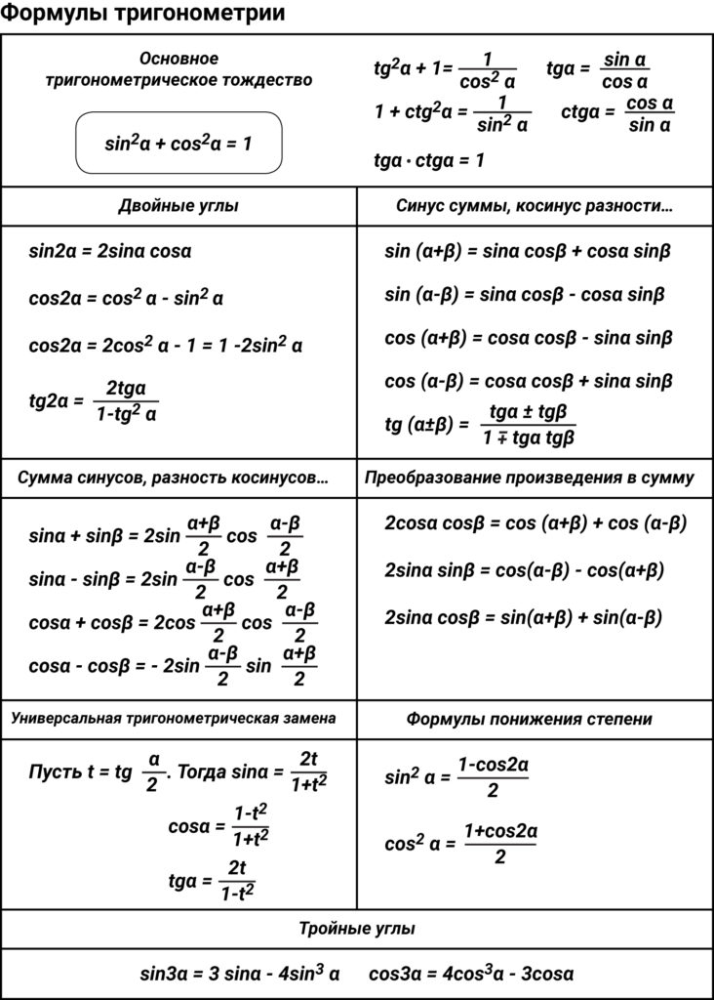

## Математический анализ

## Приложение

### Формулы тригонометрии

### Таблица производных

### Таблица интегралов

### Интегрирование по частям
$$\boxed{\int_a^bu\,dv=\left.uv\right|_a^b-\int_a^bv\,du}$$
Решение некоторых часто используемых интегралов, берущихся по частям:

$$\int_a^b\ln x\,dx=\begin{vmatrix}u=\ln x\Rightarrow du=\frac{dx}{x}\\\ dv=dx\Rightarrow v=x\end{vmatrix}=\left. x\ln x\right|_a^b-\int_a^bx\frac{dx}{x}=\left. x\ln x\right|_a^b-\left. x\right|_a^b$$

$$\begin{aligned}\int_a^bx\cos nx\,dx&=\begin{vmatrix}u=x\Rightarrow du=dx\\\ dv=\cos nx\,dx\Rightarrow v=\frac{\sin nx}{n}\end{vmatrix}=\\\ &=\left.\frac{x\sin nx}{n}\right|_a^b-\int_a^b\frac{\sin nx}{n}dx=\left.\frac{x\sin nx}{n}\right|_a^b+\left.\frac{\cos nx}{n^2}\right|_a^b\end{aligned}$$

$$\begin{aligned}\int_a^bx\sin nx\,dx&=\begin{vmatrix}u=x\Rightarrow du=dx\\\ dv=\sin nx\,dx\Rightarrow v=-\frac{\cos nx}{n}\end{vmatrix}=\\\ &=-\left.\frac{x\cos nx}{n}\right|_a^b+\int_a^b\frac{\cos nx}{n}dx=\left.-\frac{x\cos nx}{n}\right|_a^b+\left.\frac{\sin nx}{n^2}\right|_a^b\end{aligned}$$

$$\begin{aligned}\int_a^b x^2\sin nx\,dx&=\begin{vmatrix}u=x^2\Rightarrow du=2x\,dx\\\ dv=\sin nx\,dx\Rightarrow v=-\frac{\cos nx}{n}\end{vmatrix}= \\\ &=\left.-\frac{x^2\cos nx}{n}\right|_a^b+\frac{2}{n}\int_a^b x\cos nx\,dx=\begin{vmatrix}u=x\Rightarrow du=dx\\\ dv=\cos x\,dx\Rightarrow v=\frac{\sin nx}{n}\end{vmatrix}=\\\ &=\left.-\frac{x^2\cos nx}{n}\right|_a^b+\left.\frac{2}{n}\frac{x\sin nx}{n}\right|_a^b-\frac{2}{n}\int_a^b\frac{\sin nx}{n}dx=\\\ &=\left.-\frac{x^2\cos nx}{n}\right|_a^b+\left.\frac{2x\sin nx}{n^2}\right|_a^b+\left.\frac{2\cos nx}{n^3}\right|_a^b\end{aligned}$$

$$\begin{aligned}\int_a^b x^2\cos nx\,dx&=\begin{vmatrix}u=x^2\Rightarrow du=2x\,dx\\\ dv=\cos nx\,dx\Rightarrow v=\frac{\sin nx}{n}\end{vmatrix}= \\\ &=\left.\frac{x^2\sin nx}{n}\right|_a^b-\frac{2}{n}\int_a^b x\sin nx\,dx=\begin{vmatrix}u=x\Rightarrow du=dx\\\ dv=\sin x\,dx\Rightarrow v=-\frac{\cos nx}{n}\end{vmatrix}=\\\ &=\left.\frac{x^2\sin nx}{n}\right|_a^b+\left.\frac{2}{n}\frac{x\cos nx}{n}\right|_a^b-\frac{2}{n}\int_a^b\frac{\cos nx}{n}dx=\\\ &=\left.\frac{x^2\sin nx}{n}\right|_a^b+\left.\frac{2x\cos nx}{n^2}\right|_a^b-\left.\frac{2\sin nx}{n^3}\right|_a^b\end{aligned}$$

$$\begin{aligned}&\int_a^b e^x\cos nx\,dx=\\\ &\boxed{\begin{aligned}&\int_a^b e^x\cos nx\,dx=\begin{vmatrix}u=e^x\Rightarrow du=e^x\,dx\\\ dv=\cos nx\,dx\Rightarrow v=\frac{\sin nx}{n}\end{vmatrix}=\\\ &= \left.\frac{e^x\sin nx}{n}\right|_a^b-\int_a^b\frac{e^x\sin nx}{n}dx=\begin{vmatrix}u=e^x\Rightarrow du=e^x\,dx\\\ dv=\sin nx\,dx\Rightarrow v=-\frac{\cos nx}{n}\end{vmatrix}=\\\ &=\left.\frac{e^x\sin nx}{n}\right|_a^b+\left.\frac{e^x\cos nx}{n^2}\right|_a^b-\frac{1}{n^2}\int_a^b e^x\cos nx\,dx\end{aligned}}\\\ &=\left(\left.\frac{e^x\sin nx}{n}\right|_a^b+\left.\frac{e^x\cos nx}{n^2}\right|_a^b\right)\frac{1}{1+\frac{1}{n^2}}=\frac{e^x}{n^2+1}\left.\left(n\sin nx+\cos nx\right)\right|_a^b\end{aligned}$$

$$\begin{aligned}&\int_a^b e^x\sin nx\,dx=\\\ &\boxed{\begin{aligned}&\int_a^b e^x\sin nx\,dx=\begin{vmatrix}u=e^x\Rightarrow du=e^x\,dx\\\ dv=\sin nx\,dx\Rightarrow v=-\frac{\cos nx}{n}\end{vmatrix}=\\\ &= \left.-\frac{e^x\cos nx}{n}\right|_a^b+\int_a^b\frac{e^x\cos nx}{n}dx=\begin{vmatrix}u=e^x\Rightarrow du=e^x\,dx\\\ dv=\cos nx\,dx\Rightarrow v=\frac{\sin nx}{n}\end{vmatrix}=\\\ &=\left.-\frac{e^x\cos nx}{n}\right|_a^b+\left.\frac{e^x\sin nx}{n^2}\right|_a^b-\frac{1}{n^2}\int_a^b e^x\sin nx\,dx\end{aligned}}\\\ &=\left(\left.-\frac{e^x\cos nx}{n}\right|_a^b+\left.\frac{e^x\sin nx}{n^2}\right|_a^b\right)\frac{1}{1+\frac{1}{n^2}}=\frac{e^x}{n^2+1}\left.\left(-n\cos nx+\sin nx\right)\right|_a^b\end{aligned}$$
