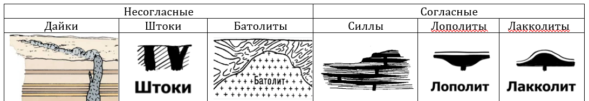

## Минеральные и энергетические ресурсы.

### Классификация природных ресурсов Земли.

**Природные (или естественные) ресурсы Земли (ПРЗ)** - это компоненты природы, которые на данном уровне развития производительных сил используются или могут быть использованы в качестве средств производства и предметов потребления.

Классификация ПРЗ:
- *По назначению*: минеральные, энергетические, биологические;
- *По генезису*: земельные, водные, растительные, минеральные, климатические, геотермальные, энергия приливов и отливов;
- *По сфере использования*:
	- применяемые в материальном производстве (промышленность, сельское хозяйство);
	- применяемые в нематериальном производстве (медицина, ювелирное дело);
- *По исчерпаемости*:
	- практически неисчерпаемые (энергия солнца, ветра, текучей воды, солнечно-лунное притяжение);
	- исчерпаемые:
		- возобновимые (почва, вода);
		- невозобновимые (минеральные ресурсы).

### Классификация полезных ископаемых.

**Минеральные (минерально-сырьевые) ресурсы** - это совокупность полезных ископаемых в недрах земной коры и на её поверхности, подсчитанных применительно к существующим кондициям на полезные ископаемые с учётом научно-технического прогресса.

**Кондиция** - это количество полезных ископаемых, которое экономически рентабельно добывать и разрабатывать при данном уровне развития техники.

**Полезные ископаемые** - это минеральные образования земной коры, химический состав и физические свойства которых позволяют эффективно использовать их в сфере материального производства. Генезис полезных ископаемых тесно связан с генезисом тех горных пород, среди которых они находятся.

Классификации полезных ископаемых:
- По химизму:
	- металлические (рудные), в свою очередь в зависимости от количества металлов в кондиционных содержаниях делятся на:
		- *монометальные* (железные, хромовые, золотые и др.), *биметальные* (свинцово-цинковые, медно-молибденовые и др.), *полиметальные*.
	- неметаллические;
	- горючие (асбестовые, фосфоритовые, серные руды и др.).
- По физическому состоянию: твёрдые, жидкие, газообразные;
- По генезису:
	- эндогенные, рождённые под действием глубинного тепла и давления;
	- экзогенные: гипергенные (кора выветривания) и осадочные (известняки).

### Химическая классификация минералов.

**Минералы** – это твёрдые природные тела, характеризующиеся кристаллохимической однородностью. Всего известно более 2000 минералов, но широкое распространение имеют всего несколько десятков, которые называются породообразующими.

Химическая классификация минералов:
- *Самородные элементы* (из одного химического элемента)
	- например, сера $S$, графит $C$;
- *Сульфиды* (соединения металлов с серой)
	- например, галенит $PbS$, пирит $FeS_2$, халькопирит $CuFeS_2$;
- *Галогены* (соли галоидоводородных кислот)
	- например, галит $NaCl$, сильвин $KCl$;
- *Оксиды и гидроксиды* (соединения с кислородом и гидроксильной группой $OH$)
	- например, кварц $SiO_2$, магнетит $Fe_3O_4$, гематит $Fe_2O3$;
- *Карбонаты* (соли угольной кислоты)
	- например, кальцит $CaCO_3$, доломит $CaMg[CO_3]_2$;
- *Сульфаты* (соли серной кислоты)
	- например, ангидрит $Ca[SO_4]$, гипс;
- *Фосфаты* (соли фосфорной кислоты)
	- например, апатит $Ca_5[PO_4]_3[F,Cl,OH]_2$;
- *Силикаты* (солеобразные химические соединения)
	- например, оливин, авгит, роговая обманка, пироксен, тальк, мусковит и др.

### Генетическая классификация минералов.

Классификация минералов по происхождению (генезису):
1. *Магматические* (кристаллизация магмы);
2. *Вулканические* (кристаллизация лавы и осаждение из вулканических паров и газов);
3. *Гидротермальные* (из горячих водных растворов);
4. *Пневматолитовые* (из горячих газовых растворов);
5. *Метаморфические* (образуются в недрах планеты за счёт других минералов);
6. *Метасоматические* (при химическом замещении других минералов);
7. *Хемогенные* (при осаждении в водной среде);
8. *Органогенные* (при участии бактерий или как скопления скелетов);
9. *Гипергенные* (химическое выветривание на поверхности).

### Классификация площадей распространения полезных ископаемых.

Площади распространения полезных ископаемых в порядке их уменьшения подразделяются на:
- *Провинции* - крупные участки земной земной коры, отвечающие платформе или горным поясам;
- *Области* -- части провинций -- приурочены к крупным тектоническим элементам (щитам, антеклизам, синеклизам, антиклинориям, синклинориям, межгорным и краевым прогибам);
	- Пояс - область, в пределах которой месторождения приурочены к линейно-вытянутым тектоническим структурам;
	- Бассейн - это область почти непрерывного распространений осадочных полезных ископаемых.
- *Районы* (*узлы*) - части областей, с местным сосредоточением месторождений площадью от сотен до первых тысяч квадратных километров; 
- *Поля* - группы месторождений, характеризующихся общностью происхождения и единством геологической структуры. Площадь полей составляет от нескольких до десятков квадратных километров.
- *Месторождения* - природные скопления полезных ископаемых, которое в количественном и качественном отношении может быть предметом промышленной разработки.
	- Природное скопление, которое в количественном отношении не может считаться предметом разработки, называется рудопроявлением.
- *Тела* - ограниченные со всех сторон скопление минерального вещества.

### Миграция и концентрация химических элементов в земной коре.

**Миграция элементов** - перемещение вещества внутри Земли и на её поверхности вне зависимости от природы физико-химических процессов, вызывающих такое перемещение.

В результате миграции происходит рассеяние и концентрация элементов, образование месторождений. 

Близкие по таблице Менделеева элементы обладают близкими химическими и физическими свойствами. В ряде случаев близкие по геохимическим свойствам элементы мигрируют совместно.

**Геохимические поля** - это элементы, близкие по таблице Менделеева. Имеется несколько вариантов разделения периодической таблицы на геохимические поля. Например, следующим образом (классификация В. М. Голдшмидта):
1. *Атмофильные* элементы (преобладают атомы с 8-электронными оболочками): инертные газы, азот;
2. *Литофильные* (ионы с 8-электронными внешними оболочками): $Li$, $O$, $C$, $F$, $Cl$, $Na$, $Ma$ и другие.
2. *Халькофильные* (ионы с 18-электронными внешними оболочками): $S$, $Cu$, $Zn$ и др.
3. *Сидерофильные* (ионы с достраивающимися электронными оболочками): $Fe$, $Co$, $Ni$, платиноиды.

**Парагенез** - совместное нахождение родственных или близких по происхождению минералов.

### Металлогеническая специализация горных пород.

Химические элементы принято делить на петрогенные и металлогенные.
- *Петрогенные элементы* - это породообразующие элементы горных пород и нерудных минералов. Петрогенные элементы соответствуют литофильным элементам.
- *Металлогенные элементы* способны образовывать скопления тяжёлых металлов и рудных месторождений. Металлогенные элементы соответствуют  халькофильным и сидерофильным элементам.

Давно была подмечена закономерная приуроченность металлов и других полезных химических элементов к определённым типам горных пород и месторождениям, которые генетически с ними связаны. Наиболее характерны следующие примеры типичных ассоциаций элементов и минералов с горными породами:
- Ультраосновные (гипербазитовые) магматические породы (дуниты, перидотиты, пироксениты):
	1. $Cr$, $Fe$, $Mg$;
	2. Реже платина $Pt$ и платиноиды;
	3. Изредка алмазы $C$ в кимберлитах, тальк или асбест при воздействии гидротермальных растворов.
- Основные (базитовые) магматические породы (габбро, диабазы и др):
	1. $Fe$, $Ti$, $V$;
	2. $Fe$, $Cu$, $Ni$, $Co$, $Pt$, $Pd$.
- Щелочные магматические породы (нефелиновые сиениты, пегматиты):
	1. $Al$, $Zr$, $Ti$, $Nb$, $Ta$, $Th$ и др.
- Кислые (гранитоидные) магматические породы (граниты, гранитодиориты):
	1. $W$, $Sn$, $Mo$, $Li$, $F$, $B$ и др.;
	2. $Fe$, иногда $W$, $Mo$, $Cu$.
- Гидротермальные жильные или метасоматические образования:
	1. $Au$, $Fe$, $S$, $As$;
	2. $Zn$, $Pb$, $Ag$, иногда $Cu$;
	3. $Ag$, $Bi$, $Co$, $Ni$, $U$, $As$;
	4. $Au$, $Ag$, $Fe$, $Se$;
	5. $Hg$, $Sb$, $Ba$, $F$, иногда $As$.
- Экзогенные остаточные продукты коры выветривания:
	1. $Fe$, $Mn$;
	2. $Al$, $Fe$;
	3. $Ni$, $Co$, $Mg$.
- Осадочные образования в морских и озёрных бассейнах:
	1. $Fe$, $Mn$;
	2. $Al$, $Fe$;
	3. $P$, $Ca$.
- Соленосные отложения в замкнутых усыхающих озёрах и лагунах:
	1. $Na$, $Ca$, $Mg$, $K$;
	2. $Na$, $Ca$, $Mg$, $B$.
- Угленосные биохимические (фитогенные) отложения прибрежных зон водоёмов:
	- бурый и каменный угли, антрацит.
- Биогенно-обломочные отложения в спокойных мелководных бассейнах (морей, лагун, заливов, озёр, дельт):
	- горючие сланцы.
- Нефтегазоносные осадочные (сапропелевые) отложения водоёмов со стоячей водой (озёр, лагун, заливов):
	- нефть, горючие газы, асфальты, битумы.

### Условия залегания горных пород

#### Условия залегания осадочных горных пород

Осадочные горные породы залегают в виде пластов (пластовых горизонтов). Залегания бывают нарушенные (вторичные) и ненарушенные (первичные).

Первичное залегание осадочных горных пород соответствует условиям их накопления, характеризуется малым углом наклона (до $5^\circ$):
- Субгоризонтальное залегание - залегание, близкое к горизонтальному;
- На более крутых склонах бассейнов возникают моноклинальные залегания - слои, наклонённые в одну сторону.

Вторичные залегания возникают при смещении слоёв горных пород с их первичного места залегания за счёт тектонических движений.
- Без нарушения сплошности, в виде складок:
	- Среди складок различают:
		- Антиклинорий - сложное сочетание в пространстве складок разных форм и масштабов, образующее в целом антиклинальную форму:
		- Синклинорий - в целом синклинальную форму;
		- Антеклиза - широкие (в несколько сотен километров) и пологие в целом выпуклые формы на платформах;
		- Синеклиза - в целом вогнутые.
	- Сочетание складок называют складчатостью
		- Полная складчатость: всё пространство территории занято линейными складками и нет горизонтального заложения слоёв;
		- Прерывистая складчатость характеризуется наличием изолированных складок, между которыми имеются участки с горизонтальным залеганием слоёв;
		- Промежуточная складчатость
			- Гребневидная: чередование узких антиклиналей и широких синклиналей.
			- Сундучно-коробочная: сундучные антиклинали и коробчатые синклинали.
- Разрывные нарушения (дизъюнктивные дислокации). Различают две группы разрывов:
	- Трещины (разрывы без смещения)
	- Разрывы со смещением

#### Условия залегания вулканических горных пород

Излившаяся на поверхность лава образует эффузивные тела, среди которых выделяются: лавовый покров, лавовый поток, некк (жерловина), вулканический (экструзивный) купол (пик, игла) и диатрема (трубка взрыва), вулканический конус, стратовулкан, щитовидный вулкан.

#### Условия залегания метаморфических горных пород

Метаморфические горные породы обычно сохраняют формы залегания тех пород, из которых они образовались (пласты, линзы – в осадочных толщах и лакколитах, а батолиты и жилы – в магматических). Породы, образовавшиеся при контактовом метаморфизме, образуют пояса вокруг интрузивного тела.

#### Условия залегания магматических горных пород

Некоторые виды интрузивных магматических тел:
- _Дайки_. Магма раздвигает разломы, застывает и образует стены. Дайки обладают длиной от десятков метров до сотен километров и шириной от нескольких сантиметров до 5—10 км;
- _Штоки_. Столбообразные интрузивы изометричной формы. Магма поднимается через пересечения разломов. Площадь выхода штока, как правило, не превышает 100 км²;
- _Батолиты_. Крупный интрузивный массив, имеющий площадь более 100 км² и мощность 3—15 км;
- _Силлы_. Пластовые тела. Протяженность силлов может достигать 300 км. Мощность силлов колеблется от десятков сантиметров до 600 м, но чаще встречаются силлы мощностью от 10 до 50 м;
- _Лополиты_. Чашеобразные интрузивы;
- _Лакколиты_. Грибообразные интрузивы.

### Фации и формации. Металлогеническая специализация формаций.

**Фация** – осадки или горные породы, возникающие в определённой физико-географической обстановке и отличающиеся от состава и условий образования смежных одновозрастных пород.

**Формация** – это комплекс пород, образовавшихся в сходных тектонических условиях.

Если фация касается поверхностной географии, то формации касаются глубинной структуры коры.

#### Платформенные формации
Платформенные формации чаще всего образуются в мелководных бассейнах.

Районы с гумидным климатом:
- ледниковые отложения, речные, озёрные, склоновые формации;

В жарких районах:
- эвапориты

При развитии трансгрессии:
- обломочные формации, карбонатные формации

Кимберлиты. На глубине 100 км накапливается горячий ($1400^\circ C$) газ. Когда происходит взрыв с расплавленными породами образуются кимберлиты. Под давлением графит преобразовывается в алмаз.

#### Геосинклинальные формации
Сегодня говорят что геосинклинали располагаются в вулканических поясах.

Флиш

#### Формации подводных окраин континентов

#### Формации дна океанов
На дне тихого океана 40 км без осадков, никаких формаций. Всё уносит течением к побережью.

### Морфология и условия залегания тел полезных ископаемых.

Выделяются три морфологических типа тел:
- Изометричные: штоки, гнёзда, линзы, чечевицы;
- Плитообразные: пласты и жилы;
- Трубообразные (столбообразные): кимберлитовые трубки.

По возрастному соотношению вмещающими породами различают:
- Сингенетические: одновременно с вмещающими;
- Эпигенетические: после вмещающих пород.

В зависимости от выхода на поверхность:
- Скрытые (слепые)
	- Поверхностные (до 100 м), можно добывать карьерным способом;
	- Глубоко залегающие (более 100 м): обычно используют шахтный способ.

По условиям залегания:
- Горизонтальные (до $10^\circ$)
- Наклонные (до $45^\circ$)
- Крутогоризонтальные (более $45^\circ$)

По отношению к сплошности вмещающих пород:
- согласные
- секущие

Контакты тел полезных ископаемых бывают:
- резкие (чёткие)
- постепенные: когда сплошная масса полезных ископаемых переходит во вмещающую породу вначале через зону богатой, а затем постепенно убывающей вкрапленности.

Выклинивание тел полезных ископаемых:
- Простое, когда их мощность уменьшается постепенно;
- Тупое, если мощность уменьшается резко;
- Сложное

Условия залегания жидких и газовых полезных ископаемых: они подчиняются формам вмещающих пород (в коллекторах, представляющих собой пористые и трещиноватые горные породы). Если горючие ископаемые не перекрыты экраном, то они выходят на поверхность, окисляются и превращаются в.... асфальты?

### Вещественный состав полезных ископаемых. Структура и текстура полезных ископаемых.

Полезные ископаемые делятся на металлические (гематит, халькопирит) и неметаллические (соли, ангидрит).

Полезные ископаемые состоят из полезной части и нерудной части, которая называется балластом.

В полезных ископаемых содержится большое количество примесей. Они могут быть полезными и вредными.
- Вредные: сера в нефти, магний в фосфоритах, мышьяк в золоте;
- полезные: платина, золото, серебро. Это такие примеси, которые могут быть использованы отдельно.

По степени концентрации различают руды:
- Богатые (массивные и сплошные)
- Рядовые
- Бедные (вкрапления руды в породах)

По генезису
- Первичные (неизменённые)
- Вторичные

По фракционному составу нефть????
- в основном состоит из бензиново-керосиновой фракции
- нефть, лишённая бензина

Минеральные воды характеризуются повышенным содержанием биологически активных компонентов.

Границей между пресными и минеральными водами считают общую минерализацию в 1 грамм на литр.

Структура - взаимное расположение двух соседних кристаллов. Различают:
- равномерно-землистая:
	- тонкоземлистые (размеры кристаллов до < 0.5 мм), мелкоземлистые (до 1 мм), среднеземлистые (до 3 мм), крупноземлистые (до 5 мм), грубоземлистые (от 5 мм).
- неравномерно-землистая;
- пластинчатая (например гипс);
- сидеронитовая (рудное вещество служит цементом для других кристаллов);
- волокнистые (гипс)
- зональные
- скелетная структура
- лучистая
- обломочная

Текстура - взаимное расположение группы кристаллов
- полосчатая
- пятнистая
- очковая

по масштабам различают:
- мегатекстура. Видна в обнажённых горных породах;
- макротекстура: видна в отдельных образцах;
- микротекстура: видна только под микроскопом.

Для обломочных различают
- рыхлую
- землистую
- порошковую

### Магматические месторождения.

Магматические месторождения связаны с магмой и магматическими телами.

Когда происходит кристаллизация интрузивов, образуются плутоны.

С прототектоникой тесно связаны гидротермальные месторождения.

Объём интрузивов при остывании уменьшается на 10% и на его поверхности появляются трещины. В остаточных магмах накапливаются $Cl$, $F$, $B$, которые являются катализаторами. И под их действием могут образовываться кварциты, пегматитовые жилы.

Магматические месторождения делятся на:
1. ликвационные: есть сульфидная и силикатные магмы;
2. сингенетические (раннемагматические): кристаллы образуются вместе со вмещающими породами. Все алмазы образованы сингенетические в трубках кимберлитового взрыва.
   
3. эпигенетические (позднемагматический): связаны с прототектоникой. Руды устремляются в трещины.

### Пегматитовые месторождения.

Пегматит - крупнокристаллические магматические горные породы, связанные с любым типом магмы (гранитные, ультраосновные). Мы возьмём только гранитные пегматиты.

Пегматиты бывают простые, перекристаллизованные и контактово-замещённые. Обычно они в виде белых линз.

Простые пегматиты. Находятся внутри массы гранита.

Перекристаллизованные пегматиты. Мелкие распадаются, крупные распадаются????

Контактово-замещённые могут находиться внутри гранитов или гнейсов. Они линзовидной формы. В верхней корке чистый кварц, во второй смесь шпатов. В третьей чистый полевой шпат.

### Гидротермальные месторождения.

Нас интересуют гидротермы связанные с гранитами. Они появляются в трещинах, которые могут находиться как в гранитном теле, так и во вмещающей породы. Зональность отложения: внутри сначала отлагаются высокотемпературные (вольфрамовые, железные, никелевые), в конце ртуть, мышьяк? ещё что-то.

### Контактово-метасоматические месторождения.

это грейзены и скары?сканы?скавы?

Если гранитная магма прорывает силикатные породы, то там возникают грейзены (кварц, молибден, топазы, мусковиты)

Если гранитная магма прорывает карбонатные породы (известняки, доломиты), то возникают скарны? (пироксен, ювенильные гранаты, железо?). Происходит дифференциация рудного вещества. Например гора Магнитная состоит из магнетита....

Иногда образуются цветные металлы.

### Метаморфизованные и метаморфические месторождения.

метаморфизованные образуюстя за счёт бедных полезных ископаемых (например за счёт лимонита что-тот ам, за счёт известняков образуется мрамор, глинистые сланцы образуют графит)

Метасоматические - обычно месторождения алюминиевых сили

### Вулканогенно-осадочные и гидротермально-осадочные месторождения.

Вулканогенно-осадочные. Допустим на дне океана имеюься гидротермы. Имеют форму пластов

### Магматические горные породы.

### Осадочные горные породы.

### Метаморфические горные породы.

### Механические (обломочные) осадочные месторождения.

Какие-то факты про обломочные месторождения:
- Обломочные месторождения образуются благодаря выветриванию (механическому (температурное и морозное) и химическому (гидролиз и гидратация силикатов)).
- Глина может образовываться как механически, так и химически. Только химическая глина может быть использована для изготовления тонкой керамики. 
- Над месторождениями железных руд образуются железные шляпы?
- Месторождения песка связаны с образованием оврагов (пролювий), речными террасами (аллювий), шельфами, флювиогляциальными отложениями.
- Большая часть (80%) золота добывается из россыпных месторождений, остальные из коренных.
- Все соли образуются в условиях аридного климата.

РИСУНКИ В ТЕТРАДИ

### Химические осадочные месторождения.

Месторождения химического выветривания:
	1. Сильвин-галитовые ($KCl$, $NaCl$). Выделяют пластовые и диапировые формы тел.
	2. Сидерит-лимонитовые ($FeCO_3$, $Fe_2O_3\cdot nH_2O$). Болотные?
	3. Марганцевые. На дне какого-то океана встречаются железо-марганцевые конкреции размерами в несколько квадратных метров.

### Биохимические месторождения.

Биохимические
	1. Каустобиолиты (горючие полезные ископаемые). Бывают твёрдые (торф, ископаемый уголь, горючие сланцы), жидкие (нефть) или газообразные (горючие газы).
		1. Много рассказывал про происхождение этих ископаемых
		2. Нефть образуется в материнской породе в виде капелек. Эти капельки собираются в массы благодаря процессам диффузии, гидродинамическим процессам (перенос водой) и фациальному механизму, миграция по трещинам под давлением воды. Основные виды ловушек, в которых собирается нефть: рисунок.
	2. Фосфоритовые месторождения. 
		1. Биологические: раковины моллюсков содержат фосфор. Они складывают апатит ($Ca_5(PO_4)_3[F,Cl,OH]_2$). А фосфориты на 90% состоят из апатита.
		2. Биохимические: образуется фосфорный ангидрит, присоединяет кальций из воды и образует фосфорит.
	3. Месторождения серы.
		1. Сингенетические. Дно, покрытое остатками моллюсков, имеет сероводородную заражённость. Сероводород может окислиться и сера выпадает.
		2. Эпигенетические. Вырабатывается бактериями.

### Месторождения выветривания.

### Условия накопления и залегания залежей углеродов.

Условия накопления: все углеводороды и газообразные и жидкости образуется из планктона. Накапливаются они в лагунах в океане в аридном климате. Когда вода хорошо прогревается. Каждый год миллиардами тонн илы обогащённые планктонами?

Из илов углеводороды попадают в коллекторах (антиклинальные складки и трещины). Если нет нефтегазовой покрышки, то вода выжимает нефть и газ до поверхности. Нефть на поверхности окисляется и превращается в твёрдый битум. Есть прилазломные ловушки, структурные, фациальные. В задачах нефтеразведки найти не саму нефть, а ловушки. Проверяют есть ли там нефть бурением.

### Геохимические методы поисков полезных ископаемых.

Вся картография начинается с топографической съёмки. Геология начинается с геологической съёмки (по маршруту выделяют границы и собирают горные породы).

Геохимические методы основаны на изучении ореолов рассеяния полезного вещества вокруг рудных тел. Ореолы бывают первичные и вторичные.
- Первичные делятся на сингенетические (характерны для магматических полезных ископаемых) и эпигенетические (связаны с пегматитами и гидротермальными месторождениями).
- Вторичные бывают механические (россыпи), соляные (те полезные ископаемые, которые растворяются в воде) и биохимические (связанные с высшими растениями)

Методы поиска:
- Шлихование
- Отбор проб горных пород для химического анализа
	- Точечный отбор по профилю
	- Бросками?
	- Разведочное бурение. Пробы вещества берут кернами;
	- Промысловое бурение.

### Геофизические методы поисков полезных ископаемых.
К геофизическим методам относятся: сейсморазведка, магниторазведка, электроразведка и гравиразведка. Есть ещё тепловые и др., но они редко используются.

Различают прямую и обратную задачи геофизических методов:
- Прямая задача: по срезу горных пород определяют, какое аномальное геофизическое поле должно быть в месте взятия пробы. Эта задача неоднозначна, так как свойства полезных ископаемых очень непостоянны. Нормальное геофизическое поле - это такое поле, которое свойственно однородной Земле. Аномалиями называются отклонения полей от нормальных. Аномалии бывают положительные и отрицательные.
- Обратная задача

Главная цель сейсморазведки - выявить тектонические структуры. Для этой задачи собственно используют только сейсморазведку и бурение. Используют два метода:
1. Метод отражённых волн. На поверхности устанавливают источник возбуждения и приёмники. После испускания волн измеряют время получения отражённых волн. А скорость прохождения волн получают по скважинам.
2. Метод преломлённых волн. Есть критический угол, при котором преломлённая волна пойдёт параллельно границе раздела сред. При этом образуются рефрагированные? волны

Магнитная разведка. Напряжённость магнитного поля измеряют магнитометром. Напряжённость аномального магнитного поля зависит от свойств полезных ископаемых. Есть полезные ископаемые, усиливающие, ослаблающие, не изменяющие магнитное поле.

Электроразведка. 
- Электропрофилирование
- Электрозондирование

### Дистанционные методы поисков полезных ископаемых.

Практически все геологические и тектонические карты составлены с использованием результатов полевого и камерального дешифрования аэроснимков. Дешифрование строится на основе выделения различных маркирующих горизонтов.

Высокая экономическая эффективность использования аэроснимков в геологии определяется тем, что отпадает необходимость полевого маршрутного прослеживания. При этом полевая проверка результатов дешифрования всё ещё обязательна.

Для использования дистанционных методов нужно знать происхождение полезных ископаемых. Форму, условия зарождения. Например, ликвационные месторождения часто однородные. Кимберлиты выглядят округлыми с жёлтым цветом. Позднемагматические месторождения выглядят как сплошные линзовидные тела.

Дешифрование космоснимков отличается от дешифрования аэроснимков. Роль полевой проверки сильно снижается. Значительно увеличивается работа по обобщению, используются геологические и геофизические карты.

### Картографические методы поисков полезных ископаемых.

Картографическими методами изучения минеральных ресурсов называются методы качественного и количественного анализа топографических карт с целью выявления и прослеживания тектонических структур, отдельных форм рельефа и площадей, перспективных на поиски и разведку полезных ископаемых.

Например, прослеживание речной надпойменной террасы, к которой приурочены россыпные месторождения золота.

Количественный анализ включает различные методы морфометрической и статистической обработки топографических карт. Эти методы позволяют выявить закономерные связи определённых форм рельефа, различных видов полезных ископаемых или геологических образований, благоприятных для размещения месторождений полезных ископаемых.

### Геотермальные ресурсы.

Геотермальные ресурсы связаны с запасами глубинного тепла Земли. Тепловой поток может служить источником энергии лишь при аномально высоких его значениях. Источником геотермальной энергии обычно служат природные горячие воды или пар, которые применяются для непосредственного обогревания зданий и теплиц, а также для получения электроэнергии.

Перспективными источниками обладают множественные вулканические зоны планеты в том числе Камчатка, Курильские, Японские и Филиппинские острова.

Достоинствами геотермальной энергии являются её неисчерпаемость, независимость от окружающей среды и большая эффективность. Главный минус геотермальной энергетики кроется в самом происхождении энергии: станции строятся в небезопасных сейсмически активных зонах.

Ещё одна проблема заключается в необходимости возобновляемого цикла поступления (закачки) воды (обычно отработанной).

### Характеристика речных систем и режимов рек.

- **Речная система** — это река со всеми её притоками.
- **Речной бассейн** — область, с которой река получает своё поверхностное и подземное питание.
- **Водоразделы** — это линии, соединяющие низшие точки рельефа, отделяют речные бассейны друг от друга.
- **Режим реки** — закономерное изменение во времени состояния воды (скорость, объём).
- **Гидрограф** – график изменения во времени расхода воды в реке за год, несколько лет или часть года.

Для характеристика бассейнов строят графики нарастания площади бассейна по мере впадения в главную реку притоков.

Режимы рек зависят от областей питания. Различают следующие фазы водного режима:
- **Половодье** — разлив реки. В основном происходит весной при таянии снега и вскрытии ото льда. Может быть и летом – от таяния ледников в горах. Во время половодья часто происходит разлив воды на пойму;
- **Паводок** — сравнительно кратковременное и непериодическое поднятие уровня воды, возникающее в результате быстрого таяния снега при оттепели, обильных дождей.
- **Межень** — ежегодно повторяющееся сезонное стояние низких уровней воды в реках. В умеренных и высоких широтах различают летнюю (или летне-осеннюю) и зимнюю межень.
- **Ледостав** — период, когда наблюдается неподвижный ледяной покров на водотоке или водоёме.
- **Ледоход** — движение льдин и ледяных полей на реках.

### Общие сведения о подземных водах.

Подзе́мные во́ды — воды, находящиеся в толще горных пород верхней части земной коры в жидком, твёрдом и газообразном состоянии. Подземные воды рассматриваются как полезное ископаемое.

По условиям залегания подземные воды делятся на:
1. **Почвенные воды**;
2. **Верховодка**, вода накапливающаяся на линзах, летом сильно или полностью высыхает. Линзы могут состоять, например, из глин или кристаллического известняка.
3. **Грунтовые воды** – основная масса вод – это подземные гравитационные воды, накопившиеся на первом выдержанном по площади (большая площадь) водоупорном горизонте;
4. **Межпластовые безнапорные воды**. Эти воды располагаются в водопроницаемых породах, которые сверху и снизу ограничены водонепроницаемыми пластами;
5. **Артезианские воды**. это межпластовые напорные воды, по закону сообщающихся сосудов обладающие избыточным внутренним давлением.

Происхождение подземных вод:
1. **Вадозные** подземные воды (атмосферные осадки, просочившиеся внутрь земли);
2. **Захоронённые** воды. Это вода, которая ушла под землю вместе с морскими отложениями;
3. **Возрождённые** воды. Образуются при метаморфизме минералов, содержащих кристаллизационную воду. Например, при переходе гипса в ангидрит;
4. **Ювенильные** (**магматогенные**) воды. Когда магма кристаллизуется, то выделяется вода. Вся вода на земле когда-то была ювенильной;
5. **Конденсационная вода**. Например, в пустыне образуется роса и уходит под землю.

Движение грунтовых вод подчиняется силе тяжести и осуществляется в виде потоков по сообщающимся порам или трещинам движутся от повышенных участков к пониженным участкам (оврагам, рекам, озерам, морям). Динамика подземных вод связана с тремя показателями:
1. Влагоёмкость – сколько в горной породе может содержаться или задерживаться воды.
	1.  Глинистые породы воду не отдают;
	2.  Полувлагоёмкие: мелкозернистые пески, алевролиты;
	3.  Невлагоёмкие: грубые обломки.
2. Водоотдача – какую часть воды порода отдаёт. Грубые породы отдают почти всю воду.
3. Водопроницаемость – фильтрующие свойства горных пород. Наибольшая – у галечника, гравии, закарстованных известняках и сильно трещиноватых породах. Наименее – глины, тяжёлые суглинки, сцементированные и нетрещиноватые породы.

### Норма стока и ее количественные выражения (средний многолетний расход; объем и слой стока).

- **Живое сечение** русла реки — это площадь поперечного сечения водного потока.
- **Расход воды** — это объём воды, протекающий через живое сечение, за единицу времени.
- **Объём стока** — это объём воды, протекающей в год.
- **Модуль стока** — это отношение расхода воды к площади речного бассейна.
- **Слой стока** – это слой воды в миллиметрах, который мог бы равномерно залить речной бассейн.

**Норма стока** – среднее значение величины стока за многолетний период. Норма стока может быть вычислена путём осреднения годовых величин стока (норма годового стока), стока за половодье (норма стока за половодье), за отдельные месяцы или другие периоды года.

### Климатические ресурсы.

Климатические ресурсы - неисчерпаемые природные ресурсы, в состав которых входят:
1. Солнечная радиация (в водонагревателях и солнечных батареях). Хотя производство и утилизация солнечных панелей сопряжена с экологическими издержками;
2. Энергия ветра (ветрогенераторы). Ветровая энергия создает шумовое загрязнение. Ресурсы ветровой энергии, в отличие от солнечной, сосредоточены главным образом в умеренном поясе. Материалы, из которых сделаны лопасти ветрогенераторов, безопасны сами по себе, но организация полигонов для захоронения неразлагающихся деталей становится настоящей проблемой;
3. Влажность.

### Использование энергии солнечных и лунных приливов в океанах.

Прили́вная электроста́нция (ПЭС) — особый вид гидроэлектростанции, использующий энергию приливов, а фактически кинетическую энергию вращения Земли. Приливные электростанции строят на берегах морей, где гравитационные силы Луны и Солнца дважды в сутки изменяют уровень воды. Колебания уровня воды у берега могут достигать 18 метров.

Для постройки ПЭС требуется большая площадь, и выбранное побережье нельзя использовать для туризма. Также, не на всех берегах условия подходящие для постройки станции.

Влияние ПЭС на среду может быть следующим:
- гибель рыб и планктонных организмов при через гидроагрегаты;
- создание трудно преодолимой преграды для мигрирующих видов морских животных в виде плотины ПЭС;
- уменьшение амплитуды колебаний уровня воды в отсеченной акватории;
- увеличение защищенности прибрежной зоны от прибоя, снижение интенсивности абразионных процессов (разрушения берега);
- и др.

### Гипергенные месторождения.

Гипергенные месторождения (седиментационные, экзогенные) — залежи полезных ископаемых, связанные с процессами на поверхности Земли.

Среди гипергенных месторождений различают:
- *Остаточные* месторождения формируются вследствие выноса растворимых минералов, соединений из коры выветривания и накопления труднорастворимого остатка, образующего руды никеля, железа, марганца, магнезит, боксит, каолин.
- *Инфильтрационные* месторождения возникают при осаждении из подземных вод растворенных в них минеральных веществ ниже поверхности Земли (руды урана, меди, золота, серебра, самородной серы).
- *Россыпные* месторождения образуются при накоплении в рыхлых отложениях на дне рек и морских побережий тяжелых и прочных ценных минералов (золото, платина, минералы титана, вольфрама, олова).
- *Осадочные* месторождения создаются в процессе осадконакопления на дне морских и континентальных водоемов (уголь, горючие сланцы, нефть, горючий газ, соли, фосфориты и др.).

### Грейзены и скарны.

См. вопрос Контактово-метасоматические месторождения.

### Происхождение алмазов и алмазоносные районы мира.

Основным источником алмазов являются кимберлиты. Кимберлиты — экструзивные магматические ультраосновные горные породы, образующие трубки взрыва, дайки и силлы. Примерно 3—4 % кимберлитов являются алмазоносными.

Кимберлитовая трубка — это остаток очень древнего вулканизма. Конуса вулкана уже давно нет, осталась только подземная часть — почти вертикальный огромный конус (трубка), заполненный давно застывшей лавой. Вероятно, алмазы образовывались одновременно с трубкой взрыва.

Как правило, кимберлитовые дайки и трубки принадлежат к стабильным участкам земной коры, таким как щиты древних платформ. Наиболее распространены алмазоносные кимберлиты на Сибирской (Якутия) и Африканской (Южная и Центральная Африка) платформах; известны также в Восточной Африке, Индии, бывшей Чехословакии.

*Первая из таких трубок была обнаружена на юге Африки в провинции Кимберли, по имени этой провинции и стали называть трубки кимберлитовыми.*

*В России самое крупное месторождение алмазов — кимберлитовая трубка «Мир». Она была открыта в 1955 году на Среднесибирской платформе в Якутии. А через два года на ней началась добыча алмазов.*

*В 1979 году в Западной Австралии были найдены богатейшие месторождения алмазов, связанные с лампроитами. Лампроиты отличается от кимберлитов высокой концентрацией Ti, K, P и некоторых других элементов.*

### Россыпные месторождения речных долин и шельфа морей.

Ро́ссыпи — скопления рыхлого или сцементированного обломочного материала, содержащего ценные минералы. При достаточном содержании полезного компонента россыпи становятся россыпными месторождениями. Из россыпных месторождений еже­год­но в боль­ших ко­ли­че­ст­вах до­бы­ва­ют зо­ло­то, цир­ко­ний, ти­тан, оло­во, ал­ма­зы, тан­тал.

Россыпные месторождения встречаются в местах, где наземная металлосодержащая порода подвергается разрушению, а образовавшиеся обломки породы смываются реками в моря. Там они «сортируются» течением, волнами, приливами и отливами таким образом, что тяжелые металлические частицы скапливаются, образуя залежи минерального песка. Они обычно принимают форму прибрежных отложений, но там, где изменялся уровень моря, они могут присутствовать и вне материкового шельфа. При добыче ценных ископаемых из песка его поднимают драгами и просеивают, отделяя металлические компоненты.

### Месторождения оптических кварцевых песков и фосфоритов Москвы и Подмосковья.

В Московской области в основном добываются пески, гравий, глины, известняки, доломиты, фосфориты, торф, калийная соль, минерализованные воды.

Фосфориты применяются главным образом для производства фосфорных удобрений.

В районе Егорьевска и Воскресенска (к юго-востоку от Москвы) находятся крупнейшие в Московской области месторождения фосфоритов — Егорьевское и Северское.

Песок делят на виды: речной, карьерный, кварцевый. Под термином «кварцевый» понимается минерал, который образуется в результате естественного или искусственного разрушения кварцсодержащих пород. Основным назначением кварцевого песка является производство стекла и оптических приборов. Кроме того, он используется в фильтрах для очистки воды, а также при создании ювелирных изделий.

Месторождения кварцевых песков:
- Люберецкое месторождение (Дзержинские карьеры)
- Восточно-Новочеркасское месторождение в Воскресенском районе
- Егановское месторождение

