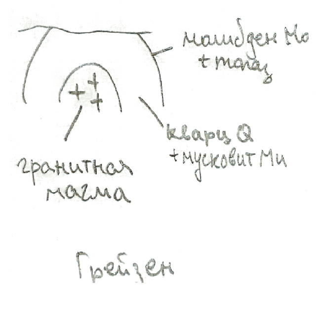

## Минеральные и энергетические ресурсы.

### Классификация природных ресурсов Земли.

**Природные (или естественные) ресурсы Земли (ПРЗ)** - это компоненты природы, которые на данном уровне развития производительных сил используются или могут быть использованы в качестве средств производства и предметов потребления.

Классификация ПРЗ:
- *По назначению*: минеральные, энергетические, биологические;
- *По генезису*: земельные, водные, растительные, минеральные, климатические, геотермальные, энергия приливов и отливов;
- *По сфере использования*:
	- применяемые в материальном производстве (промышленность, сельское хозяйство);
	- применяемые в нематериальном производстве (медицина, ювелирное дело);
- *По исчерпаемости*:
	- практически неисчерпаемые (энергия солнца, ветра, текучей воды, солнечно-лунное притяжение);
	- исчерпаемые:
		- возобновимые (биологические, земельные, водные);
		- невозобновимые (минеральные ресурсы).

### Классификация полезных ископаемых.

**Полезные ископаемые** - это минеральные образования земной коры, химический состав и физические свойства которых позволяют эффективно использовать их в сфере материального производства. Генезис полезных ископаемых тесно связан с генезисом тех горных пород, среди которых они находятся.

Классификации полезных ископаемых:
- По химизму:
	- металлические (рудные), в свою очередь в зависимости от количества металлов в кондиционных содержаниях делятся на:
		- *монометальные* (железные, хромовые, золотые и др.), *биметальные* (свинцово-цинковые, медно-молибденовые и др.), *полиметальные*.
	- неметаллические;
	- горючие (асбестовые, фосфоритовые, серные руды и др.).
- По физическому состоянию: твёрдые, жидкие, газообразные;
- По генезису:
	- эндогенные, рождённые под действием глубинного тепла и давления;
	- экзогенные: гипергенные (кора выветривания) и осадочные (известняки).

### Химическая классификация минералов.

**Минералы** – это твёрдые природные тела, характеризующиеся кристаллохимической однородностью. Всего известно более 2000 минералов, но широкое распространение имеют всего несколько десятков, которые называются породообразующими.

**Минеральные (минерально-сырьевые) ресурсы** - это совокупность полезных ископаемых в недрах земной коры и на её поверхности, подсчитанных применительно к существующим кондициям на полезные ископаемые с учётом научно-технического прогресса.

**Кондиция** определяется минимальным содержанием металлов и неметаллических компонентов, которое является достаточным для экономически рентабельного использования ПИ в какой-либо отрасли.

Химическая классификация минералов:
- *Самородные элементы* (из одного химического элемента)
	- например, сера $S$, графит $C$;
- *Сульфиды* (соединения металлов с серой)
	- например, галенит $PbS$, пирит $FeS_2$, халькопирит $CuFeS_2$;
- *Галогены* (соли галоидоводородных кислот)
	- например, галит $NaCl$, сильвин $KCl$;
- *Оксиды и гидроксиды* (соединения с кислородом и гидроксильной группой $OH$)
	- например, кварц $SiO_2$, магнетит $Fe_3O_4$, гематит $Fe_2O_3$;
- *Карбонаты* (соли угольной кислоты)
	- например, кальцит $CaCO_3$, доломит $CaMg[CO_3]_2$;
- *Сульфаты* (соли серной кислоты)
	- например, ангидрит $Ca[SO_4]$, гипс $Ca[SO_4]\cdot 2H_2O$;
- *Фосфаты* (соли фосфорной кислоты)
	- например, апатит $Ca_5[PO_4]_3[F,Cl,OH]_2$;
- *Силикаты* (соли кремниевых кислот)
	- например, оливин, авгит, роговая обманка, пироксен, тальк, мусковит и др.

### Генетическая классификация минералов.

Классификация минералов по происхождению (генезису):
1. *Магматические* (кристаллизация магмы): пирит $FeS_2$, халькопирит $CuFeS_2$, топаз, оливин;
1. *Вулканические* (кристаллизация лавы и осаждение из вулканических паров и газов): сера $S$, пирит $FeS_2$, галит $NaCl$;
2. *Гидротермальные* (из горячих водных растворов): галенит $PbS$, доломит $CaMg[CO_3]_2$;
3. *Пневматолитовые* (из горячих газовых растворов): халькопирит $CuFeS_2$, флюорит $CaF_2$;
4. *Метаморфические* (образуются в недрах планеты за счёт других минералов): тальк, олигоклаз, ортоклаз;
5. *Метасоматические* (при химическом замещении других минералов);
6. *Хемогенные* (при осаждении в водной среде): ангидрит;
7. *Органогенные* (при участии бактерий или как скопления скелетов): кальцит $CaCO_3$;
8. *Гипергенные* (химическое выветривание на поверхности): лимонит $Fe_2O_3\cdot nH_2O$, малахит $Cu_2[CO_3](OH)_2$.

### Классификация площадей распространения полезных ископаемых.

Площади распространения полезных ископаемых в порядке их уменьшения подразделяются на:
- *Провинции* - крупные участки земной земной коры, отвечающие платформе или горным поясам;
- *Области* -- части провинций -- приурочены к крупным тектоническим элементам (щитам, антеклизам, синеклизам, антиклинориям, синклинориям, межгорным и краевым прогибам);
	- Пояс - область, в пределах которой месторождения приурочены к линейно-вытянутым тектоническим структурам;
	- Бассейн - это область почти непрерывного распространений осадочных полезных ископаемых.
- *Районы* (*узлы*) - части областей, с местным сосредоточением месторождений площадью от сотен до первых тысяч квадратных километров; 
- *Поля* - группы месторождений, характеризующихся общностью происхождения и единством геологической структуры. Площадь полей составляет от нескольких до десятков квадратных километров.
- *Месторождения* - природные скопления полезных ископаемых, которое в количественном и качественном отношении может быть предметом промышленной разработки.
	- Рудопроявление - природное скопление, которое в количественном отношении не может считаться предметом разработки.
- *Тела* - ограниченные со всех сторон скопления минерального вещества.

### Миграция и концентрация химических элементов в земной коре.

**Миграция элементов** - перемещение вещества внутри Земли и на её поверхности вне зависимости от природы физико-химических процессов, вызывающих такое перемещение.

В результате миграции происходит рассеяние и концентрация элементов, образование месторождений. 

Близкие по таблице Менделеева элементы обладают близкими химическими и физическими свойствами. В ряде случаев близкие по геохимическим свойствам элементы мигрируют совместно.

**Геохимические поля** - это элементы, близкие по таблице Менделеева. Имеется несколько вариантов разделения периодической таблицы на геохимические поля.

Предложена Гольдшмидтом исходя из предположения, что Земля образовалась в результате разделения первично однородного вещества, аналогичного метеоритам, на четыре части: металл, серный расплав, силикатная часть и атмосфера с океаном. Каждый элемент имеет склонность концентрироваться в одной из этих сред.
1. *Атмофильные* элементы накапливаются в атмосфере, для них характерно газообразное состояние. Это: инертные газы, азот, водород;
2. *Литофильные* обладают сродством к силикатным минералам и расплавам: $Li$, $O$, $C$, $F$, $Cl$, $Na$, $Ma$ и другие.
2. *Халькофильные* элементы включают элементы сульфидных групп: $S$, $Cu$, $Zn$ и др.
3. *Сидерофильные* обладают сродством к железу: $Fe$, $Co$, $Ni$, платиноиды.

**Парагенез** - совместное нахождение родственных или близких по происхождению минералов.

В начале XX вв. американский геохимик Франк Уиглсуорт Кларк попросил геологов мира прислать образцы горных пород. Проанализировав их, учёный определил среднее содержание элементов в горных породах. Эти содержания назвали **кларками**. Таблицы кларков составляют для разных областей: для земной коры, гидросферы, отдельного региона и др.

Состав земной коры определяется продуктами силикатных минералов и продуктами их разрушения. 85% земной коры состоит из трёх элементов: *кислород, кремний и алюминий*. 99% составляется двенадцатью элементами: *кислород, кремний, алюминий, железо, магний, натрий, калий, кальций, сера, фосфор, водород, углерод*.

### Металлогеническая специализация горных пород.

Химические элементы принято делить на петрогенные и металлогенные.
- *Петрогенные элементы* - это породообразующие элементы горных пород и нерудных минералов. Петрогенные элементы соответствуют литофильным элементам.
- *Металлогенные элементы* способны образовывать скопления тяжёлых металлов и рудных месторождений. Металлогенные элементы соответствуют халькофильным и сидерофильным элементам.

Давно была подмечена закономерная приуроченность металлов и других полезных химических элементов к определённым типам горных пород и месторождениям, которые генетически с ними связаны. Наиболее характерны следующие примеры типичных ассоциаций элементов и минералов с горными породами:
- Ультраосновные (гипербазитовые) магматические породы (дуниты, перидотиты, пироксениты):
	1. $Cr$, $Fe$, $Mg$;
	2. Реже платина $Pt$ и платиноиды;
	3. Изредка алмазы $C$ в кимберлитах, тальк или асбест при воздействии гидротермальных растворов.
- Основные (базитовые) магматические породы (габбро, диабазы и др):
	1. $Fe$, $Ti$, $V$;
	2. $Fe$, $Cu$, $Ni$, $Co$, $Pt$, $Pd$.
- Щелочные магматические породы (нефелиновые сиениты, пегматиты):
	1. $Al$, $Zr$, $Ti$, $Nb$, $Ta$, $Th$ и др.
- Кислые (гранитоидные) магматические породы (граниты, гранитодиориты):
	1. $W$, $Sn$, $Mo$, $Li$, $F$, $B$ и др.;
	2. $Fe$, иногда $W$, $Mo$, $Cu$.
- Гидротермальные жильные или метасоматические образования:
	1. $Au$, $Fe$, $S$, $As$;
	2. $Zn$, $Pb$, $Ag$, иногда $Cu$;
	3. $Ag$, $Bi$, $Co$, $Ni$, $U$, $As$;
	4. $Au$, $Ag$, $Fe$, $Se$;
	5. $Hg$, $Sb$, $Ba$, $F$, иногда $As$.
- Экзогенные остаточные продукты коры выветривания:
	1. $Fe$, $Mn$;
	2. $Al$, $Fe$;
	3. $Ni$, $Co$, $Mg$.
- Осадочные образования в морских и озёрных бассейнах:
	1. $Fe$, $Mn$;
	2. $Al$, $Fe$;
	3. $P$, $Ca$.
- Соленосные отложения в замкнутых усыхающих озёрах и лагунах:
	1. $Na$, $Ca$, $Mg$, $K$;
	2. $Na$, $Ca$, $Mg$, $B$.
- Угленосные биохимические (фитогенные) отложения прибрежных зон водоёмов:
	- бурый и каменный угли, антрацит.
- Биогенно-обломочные отложения в спокойных мелководных бассейнах (морей, лагун, заливов, озёр, дельт):
	- горючие сланцы.
- Нефтегазоносные осадочные (сапропелевые) отложения водоёмов со стоячей водой (озёр, лагун, заливов):
	- нефть, горючие газы, асфальты, битумы.

### Условия залегания горных пород

#### Условия залегания осадочных горных пород

Осадочные горные породы залегают в виде пластов (пластовых горизонтов). Залегания бывают нарушенные (вторичные) и ненарушенные (первичные).

Первичное залегание осадочных горных пород соответствует условиям их накопления, характеризуется малым углом наклона (до $5^\circ$):
- Субгоризонтальное залегание - залегание, близкое к горизонтальному;
- На более крутых склонах бассейнов возникают моноклинальные залегания - слои, наклонённые в одну сторону.

Вторичные залегания возникают при смещении слоёв горных пород с их первичного места залегания за счёт тектонических движений.
- Без нарушения сплошности, в виде складок:
	- Среди складок различают:
		- Антиклинорий - сложное сочетание в пространстве складок разных форм и масштабов, образующее в целом антиклинальную форму:
		- Синклинорий - в целом синклинальную форму;
		- Антеклиза - широкие (в несколько сотен километров) и пологие в целом выпуклые формы на платформах;
		- Синеклиза - в целом вогнутые.
	- Сочетание складок называют складчатостью
		- Полная складчатость: всё пространство территории занято линейными складками и нет горизонтального заложения слоёв;
		- Прерывистая складчатость характеризуется наличием изолированных складок, между которыми имеются участки с горизонтальным залеганием слоёв;
		- Промежуточная складчатость
			- Гребневидная: чередование узких антиклиналей и широких синклиналей.
			- Сундучно-коробочная: сундучные антиклинали и коробчатые синклинали.
- Разрывные нарушения (дизъюнктивные дислокации). Различают две группы разрывов:
	- Трещины (разрывы без смещения)
	- Разрывы со смещением

Разрывные нарушения со смещением:

#### Условия залегания вулканических горных пород

Излившаяся на поверхность лава образует эффузивные тела, среди которых выделяются: лавовый покров, лавовый поток, некк (жерловина), вулканический (экструзивный) купол (пик, игла) и диатрема (трубка взрыва), вулканический конус, стратовулкан, щитовидный вулкан.

#### Условия залегания метаморфических горных пород

Метаморфические горные породы обычно сохраняют формы залегания тех пород, из которых они образовались (пласты, линзы – в осадочных толщах и лакколитах, а батолиты и жилы – в магматических). Породы, образовавшиеся при контактовом метаморфизме, образуют пояса вокруг интрузивного тела.

#### Условия залегания магматических горных пород

Некоторые виды интрузивных магматических тел:
- _Дайки_. Магма раздвигает разломы, застывает и образует стены. Дайки обладают длиной от десятков метров до сотен километров и шириной от нескольких сантиметров до 5—10 км;
- _Штоки_. Столбообразные интрузивы изометричной формы. Магма поднимается через пересечения разломов. Площадь выхода штока, как правило, не превышает 100 км²;
- _Батолиты_. Крупный интрузивный массив, имеющий площадь более 100 км² и мощность 3—15 км;
- _Силлы_. Пластовые тела. Протяженность силлов может достигать 300 км. Мощность силлов колеблется от десятков сантиметров до 600 м, но чаще встречаются силлы мощностью от 10 до 50 м;
- _Лополиты_. Чашеобразные интрузивы;
- _Лакколиты_. Грибообразные интрузивы.

### Фации и формации. Металлогеническая специализация формаций.

**Фация** – осадки или горные породы, возникающие в определённой физико-географической обстановке и отличающиеся от состава и условий образования смежных одновозрастных пород.

**Формация** – это комплекс пород, образовавшихся в сходных тектонических условиях. Если фация касается поверхностной географии, то формации касаются глубинной структуры коры.

*Платформенные формации* образуются в бассейнах:
- В районах с гумидным климатом:
	- ледниковые, речные, озёрные, склоновые, болотные отложения;
	- при трансгрессии моря образуются лагунные формации (сероцветы).
- В аридных районах:
	- породы, образующиеся при испарении воды (эвапориты).
- При дальнейшей трансгрессии образуются обломочные формации: кварцево-песчаные, глинисто-песчаные;
- При максимальной трансгрессии и перекрытии морем внутренних источников сноса (щитов и антеклиз): карбонатные формации.

Сегодня говорят что геосинклинали располагаются в вулканических поясах. *Геосинклинальные формации*:
- Флиш - серия морских осадочных горных пород, характеризуется чередованием нескольких слоёв.
	- Терригенный флиш, в котором ритм состоит из конгломерата, песчаника, алевролита, аргиллита;
	- Карбонатный флиш, ритм состоит из обломочного песчаного известняка, мергеля и аргиллита.

*Формации дна океанов*:
- В центральной части океана практически нет осадочного слоя, он находится ближе к подножиям континентальных склонов. Осадочный чехол представлен безызвестняковыми илами: радиоляриевыми, диатомовыми, красной глиной. Количество карбонатов увеличивается на океанских поднятиях, выше глубины растворения карбонатов.

### Морфология и условия залегания тел полезных ископаемых.

Выделяются три морфологических типа твёрдых тел:
- Изометричные: штоки, гнёзда, линзы, чечевицы;
- Плитообразные: пласты и жилы;
- Трубообразные (столбообразные): кимберлитовые трубки.

По возрастному соотношению вмещающими породами различают:
- Сингенетические: одновременно с вмещающими;
- Эпигенетические: образование позже вмещающих пород.

Если рудные тела не выходят на поверхность, то их называют слепыми (или скрытыми).
- Поверхностные (до 100 м), можно добывать карьерным способом;
- Глубоко залегающие (более 100 м): обычно используют шахтный способ.

По условиям залегания:
- Горизонтальные (до $10^\circ$);
- Наклонные (до $45^\circ$);
- Крутопадающие (более $45^\circ$).

По отношению к сплошности вмещающих пород:
- согласные;
- секущие.

Контакты тел полезных ископаемых бывают:
- резкие (чёткие)
- постепенные: когда сплошная масса полезных ископаемых переходит во вмещающую породу вначале через зону богатой, а затем постепенно убывающей вкрапленности.

Выклинивание тел полезных ископаемых:
- Простое, когда их мощность уменьшается постепенно;
- Тупое, если мощность уменьшается резко;
- Сложное.

Условия залегания жидких и газовых полезных ископаемых: они подчиняются формам вмещающих пород (в коллекторах, представляющих собой пористые и трещиноватые горные породы). Скопления нефти и газа в коллекторах возможны лишь при наличии непроницаемых пластов, иначе они улетучиваются и окисляются.

### Вещественный состав полезных ископаемых. Структура и текстура полезных ископаемых.

Полезные ископаемые состоят из полезной части и нерудной части, которая называется балластом.

В полезных ископаемых содержится большое количество примесей. Они могут быть
- полезными (сопутствующие компоненты, повышающие ценность руд), которые могут быть использованы отдельно;
- вредными, например:
	- Для руд железа и марганца вредными являются сера и фосфор;
	- Для золотых руд - мышьяк;
	- Для фосфоритов - магний;
	- Для горючих ископаемых - сера и фосфор. Минеральные примеси и ископаемая вода для горючих ископаемых считаются балластом.

*Сера вызывает снижение прочности стали при повышенных температурах (красноломкость) и поэтому является вредной примесью.*

По степени концентрации различают руды:
- Богатые (массивные, сплошные);
- Рядовые;
- Бедные (вкрапленные).

**Структура** -- взаимное расположение двух соседних кристаллов. Различают:
- равномернозернистая структура:
	- тонкозернистая (размеры кристаллов до < 0.5 мм);
	- мелкозернистая (до 1 мм);
	- среднезернистая (до 3 мм);
	- крупнозернистая (до 5 мм);
	- грубозернистая (от 5 мм).
- неравномернозернистая;
- пластинчатая (например гипс);
- сидеронитовая (рудное вещество служит цементом для других кристаллов);
- волокнистая (гипс);
- зональная;
- скелетная структура;
- лучистая;
- обломочная;
- и др.

**Текстура** - взаимное расположение группы кристаллов
- массивная;
- полосчатая;
- пятнистая;
- очковая;
- оолитовая;
- рыхлая, землистая, порошковая;
- и др.

По масштабам текстуры делят на:
- *мегатекстура* видна в обнажённых горных породах;
- *макротекстура* видна в отдельных образцах;
- *микротекстура* видна только под микроскопом.

*Нефть состоит из жидких углеводородов с примесью сернистых, азотистых и кислородных соединений. По фракционному составу известны нефти, состоящие в основном из бензиново-керосиновых фракций, и нефти, лишённые бензина.*

*Минеральные воды характеризуются повышенным содержанием некоторых биологически активных элементов. Границей между пресными и минеральными водами обычно считают общую минерализацию 1 г/л.*

### Магматические горные породы.

**Магматические** образуются при охлаждении и кристаллизации магмы или лавы. Породообразующими минералами этих пород являются силикаты.
1. В зависимости от условий застывания:
	1. Глубинные (интрузивные) – застывание магмы, внедрившейся в земную кору.
		1. Абиссальные, застывшие на глубине более трёх километров. Им свойственна полнокристаллическая структура и плотная текстура;
		2. Гипабиссальные, застывшие на меньших глубинах. Им свойственна порфировая структура и плотная текстура.
	2. Излившиеся (эффузивные) — остывание излившейся на поверхность магмы, т.е. лавы. Им свойственна скрытокристаллическая структура и пористая или порфировая текстура.
2. В зависимости от процентного содержания кремнезёма (т.е. диоксида кремния, SiO2): кислые (65-75%), средние (52-65%), основные (40-52%) и ультраосновные (<40%)

### Осадочные горные породы.

**Осадочные** образуются на поверхности литосферы при разрушении пород, а также в результате жизнедеятельности или отмирания организмов. Для большинства осадочных пород характерна слоистая форма залегания.
1. обломочные (механическое разрушение пород);
2. глинистые (преимущественно химическое разрушение пород);
3. хемогенные (выпадение солей из пересыщенных водных растворов);
4. органогенные (жизнедеятельность организмов или скопление отмерших организмов).

### Метаморфические горные породы.

**Метаморфические** образуются в земной коре из магматических или осадочных горных пород при воздействии на них высоких температур, давлений и глубинных флюидов и газов.

По размеру ареалов и их положению различают метаморфизм:
1. Региональный (на огромных площадях): кварциты, мраморы, филлиты, сланцы, гнейсы и др.
2. Локальный (метаморфические изменения захватывают ограниченные участки): контакт магмы с вмещающими породами;
3. Динамометаморфизм (крупные разломы, сдвиги, при образовании которых всегда возникает сжатие);
4. Ударный метаморфизм, вызванный падением на землю метеоритов.

### Магматические месторождения.

Магматические месторождения связаны с магмой и магматическими телами. Когда происходит кристаллизация интрузивов, образуются плутоны. С прототектоникой тесно связаны гидротермальные месторождения.

Объём интрузивов при остывании уменьшается на 10% и на его поверхности появляются трещины. В остаточных магмах накапливаются $Cl$, $F$, $B$, которые являются катализаторами. И под их действием могут образовываться кварциты, пегматитовые жилы.

Магматические месторождения делятся на:
1. *Ликвационные* месторождения образуются в результате разделений охлаждающийся магмы и рудно-силикатного-состава на две несмешивающиеся жидкости сульфидная (рудная) и силикатная магмы. В начале ликвации обособившаяся сульфидная жидкость приобретает форму шариков, крупные из них опускаются на дно. К ликвационным месторождениям относятся только пентландит-халькопирит-пирротиновые месторождения в основных и ультраосновных породах;
2. *Сингенетические* (*раннемагматические*) месторождения: кристаллы образуются вместе со вмещающими породами. Все алмазы образованы сингенетические в трубках кимберлитового взрыва.
   
3. *Эпигенетические* (*позднемагматические*) месторождения формируются из остаточного рудного расплава, в котором концентрируется основная масса ценных компонентов. Остаточный расплав заполняет в почти затвердевшей интрузии трещины, пустоты и промежутки между зернами силикатных минералов.

### Пегматитовые месторождения.

Пегматиты - любая магматическая горная порода с грубо- (0.5-1см) и гигантскокристаллической (>1см) структурой, связанные с любым типом магмы (гранитные, ультраосновные). Рассмотрим только гранитные пегматиты.

Пегматитовые месторождения делятся на:
- *Простые мегматиты* - по минеральному и химическому составу соответствуют материнским породам. Гранитные пегматиты содержат кварц, полевые шпаты, слюду;
- *Перекристаллизованные пегматиты* образовались в результате перекристаллизации материнского вещества под воздействием газово-водных растворов;
- *Контактово-замещённые пегматиты* - перекристаллизованные и метасоматические преобразованные породы. Они имеют зональное строение: в верхнем слое кварц, во второй смесь шпатов, в третьей полевой шпат. Имеют линзовидную форму размером в десятки метров. Внутри вознкают большие пустоты, в которые выпадат кристаллы (топазы, рубины и др.).

### Гидротермальные месторождения.

Гидротермальные месторождения образуются при отложении минералов из циркулирующих в земной коре водных растворов. Источники воды в гидротермах: магматические, метаморфические, захоронённые, атмосферные глубокой циркуляции. Отложение минералов происходит при понижении температуры и давления и при химическом взаимодействии.

Форма тел гидротермальных месторождений зависит от формы рудовмещающих полостей и от конфигурации границ замещаемых пород. Характерные формы: жилы, штоки, гнёзда, линзы, пласты. Размеры тел различны от нескольких метров до десятков километров.

Нас интересуют гидротермы, связанные с гранитами. Они появляются в трещинах, которые могут находиться как в гранитном теле, так и во вмещающей породы. Зональность отложения: внутри сначала отлагаются вещества с высокой температурой плавления (вольфрамовые, железные, никелевые), в конце с самой низкой.

По условиям образования гидротермальные месторождения делятся на:
- *плутогенные* (глубинные) связаны с интрузивами (батолитами).
- *вулканогенные* (приповерхностные).

### Контактово-метасоматические месторождения.

Связаны с приконтактовыми зонами интрузивных тел. Сформированы в результате метасоматоза, который представляет собой замещение одного минерального агрегата другим с отличным химическим составом. В процессе метасоматоза активное участие принимают газово-водные растворы, приносящие и выносящие химические компоненты. Выделяют:
- *Альбитовые месторождения*.
- *Грейзеновые месторождения*. Если гранитная магма прорывает силикатные породы, то там возникают грейзены (кварц, мусковиты, молибден, топазы).
- *Скарновые месторождения*. Если гранитная магма прорывает карбонатные породы (известняки, доломиты), то возникают скарны (пироксен, ювенильные гранаты).

### Метаморфизованные и метаморфические месторождения.

**Метаморфизм** - перегруппировка минерального вещества с участием летучих соединений, но без привноса вещества из рудовмещающих толщ. В случае если изменяется химический состав, процесс называется метасоматизмом.

Метаморфизованные месторождения возникают в процессе регионального и термального контактового метаморфизма ранее существовавших месторождений. В процессе метаморфизма содержание ценных компонентов в рудах обычно увеличивается, а вредных примесей уменьшается. Среди метаморфизованных месторождений основными являются:
- Гематит-магнетитовые месторождения, возникшие за счёт гидроокислов железа;
- Браунит-гаусманитовые месторождения -- метаморфизм маргацевых руд;

Метаморфические месторождения возникают в процессе метаморфизма горных пород, не представлявших до этого промышленной ценности. Выделяются:
- Алюминиевые месторождения - при региональном метаморфизме глинистых сланцев;
- Месторождения графита при глубоком метаморфизме глинистых пород;
- Мрамора из известняков;
- кварцитов (из кварцевых песков)

### Вулканогенно-осадочные и гидротермально-осадочные месторождения.

Вулканогенно-осадочные месторождения возникают в ре­зуль­та­те хи­мического взаи­мо­дей­ст­вия про­дук­тов под­вод­но­го вул­ка­низ­ма (лав, пи­рок­ла­сти­че­ско­го ма­те­риа­ла, вул­ка­нических га­зов) с морской во­дой, вы­но­са и оса­ж­де­ния руд­ных ком­по­нен­тов со­вме­ст­но с мор­ски­ми осад­ка­ми. Руд­ные те­ла за­ле­га­ют в ви­де пла­стов и жел­ва­ков.

Наиболее важные вулканогенные-осадочные месторождения:
- Пиритовые колчеданные
- Халькопирит-пиритовые
- Галенит-сфалерит-пиритовые
- Магнетит-гематитовые
- Марганцевые

Гидротермально-осадочные месторождения фор­ми­ру­ют­ся пу­тём от­ло­же­ния ми­не­ра­лов из го­ря­чих ми­не­ра­ли­зо­ван­ных рас­тво­ров, цир­ку­ли­рую­щих в зем­ной ко­ре.

Выделяют следующие типы:
- Меднорудные в пластах песчаников и сланцах
- Свинцово-цинковые в карбонатных порода
- Сурьмяно-ртутные

### Механические (обломочные) осадочные месторождения.

Обломки образуются как результат процессов выветривания (температурное и морозное), вулканизма, тектонической и техногенной активности, экзарация ледником.

Среди месторождений обломочных пород выделяют:
- Гравийные: пролювиальные, аллювиальные, гляциальные, озёрные, морские;
- Песчаные: связаны с образованием оврагов (пролювий), речными террасами (аллювий), шельфами, флювиогляциальными отложениями.
- Глинистые: деллювиальные, аллювиальные, озёрные, морские, гляциальные и эоловые. Хотя большая часть глин образовалась химическим способом.

Благодаря концентрации ценных компонентов, в процессе разрушения и переотложения вещества образуются месторождения россыпей. Россыпи концентрируют минералы высокой плотности, химической устойчивости и физической прочности.

### Химические осадочные месторождения.

Среди химических месторождений выделяют следующие основные типы:
	1. *Сильвин-галитовые* ($KCl$, $NaCl$). Сопровождаются гипсом, ангидритом.
		1. По условиям формирования разделяют на современные соленосные бассейны, соляные подземные воды и ископаемые соляные месторождения;
		2. Условия залегания: пластовые, складчатые, купольные и диапировые.
	2. *Сидерит-лимонитовые* ($FeCO_3$, $Fe_2O_3\cdot nH_2O$) железнорудные месторождения представлены пластами, линзами. Протяжённость рудных тел достигает десятков и сотен километров.
	3. *Современные морские отложения марганцевых руд* сосредоточены на дне океанов. Руды содержат в основном марганец и железо. Ежегодно они возрастают на 10 млн. т. благодаря непрерывному формированию конкреций. Размеры конкреций в среднем до 10 см, но достигают и метров.
	4. *Осадочные бокситовые месторождения*.

### Биохимические месторождения.

Биохимическое осадочное происхождение имеют месторождения известняков, доломитов, мергелей, диатомитов, фосфоритов, урана, ванадия, серы, каустобиолитов.

Главное значение имеют следующие месторождения:
1. *Каустобиолиты* (горючие полезные ископаемые). Бывают твёрдые (торф, ископаемый уголь, горючие сланцы), жидкие (нефть) или газообразные (горючие газы).
	1. Торф представляет собой первую стадию превращения растительного материала по пути его преобразования в уголь. Накапливается в болотах из остатков отмерших растений, подвергшихся неполному разложению в условиях повышенной влажности и недостатка воздуха.
	2. Ископаемые угли и горючие сланцы. Главным условием возникновения торфяных залежей и превращения их в угольные пласты являются нисходящие движения земной коры, соизмеримые со скоростью накопления растительных остатков на заболоченных равнинах. Происходит погружение залежей вглубь, где под действием регионального метаморфизма торф преобразуется в лигнит, бурый уголь, каменный и, наконец, в антрацит.
	3. Нефть - природная горючая маслянистая жидкость, состоящая из жидких углеводородов, в которых растворены газы и твёрдые битумы (смола, парафин и др.).
	4. Горючие газы - это горючая смесь газообразных углеводородов (метана, этана, пропана, бутана, составляющие залежи сухого газа) или газообразные углеводороды с примесью подчиненного количества жидких, но легкокипящих углеводородов - пентана, гексана и др.
2. *Фосфоритовые месторождения*:
	1. Биологические: раковины моллюсков содержат фосфор. Они складывают апатит ($Ca_5(PO_4)_3[F,Cl,OH]_2$). А фосфориты на 90% состоят из апатита;
	2. Биохимические: из отмерших морских организмов образуется фосфорный ангидрит $P_2O_5$, присоединяет кальций из воды и выпадает в фосфорит.
3. Месторождения серы:
	1. Сингенетические. Вследствие деятельности анаэробных бактерий из органических веществ выделяется сероводород. Попадая в верхние части водоёма, сероводород окисляется до самородной серы.
	2. Эпигенетические (95% добычи самородной серы в мире). Под действием бактерий сульфатные воды, возникшие за счёт гипс-ангидритовых пород, обогащаются сероводородом, который впоследствии окисляется.

### Месторождения выветривания.

**Процессы выветривания** – это процессы разрушения горных пород без их переноса. Не связаны с ветром или водой.

Месторождения выветривания образуются в коре выветривания, которая возникает в результате механического разрушения горных пород и минералов и дальнейшей их химической и биохимической переработке.

В зависимости от способа накопления вещества полезного ископаемого месторождения выветривания делятся на:
- *Остаточные месторождения*:
	- Каолиновые месторождения формируются в коре выветривания любых полевошпатовых пород;
	- Месторождения никелевых руд с кобальтом и лимонитовые месторождения связаны с корой выветривания серпентинитов.
- *Инфильтрационные месторождения* образуются за счёт заполнения минеральным веществом пустот или метасоматическим путём. Возникают месторождения железа, марганца, меди, ванадия и др. Наибольшее значение имеют месторождения урана.

### Условия накопления и залегания залежей углеводородов.

При захоронении органического вещества (зоопланктона и водорослей) в водно-осадочных отложениях происходит его постепенное преобразование. С повышением температуры оно может образовать жидкие углеводороды, имеющие хорошую подвижность. Они могут мигрировать из нефтематеринских пород по коллекторам (горным породам, обладающим способностью вмещать в себя нефть и газ: пески, доломиты, известняки), собираясь в ловушках.

Если нет нефтегазовой покрышки, то вода выжимает нефть и газ до поверхности. Нефть на поверхности окисляется и превращается в твёрдый битум.

Ловушки бывают:
- Структурные (складки и разрывы);
- Неструктурные (угловое несогласие, изменение фации по простиранию коллектора).

В задачах нефтеразведки найти не саму нефть, а ловушки. Проверка ловушек производится бурением.

### Геохимические методы поисков полезных ископаемых.

Геохимические методы основаны на изучении ореолов рассеяния полезного вещества вокруг рудных тел. Ореолы бывают первичные и вторичные.
- *Первичные ореолы рассеяния* представляют собой зону рудовмещающих пород.
	- сингенетические (характерны для магматических полезных ископаемых);
	- эпигенетические (связаны с пегматитами и гидротермальными месторождениями).
- *Вторичные ореолы рассеяния* представляют собой зону повышенных концентраций тех или иных элементов.
	- механические (шлиховые): россыпи;
	- соляные могут проявляться в твёрдых и жидких фазах: ПИ, которые растворяются в воде;
	- газовые ореолы возникают над месторождениями, образование или разрушение которых сопровождается выделением газообразных продуктов;
	- биохимические (связанные с высшими растениями).

Методы поиска:
- Шлихование;
- Точечный отбор по профилю. Осуществляют разведочным бурением, пробы вещества берут кернами.

### Геофизические методы поисков полезных ископаемых.

К геофизическим методам относятся: сейсморазведка, магниторазведка, электроразведка и гравиразведка. Есть ещё тепловые и др., но они редко используются.

В общем случае под нормальным полем понимают поле крупной геологической структуры или целого района. А для магнитного и гравитационного полей -- соответствующие им поля всей Земли. Аномальным полем называется физическое поле, обязанное локальным геологическим телам.

Различают прямую и обратную задачи геофизических методов:
- *Прямая задача*: по срезу горных пород определяют, какое аномальное геофизическое поле должно быть в месте взятия пробы.
- *Обратная задача*: по заданному физическому профилю определить наиболее вероятный геологический разрез.

**Сейсморазведка**. Главная цель сейсморазведки - выявить тектонические структуры. Используют два метода:
1. *Метод отражённых волн*. На поверхности устанавливают источник возбуждения и приёмники. После испускания волн измеряют время получения отражённых волн. А скорость прохождения волн получают по скважинам.
2. *Метод преломлённых волн*. Есть критический угол, при котором преломлённая волна пойдёт параллельно границе раздела сред. При этом образуются рефрагированные волны.

**Магнитная разведка**. Напряжённость магнитного поля измеряют магнитометром. Напряжённость аномального магнитного поля зависит от свойств полезных ископаемых. Есть полезные ископаемые усиливающие (ферромагнетики, магнетит, гематит и др.), ослабляющие (диамагнетики, золото, серебро) и не изменяющие магнитное поле (парамагнетики, соли).

**Электроразведка**. 
- *Электропрофилирование* - метод изучения электрического сопротивления среды путём последовательного перемещения установки по профилю при неизменных разносах;
- *Электрозондирование* (на больших расстояниях). Глубинность электроразведки возрастает с увеличением расстояния между источником поля и точкой наблюдения.

### Дистанционные методы поисков полезных ископаемых.

Практически все геологические и тектонические карты составлены с использованием результатов полевого и камерального дешифрования аэроснимков. Дешифрование строится на основе выделения различных маркирующих горизонтов.

Высокая экономическая эффективность использования аэроснимков в геологии определяется тем, что отпадает необходимость полевого *маршрутного прослеживания*. При этом полевая проверка результатов дешифрования всё ещё обязательна.

Для использования дистанционных методов нужно знать происхождение полезных ископаемых, форму, условия зарождения. Например, ликвационные месторождения часто однородные. Кимберлиты выглядят округлыми с жёлтым цветом. Позднемагматические месторождения выглядят как сплошные линзовидные тела.

Дешифрование космоснимков отличается от дешифрования аэроснимков. Роль полевой проверки сильно снижается. Значительно увеличивается работа по обобщению, используются геологические и геофизические карты.

Основные свойства космических снимков:
1. Обзорность;
2. Естественная генерализация (упрощение форм);
3. Рентгеноскопичность (просвечиваемость).

### Картографические методы поисков полезных ископаемых.

Картографическими методами изучения минеральных ресурсов называются методы качественного и количественного анализа топографических карт с целью выявления и прослеживания тектонических структур, отдельных форм рельефа и площадей, перспективных на поиски и разведку полезных ископаемых.

Например, прослеживание речной надпойменной террасы, к которой приурочены россыпные месторождения золота.

Количественный анализ включает различные методы морфометрической (числовые характеристики рельефа) и статистической обработки топографических карт. Эти методы позволяют выявить закономерные связи определённых форм рельефа, различных видов полезных ископаемых или геологических образований, благоприятных для размещения месторождений полезных ископаемых.

### Геотермальные ресурсы.

Геотермальные ресурсы связаны с запасами глубинного тепла Земли. Тепловой поток может служить источником энергии лишь при аномально высоких его значениях. Источником геотермальной энергии обычно служат природные горячие воды или пар, которые применяются для непосредственного обогревания зданий и теплиц, а также для получения электроэнергии.

Перспективными источниками обладают множественные вулканические зоны планеты в том числе Камчатка, Курильские, Японские и Филиппинские острова.

Достоинствами геотермальной энергии являются её неисчерпаемость, независимость от окружающей среды и большая эффективность. Главный минус геотермальной энергетики кроется в самом происхождении энергии: станции строятся в небезопасных сейсмически активных зонах.

Одна из проблем, которые возникают при использовании подземных термальных вод, заключается в необходимости возобновляемого цикла поступления (закачки) воды (обычно отработанной) в подземный водоносный горизонт, на что требуется расход энергии. В термальных водах содержится большое количество солей различных токсичных металлов (например, свинца, цинка, кадмия), неметаллов (например, бора, мышьяка) и химических соединений (аммиака, фенолов), что исключает сброс этих вод в природные водные системы, расположенные на поверхности.

### Характеристика речных систем и режимов рек.

- **Речная система** — это река со всеми её притоками.
- **Речной бассейн** — область, с которой река получает своё поверхностное и подземное питание.
- **Водоразделы** — это линии, соединяющие низшие точки рельефа, отделяют речные бассейны друг от друга.
- **Режим реки** — закономерное изменение во времени состояния воды (скорость течения, уровень воды, температура).
- **Гидрограф** – график изменения во времени расхода воды в реке за год, несколько лет или часть года.

Для характеристика бассейнов строят графики нарастания площади бассейна по мере впадения в главную реку притоков.

Режимы рек зависят от областей питания. Различают следующие фазы водного режима:
- **Половодье** — разлив реки. В основном происходит весной при таянии снега и вскрытии ото льда. Может быть и летом – от таяния ледников в горах. Во время половодья часто происходит разлив воды на пойму;
- **Паводок** — сравнительно кратковременное и непериодическое поднятие уровня воды, возникающее в результате быстрого таяния снега при оттепели, обильных дождей.
- **Межень** — ежегодно повторяющееся сезонное стояние низких уровней воды в реках. В умеренных и высоких широтах различают летнюю (или летне-осеннюю) и зимнюю межень.
- **Ледостав** — период, когда наблюдается неподвижный ледяной покров на водотоке или водоёме.
- **Ледоход** — движение льдин и ледяных полей на реках.

### Общие сведения о подземных водах.

Подзе́мные во́ды — воды, находящиеся в толще горных пород верхней части земной коры в жидком, твёрдом и газообразном состоянии. Подземные воды рассматриваются как полезное ископаемое.

По условиям залегания подземные воды делятся на:
1. **Почвенные воды**;
2. **Верховодка**, вода накапливающаяся на линзах, летом сильно или полностью высыхает. Линзы могут состоять, например, из глин или кристаллического известняка.
3. **Грунтовые воды** – основная масса вод – это подземные гравитационные воды, накопившиеся на первом выдержанном по площади (большая площадь) водоупорном горизонте;
4. **Межпластовые безнапорные воды**. Эти воды располагаются в водопроницаемых породах, которые сверху и снизу ограничены водонепроницаемыми пластами;
5. **Артезианские воды**. это межпластовые напорные воды, по закону сообщающихся сосудов обладающие избыточным внутренним давлением.

Происхождение подземных вод:
1. **Вадозные** подземные воды (атмосферные осадки, просочившиеся внутрь земли);
2. **Захоронённые** воды. Это вода, которая ушла под землю вместе с морскими отложениями;
3. **Возрождённые** воды. Образуются при метаморфизме минералов, содержащих кристаллизационную воду. Например, при переходе гипса в ангидрит;
4. **Ювенильные** (**магматогенные**) воды. Когда магма кристаллизуется, то выделяется вода. Вся вода на земле когда-то была ювенильной;
5. **Конденсационная вода**. Например, в пустыне образуется роса и уходит под землю.

Движение грунтовых вод подчиняется силе тяжести и осуществляется в виде потоков по сообщающимся порам или трещинам движутся от повышенных участков к пониженным участкам (оврагам, рекам, озерам, морям). Динамика подземных вод связана с тремя показателями:
1. Влагоёмкость – сколько в горной породе может содержаться или задерживаться воды.
	1.  Глинистые породы воду не отдают;
	2.  Полувлагоёмкие: мелкозернистые пески, алевролиты;
	3.  Невлагоёмкие: грубые обломки.
2. Водоотдача – какую часть воды порода отдаёт. Грубые породы отдают почти всю воду.
3. Водопроницаемость – фильтрующие свойства горных пород. Наибольшая – у галечника, гравии, закарстованных известняках и сильно трещиноватых породах. Наименее – глины, тяжёлые суглинки, сцементированные и нетрещиноватые породы.

### Норма стока и ее количественные выражения (средний многолетний расход; объем и слой стока).

- **Живое сечение** русла реки — это площадь поперечного сечения водного потока.
- **Расход воды** — это объём воды, протекающий через живое сечение, за единицу времени.
- **Модуль стока** — это отношение расхода воды к площади речного бассейна.
- **Объём стока** — это объём воды, протекающей в год.
- **Слой стока** – показывает каким слоем воды в миллиметрах можно полностью залить водосбор, если бы вода распределялась по его территории равномерно. Вычисляется путем деления объема стока на площадь водосбора.

Годовой сток в каком-либо створе реки непостоянен во времени. Он колеблется в зависимости от климатических и физико-географических факторов. Установлено, что колебания годового стока носят циклический характер.

**Норма стока** – среднее значение величины стока за многолетний период. Норма стока может быть вычислена путём осреднения годовых величин стока (норма годового стока), стока за половодье (норма стока за половодье), за отдельные месяцы или другие периоды года.

### Климатические ресурсы.

Климатические ресурсы - неисчерпаемые природные ресурсы, в состав которых входят:
1. Солнечная радиация (в водонагревателях и солнечных батареях). Хотя производство и утилизация солнечных панелей сопряжена с экологическими издержками;
2. Энергия ветра (ветрогенераторы). Ветровая энергия создает шумовое загрязнение. Ресурсы ветровой энергии, в отличие от солнечной, сосредоточены главным образом в умеренном поясе. Материалы, из которых сделаны лопасти ветрогенераторов, безопасны сами по себе, но организация полигонов для захоронения неразлагающихся деталей становится настоящей проблемой;
3. Влажность.

### Использование энергии солнечных и лунных приливов в океанах.

Прили́вная электроста́нция (ПЭС) — особый вид гидроэлектростанции, использующий энергию приливов, а фактически кинетическую энергию вращения Земли. Приливные электростанции строят на берегах морей, где гравитационные силы Луны и Солнца дважды в сутки изменяют уровень воды. Колебания уровня воды у берега могут достигать 18 метров.

Для постройки ПЭС требуется большая площадь, и выбранное побережье нельзя использовать для туризма. Также, не на всех берегах условия подходящие для постройки станции.

Влияние ПЭС на среду может быть следующим:
- гибель рыб и планктонных организмов при через гидроагрегаты;
- создание трудно преодолимой преграды для мигрирующих видов морских животных в виде плотины ПЭС;
- уменьшение амплитуды колебаний уровня воды в отсеченной акватории;
- увеличение защищенности прибрежной зоны от прибоя, снижение интенсивности абразионных процессов (разрушения берега);
- и др.

### Гипергенные месторождения.

*Гипергенные месторождения* (*седиментационные*, *экзогенные*) — залежи полезных ископаемых, связанные с процессами на поверхности Земли.

Среди гипергенных месторождений различают:
- *Остаточные* об­ра­зу­ют­ся на зем­ной по­верх­но­сти или близ неё вслед­ст­вие вы­но­са во­дой из гор­ных по­род рас­тво­ри­мых со­еди­не­ний и на­ко­п­ле­ния труд­но­рас­тво­ри­мых цен­ных ми­не­ра­лов: никеля, железа, марганца, магнезит, боксит, каолин;
- *Инфильтрационные* образуются в процессе выщелачивания водами рудных компонентов и последующего их переноса и отложения. Такой способ формирования характерен для некоторых месторождений урана, меди, серы;
- *Россыпные* месторождения представляют собой скопления ценных минералов в обломочных породах. Накапливаются в реках и побережьях;
- *Осадочные* месторождения создаются в процессе осадконакопления на дне морских и континентальных водоемов (уголь, горючие сланцы, нефть, горючий газ, соли, фосфориты и др.).

### Грейзены и скарны.

См. вопрос Контактово-метасоматические месторождения.

### Происхождение алмазов и алмазоносные районы мира.

Основным источником алмазов являются кимберлиты. Кимберлиты — экструзивные магматические ультраосновные горные породы, образующие трубки взрыва, дайки и силлы. Примерно 3—4 % кимберлитов являются алмазоносными.

Кимберлитовая трубка — это остаток очень древнего вулканизма. Конуса вулкана уже давно нет, осталась только подземная часть — почти вертикальный огромный конус (трубка), заполненный давно застывшей лавой. Вероятно, алмазы образовывались одновременно с трубкой взрыва.

*На глубине 100 км накапливается горячий ($1400^\circ C$) газ. Когда происходит взрыв с расплавленными породами образуются кимберлиты. Под давлением графит преобразовывается в алмаз.*

Как правило, кимберлитовые дайки и трубки принадлежат к стабильным участкам земной коры, таким как щиты древних платформ. Наиболее распространены алмазоносные кимберлиты на Сибирской (Якутия) и Африканской (Южная и Центральная Африка) платформах; известны также в Восточной Африке, Индии, бывшей Чехословакии.

*Первая из таких трубок была обнаружена на юге Африки в провинции Кимберли, по имени этой провинции и стали называть трубки кимберлитовыми.*

*В России самое крупное месторождение алмазов — кимберлитовая трубка «Мир». Она была открыта в 1955 году на Среднесибирской платформе в Якутии. А через два года на ней началась добыча алмазов. Данное месторождение алмазов стало вторым коренным месторождением алмазов в Якутии после открытия в 1954 году первой в Советском Союзе кимберлитовой трубки «Зарница», но первой начала разрабатываться трубка «Мир»*

*В 1979 году в Западной Австралии были найдены богатейшие месторождения алмазов, связанные с лампроитами. Лампроиты отличается от кимберлитов высокой концентрацией Ti, K, P и некоторых других элементов.*

### Россыпные месторождения речных долин и шельфа морей.

Ро́ссыпи — скопления рыхлого или сцементированного обломочного материала, содержащего в виде зёрен, их обломков или агрегатов ценные минералы.

Россыпные месторождения встречаются в местах, где металлосодержащая порода подвергается разрушению, а образовавшиеся обломки породы смываются реками в моря. Там они «сортируются» течением, волнами, приливами и отливами таким образом, что тяжелые металлические частицы скапливаются, образуя залежи минерального песка. Они обычно принимают форму прибрежных отложений, но там, где изменялся уровень моря, они могут присутствовать и вне материкового шельфа.

Поиски и разведка россыпных полезных ископаемых производится на всех этапах геологических работ, включая геологическую съёмку, во время которой рыхлые горные породы проверяются на наличие ценного компонента шлиховым методом.

Из россыпных месторождений еже­год­но в боль­ших ко­ли­че­ст­вах до­бы­ва­ют зо­ло­то, цир­ко­ний, ти­тан, оло­во, ал­ма­зы, тан­тал.

### Месторождения оптических кварцевых песков и фосфоритов Москвы и Подмосковья.

В Московской области в основном добываются пески, гравий, глины, известняки, доломиты, фосфориты, торф, калийная соль, минерализованные воды.

Фосфориты применяются главным образом для производства фосфорных удобрений.

В районе Егорьевска и Воскресенска (к юго-востоку от Москвы) находятся крупнейшие в Московской области месторождения фосфоритов — Егорьевское и Северское.

Песок делят на виды: речной, карьерный, кварцевый. Под термином «кварцевый» понимается минерал, который образуется в результате естественного или искусственного разрушения кварцсодержащих пород. Основным назначением кварцевого песка является производство стекла и оптических приборов. Кроме того, он используется в фильтрах для очистки воды, а также при создании ювелирных изделий.

Месторождения кварцевых песков:
- Люберецкое месторождение (Дзержинские карьеры);
- Восточно-Новочеркасское месторождение в Воскресенском районе;
- Егановское месторождение.

