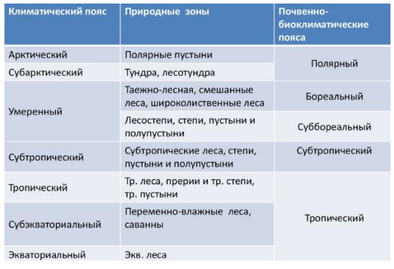

## Почвы

### Почва. Классификация почв.

**Почва** – верхний слой земной коры, способный на воспроизводство растительной массы. В основном почвы делят по генетическому признаку. В разных странах приняты свои классификации. В России классификация основана на работах Василия Васильевича Докучаева.

В основе классификации стоит тип почв. Тип почв характеризуется ярким проявлением основного процесса почвообразования. Далее типы почв нисходят по следующей классификации:
1. Подтип – по проявлению основного и дополнительного процессов почвообразования;
2. Род – по комплексу местных условий (минералогический состав, новообразования);
3. Вид – по степени развития почвообразовательных процессов (гумусированности, засоленности и др.);
4. Разновидность – по гранулометрическому составу;
5. Разряд – по генезису почвообразующих пород. Полное название почвы: например, чернозем обычный солонцеватый среднегумусовый маломощный среднесуглинистый на лессовидном суглинке.

### Основные типы почв.

Основные типы почв:
1. *Тундровые глеевые почвы* находятся на равнинах. Образуются без особого влияния на них растительности. Эти почвы находятся в областях, где есть многолетняя мерзлота. В России данный вид почв тянется широкой полосой вдоль побережья Северного Ледовитого океана
2. *Подзолистые почвы* — типичные почвы хвойных, или северных («бореальных»), лесов. Эти почвы формируются в холодных местностях с хорошим промывным режимом. При подзолообразовании происходит кислотная реакция, поэтому этот тип почвы еще называется кислый. В России подзолистые почвы распространены в Сибири и на Дальнем Востоке.
	1. a. *Дерново-подзолистые почвы* – это подтип подзолистых почв. Развиваются под смешанными лесами. Плодородность выше, чем у подзолистых почв, но всё равно низкая.
3. *Серые лесные* формируются в лесостепной зоне в условиях периодически-промывного водного режима под пологом лиственных и смешанных лесов. Эти почвы преобладают в России на территории от Забайкалья до Карпатских гор. Плодородность хорошая.
4. *Чернозёмы* формируются в условиях суббореального и умеренно континентального климата при периодически промывном или непромывном водном режиме под многолетней травянистой растительностью. Самые плодородные почвы.
5. *Каштановые почвы* распространены в степях и полупустынях. Каштановые почвы в России распространены на территории Кавказа, на Поволжье. Хорошее плодородие. Особняком стоят интразональные и азональные типы почв.

### Состав и строение почв. Свойства почв.

В состав почв входят минеральные вещества, гумус, вода, воздух и микроорганизмы. 

Почвенные горизонты:
- А0 – лесная подстилка / луговой войлок;
- Аd – дернина;
- A1 – перегнойный, или гумусовый горизонт;
- A2 – горизонт вымывания (выноса);
- B – иллювиальный горизонт, или горизонт вмывания (вноса);
- C – материнская (почвообразующая порода – горные породы, на которых образуется почва).

Свойства почв:
1. Цвет (чёрный, серый, коричневый, белый). Оценивается не в целом, а, например, по горизонтам;
2. Гранулометрический состав: супесь – лёгкий суглинок – средний суглинок – тяжёлый суглинок – глина.
3. Влажность: мокрая – влажная – влажноватая;
4. Наличие новообразований: они имеют пятнистый характер и могут быт в любых слоях. Например, железистые (ржавые) новообразования, гумусовые образования;
5. Структура почвы: пылеватая, зернистая, комковатая, слоистая, столбчатая, ореховатая;
6. Включения: моренный материал, остатки сельскохозяйственной деятельности.

### Почвенные разрезы. Почвенные разрезы основных типов почв России.

**Почвенный разрез** – это четырехугольное углубление, вскрывающее генетические горизонты почвенного профиля. Почвенные разрезы в зависимости от задач делают на разную глубину:
1. основные (полные): делают такой глубины, чтобы была видна материнская порода;
2. контрольные (полуразрезы): до материнской породы;
3. прикопки: делают главным образом для уточнения границ.

Почвенные разрезы некоторых типов почв:

### Факторы почвообразования.

1. Климат. Обычно, чем теплее и влажнее, тем почва плодороднее;
2. Геологический фактор (материнская порода, являющаяся источником образования минеральной части почвы, влияет на её состав).
3. Разные типы почв развиваются под разными растительными покровами.
4. Геоморфологический фактор (рельеф);
6. Время.

### Закономерности распространения почв. Интразональные и азональные почвы. Почвенно-экологическое районирование.

Главная закономерность распространения почв – это *зональность*, то есть приуроченность определённых типов почв к конкретной географической широте местности.

**Интразональные почвы** — почвы, не типичные для определенных зон, а встречающиеся во многих зонах (например, болотные, пойменные, солонцы, солончаки).

***Азональные почвы*** — это молодые почвы, не успевшие приобрести зональные особенности (формирующиеся на свежем аллювии, элювии плотных пород, примитивные щебнистые, молодые рыхлые на песках и т.д.).

Существует ещё *почвенно-экологическое районирование* – это разделение территории на регионы, однотипные по структуре почвенного покрова, сочетанию факторов почвообразования и возможностям хозяйственного использования почв.

