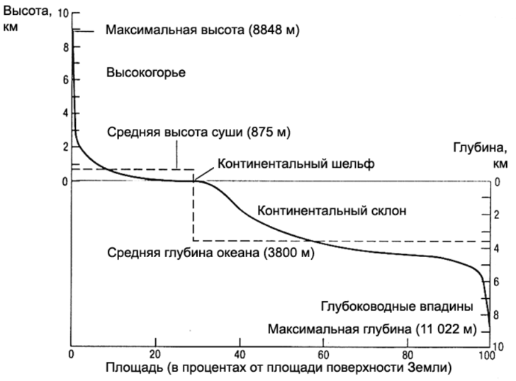

### 1. Геология, геоморфология, инженерная геология. Задачи и методы исследования.

**Геология** – это наука, изучающая строение (вещество и структуру) земной коры и закономерности её развития. Задачи геологии: изучить вещественный состав и структуру земной коры.

**Геоморфология** – это наука, изучающая рельеф и закономерности его распространения и развития. Задачи геоморфологии – изучить влияние поверхностных процессов.

**Инженерная геология** – это наука, изучающая геологическую среду с целью оценки её пригодности для проведения строительных работ. Геологическая среда – это часть литосферы и поверхности, вовлечённая в хозяйственную деятельность человека.

Методы бывают *полевые* (в том числе с использованием дистанционных методов) и *лабораторные*.

### 2. Общее строение Земли (атмосфера, гидросфера, внутреннее строение Земли, литосфера, биосфера).

Деление слоёв атмосферы по термическому режиму: тропосфера (до 11 км), стратосфера (11-50 км), мезосфера (50-90 км), термосфера. Верхняя граница термосферы и, соответственно, нижняя граница экзосферы - экзобаза, определяется по равенству длины свободного пробега атомов высоте однородной атмосферы, зависит от солнечной активности и находится на высоте 500-1000 км.

Информация о внутреннем строении Земли получена при интерпретации сейсмологических данных. По ним выделяют:
1. *Кора* (океаническая от 5 до 30 км, континентальная от 30 до 50 км);
4. *Граница Мохоро́вичича* (сокр. граница Мохо) — нижняя граница земной коры, отделяющая земную кору от мантии, на которой происходит скачкообразное увеличение скоростей продольных и поперечных сейсмических волн. Поверхность Мохоровичича прослеживается по всему земному шару на глубине от 5 до 10 км под океанической корой и от 20 до 90 км под континентальной корой.
5. *Мантия*. Вещество мантии в основном находится в твёрдом состоянии.
	1. Верхняя мантия. Основными минералами вещества верхней мантии являются оливин и пироксены.
		- *Астеносфера* – слой в верхней мантии. Более пластичный, чем соседние слои.
	2. *Слой Голицына* - переходная зона между верхней мантией и нижней мантией, находящаяся в интервале глубин 410-670 км. Верхняя граница этой зоны устанавливается по интенсивному росту скоростей сейсмических волн.
	3. *Нижняя мантия*.
7. *Граница Гутенберга*, или *граница Вихерта-Гутенберга* - зона разделения слоёв Земли, расположенная на глубине примерно 2900 км и отделяющая мантию от ядра. Сейсмические волны разных типов по-разному ведут себя при взаимодействии с границей: S-волны отражаются от неё, а P-волны преломляются ей с резким уменьшением скорости их распространения. Это позволило сделать вывод, что ниже границы Гутенберга лежит жидкая область.
8. *Ядро*. Состоит в основном из силикатов.
	1. *Внешняя часть* (до 5100 км) расплавлена;
	2. *Твёрдое ядро* (средний радиус около 1300 км). Предположительно, температура на поверхности твёрдого ядра составляет около 6000°C, а давление - 3 млн атмосфер.

**Литосфера** – земная кора и твёрдая верхняя часть мантии. Инертная и холодная;

**Гидросфера** — водная оболочка Земли от облаков до подземных вод.

**Биосфера** – часть литосферы и атмосферы, в которой наблюдается жизнедеятельность организмов. Толщина от -10км до +20км.

### 3. Химический состав и строение земной коры. Типы земной коры. Кларки.

В начале XX вв. американский геохимик Frank Wigglesworth Clarke попросил геологов мира прислать образцы горных пород. Проанализировав их, учёный определил среднее содержание элементов в горных породах. Эти содержания назвали **кларками**. Таблицы кларков составляют для разных областей: для земной коры, гидросферы, отдельного региона и др.

Состав земной коры определяется продуктами силикатных минералов и продуктами их разрушения. 85% земной коры состоит из трёх элементов: *кислород, кремний и алюминий*. 99% составляется двенадцатью элементами: *кислород, кремний, алюминий, железо, магний, натрий, калий, кальций, сера, фосфор, водород, углерод*.

1. Континентальная кора. Состоит из осадочного, гранитного, и базальтового слоёв. Если осадочного слоя нет, то эти части платформ называют щитами. Если есть – плитами. Средняя мощность 30-40 км, а под горами достигает 70 км.
2. Субконтинентальная кора. Отличается от континентальной уменьшенным гранитным слоем. Обычно связывают с островными дугами.
3. Субокеаническая кора. Приурочен к котловинным частям морей. От океанской коры отличается повышенной мощностью осадочного слоя.

Гранитный (гранитометаморфический) и базальтовый (гранулито-базальтовый) слои называются так, потому что по расчётам скорости прохождения сейсмических волн в этих слоях, предполагают, что они состоят из гранитов и базальтов.

Поверхность Конрада — условная граница, разделяющая гранитный и базальтовый слои земной коры, выявляемая по увеличению скорости прохождения сейсмических волн. Поверхность Конрада встречается в различных районах континентальной коры на глубине 15-20 км, однако отсутствует под океанической корой.

### 4.1 Минералы. Классификации и происхождение. Формы нахождения минералов.

**Минералы** – это твёрдые природные тела, характеризующиеся кристаллохимической однородностью. Всего известно более 2000 минералов, но широкое распространение имеют всего несколько десятков, которые называются породообразующими.

Классификации минералов:
1.  По структуре:
	1.  Кристаллические (есть кристаллическая решётка). В земной коре минералы находятся преимущественно в кристаллическом состоянии;
	2.  Аморфные. Не имеют закономерностей в расположении частиц, следовательно, их свойства во всех направлениях одинаковы, они не образуют кристаллов и не обладают спайностью.
2.  По происхождению:
	1.  Магматические (кристаллизация магмы);
	2.  Вулканические (кристаллизация лавы и осаждение из вулканических паров и газов);
	3.  Гидротермальные (из горячих водных растворов);
	4.  Пневматолитовые (из горячих газовых растворов);
	5.  Метаморфические (образуются в недрах планеты за счёт других минералов);
	6.  Метасоматические (при химическом замещении других минералов);
	7.  Хемогенные (при осаждении в водной среде);
	8.  Органогенные (при участии бактерий или как скопления скелетов);
	9.  Гипергенные (химическое выветривание на поверхности).
3.  По химическому составу:
	1.  Самородные элементы (из одного химического элемента)
	2.  Сульфиды (соединения металлов с серой)
	3.  Галогены – соли галоидоводородных кислот
	4.  Оксиды и гидроксиды (соединения с кислородом)
	5.  Карбонаты (соли угольной кислоты)
	6.  Сульфаты (соли фосфорной кислоты)
	7.  Силикаты (солеобразные химические соединения). По типу кристаллической решётки среди силикатов различают: островные, кольцевые, цепочечные, ленточные, слоистые (листовые) и каркасные.

При определении кристалла в полевых условиях следует пользоваться следующими признаками: цвет в куске, цвет в порошке (цвет черты), блеск, прозрачность, плотность, излом, спайность, твердость и некоторые характерные свойства минералов.

Формы нахождения минералов в природе разнообразны и зависят главным образом от условий образования:
- Отдельные кристаллы или их закономерные сростки (двойники);
- Обособленные минеральные скопления:
	- Друза – совокупность сросшихся между собой кристаллов, наросших на общее основание;
	- Секреция образуется в результате заполнения неправильной, обычно округлой формы полости минеральным веществом. Мелкие секреции называются миндалинами, крупные – жеодами.
	- Конкреция, в противоположность секрециям, разрастаются вокруг какого-нибудь центра. Мелкие округлые образования обычно концентрического строения называются оолитами.
	- Натёк, свисающие со сводов пустот, называются сталактитами, растущие вверх со дна пещер — сталагмитами, слившиеся сталактит и сталагмит называются сталагнатом;
	- На поверхности трещин могут развиваться плоские минеральные пленки.
- Минеральные агрегаты.

### 4.2. Горные породы. Классификации и происхождение. Их влияние на интенсивность развития геоморфологических процессов. 

**Горные породы** представляют собой природный агрегат одного минерала (мономинеральные) или нескольких (полиминеральные).

Классификация горных пород по условиям образования (генезису):
1. **Магматические** образуются при охлаждении и кристаллизации магмы или лавы. Породообразующими минералами магматических пород являются силикаты.
	1. В зависимости от условий застывания:
		1. Глубинные (интрузивные) – застывание магмы, внедрившейся в земную кору.
			1. Абиссальные, застывшие на глубине более трёх километров. Им свойственна полнокристаллическая структура и плотная текстура;
			2. Гипабиссальные, застывшие на меньших глубинах. Им свойственна порфировая структура и плотная текстура.
		2. Излившиеся (эффузивные) — остывание излившейся на поверхность магмы, т.е. лавы. Им свойственна скрытокристаллическая структура и пористая или порфировая текстура.
	2. В зависимости от процентного содержания кремнезёма (т.е. диоксида кремния, SiO2): кислые (65-75%), средние (52-65%), основные (40-52%) и ультраосновные (<40%)
2. **Осадочные** образуются на поверхности литосферы при разрушении пород, а также в результате жизнедеятельности или отмирания организмов. Для большинства осадочных пород характерна слоистая форма залегания.
	1. обломочные (механическое разрушение пород);
	2. глинистые (преимущественно химическое разрушение пород);
	3. хемогенные (выпадение солей из пересыщенных водных растворов);
	4. органогенные (жизнедеятельность организмов или скопление отмерших организмов).
3. **Метаморфические** образуются в земной коре из магматических или осадочных горных пород при воздействии на них высоких температур, давлений и глубинных флюидов и газов. Метаморфические породы обладают полнокристаллической структурой, типичны ориентированные структуры.

*Поскольку сходные по составу, структурам и текстурам метаморфические породы могут образоваться за счет изменения как магматических, так и осадочных пород, к названиям метаморфических пород, возникших по магматическим породам, прибавляется приставка «орто» (например, ортогнейсы), а к названиям метаморфических, первично-осадочных пород — приставка «пара» (например, парагнейсы).*

Строение горных пород характеризуется:
- Структурой:
	- Если порода целиком состоит из кристаллических зерен, выделяют полнокристаллическую структуру;
	- При резком преобладании нераскристаллизовавшейся массы говорят о стекловатой или аморфной структуре;
	- Если в стекловатую массу вкраплены кристаллические зерна, структуру называют порфировой;
	- Если крупные кристаллические зерна вкраплены также в кристаллическую, но более мелкозернистую массу, структура называется порфировидной;
	- Когда порода состоит из каких-либо обломков, говорят об обломочной структуре.
- Текстурой:
	- Выделяют плотную и пористую текстуры, однородную или массивную и ориентированную (слоистую, сланцеватую и др.).

*В случае порфировой структуры эффузивных пород пользуются терминами порфир, если кристаллические вкрапленники представлены преимущественно калиевыми полевыми шпатами, и порфирит, если во вкрапленниках преобладают плагиоклазы.*

На интенсивность влияния естественным образом влияют такие характеристики горных пород, как стойкость к выветриванию, к работе текучих воды или ветра, степень проницаемости для дождевых и талых вод (зависит от рыхлости и трещинноватости), растворимость (легко растворяются соль, гипс, известняки, доломиты), просадочность (уменьшение объёма горной породы при её намокании, как например у лёссов) и др.

Так, осадочные горные породы являются довольно стойкими по отношению к выветриванию, но многие из них весьма податливы к разрушительной работе текучих вод и ветра (лёсс, пески, суглинки, глины, мергели, галечники и т.д.), а магматические и метаморфические породы оказываются стойкими или довольно стойкими по отношению к размыву текучими водами, но сравнительно легко разрушаются под воздействием процессов выветривания. Объясняется это тем, что магматические и метаморфические породы образовались в глубине земли, в определенной термодинамической обстановке и при определённом соотношении химических элементов. Оказавшись на поверхности Земли, они попадают в новые условия, становятся неустойчивости в этих условиях и под воздействием различных процессов и начинают разрушаться.

### 5. Аномальные геофизические поля и их использование для поисков и разведки полезных ископаемых.

Земля обладает своими физическими полями. Их интенсивность зависит от фигуры Земли, координат точки, в которой производится замер, от распределения вещества по объёму Земли и множества других признаков.

**Аномальное геодезическое поле** – это отличие реального поля (измеренного прибором) от нормального поля (рассчитанного теоретически). Аномальные геодезические поля связаны с полезными ископаемыми.

Поиск и разведка полезных ископаемых:
- С помощью гравиразведки находят, где сила тяжести больше или меньше, чем ожидаемая;
- С помощью магниторазведки находят, где магнитное поле отличается от ожидаемого (образуются от намагниченности земной коры и меняют поле образованное токами в Земле и ионосфере с магнитосферой). Все минералы по магнитным свойствам делятся на:
	- Ферромагнетики (минералы группы железа, усиливают поле Земли);
	- Диамагнетики (магнитятся в другую сторону, цветные и благородные металлы);
	- Парамагнетики (соли, слабо магнитятся).
- Тепловые, радиоактивные признаки…

### 6. Рельеф Земли. Геотектуры, морфоструктуры, морфоскульптуры. Формы и элементы форм рельефа. Основные формы рельефа. Типы рельефа. Гипсографическая кривая.

**Рельеф Земли** – неровности твёрдой земной поверхности.

По размерам формы рельефа делятся на:
- Геотектуры – самые крупные формы рельефа. Геотектурные элементы рельефа обусловлены силами общепланетарного масштаба.
	- Рельефы первого порядка — материковые глыбы и океанические жёлоба.
	- Рельефы второго порядка — горные пояса и крупные равнины.
- Морфоструктуры – более мелкие формы рельефа, созданные преимущественно тектоническими процессами (глубинными силами). Это горные хребты, горные долины, впадины больших озёр.
- Морфоскульптуры – формы рельефа, сформированные на поверхности земли под действием внешних сил (вода, ледники, ветры...) – это речные долины, овраги, ущелья, дюны, барханы.

**Формы рельефа** бывают:
- Положительные и отрицательные;
- Линейные (горные хребты), изометричные (курганы, впадины), брахиформы (овальные);
- Открытыми (речные долины, овраги..) и закрытыми(озёра).

**Элементы формы рельефа**:
- Горные вершины, днища конусообразных воронок;
- Водораздел – линия, соединяющая наивысшие точки рельефа;
- Тальвег – линия, соединяющая наинизшие точки рельефа;
- Склоны – поверхности между водоразделами и тальвегами;
- Бровка – линия перегиба, где склон выполаживается.

**Основные формы рельефа:** гора, котловина, хребет, лощина, седловина, равнина.

**Типы рельефа по генетическому признаку** бывают тектонические и бывают связанные с внешними силами: эрозионные, ледниковые, карстовые...

**Гипсографическая (гипсометрическая) кривая** – это кривая, показывающая распространённость на Земле различных высот и глубин. Согласно гипсографической кривой, суша занимает 29.7% всей поверхности Земли. Средняя высота материков – 875м. Средняя глубина океана – 3650 м.

### 7. Геохронология.  Методы определения возраста горных пород.

**Геохронология** -  комплекс методов определения абсолютного и относительного возраста горных пород или минералов.

В разрезе нормально залегающие отложения отражают последовательность геологических событий, хотя понятие «нормально залегающие» точно не сформулировано. **Стратиграфический метод** применим только для осадочных горных пород при их спокойном залегании.

Одновозрастность слоёв пород по окаменелостям можно определить и по окаменелостям, названным руководящими ископаемыми (**палеонтологический метод**).

**Палеомагнитный метод** основан на том, что горные породы, содержащие ферромагнитные минералы, образовались в магнитном поле Земли и, обладая свойством магнитной восприимчивости, запечатлели положение векторов существовавшего в момент своего образования магнитного поля. Это свойство называют остаточной намагниченностью.

**Радиометрический метод** основан на изучении распада радиоактивных элементов или радиоактивных изотопов. Позволяет определить абсолютный возраст горных пород. В абсолютной геохронологии применяется обычная астрономическая система летосчисления — астрономический год — период времени полного обращения Земли вокруг Солнца. Надо иметь в виду, что продолжительность современного астрономического года не полностью соответствует продолжительности года в палеозое и тем более в протерозое или архее. Поэтому лучше говорить не об абсолютном, а о радиогеохронологическом или радиометрическом возрасте.

В истории развития Земли выделяются несколько крупных этапов:
1. *Этап аккреции* вещества газопылевой туманности;
2. *Догеологический этап*. горных пород этого времени практически не сохранилось, а процессы, протекавшие на данном этапе, приводили к дифференциации вещества внутри планеты, образованию какой-то первичной земной коры основного состава, выделению внешнего, жидкого ядра Земли и, соответственно, появлению магнитного поля;
3. *Докембрийский супер-эон (криптозой)* (4,0 — 0,5 млрд. лет назад). Включает в себя три эона: протерозой, архей и катархей. Криптозой — время скрытой жизни, в нём существовали только мягкотелые организмы, не оставляющие следов в осадочных породах.
4. *Фанерозойский эон* включает в себя палеозойскую, мезозойскую и кайнозойскую эру. Фанерозой начался с появлением множества видов моллюсков и других организмов, остатки которых сохранились до наших дней.

Стратиграфическая последовательность слоев и их относительное время образования называют одними и теми же именами. Для того чтобы отличать время образования слоев от последовательности напластований, необходимо давать название времени (*период*, *эпоха*, *век*) или название напластования (*система*, *отдел*, *ярус*).

### 8. Фации и формации. Фациальные и формационные анализы. Метод актуализма.

**Метод актуализма** – “познавая современность, познаём древность”. Он опирается на принцип однообразия, по которому геологические процессы, происходящие в прошлые геологические эпохи, и явления, вызывавшиеся этими процессами, имеют много общего с современными.

**Фация** – осадки (или горные породы), возникающие в определённой физико-географической обстановке и отличающиеся от состава и условий образования смежных одновозрастных пород.
- Континентальные фации: горная, равнинная, речная, русловая, озёрная, болотная и т.д.
- Морские: береговые, шельфовые, фации подножия материкового склона, фации ложа мирового океана…
- Переходные фации: лагунные и дельтовые фации.

Фациальный анализ - метод реконструкции палеогеографических обстановок по выделенным фациям.
- Пример горизонтального фациального ряда: берег – грубые породы – галечники – галька с песком – чисто песок – песок с глиной – глина…
- Пример вертикального ряда — трансгрессия моря (наступление моря): сначала была береговая фация – уровень моря повышается – накапливается песок – уровень моря повышается – накапливается глина.

**Формация** – это комплекс пород, образовавшихся в сходных тектонических условиях. Если фация касается поверхностной географии, то формации касаются глубинной структуры коры. 

### 9. Геологическая карта и её виды. Собственно геологические карты, тектонические карты, инженерно-геологические карты.

**Геологическая карта** — карта, отображающая на топографической основе, геологическое строение определённого участка земной коры. В зависимости от содержания и предназначения различают: *собственно геологические карты*, *карты антропогеновых (четвертичных) отложений*, *тектонические*, *литологические*, *палеогеографические*, *гидрогеологические*, *инженерно-геологические*, *карты полезных ископаемых*, *прогнозные* и *геохимические*.

Наибольшее значение имеют **собственно геологические карты**, на которых с помощью качественного фона (цветного и штрихового), буквенных, цифровых и других условных знаков показываются возраст, состав и происхождение горных пород, условия их залегания и характер границ между отдельными комплексами.
- Цветной фон служит для обозначения возраста осадочных, вулканогенных и метаморфических пород;
- Штриховыми знаками обозначается состав пород;
- Исключение представляют интрузивные и некоторые вулканогенные породы, состав которых условно изображается цветом или буквами.
Существуют также одноцветные геологические карты, показывающие и состав пород, и их возраст штриховыми обозначениями.

**Тектоническая карта** — геологическая карта, отображающая историю тектонических движений и строение земной коры. В мелких масштабах на тектонических картах изображаются платформы, щиты, плиты, геосинклинали, складчатые области; в крупных масштабах — отдельные складки, разломы, горсты, грабены и т. д.

**Инженерно-геологические карты** - вид геологических карт, на которых показаны все важнейшие геологические факторы, учитываемые при планировании, проектировании, строительстве, эксплуатации сооружений и проведении других инженерных мероприятий.

### 10. Эндогенные и экзогенные процессы и их влияние на рельеф.

**Эндогенные процессы** – это процессы, связанные с внутренними силами. К эндогенным процессам относят магматические, метаморфические, тектонические и сейсмические процессы. Эндогенные процессы обусловлены влиянием внутреннего тепла Земли и гравитации.

**Экзогенные процессы** – это процессы на поверхности. К ним относят эрозионные, эоловые, гляциальные, криогенные, гравитационные, нивальные процессы. Экзогенные процессы обусловлены действием силы тяжести и солнечной энергии.

Эндогенные процессы создают неровности рельефа, а экзогенные пытаются их нивелировать.
