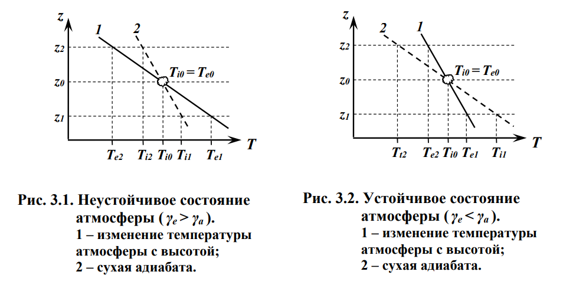

## Физика атмосферы

### Физика атмосферы. Особенности атмосферных процессов. Методы наблюдения за состоянием атмосферы.

Физика атмосферы – наука, изучающая различные физические явления и процессы, происходящие в атмосфере, атмосферные движения разных масштабов и различной природы. Основной целью физики атмосферы является построение достаточно полной физической модели атмосферных процессов и явлений.

Для атмосферных явлений характерна их *комплексность* – зависимость от макроскопических движений и структуры атмосферы, от свойств поверхности Земли, космических явлений (солнечные вспышки), а так же явлений малого масштаба, таких как внутреннее трение и термическая устойчивость атмосферы.

Нагрев атмосферного воздуха происходит преимущественно от поверхности Земли при переизлучении инфракрасного излучения. Нагрев неоднороден как в пространстве, так и во времени (например, из-за наклона оси вращения Земли).

Наличие в атмосфере водяного пара приводит к образованию облаков и туманов. Облака служат источником энергетических и оптических явлений. При конденсации выделяется тепло, а облака уменьшают количество излучения, достигающего земной поверхности.

Также для атмосферных явлений характерна *многомасштабность*. Хоть атмосферы и происходят по всей Земле, их масштабы очень различны: от нескольких метров до многих тысяч километров. К тому же, многие явления (облака, смерчи), меняют свои размеры по мере своего развития.

Для характеристики состояния атмосферы используют следующие метеорологические параметры: температура, плотность, влажность, ветер, количество и толщина облаков, осадки, видимость, водность облаков, осадков, туманов, потоки лучистой энергии Солнца и др.

Методы наблюдения за состоянием атмосферы:
- Наземное наблюдение (метеопосты);
- Радиозонды, до 20-30 км;
- Метеорологические ракеты, до 60-80 км;
- Геофизические ракеты, до 500 км;
- Метеорологические шары;
- Дистанционные методы.

При использовании дистанционного зондирования используют ЭМИ. Атмосфера непроницаема для некоторых волн, и выделяют полосы поглощения и полосы пропускания (или окна прозрачности). Радиосигнал может отразиться от ионосферы и обогнуть Землю. 

### 1. Строение атмосферы. Принцип деления атмосферы на слои. Диссипация газов из атмосферы. Уровень диссипации.

Атмосфера - газообразная оболочка, окружающая Землю. Общая масса атмосферы составляет $5.2\cdot 10^{18}$ кг. До высоты 200 км атмосфера представляет собой сравнительно одинаковую оболочку здесь находится основная масса воздуха. Дальше 200 км температура и плотность атмосферы сильно меняются в пространстве и времени. Атмосфера имеет довольно неправильную форму, сжимается и расширяется.

50% массы атмосферы заключено в слое до 5 км;
75% массы находится на высотах до 10 км;
95% массы находится на высотах до 20 км;
99% массы находится на высотах до 30-35 км.

Вертикальные масштабы явлений и процессов в атмосфере значительно меньше, чем горизонтальные размеры. Изменения по вертикали примерно в 500 раз быстрее чем по горизонтали. Поэтому при делении атмосферы в первую очередь учитывают её изменчивость по вертикали.

Используют четыре принципа деления атмосферы: по термическому режиму, по составу воздуха атмосферы, по характеру взаимодействия с земной поверхностью, по влиянию на движение летательных аппаратов.

#### По термическому режиму
Наиболее отчётливо различия атмосферы проявляются в термических градиентах $\frac{\Delta t}{\Delta h}$. В атмосфере по термическому режиму выделяют:
1. *Тропосфера* (до 11 км). Средний вертикальный температурный градиент в тропосфере $\approx65\pm 0,30^\circ C/100 м$. В тропосфере образуются туманы и почти все  виды облаков, формируются осадки. Температура уменьшается с подъёмом.
	1. Тропопауза. Здесь средняя температура $\approx 56,5^\circ C$.
2. *Стратосфера* (11-50 км). Характеры сначала постоянство, затем рост температуры. Изотермическое распределение температуры на средних широтах в стратосфере сохраняется примерно до 25 км. Выше температура начинает расти. Средний градиент температуры на высотах 25-45 км $\approx-0,28^\circ C/100м$. Повышение температуры обусловлено поглощением радиации. На высоте 20-30 км часто образуются перламутровые облака.
	1. Стратопауза
3. *Мезосфера* (50-90 км). В мезосфере температура сначала постоянна, затем начинает падать с градиентом $\approx-0,35^\circ C/100м$. В верхних слоях мезосферы (82-85 км) в летнее время могут наблюдаться серебристые облака.
	1. Мезопауза. Температура воздуха здесь меняется незначительно ($-85$ - $-90^\circ C$),
4. *Термосфера* (90-800 км). Температура снова начинает расти. Главным образом из-за поглощения кислородом солнечной радиации с длиной волны $<0,24$ мкм. При этом происходит диссоциация кислорода.
	1. Термопауза
5. *Экзосфера* (более 800 км).

#### По составу воздуха атмосферы
По составу воздуха атмосферу делят на:
1. Гомосфера (0-95 км). Содержит неизменный состав: $N_2$, $O_2$, $Ar$. Молярная масса не меняется и равна 29 кг/моль.
2. Гетеросфера (выше 95 км). Здесь появляются атомарные азот и кислород. Молярная масса воздуха уменьшается с высотой. 

С 50-60 км резко увеличивается содержание заряженных частиц за счёт того, что происходит ионизация нейтральных частиц (ионосфера)

На высоте 20-55 км сосредоточена основная масса озона $O_3$ (озоновый слой).

На высоте более 100 км (внешний слой) столкновения частиц редки, и преобладающая их часть заряжена (радиационный пояс). В пределах радиационного пояса совершают колебания вдоль магнитного поля Земли и имеют большую энергию. Граница радиационного пояса со стороны освещённой Солнцем в плоскости геомагнитного экватора находится на высоте 9-10 радиусов Земли. А на неосвещённой стороне - 10-12 радиусов Земли.

#### По характеру взаимодействия с земной поверхностью
По характеру взаимодействия с земной поверхностью атмосферу делят на:
1. Пограничная часть (до 1.5 км). На движение воздушных масс сильно влияет земная поверхность; хорошо проявляются суточные изменения метеорологических параметров.
	1. Приземный слой (до 50-100 м). Здесь влияние ещё и от растительного и животного мира.
2. Свободная атмосфера (выше 1.5 км)

#### По влиянию на движение летательных аппаратов
1. До 100-150 км условия полёта искусственных спутников примерно одинаковы. Сопротивление воздуха велико.
2. Околоземное космическое пространство (более 150 км).

#### Диссипация газов из атмосферы
Молекулы газов находятся в непрерывном хаотичном движении. При этом средняя скорость движения молекул возрастает с ростом температуры. Скорости отдельных молекул могут позволить им ускользнуть из атмосферы в космос. Диссипацией газов из атмосферы называется преодолевание молекул газа притяжения планеты.

Кинетическая энергия молекулы должна быть больше потенциальной энергии силы притяжения планеты.
$$E_{К}=\frac{mV^2}{2}$$
$$\left|E_{П}\right|=G\frac{mM}{R_i}$$
Уравняв $E_{К}=E_{П}$, получим:
$$\boxed{V_{критическая}=\sqrt{\frac{2GM}{R_i}}}$$
где $R_i$ - расстояние до центра Земли; $M$ - масса Земли; $m$ - масса молекулы; $G$ - гравитационная постоянная.

Критическая скорость для частиц на поверхности Земли составляет примерно 11 км/с. Наличие скорости, превышающей критическую, является необходимым, но не достаточным условием диссипации. Частица, обладающая критической скоростью, не должна сталкиваться с другими частицами. Поэтому в нижних слоях атмосферы вероятность диссипации крайне мала, в отличие от верхних слоёв атмосферы, где увеличивается свободный пробег молекул.

**Уровень диссипации** - высота, начиная с которой, вероятность прохождения молекул без столкновения бесконечного пути равна $e^{-1}$. Иногда за верхнюю границу атмосферы принимают уровень диссипации.
$$\boxed{Z_{дисс}=\overline{H}\cdot \ln\frac{\overline{H}}{l(0)}}$$
где $\overline{H}$ - средняя высота молекулы; $l(0)$ - длина свободного пробега молекулы у поверхности Земли. Например, при $\overline{H}=20 км$, $l(0)=10^{-7} см$, $Z_{д}$ составит около 500 км.

**Время диссипации** - время, за которое единица объёма газа совершит диссипацию. Чем легче газ, тем меньше время диссипации.

### 2. Уравнение состояния сухого воздуха.

Сухой воздух - это воздух, в состав которого не входит водяной пар. Воздух - это механическая (химических процессов не происходит) смесь газов. Воздух обычно ведёт себя как идеальный газ, т.е. молекулы не взаимодействуют и их можно считать за точки.

Приняв воздух за идеальный газ, можно использовать формулы идеального газа. Например, уравнение Менделеева-Клапейрона:
$$P_iV_i=R_iT_i$$
где $P_i$ - парциальное давление (такое давление, которое оказывала бы газовая компонента, если бы она заполняла весь объём); $V_i$ - удельный объём $i$-й компоненты воздуха (такой объём, который займёт 1 моль); $R_i$ - удельная газовая постоянная; $T_i$ - температура газовой компоненты.

Справедливы следующие формулы: $$P=\sum P_i$$ $$V_i=\frac{V}{m_i}$$ $$R_i=\frac{R^*}{\mu_i}$$
где $R^*$ - универсальная газовая постоянная, $\mu_i$ - молярная масса газовой компоненты; $m_i$ - масса газовой компоненты.

Выведем теперь уравнение состояния для сухого воздуха:
$$\sum P_i\frac{V}{m_i}=\sum R_iT_i$$
$$\boxed{PV=\sum_1^n R_iT_im_i}$$
При термодинамическом равновесии:
$$PV=T\sum m_iR_i$$
Обозначим $R_c=\sum m_iR_i=R^*\sum\frac{m_i}{\mu_i}$ - газовая постоянная сухого воздуха. Тогда:
$$\boxed{PV=R_cT}$$

### 3. Уравнение состояния влажного воздуха.

Влажный воздух - механическая смесь сухого воздуха и водяного пара. Так как критическая температура водяного пара высокая (~$647^\circ K$), то в реальных условиях он может переходить в жидкое и твёрдое состояния.

Чтобы началась конденсация, пар должен достичь точки насыщения (обычно за счёт температуры). Также нужен центр конденсации.

Выделим в атмосфере 1 грамм влажного воздуха. И пусть в нём содержится $s$ грамм водяного пара и $1-s$ грамм сухого воздуха. Обычно распределение пара и сухого воздуха равномерно. Обозначим $V_{п}=\frac{V}{s}$ - удельный объём водяного пара; $V_{с}=\frac{V}{1-s}$ - удельный объём сухого воздуха; $e$ - парциальное давление водяного пара.

Экспериментально установлено, что физические свойства водяного пара практически близки к свойствам идеального газа. Так, уравнение Менделеева-Клапейрона для водяного пара примет вид:
$$eV_{п}=R_{п}T$$
Учитывая, что удельная газовая постоянная для водяного пара и для сухого связана отношением $R_{п}\approx 1,608 R_{с}$, выведем:
$$eV=1.608R_{с}T\cdot s$$
Запишем теперь уравнение состояния сухого воздуха:
$$(P-e)V=R_{с}T(1-s)$$
Сложив эти два уравнения, получим уравнение состояния влажного воздуха:
$$PV=R_{с}T(1+0.608s)$$
Иногда $R_{п}$ и $R_{с}$ объединяют: $R_{сп}=R_{с}(1+0.608s)$
$$\boxed{PV=R_{сп}T}$$
Иногда вводят виртуальную температуру
$$T_{в}=T(1+0.608s)=T+\Delta T_{в}$$
$$\Delta T_{в}\approx0.378\frac{e}{P}$$
$$\boxed{PV=R_{с}T_{в}}$$
Если водяной пар находится в насыщенном состоянии, то $\Delta T_{в}$ достигает максимального значения $0.378\frac{E}{P}$, $E$ - упругость насыщенных водяных паров.

Если ввести плотность влажного воздуха $\rho=\frac{1}{V}$, то можно записать:
$$\boxed{P=R_{с}\rho T_{в}}$$

### 4.1 Определение и связь между характеристиками влажности воздуха.

Концентрации основных газов на небольших высотах довольно постоянны. Однако концентрация водяного пара колеблется от 0 до 4% от общего объёма. Содержание водяного пара в атмосфере характеризуется следующими характеристиками.

#### Упругость водяного пара

Упругость водяного пара $e$ - парциальное давление водяного пара.

При данной температуре $T$ упругость $e$ водяного пара не может превосходить некоторое предельное значение $E$, которое называют упругостью насыщения (или максимальной упругостью водяного пара). $E$ возрастает с увеличением температуры.

#### Абсолютная влажность воздуха

Абсолютная влажность a - масса водяного пара, выраженного в граммах на кубический метр влажного воздуха. Между абсолютной влажностью и плотностью водяного пара существует связь
$$\boxed{a=10^5\rho_{п}=220\frac{e}{T}}$$
где $\rho_{п}$ - плотность водяного пара, выраженная в граммах на кубический сантиметр; $e$ - упругость водяного пара, выраженная в миллибарах.

#### Относительная влажность воздуха

Относительная влажность $f$ воздуха - отношение фактической упругости к максимальной:
$$\boxed{f=\frac{e}{E}\cdot100\\%}$$

#### Удельная влажность воздуха

Удельная влажность $s$ воздуха определяет количество водяного пара в граммах, содержащееся в 1 грамме влажного воздуха.
$$\boxed{s=\frac{0.622e}{P-0.378e}}$$
При практических расчётах используют формулу
$$\boxed{s=0.622\frac{e}{P}}$$
#### Дефицит влажности

Дефицит влажности $d$ определяет разность между упругостью насыщения $E$ при данной температуре $T$ и фактической упругостью пара $e$:
$$\boxed{d=E-e}$$

#### Точка росы

Точка росы $T_{р}$ - температура, при которой содержащийся в воздухе водяной пар при постоянных атмосферном давлении и удельной влажности становится насыщенным. Это характеристика влажности воздуха, а не термического режима. Эта связь определяется графически.
$$e=E(T_{р})$$
При охлаждении насыщенного воздуха ($f=100\%$), будет происходить конденсация.

#### Дефицит точки росы

Дефицит точки росы - это разность между температурой воздуха $T$ и точкой росы $T_{р}$:
$$\boxed{\Delta=T-T_{р}}$$
### 4.2 Определение и связь между газовыми компонентами воздуха. Адиабатический процесс.

Атмосферный воздух является механической смесью различных газов. Содержание каждой газовой компоненты характеризуется следующими безразмерными величинами:
1. Массовая концентрация $$g_i=\frac{m_i}{m}$$
2. Объёмная концентрация $$r_i=\frac{V_i}{V}$$
3. Мольная концентрация $$z_i=\frac{N_i}{N}$$
где $m$, $V$, $N$ - масса, объём и число молей всей смеси газов соответственно.

Соотношение между концентрациями:
$$z_i=r_i=g_i\cdot\frac{\mu}{m_i}=\frac{P_i}{P}$$
где $P_i$ - парциальное давление газовой компоненты; $P$ - давление смеси газов; $\mu_i$ - молярная масса газовой компоненты; $\mu$ - молярная масса смеси газов. $$\mu=\sum z_i\mu_i$$
Если газовая смесь включает газы с различным числом атомов в молекулах, то удельные теплоёмкости рассчитываются по следующим формулам:

Удельная теплоёмкость при постоянном объёме:
$$c_V=\sum g_i\cdot c_{Vi}=\sum g_i\cdot\frac{i}{2}R^*T$$
где $\frac{i}{2}$ - число степеней свободы, делённое на два.

Удельная теплоёмкость при постоянном давлении:
$$c_P=\sum g_i\cdot c_{Pi}=\sum g_i\cdot\frac{i+2}{2}R^*T$$

Адиабатический процесс - процесс, не производящий теплообмена с окружающей средой. Уравнение адиабаты: $$PV^{\gamma}=const$$
$\gamma$ - показатель адиабаты.
$$\gamma=\frac{c_P}{c_V}$$

### 5. Силы, действующие в атмосфере в состоянии равновесия.

Силы, действующие в атмосфере, делятся на:
1. Массовые (внешние): сила тяжести, отклоняющие силы вращения Земли (силы Кориолиса, центробежная сила);
2. Внутренние (поверхностные): сила давления, сила трения.

В статике атмосферы рассматриваются только силы тяжести и давления. А силы вращения Земли и силы трения относятся к движущейся атмосфере.

### 6. Основное уравнение статики атмосферы.

На выделенный объём (1 кубометр) воздуха действуют силы давления и силы тяжести. Пусть сила тяжести начинается в центре. Силы по горизонтали уравновешиваются, а по вертикали - нет, и возникает сила тяжести.
$$P_{Т}=g\cdot \rho \cdot dz \cdot1{м}^2$$
где $g$ - ускорение свободного падения; $\rho$ - плотность воздуха; $dz$ - толщина слоя воздуха. Спроецировав все силы на положительное направление вертикали $z$, получим:
$$P-(P+dP)-P_{Т}=0$$
$$P-P-dP-g\cdot\rho\cdot dz=0$$
$$\boxed{-dP=g\cdot\rho\cdot dz}$$
или
$$\boxed{-\frac{dP}{dz}=g\cdot\rho}$$
$-dP/dz$ - вертикальная составляющая градиента давления. Полученное уравнение называется основным уравнением статики. Оно выражает равновесие двух сил: градиента давления и силы тяжести. Это уравнение с большой точностью сохраняется и при движущемся атмосферном воздухе. Из этой формулы можно сделать следующие выводы:
1. Если выделенный объём воздуха поднимается вверх ($dz>0$), то давление падает ($dP<0$). То есть увеличению высоты соответствует отрицательный рост давления;
2. Атмосферное давление на каждом уровне представляет собой вес столба воздуха с площадью основания $1м^2$ и высотой от данного уровня до верхней границы атмосферы;
3. Чем выше расположен уровень, тем меньше величина падения давления при подъёме на одну и ту же величину.

### 7.1. Барометрические формулы. Однородная, изотермическая и политропная атмосферы.

При рассматривании больших объёмов воздуха необходимо перейти от дифференциальной формы основного уравнения статики атмосферы к интегральной.

Интегралы основного уравнения статики, полученные при разных изменениях температуры и давления воздуха, называются барометрическими формулами.

#### Однородная атмосфера

Однородная атмосфера - это такая атмосфера, плотность которой не меняется с высотой.
$$\rho=\rho_0=const$$
$$\int_{P_0}^P-dP=\int_0^zg\cdot\rho_0\cdot dz$$
$$-P|_{P_o}^P=g\rho z|_0^z$$
$$P-P_0=-g\rho z$$
$$\boxed{P=P_0-g\rho z}$$
По формуле видно, что в однородной атмосфере при увеличении высоты давление падает линейно. Высота, на которой давление становится равным нулю, называется высотой атмосферы и обозначается как $H$:
$$H=\frac{P}{g\rho_0}$$
Используя уравнение состояния атмосферы воздуха, можем записать $H$ в виде:
$$H=\frac{R_сT_0}{g}$$
где $T_0$ - температура вблизи поверхности Земли. Высота однородной атмосферы при температуре $T_0=273K$ составляет около восьми километров.

Выведем вертикальный градиент температуры $\gamma$ в однородной атмосфере.
$$\gamma=-\frac{dT}{dz}$$
Из уравнения состояния сухого воздуха:
$$PV=R_сT\Rightarrow T=\frac{P}{R_с\rho_0}$$
$$\frac{dT}{dz}=\frac{1}{R_с\rho_0}\cdot\frac{dP}{dz}$$
Из основного уравнения статики атмосферы:
$$-\frac{dP}{dz}=g\cdot\rho\Rightarrow \frac{dP}{\rho_0dz}=g$$
$$\frac{dT}{dz}=\frac{g}{R_с}$$
То есть $\gamma=\frac{g}{R_с}\approx3,42К/100м$; температура меняется по линейному закону:
$$T=T_0-\gamma z$$

#### Изотермическая атмосфера

Это такая атмосфера, температура которой не изменяется с высотой:
$$T=T_0=const$$
Из уравнения состояния сухого воздуха:
$$\rho=\frac{P}{R_сT}\Rightarrow-\frac{dP}{P}=\frac{g}{R_сT_0}dz\Rightarrow$$
$$\Rightarrow\int_{P_0}^P-\frac{dP}{P}=\frac{g}{R_с}\int_0^z\frac{dz}{T_0}\Rightarrow \ln P=\ln P_0-\frac{gz}{R_сT_0}$$
$$\boxed{P(z)=P_0\exp\left(-\frac{gz}{R_сT_0}\right)}$$
То есть наблюдается экспоненциальный спад давления с ростом высоты.

#### Политропическая атмосфера

Политропическая атмосфера - это такая атмосфера, которая характеризуется линейным изменением температуры с высотой:
$$T=T_0-\gamma z,\quad\gamma=const$$
$$\rho=\frac{P}{R_сT}\Rightarrow-\frac{dP}{P}=\frac{g}{R_сT}dz\Rightarrow$$
$$\Rightarrow\int_{P_0}^P-\frac{dP}{P}=\frac{g}{R_с}\int_0^z\frac{dz}{T_0-\gamma z}\Rightarrow \ln P=\ln P_0+\frac{g}{R_с\gamma}\ln(T_0-\gamma z)$$
$$\boxed{P=P_0\cdot(T_0-\gamma z)^\frac{g}{R_с\gamma}}$$
Из уравнения видно, что давление падает с высотой. И чем больше гамма, тем меньше давление при одинаковых давлении и температуре.

### 7.2. Барическая ступень. Барометрическая формула верхних слоёв атмосферы.

Для приближённой оценки высоты по известной разности давлений (или наоборот) на практике часто используют барическую ступень. Барической ступенью $h$ называется такая высота, на которую нужно подняться с исходного уровня, чтобы давление упало на 1 миллибар.
$$h=-\frac{dz}{dP}$$
Если применить основное уравнение статики, получим:
$$h=\frac{1}{g\rho}$$
То есть плотность и барическая ступень обратно пропорциональны друг другу. Чем меньше барическая ступень, тем быстрее падает плотность при увеличении высоты. Барическая ступень в тёплой воздушной массе больше барической ступени в холодной воздушной массе.

Под влиянием силы сопротивления атмосферного воздуха происходит постепенное уменьшение полной механической энергии спутника и, как следствие этого, изменение формы и размеров орбиты. Также нужно учитывать, что на больших высотах меняются состав воздуха и ускорение силы тяжести.

Из уравнения состояния сухого воздуха:
$$-\frac{dP}{P}=\frac{g}{R_сT}dz\quad\text{или}\quad-\frac{dP}{P}=\frac{\mu g}{R^{*}T}dz$$

Введём величину $H$
$$H=\frac{R^*T}{\mu g}\Rightarrow\boxed{-\frac{dP}{P}=\frac{dz}{H}}$$
Величину $H$ называют высотой однородной атмосферы или вертикальным масштабом атмосферы. Примем $H=const$ и проинтегрируем полученное уравнение в пределах от $z_п$ до произвольной высоты $z$ и получим барометрическую формулу:
$$\boxed{-\ln\frac{P}{P_п}=\frac{z-z_п}{H}}\quad\text{или}\quad \boxed{P=P_п\exp\left(-\frac{z-z_п}{H}\right)}$$
Теперь можно дать определение величине $H$: вертикальный масштаб атмосферы - это толщина такого слоя атмосферы. в пределах которого давление убывает в $e$ раз. Давление убывает тем быстрее, чем меньше величина параметра $H$.

Данная барометрическая формула используется при расчёте изменения орбиты летательных аппаратов. Также используется для определения времени существования искусственных спутников Земли.

$$H=\frac{R^*T}{\mu g}\Rightarrow H=\frac{P}{\rho g}\Rightarrow P=g\rho H$$
$$g\rho H=g_п\rho_п H\exp\left(-\frac{z-z_п}{H}\right)$$
$$\rho(z)=\rho_п\frac{g_п}{g}\exp\left(-\frac{z-z_п}{H}\right)$$
Получили формулу изменения плотности воздуха с изменением высоты в слое $H=const$, где $g_п$ - ускорение свободного падения на уровне $п$, $g$ - ускорение свободного падения вблизи поверхности Земли.

### 8. Геопотенциал. Абсолютная и относительная высота изобарических поверхностей. 

Для анализа полей давления часто используется метод барической топографии. Он основан на использовании карт барической топографии (БТ), которые составляются по данным зондирования атмосферы во многих точках Земли. В основе метода БТ лежит понятие геопотенциала.

Геопотенциал уровня $\Phi^*$ измеряется работой, которую необходимо совершить, чтобы поднять единицу массы в поле силы тяжести от исходного уровня до заданного.
$$d\Phi=g\cdot dz\quad\text{или}\quad\Phi^*=\int_0^zg\cdot dz$$
Геопотенциальная высота $\Phi$ измеряется в геопотенциальных метрах (гп. м):
$$\Phi=\frac{\Phi^*}{g_0}=\frac{1}{g_0}\int_0^zg\cdot dz$$
Экспериментальные исследования показывают, что до 30 км геопотенциальная высота $\Phi$ и обычная высота мало отличаются друг от друга, так как $g$ и $g_0$ близки между собой.

Введём геопотенциальную высоту в барометрическую формулу: 
$$P=P_0\exp\left(-\frac{z-z_п}{H}\right)=P_0\exp\left(-\frac{z-z_п}{\frac{R_сT_V}{g_0}}\right)=P_0\exp\left(-\frac{g_0\Phi}{R_сT_V}\right)$$
Абсолютной высотой изобарической поверхности (с давлением $P$) называется геопотенциальная высота $\Phi_P$ над уровнем моря.
$$\Phi_P=\frac{R_с}{g_0}\overline{T_V}\ln\frac{P_0}{P}\approx67,3\overline{T_V}\lg\frac{P_0}{P}$$
где $\overline{T_V}$ - средняя виртуальная температура столба воздуха, заключенного между уровнем моря и высотой изобарической поверхности; $P_0$ - давление на уровне моря.

Географические карты с нанесёнными на них абсолютными значениями изобарической поверхности называют картами абсолютной топографии (АТ). На таких картах через каждые 40 гп. м проводят изолинии геопотенциальных высот. Поскольку изобарическая поверхность над циклонами имеет вогнутую ( к земной поверхности ) форму, а над антициклонами – выпуклую, то циклоны и антициклоны на картах АТ представляют собой области с замкнутыми изогипсами соответственно с низкими и высокими значениями $\Phi_P$ в центре.

Широкое распространение получили также карты относительной топографии (ОТ), на которых наносятся значения относительных высот. Относительные высоты представляют собой превышение одной изобарической поверхности над другой (в гп. м). Формула для относительной высоты $\Phi_{P_1}^{P_2}$ имеет вид: $$\Phi_{P_1}^{P_2}=67,4\overline{T_V}\lg\frac{P_1}{P_2}$$
Относительная высота зависит только от средней температуры столба воздуха, заключенного между изобарическими поверхностями. Карты ОТ – это карты средней температуры.

### 9.1. Термодинамические процессы в сухом и влажном воздухе. 

Обычно считают вертикальные процессы движения воздуха адиабатическими, так как работа расширения намного превышает приток тепла. Такое допущение невозможно в первую очередь при изучении атмосферы вблизи Земли, где наблюдаются большие контрасты температуры между массой воздуха и средой, приводящие к притоку тепла.

Согласно первому началу термодинамики, поданное тепло расходуется на изменение внутренней энергии и совершение механической работы. Предположим, что воздушная частица (единица массы сухого воздуха) получает извне некоторое количество тепла $dQ$. Это тепло расходуется на нагревание воздуха (при постоянном объёме) и на его расширение.
$$dQ=dU+dA$$
$$dQ=c_V\cdot dT_i+P_i\cdot dV_i$$
где $i$ - индекс, характеризующий состояние частицы; $c_V$ - теплоёмкость воздуха при постоянном объёме; $dT_i$ - изменение температуры; $dV_i$ - изменение объёма.

При адиабатическом подъёме частицы ($dQ=0$) её объём увеличивается (давление падает), а температура снижается. При адиабатическом опускании происходит обратное.
$$-c_V\cdot dT_i=P_i\cdot dV_i$$
Продифференцируем уравнение состояния сухого воздуха и подставим в него уравнение выше:
$$P_i\cdot dV+V_i\cdot dP=R_с\cdot dT_i$$
$$-c_V\cdot dT_i+V_i\cdot dP=R_с\cdot dT_i$$
Учитывая, что $c_V+R_с=c_P$, получим:
$$-c_P\cdot dT_i+R_с\cdot dT_i+V_i\cdot dP=R_с\cdot dT_i$$
$$c_P\cdot dT_i=V_i\cdot dP$$
Если считать давление частицы равным давлению окружающей среды, то:
$$P_i=P,\quad V_i=\frac{R_сT_i}{P}$$
$$c_P\cdot dT_i=\frac{R_сT_i}{P}\cdot dP$$
$$c_P\int_{T_{i0}}^{T_i}\frac{dT_i}{T_i}=\int_{P_0}^PR_с\frac{dP}{P}$$
$$\frac{T_i}{T_{i0}}=\left(\frac{P}{P_0}\right)^\frac{R_с}{c_P}$$
Полученное соотношение представляет собой уравнение адиабатического процесса в интегральной форме или уравнение сухой адиабаты.

### 9.2. Сухоадиабатический градиент температуры. Устойчивость атмосферы. 

Метод анализа состояния атмосферы, рассматривающей движение отдельных частиц, называется методом частиц.

На каждом уровне на воздушную частицу единичного объема действуют две силы:
1. Сила тяжести $P=g\rho_i$;
2. Сила Архимеда $F=g\rho_e$.

Результирующая сила будет являться силой плавучести
$$F_{пл}=g(\rho_e-\rho_i)$$
Спроецируем его на ось $z$ и, пользуясь вторым законом Ньютона, запишем, что $F_{пл}=ma$, где $m=\rho_i$, $a=\frac{d^2z}{dt^2}$.
$$\rho_i\cdot\frac{d^2z}{dt^2}=g\cdot(\rho_e-\rho_i)$$
$$\frac{d^2z}{dt^2}=g\cdot\left(\frac{\rho_e}{\rho_i}-1\right)=g\cdot\left(\frac{T_i-T_e}{T_e}\right)$$
Проанализируем теперь это уравнение. Если $T_i>T_e$, то ускорение положительно, т.е. атмосфера будет помогать частице всплывать. При $T_i<T_e$ - наоборот, тормозить частицу.

- **Неустойчивое состояние атмосферы.**

Пусть в атмосфере температура падает  с высотой быстрее чем 1 кельвин на 100 метров (т.е. $\gamma_e>\gamma_a$). Предположим, что температура частицы на исходном уровне (нулевом) $z_0$ равна температуре атмосферы ($T_{i0}=T_{e0}$).

Переместим выделенную воздушную частицу сухоадиабатически (т.е. без теплообмена с окружающей средой и без участия воды) на уровень $z_2$. На этом уровне частица будет иметь температуру $T_{i2}$, большую, чем температура окружающей среды $T_{e2}$, а плотность - меньше ($\rho_{i2}<\rho_{e2}$).

Частица, будучи смещённой с исходного уровня на сколь угодно малое расстояние, приобретает скорость и ускорение, направленное в сторону смещения. Состояние атмосферы, когда $\gamma_e>\gamma_a$, называется неустойчивым.

- **Равновесная (безразличная) атмосфера**

Рассмотрим второй случай.
$$\gamma_e=\gamma_a$$
В таком случае на всех трёх уровнях можно записать следующее соотношение:
$$T_{i0}=T_{e0},\quad\rho_{i0}=\rho_{e0},\quad\frac{d^2z}{dt^2}=0$$
$$T_{i1}=T_{e1},\quad\rho_{i1}=\rho_{e1},\quad\frac{d^2z}{dt^2}=0$$
$$T_{i2}=T_{e2},\quad\rho_{i2}=\rho_{e2},\quad\frac{d^2z}{dt^2}=0$$
Такое состояние атмосферы называют равновесным (или безразличным).

- **Устойчивое состояние атмосферы**

Рассмотрим третий случай
$$\gamma_e<\gamma_a$$
На уровне $z_2$:
$$T_{i2}<T_{e2},\quad\rho_{i2}>\rho_{e2},\quad\frac{d^2z}{dt^2}<0$$
На уровне $z_1$:
$$T_{i1}>T_{e1},\quad\rho_{i1}<\rho_{e1},\quad\frac{d^2z}{dt^2}>0$$
То есть, куда бы частица не смещалась, возникают силы, возвращающие её в исходное положение. Такое состояние атмосферы называется устойчивым.

### 9.3. Энергия неустойчивости.

Вертикальные движения, обусловленные начальным перегревом или неустойчивостью воздушной массы, называются свободными конвекциями. Метод частиц не показывает локальные явления. И поэтому вводят энергию неустойчивости $E_i$ некоторого слоя атмосферы.

Энергия неустойчивости измеряется работой, которая совершается при вертикальном перемещении воздушной массы под действием силы плавучести.
$$dA=dE_i=\frac{g(T_i-T_e)}{T_e}dz$$
С использованием уравнения статики, получим
$$dE_i=-R_e(T_i-T_e)d\ln P$$
Энергию неустойчивости при перемещении воздушной частицы с уровня $z_2$ до уровня $z_2$ можно определить:
$$E_i=\int_{z_1}^{z_2}g\frac{T_i-T_e}{T_e}dz=-g\int_{P_1}^{P_2}\frac{T_i-T_e}{T_e}\frac{R_cT_e}{g}\frac{dP}{P}=-R_c\int_{P_1}^{P_2}(T_i-T_e)d\ln P$$
Если $E_i>0$ при $T_i-T_e>0$, то $\ln P>0$. То есть положительному значению энергии неустойчивости соответствует неустойчивому состоянии атмосферы. Большая энергия неустойчивости способствует развитию более мощных конвективных движений, которые приводят к образованию кучевых и кучево-дождевых облаков.

Отрицательная энергия неустойчивости наблюдается при устойчивом состоянии атмосферы. В этом случае перемещение воздушных масс по вертикали затруднено или полностью исключено.

### 9.4. Гравитационные колебания и волны

Волны - это распространяющиеся в пространстве колебания. Для существования в атмосфере колебаний необходимо её устойчивое состояние. Они возникают под влиянием какого-либо толчка или при обтекании воздушным потоком некого препятствия.

Колебания могут наблюдаться на расстоянии километров от препятствия. Такие волны называют гравитационными волнами атмосферы, так как в них действующей силой является силой тяжести. Запишем уравнение движения частицы в этом воздушном потоке:
$$\frac{\partial^2\Delta z}{\partial t^2}=-\frac{g}{T_e}(\gamma_a-\gamma_e)\Delta z$$
где $\Delta z$ - отклонение от положения равновесия (начального уровня). Уравнение имеет смысл только когда $\gamma_a-\gamma_e>0$. Решение этого уравнения выражается как:
$$\Delta z=A\sin\omega t$$
где $A$ - амплитуда колебания; $\omega$ - круговая (циклическая частота), которая может быть вычислена по формуле Брента-Вайсала:
$$\omega=\sqrt{\frac{g}{T_e}(\gamma_a-\gamma_e)}$$
Оценки показывают, что при $\gamma_a=0,05\frac{К}{100м}$, $T_e=273K$, $\omega=0,0109 с^{-1}$, период колебаний $T$ составит 9,5 минут, а амплитуда $A$ - 90 метров. Такие колебания создают волны длиной в несколько километров.

### 10. Термодинамические процессы фазовых переходов. Уравнение Клаузиуса-Клапейрона.

#### 10.1. Адиабатические процессы во влажном ненасыщенном воздухе

Вода в воздухе может быть в разных состояниях: водяной пар, вода, лёд, снег. Фазовые переходы сопровождаются выделением или поглощением тепла.

Если воздух далёк от насыщения, что изменения воздуха происходят по сухоадиабатическому закону. При подъёме частицы температура падает, удельная влажность при этом постоянная ($s=const$). Относительная влажность будет расти ($\frac{df}{dz}>0$). В некоторый момент наступает состояние насыщения (уровень конденсации).

Если влажная частица поднимается выше уровня конденсации, то благодаря понижению температуры начинается конденсация водяного пара. При конденсации выделяется теплота, поэтому температура частицы выше этого уровня понижается медленнее.

Изменение температуры насыщенной частицы при подъёме на единицу высоты при влажноадиабатическом процессе называется влажноадаиабатическим градиентом $\gamma_a'$.
- Температура уменьшается с высотой медленнее, чем при сухоадиабатическом процессе: $\gamma_a'<\gamma_a$
- Доля водяного пара ($s$), вследствие конденсации, уменьшается с высотой.
- Относительная влажность поднимающейся воздушной частицы постоянна: $f=100\%=const$

Высота, на которой поднимающаяся частица примет температуру окружающей среды, называется уровнем конвекции
$$z_{кв}=\frac{T_i-T_e}{\gamma_i-\gamma_e}$$
где $T_i$ - температура частицы воздуха; $T_e$ - температура окружающей среды; $\gamma_i$ - температурный градиент поднимающейся частицы воздуха; $\gamma_e$ - температурный градиент окружающей среды.

С этим процессом связано возникновение конвекционных облаков. Нижняя и верхняя границы образования конвекционных облаков являются уровнями конденсации и конвекции соответственно.

#### 10.2 Влажноадиабатический градиент температуры

Во влажном насыщенном воздухе происходят процессы, отличающиеся от процессов в сухом воздухе не только с количественной, но и с качественной стороны.

Выделим частицу массы насыщенного воздуха единичной массы и сообщим ему какое-то количество тепла $dQ$. Это тепло идёт на:
1. Изменение внутренней энергии $c_V\cdot dT_i$;
2. Работу расширения $P\cdot dV_i$;
3. Испарение некоторого количества водяного пара $L\cdot ds_m$, где $L$ - удельная теплота фазового перехода, $ds_m$ - изменение удельной влажности.

Для влажноадиабатического процесса $dQ=0$. Уравнение первого начала термодинамики в этом случае имеет вид:
$$dQ=c_V\cdot dT_i+P\cdot dV_i+L\cdot ds_m=0$$
Воспользовавшись уравнением связи влажного воздуха, получим
$$0=c_V\cdot dT_i-R_{в}T_i\frac{dP}{P}+L\cdot ds_m$$
С учётом основного уравнения статики, получим:
$$0=c_V\cdot dT_i+g\frac{T_i}{T_e}\cdot dz+L\cdot ds_m$$
$$0=\frac{dT_i}{dz}+\frac{g}{c_V}\frac{T_i}{T_e}+\frac{L}{c_V}\frac{ds_m}{dz}$$
Так и не понял почему $c_V$ поменялось на $c_P$
$$\gamma_a'=-\left(\frac{dT_i}{dz}\right)_{вл}=\frac{g}{c_P}\frac{T_i}{T_e}+\frac{L}{c_P}\frac{ds_m}{dz}$$
$$\boxed{\gamma_a'=\gamma_a+\frac{L}{c_P}\frac{ds_m}{dz}}$$
Из формулы следует, что  $\gamma_a>\gamma_a'$, так как при адиабатическом подъёме влажного насыщенного воздуха удельная влажность уменьшается ($\frac{ds_m}{dz}<0$). В отличие от сухоадиабатического градиента, который практически постоянен, влажноадиабатический градиент изменяется в зависимости от температуры и давления.

Если принять $s_m=0,622E/P$, то влажноадиабатический градиент можно записать в виде:
$$\boxed{\gamma_a'=\frac{\gamma_a+0,622\frac{L}{c_P}\frac{E}{P}\frac{g}{R_{вл}T_e}}{1+0,622\frac{L}{c_P}\frac{1}{P}\frac{dE}{dT_i}}}$$
Зная зависимость $E$ от температуры, по формуле можно рассчитать влажноадиабатический градиент для любых значений температуры и давления.

С ростом температуры при постоянном давлении влажноадиабатический градиент температуры уменьшается; при низких температурах он приближается к сухоадиабатическому. С увеличением давления при постоянной температуре $\gamma_a'$ растёт.

#### Уравнение Клаузиуса–Клапейрона.

При наблюдаемых температурах, водяной пар, в отличие от других газов при наблюдаемых температур воздуха, может менять своё агрегатное состояние. Рассмотрим термодинамический переход из фазового состояния 1 в фазовое состояние 2. При фазовых переходах справедливо первое начало термодинамики:
$$dQ=dU+edV$$
При $e<E$ наблюдается процесс испарения; при $e>E$ - процесс конденсации. Фазовые переходы всегда происходят при постоянных температуры $T$, упругости насыщенного водяного пара $E$ и термодинамического потенциала $\varphi$, определяемого соотношением
$$\varphi=U+EV-TS$$
где $S$ - энтропия.
$$S=\frac{dQ}{dT}$$
$$dQ=TdS$$
$$TdS=dU+EdV$$
Проинтегрируем полученное выражение, предполагая, что происходит переход из состояния 1 в состояние 2.
$$\int_1^2TdS=\int_1^2dU+\int_1^2EdV$$
$$T\int_1^2dS=\int_1^2dU+E\int_1^2dV$$
$$T(S_2-S_1)=(U_2-U_1)+E(V_2-V_1)$$
$$U_2+EV_2-TS_2=U_1+EV_1-TS_1$$
$$\varphi_2=\varphi_1$$
То есть при фазовом переходе термодинамический потенциал сохраняется.

Найдём зависимость упругости насыщения от температуры. Рассмотрим переход из одного фазового состояния в другое при температуре $T + dT$. Соответствующие этой температуре термодинамический потенциал и упругость насыщения равны $\varphi+d\varphi$ и $E + dE$.
$$\varphi_1+d\varphi_1=\varphi_2+d\varphi_2$$
$$d\varphi_1=d\varphi_2$$
Из определения $\varphi$ найдём дифференциал:
$$d\varphi=d(U+EV-TS)=dU+EdV-TdS+VdE-SdT$$
Учитывая, что $TdS=dU+EdV$, получим
$$d\varphi=VdE-SdT$$
То есть
$$V_1dE-S_1dT=V_2dE-S_2dT$$
$$\frac{dE}{dT}=\frac{S_2-S_1}{V_2-V_1}$$
При изотермическом процессе
$$S_2-S_1=\int_1^2\frac{dQ}{T}=\frac{1}{T}\int_1^2dQ=\frac{L_{12}}{T}$$
$$\boxed{\frac{dE}{dT}=\frac{L_{12}}{T(V_2-V_1)}}$$
Полученное уравнение называется уравнением Клаузиуса-Клапейрона.

Когда вода переходит в пар, $L_{12}=L$, а $V_1\ll V_2$. И с учётом уравнения состояния водяного пара уравнение примет вид:
$$\frac{dE}{dT}=\frac{L}{R_{п}}\frac{dT}{T^2}$$

#### График фазового перехода

На рисунке:
- $T_0=273,16K$, $E_0=6,1114\text{ мб}$.
- Кривая линия отображает упругость насыщения
- Точка $O$ - тройная точка, где все три фазы находятся в состоянии равновесия, то есть термодинамические параметры воды, пара и льда одинаковы.
- Точка $C$ - точка, в которой вода и пар находятся в состоянии насыщения.
- Пунктирная линия - ???

При $T>T_0$ устойчивыми состояниями воды в воздухе могут являться только жидкое (при $e>E$) и газообразное (при $e<E$).

При $T\approx-12^\circ C$ разность упругостей насыщения водяного пара над водой и над льдом максимальна. В условиях атмосферы это приводит к важным следствиям. Пусть рядом оказались капли переохлаждённой воды и кристаллы льда. По отношению ко льду водяной пар будет находиться в перенасыщенном состоянии и начнётся сублимация водяного пара на кристалле льда. С другой стороны по отношению к переохлажденной капле водяной пар находится в ненасыщенном состоянии и будет происходить испарение капли воды. Этот эффект перегонки воды с капли на кристалл играет большую роль в образовании осадков.

### 11. Физические процессы образования облаков.

Облаком называют видимую совокупность взвешенных капель воды или кристаллов льда, находящихся на некоторой высоте над земной поверхностью. Различают водяные и ледяные облака, бывают смешанные облака, в которых есть и капли, и кристаллы льда одновременно. Водяные облака состоят из капель различных радиусов от 4 до 25 мкм.

Водность облаков $W$ определяется содержанием в облаках воды или льда, измеряемым в $г/см^3$ или $г/м^3$.

Водозапас облака $Q$ - содержание воды в вертикальном столбе сечением в один квадратный метр.

Микроструктуру облаков характеризуют спектральным распределением капель по размерам. Средний спектр хорошо представляется эмпирической формулой
$$n(r)\cdot dr=cr^2e^{-br}dr$$
где $n(r)\cdot dr$ - число капель с радиусом от $r$ до $r+dr$ в кубическом метре облака; $b=\frac{3}{r_{ср}}$; $c$ - постоянная, зависящая от водности облака или общего числа капель $N_0$ в одном кубическом метре.
$$c=\frac{b^6W}{160\pi\rho_{в}}=\frac{N_0b^3}{2}$$
Обычно водяные облака содержат от 100 до 800 капель в $1см^3$.

Облака образуются вследствие увеличения общего влагосодержания или в результате понижения температуры воздуха. В реальных условиях играют роль оба фактора. В свободной атмосфере важнейшими процессами, которые приводят к понижению температуры и облакообразованию являются движения воздуха и адвекция. Понижения температуры могут вызвать также излучение и турбулентное перемешивание.

#### Кучевообразные, волнистообразные и слоистообразные облака

В зависимости от горизонтальных размеров областей, охваченных вертикальными движениями, а также физических процессов, образуются различные по внешнему виду и внутреннему строению облака. Различают кучевообразные (конвективные), волнистообразные и слоистообразные облака.

Кучевообразные облака имеют обычно вид изолированных облачных масс. Они сильно развиты по вертикали и как правило имеют небольшую горизонтальную протяжённость. Ключевыми признаками их образования являются термическая конвекция и турбулентный обмен. Термическая конвекция появляется в результате перегрева определённых масс при неустойчивом состоянии нижних слоёв. Подходящие условия создаются на тёплой суше в области пониженного давления.

В атмосфере наблюдаются волновые движения самой различной амплитуды и длины волны. Под влиянием таких движений при определенных условиях могут формироваться волнистообразные облака. Они имеют горизонтальную протяженность на десятки и сотни километров и состоят из валов и гряд. Вертикальная протяженность составляет несколько десятков и сотен метров, в отдельных случаях до 2 – 3 км и более. Волнистообразные облака образуются в основном под влиянием волновых движений, возникающих в слоях с инверсионным или сильно устойчивым состоянием, так называемых задерживающих слоях, и при обтекании воздушным потоком гор и возвышенностей. Основную роль в возникновении волнистообразных облаков играют турбулентный обмен, крупномасштабные вертикальные движения и радиационные эффекты.

Горизонтальная протяженность слоистообразных облаков в десятки и сотни раз превышает вертикальную. Мощность их составляет 0,3 – 0,4 км. Они бывают самых разных форм. В формировании и эволюции облачности играют важную роль турбулентный обмен и вертикальные токи. Слоистообразные облака чаще всего возникают в слоях атмосферы, расположенных под тропопаузой и пограничным слоем атмосферы, так как они характеризуются повышенными уровнями турбулентной энергии. Они располагаются в основном под слоем сильной инверсии.

#### Классификация облачных форм

Облака можно наблюдать с ИСЗ, на которых устанавливаются телевизионные камеры, использующие видимый и инфракрасный диапазон электромагнитных волн. Количество облаков определяется в баллах N – это доля небосвода выше 15˚ над горизонтом, покрытая облаками. Выделяют четыре семейства облаков, суммарно разбитых на 10 видов, зависящих от формы:
1. Облака верхнего яруса (> 6 км):
	- *Перистые* (*Cirrus*, *Ci*) - отдельные тонкие просвечивающие облака волокнистой структуры;
	- *Перисто-кучевые* (*Cirrocumulus*, *Cc*) - слои тонких и просвечивающихся облаков, состоящих из отдельных хлопьев или шариков;
	- *Перисто-слоистые* (*Cirrostratus*, *Cs*) облака - просвечивающийся беловатый слой. В них наблюдаются такие явления как гало, светлые круги вокруг Солнца.
2. Облака среднего яруса (2 – 6 км):
	- *Высоко-кучевые* (*Altocumulus*, *Ac*) - слой, состоящий из отдельных глыб или гряд. Они сравнительно тонкие и часто располагаются правильными рядами;
	- *Высоко-слоистые* (*Altostratus*, *As*) - тонкий слой сероватого или синеватого оттенка, местами неоднородный.
3. Облака нижнего яруса (< 2 км):
	- *Слоисто-кучевые* (*Stratocumulus*, *Sc*) – состоят из гряд, валов и отдельных элементов;
	- *Слоистые* (*Stratus*, *St*) - однородные правильной структуры низкие облака серого цвета;
	- *Слоисто-дождевые* (*Nimbostratus*, *Ns*) – низкий слой облаков темно серого цвета.
4. Облака вертикального развития:
	- *Кучевые* (*Cumulus*, *Сu*) - плотные с плоским основанием и белой куполообразной вершиной;
	- *Кучево-дождевые* (*Cumulonimbus*, *Сb*) - ливневые или грозовые облака, быстро растущие мощные и высокие облачные массы, верхняя часть имеет форму наковальни.

Облака As, Ns, Cb часто дают осадки – дождь, снег, град, доходящие до поверхности Земли.

Изредка наблюдаются другие виды облаков: перламутровые облака (на высоте 20-25 км); серебристые облака (70-80 км); вымеобразные; лентикулярные; пирокумулятивные.

Упорядоченные восходящие движения воздуха вдоль фронтальной поверхности приводят к образованию мощных систем слоистообразной облачности $Ns-As-Cs$.

### 12. Динамические процессы в атмосфере.

### 13. Понятие сплошной среды. Уравнение движения сплошной среды в интегральной форме.

В физике широко применяются два основных типа теорий для описания среды, состоящей из большого числа молекул в сравнительно малом объеме.
- Первый тип, объединяемый статистической физикой, основан на гипотезах, по которым частицы рассматриваются как материальные точки.
- Второй тип – механика сплошной среды, построен на гипотезе, что плотность и скорость материи зависят от координат и времени, а незаданная явно часть взаимодействия может рассматриваться как сила, действующая на поверхность. Теории, основанные на гипотезе сплошной среды, используют аппарат уравнений в частных производных.

Сплошная среда – это среда, непрерывно заполняющая пространство, обладающая свойствами инерции и различными физическими свойствами. Физические свойства вводятся с помощью дополнительных определений применительно к различным реальным средам и задачам. Общим для всех моделей сплошной среды является свойство инерции, характеризуемое массой. Предполагается, что средняя плотность характеризует массу среды в единице объема.

Для введения макроскопических характеристик нужно осуществить осреднение по элементарному объему системы, который должен удовлетворять определенным требованиям: линейные размеры этого объема $l_0$ должны быть велики по сравнению с длиной свободного пробега молекул l, но малы, по сравнению с характерным масштабом рассматриваемого явления
$$L\approx\frac{b}{\nabla b}$$
где $b$ - любая макроскопическая величина, т. е. $l\ll l_0\ll L$. Первое условие необходимо для того, чтобы исключить флуктуации, обусловленные молекулярным движением; второе позволяет пренебречь изменениями осредненных величин в пределах выделенного объема.

Для незамкнутой системы материальных точек уравнение движения имеет вид
$$\frac{d\vec{P}}{dt}=\sum\vec{F_i}(\vec{r_1},\ldots,\vec{r_n})$$
где $\vec P=m\vec w$ - импульс; $\vec w$ - вектор скорости. Силы зависят от координат точек системы и внешнего силового поля. Уравнение движения сплошной среды можно получить, обобщив уравнение на конечный объем сплошной среды, состоящий из материальных точек. Геометрические размеры такого объема могут со временем изменяться, а масса останется постоянной. Производная от импульса для такого объема
$$\frac{d\vec{P}}{dt}=\frac{d}{dt}\int_{V(t)}\vec w\rho\cdot dV=\int_{V(t)}\rho\frac{d\vec w}{dt}dV$$

Для сплошной среды рассматривают два основных типа сил:
1. Массовые силы, действуют на массу сплошной среды внутри $dV$ со стороны других материальных систем. Например сила тяжести или сила Кориолиса. Массовую силу $d\vec F$ можно представить в виде  $$d\vec F=\vec F\rho\cdot dV$$Где $\vec F$ - вектор плотности массовых сил, а его величина имеет размерность ускорения. Массовая сила, действующая на конечный объем сплошной среды: $$\vec F=\int_{V(t)}\vec F\rho\cdot dV\quad$$Для гравитационного поля $$\vec F=\int_{V(t)}\vec g\rho\cdot dV\quad$$
2. Поверхностные силы – главный вид сил для сплошной среды. Они могут быть внешними, действующими на выделенной границе жидкости, или внутренними, которые можно вводить мысленно на любой поверхности, проходящей через внутреннюю точку среды. Поверхностные силы зависят не только от координат точки, через которую проходит выделенная поверхность, и времени, но еще от ориентации этой поверхности в пространстве. Ориентация поверхности в данной точке определяется внешней нормалью к поверхности в этой точке. Свойства поверхностных сил:
	1. В каждой точке среды для любых направлений нормали справедлив закон равенства действия и противодействия для внутренних поверхностных сил: $$\vec{P_n}=-\vec{P_{-n}}$$
	2. В вязкой жидкости сила воздействия одного слоя на другой $\vec{P_n}$ направлена под некоторым углом к поверхности, разделяющей эти слои, т.е. $\vec{P_n}$ имеет как нормальную, так и касательную составляющую
	
	Вектор поверхностных сил, действующих на границу s конечного объема сплошной среды, имеет вид $$P=\int_{s(t)}\vec{P_n}\cdot ds$$
Теперь можно записать уравнение движения в интегральной форме
$$\frac{d\vec{P}}{dt}=\int_{V(t)}\rho\frac{d\vec w}{dt}dV=\sum\vec{F_i}(\vec{r_1},\ldots,\vec{r_n})=\vec F+P=\int_{V(t)}\vec F\rho\cdot dV\quad+\int_{s(t)}\vec{P_n}\cdot ds$$
$$\boxed{\int_{V(t)}\rho\frac{d\vec w}{dt}dV=\int_{V(t)}\vec F\rho\cdot dV\quad+\int_{s(t)}\vec{P_n}\cdot ds}$$
Используя теорему Остроградского-Гаусса, соотношение, характеризующее поверхностные силы, можно привести к виду:
$$\int_{s(t)}\vec{P_n}\cdot ds=\int_{V(t)}\frac{\partial \vec{P_i}}{\partial x_i}\cdot dV$$
Подставим это в уравнение движения
$$\int_{V(t)}\rho\frac{d\vec w}{dt}dV=\int_{V(t)}\vec F\rho\cdot dV\quad+\int_{V(t)}\frac{\partial \vec{P_i}}{\partial x_i}\cdot dV$$
$$\int_{V(t)}\left(\rho\frac{d\vec w}{dt}-\vec F\rho-\frac{\partial \vec{P_i}}{\partial x_i}\right)\cdot dV$$
В силу произвольности объема $V(t)$ перепишем уравнение:
$$\boxed{\rho\frac{d\vec{w_i}}{dt}=\vec{F_i}\rho+\frac{\partial\vec{P_{j}}}{\partial x_i}}$$
Полученное соотношение представляет собой дифференциальное уравнение движения сплошной среды в векторной форме.

### 14. Модели сплошной среды - идеальная и вязкая жидкости. Уравнения Эйлера и Навье-Стокса.

#### Идеальная жидкость. Уравнения Эйлера.

Под идеальной жидкостью ( газом ) в гидродинамике понимается сплошная среда, у которой напряжение на любой площадке с внешней нормалью n  направлено в противоположную сторону нормали, т.е.
$$\vec{P_n}=P_{nn}\cdot\vec n=-P\vec n$$
Тензор напряжений имеет вид:
$$\vec{P_{ij}}=||P_{ij}||=\begin{Vmatrix}-P&0&0\\\ 0&-P&0\\\ 0&0&-P\end{Vmatrix}$$
Величина $P=–P_{nn}$ называется давлением идеальной жидкости. Из тензора напряжений следует, что идеальная жидкость имеет только нормальные напряжения, причем в каждой точке по любому направлению они одинаковы. Касательные напряжения в идеальной жидкости равны нулю. Подставляя значения компонент тензора напряжений для идеальной жидкости, получим:
$$\boxed{\rho\frac{dw_i}{dt}=F_i\rho-\frac{\partial P}{\partial x_i}}$$
или в векторной форме:
$$\boxed{\rho\frac{dw_i}{dt}=\vec F\rho-\nabla P}$$
Данные уравнения называются уравнениями Эйлера. Модель идеальной жидкости удовлетворительно описывает только те классы движения реальной среды, в которой можно пренебречь касательными напряжениями.

#### Вязкая жидкость. Уравнения Навье-Стокса.

Движущаяся вязкая жидкость отличается от идеальной тем, что в ней развиваются касательные напряжения, обусловленные внутренним трением. Это свойство заключается в том, что движение в вязкой жидкости ( газе ) передается от слоя к слою, причем развивается сопротивление перемещению частиц относительно друг друга.

Вязкость играет двоякую роль при движении всякой реальной жидкости, в том числе и воздуха. Передача импульса приводит к выравниванию поля скоростей и сопровождается поглощением механической энергии и превращением ее в тепловую энергию.

Вязкая жидкость – это сплошная среда, удовлетворяющая следующим гипотезам:
1. Гипотеза линейности. Тензор вязких напряжений есть линейная функция тензора скоростей деформации.
   $$\begin{align}P_{xx}&=-P-\frac23\mu\left(\frac{\partial u}{\partial x}+\frac{\partial v}{\partial y}+\frac{\partial w}{\partial z}\right)+2\mu\frac{\partial u}{\partial x}\\\ P_{yy}&=-P-\frac23\mu\left(\frac{\partial u}{\partial x}+\frac{\partial v}{\partial y}+\frac{\partial w}{\partial z}\right)+2\mu\frac{\partial v}{\partial y}\\\ P_{zz}&=-P-\frac23\mu\left(\frac{\partial u}{\partial x}+\frac{\partial v}{\partial y}+\frac{\partial w}{\partial z}\right)+2\mu\frac{\partial w}{\partial z}\\\ P_{xy}&=\mu\left(\frac{\partial u}{\partial y}+\frac{\partial v}{\partial x}\right)\\\ P_{yz}&=\mu\left(\frac{\partial v}{\partial z}+\frac{\partial w}{\partial y}\right)\\\ P_{zx}&=\mu\left(\frac{\partial w}{\partial x}+\frac{\partial u}{\partial z}\right)\end{align}$$
   где $P$ - давление, которое было бы в жидкости, если бы она была идеальной. Знак минус показывает, что давление направлено внутрь рассматриваемого объема жидкости. $\mu$ - коэффициент динамической вязкости жидкости, параметр, зависящий от физических свойств жидкости. Его величина определяется экспериментально. $u$, $v$, $w$ - составляющие скорости по осям $x$, $y$, $z$.

2. Гипотеза однородности. Вид линейной зависимости между компонентами тензора вязких напряжений и компонентами тензора скоростей деформаций для всех точек пространства одинаков;
3. Гипотеза изотропности. Свойства вязкой жидкости по любому направлению в данной точке одинаковы.

Определение вязкой жидкости должно устанавливать однозначную функциональную зависимость тензора напряжения от характеристик деформации среды, т.е. устанавливать связь между напряжением и деформациями. В жидкости (газе) напряженное состояние определяется не самими деформациями среды, а скоростями этих деформаций в различных направлениях.

Запишем уравнение движения вязкой жидкости в координатной форме:
$$\begin{cases}
\frac{du}{dt}=F_x+\frac{1}{\rho}\left(\frac{\partial P_{xx}}{\partial x}+\frac{\partial P_{yx}}{\partial y}+\frac{\partial P_{zx}}{\partial z}\right)\\\
\frac{dv}{dt}=F_x+\frac{1}{\rho}\left(\frac{\partial P_{xy}}{\partial x}+\frac{\partial P_{yy}}{\partial y}+\frac{\partial P_{zy}}{\partial z}\right)\\\
\frac{dw}{dt}=F_x+\frac{1}{\rho}\left(\frac{\partial P_{xz}}{\partial x}+\frac{\partial P_{yz}}{\partial y}+\frac{\partial P_{zz}}{\partial z}\right)
\end{cases}$$
Исключая напряжения (тензор вязких напряжений) из этой системы уравнений, получаем уравнения движения вязкой жидкости, называемые уравнениями Навье-Стокса:
$$\begin{cases}
\frac{d\vec u}{dt}=\vec F_x-\frac1\rho\frac{\partial\vec P}{\partial x}+\frac13\nu\frac{\partial}{\partial x}\left(\frac{\partial\vec u}{\partial x}+\frac{\partial\vec v}{\partial y}+\frac{\partial\vec w}{\partial z}\right)+\nu\left(\frac{\partial^2u}{\partial x^2}+\frac{\partial^2u}{\partial y^2}+\frac{\partial^2u}{\partial z^2}\right)\\\
\frac{d\vec v}{dt}=\vec F_y-\frac1\rho\frac{\partial\vec P}{\partial y}+\frac13\nu\frac{\partial}{\partial y}\left(\frac{\partial\vec u}{\partial x}+\frac{\partial\vec v}{\partial y}+\frac{\partial\vec w}{\partial z}\right)+\nu\left(\frac{\partial^2v}{\partial x^2}+\frac{\partial^2v}{\partial y^2}+\frac{\partial^2v}{\partial z^2}\right)\\\
\frac{d\vec w}{dt}=\vec F_z-\frac1\rho\frac{\partial\vec P}{\partial z}+\frac13\nu\frac{\partial}{\partial z}\left(\frac{\partial\vec u}{\partial x}+\frac{\partial\vec v}{\partial y}+\frac{\partial\vec w}{\partial z}\right)+\nu\left(\frac{\partial^2w}{\partial x^2}+\frac{\partial^2w}{\partial y^2}+\frac{\partial^2w}{\partial z^2}\right)
\end{cases}$$
где $\nu=\frac{\mu}{\rho}$ - кинематический коэффициент вязкости.

Предположим, что жидкость несжимаема, то есть:
$$\frac{\partial u}{\partial x}+\frac{\partial v}{\partial y}+\frac{\partial w}{\partial z}=0;\quad \rho=const$$
Тогда уравнения Навье-Стокса примут вид:
$$\begin{cases}
\frac{d\vec u}{dt}=\vec F_x-\frac1\rho\frac{\partial\vec P}{\partial x}+\nu\left(\frac{\partial^2u}{\partial x^2}+\frac{\partial^2u}{\partial y^2}+\frac{\partial^2u}{\partial z^2}\right)\\\
\frac{d\vec v}{dt}=\vec F_y-\frac1\rho\frac{\partial\vec P}{\partial y}+\nu\left(\frac{\partial^2v}{\partial x^2}+\frac{\partial^2v}{\partial y^2}+\frac{\partial^2v}{\partial z^2}\right)\\\
\frac{d\vec w}{dt}=\vec F_z-\frac1\rho\frac{\partial\vec P}{\partial z}+\nu\left(\frac{\partial^2w}{\partial x^2}+\frac{\partial^2w}{\partial y^2}+\frac{\partial^2w}{\partial z^2}\right)\\\
\frac{\partial u}{\partial x}+\frac{\partial v}{\partial y}+\frac{\partial w}{\partial z}=0
\end{cases}$$
Решив эту систему уравнений, можно решить основную задачу гидромеханики – определить характеристики движения и давления жидкости по данным массовым силам. Из этих уравнений требуется найти $u$, $v$, $w$, $P$, как функции координат точки $x$, $y$, $z$ и времени $t$.

В число неизвестных не входит температура, это значит, что движение несжимаемой жидкости не зависит от термодинамических процессов, происходящих в ней.

### 15. Силы, действующие в атмосфере.

#### Сила градиента давления

Рассмотрим в атмосфере параллелепипед со сторонами $dx$, $dy$, $dz$. Предположим, что давление воздуха на грани параллелепипеда направлено по нормали к ним и что воздух – идеальная жидкость.

В частности, сила давления воздуха на грань $AA΄D΄D$ равна $P\cdot dy\cdot dz$, а на грань $BB΄C΄C$ равна $(P+dP)\cdot dy\cdot dz$. В результате на объем $dx dy dz$ в направлении оси $x$ действует сила:
$$\left[P-(P+dP)\right]dydz=\left[P-(P+\frac{\partial P}{\partial x})dx\right]dydz=-\frac{\partial P}{\partial x}dxdydz$$
Сила градиента давления, действующая на единицу массы, равна:
$$\vec F_x=-\frac{1}{\rho}\frac{\partial P}{\partial x}$$
Аналогично найдем силу вдоль оси $y$:
$$\vec F_y=-\frac{1}{\rho}\frac{\partial P}{\partial y}$$
Сила градиента давления вдоль оси $z$ с учётом силы тяжести:
$$\vec F_z=-\frac{1}{\rho}\frac{\partial P}{\partial z}-g$$

#### Отклоняющая сила вращения Земли

Так как атмосфера участвует в суточном вращении Земли с угловой скоростью $\vec\omega$, то на каждую частицу воздуха, движущуюся со скоростью $\vec w$ по отношению к земной поверхности, действует отклоняющая сила вращения Земли (сила Кориолиса).
$$\vec{F_K}=2[\vec w,\vec \omega]$$
$$|\vec{F_K}|=2\cdot|\vec w|\cdot|\vec \omega|\cdot \sin\varphi$$

Сила Кориолиса направлена перпендикулярно векторам $\vec v$ и $\vec w$, вправо от вектора скорости в северном полушарии и влево в южном.

Направим ось $x$ к югу, ось $y$ – по параллели к востоку, ось $z$ – по вертикали вверх. Тогда составляющие вектора $\vec w$ будут равны:
$$\begin{align}
&\omega_x=-\omega\cos\varphi\\\
&\omega_y=0\\\
&\omega_z=\omega\sin\varphi
\end{align}$$
где $\varphi$ - широта; $\omega=7,29\cdot10^{-5}с^{-1}$.

По правилу векторного произведения находим составляющие силы Кориолиса по осям $x$, $y$, $z$:
$$\begin{align}
&F_{Kx}=2(\omega_zv-\omega_yw)\\\
&F_{Ky}=2(\omega_xw-\omega_zu)\\\
&F_{Kz}=2(\omega_yu-\omega_xv)
\end{align}$$

В выражениях $F_{Kx}$ и $F_{Ky}$ можно пренебречь слагаемыми, содержащими вертикальную скорость $w$, так как последняя в атмосфере в десятки и сотни раз меньше $u$ и $v$.
$$\begin{align}
&F_{Kx}=-2\omega v\sin\varphi\\\
&F_{Ky}=-2\omega u\sin\varphi\\\
&F_{Kz}=2\omega v\cos\varphi
\end{align}$$
- В северном полушарии потоки, движущиеся к востоку отклоняются к югу, а направленные к югу отклоняются к западу.
- На экваторе $F_{Kx}=F_{Ky}=0$ при горизонтальном движении, а при вертикальных движениях $F_{Ky}\neq 0$, так что восходящие потоки отклоняются на запад, а нисходящие – на восток.
- Вертикальная составляющая $F_{Kz}$ направлена всегда вверх при западном ветре и вниз при восточном.

### 16. Уравнение движения свободной атмосферы.

### 17. Геострофический ветер. 

### 18. Градиентный ветер.