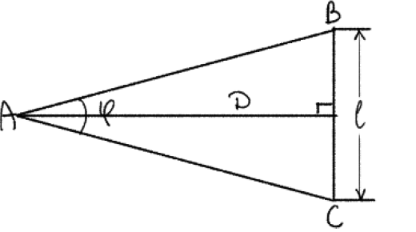
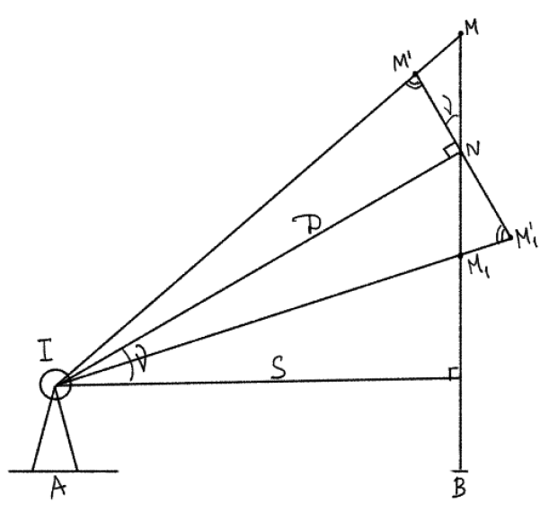
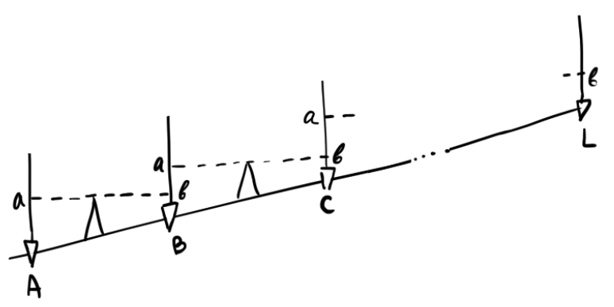
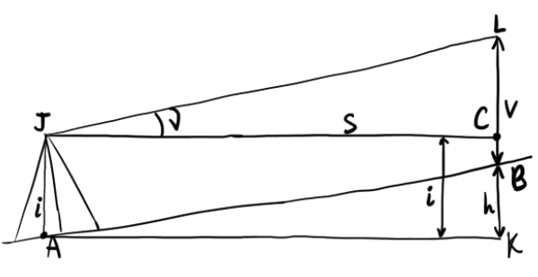
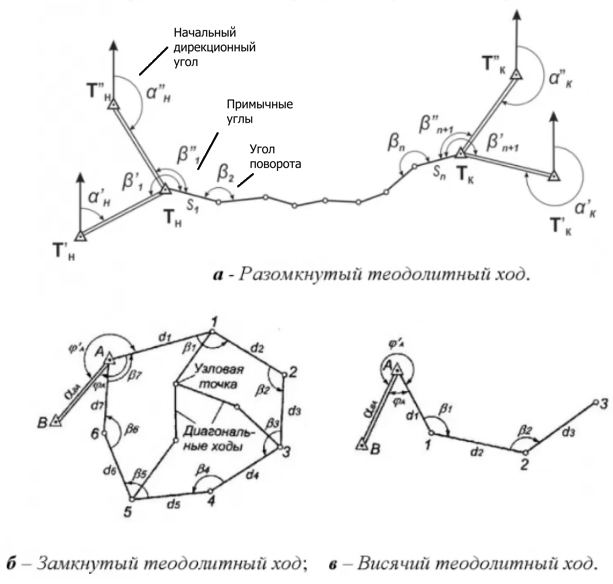
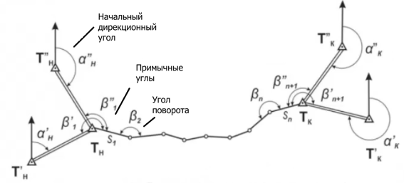
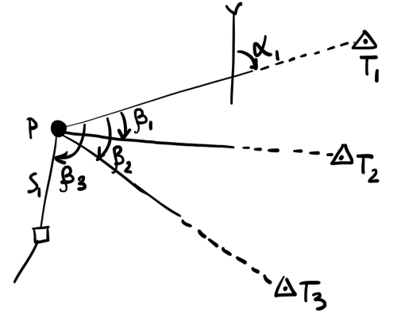
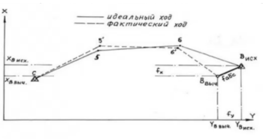

## Геодезические измерения

Основано на лекциях/семинарах Курченко Леонида Алексеевича.

### Предмет и задачи геодезии.

**Геодезия** (с гр. "землеразделение") — это наука, изучающая форму, размеры и гравитационное поле Земли, а также правильное изображение её на плоскости в виде карт и планов при помощи специальных геодезических измерений. В настоящее время геодезия рассматривает методы и способы измерения горизонтальных и вертикальных углов, расстояний и внешнего гравитационного поля Земли при помощи новых электронных приборов. Искусство измерять землю и графически изображать отдельные фрагменты её возникли в Египте приблизительно 3000 лет до н.э. В России геодезия получила наибольшее развитие при Петре I. Так, в 1715 году была открыта морская академия с классом геодезии. А в 1745 г. был издан первый атлас России. В Москве по указу Екатерины II в 1799 году была открыта Константиновская землемерная школа. В 1819 переименованная в Константиновское училище. В 1835 году преобразованная в Константиновский межевой институт. После революции в 1936 г. был переименован в МИИГАиК. В 1993 г. – в МУГК.

Основная задача геодезии — это определение плановых координат и высот точек местности на земле, которые и являются основой для создания топографических карт и решения различных инженерно-технических задач.

### Понятие о форме и размерах Земли.

Знания фигуры и размеров Земли необходимы для определения положения объектов на земной поверхности и правильного её изображения в виде карт, планов и цифровых моделей местности. Физическая поверхность Земли состоит из разных форм рельефа. Описать такую фигуру очень сложно. Поэтому предлагается использовать такую геометрическую фигуру, которая соответствует фигуре Земли, и которую можно использовать для различных вычислений. Следовательно, определение формы Земли разделено на две части: определение правильной фигуры, которая соответствует форме Земли, и определение уклонений физической поверхности Земли от заданной модели.

Направление силы тяжести называется *отвесной линией* или *нормалью*. В природе нормаль можно наблюдать при помощи отвеса.

Поверхность Земли на 71% покрыта водой и только 28% занимает суша. Поверхность открытых морей и океанов, находящихся в спокойном состоянии, характерна тем, что она в любой своей точке перпендикулярна к отвесной линии. Следовательно, такую поверхность назвали уровнем.

**Уровенная поверхность** — это поверхность открытых морей и океанов в спокойном состоянии, мысленно продолженная под материками. Такую фигуру в 1871 г. немецкий учёный Иоганн Листинг назвал геоидом (с гр. "землеподобный").

**Геоид** — это геометрическое тело, образованное уровенной поверхностью. Это очень сложная математическая фигура, применяющаяся для некоторых задач. Похож на эллипсоид вращения.

По спутниковым измерениям отклонение уровенной поверхности Земли от геоида составляет 0.1 до 0.3 м. А на суше 2-3 м. Для решения геодезических задач для данной страны или ряда стран применяется референц-эллипсоид, поверхность которого совпадает с поверхностью страны или ряда стран.

**Референц эллипсоид** – это земной эллипсоид с определёнными размерами и положением в теле Земли. С 1946 г. в России используется референц-эллипсоид Красовского, у которого большая полуось равна 6 378 245 м. Сжатие Земли $\alpha=\frac{(a-b)}{b}$ часто используется сфера. Объём сферы соответствует объёму эллипсоида. Радиус вычисляется по формуле $\sqrt[3]{a^2\cdot b}$. Для сферы Красовского радиус составляет 6 371 110 м. В настоящее время используется трёхосный эллипсоид.

### Влияние кривизны Земли на горизонтальные расстояния.

Пусть $\Delta S$ - искажение при замене дуги сферы отрезком касательной, $S$ - длина дуги, $t$ - длина отрезка касательной, $\alpha$ - центральный угол.
$$\Delta S=t-S=R\tan\alpha-R\alpha\approx R(\alpha+\frac{\alpha^3}{3})-R\alpha=R\frac{\alpha^3}{3}$$
Относительная ошибка составит:
$$\frac{\Delta S}{S}=\frac{R\frac{\alpha^3}{3}}{R\alpha}=\frac{\alpha^2}{3}=\frac{1}{3}\left(\frac{S}{R}\right)^2$$
Приняв радиус Земли за постоянную ( 6 371 км), получим, что при расстояниях $R<11$ км относительная ошибка составит менее 1см на 1км. 

### Влияние кривизны Земли на вертикальные расстояния.

Обозначим разность между $OB'$ и $OB$ как $h$. Из прямоугольного треугольника $OAB'$ определим $h$:
$$(R+h)^2=R^2+t^2$$
$$R^2+2Rh+h^2=R^2+t^2$$
$$t^2=h(2R+h)$$
$$h=\frac{t^2}{2R+h}$$
Так как $2R\gg h$ даже на Эвересте, то:
$$h\approx\frac{t^2}{2R}$$
Приняв радиус Земли $R=6 371$ км, получим, что ошибку в 1см мы получим при расстояниях, меньших чем 350 м.

### Принцип измерения расстояний оптическими дальномерами. Нитяной дальномер.

В основу определения расстояния оптическим дальномером положено решение равнобедренного треугольника:

$$D=\frac{l}{2}\cot\frac{\varphi}{2}$$
В конструкциях дальномеров предусмотрено, что одна из величин $\varphi$ или $l$ является постоянной, а вторая – переменной. В зависимости от этого дальномеры делятся на два типа:
1. Дальномеры с постоянным углом. При работе с ними измеряют переменную величину $l$, которая называется дальномерным отсчётом. Угол $\varphi$ является постоянной величиной. Обозначим постоянную величину $\frac{1}{2}\cot\frac{\varphi}{2}$ через $C$. Величина $C$ называется коэффициентом дальномера. Тогда формула примет вид $$D=Cl$$
2. Дальномеры с постоянным базисом. При работе с ними измеряют переменный угол $\beta$, который называется параллактическим углом, а постоянная величина $l$ – базисом дальномера, конечные точки на рейке отмечены марками. $$D=\frac{l}{2\tan\frac{\beta}{2}}$$Параллактический угол очень мал, поэтому можно принять $\tan\frac{\beta}{2}=\frac{\beta}{2\cdot\rho}$.$$D=\frac{l}{\beta}\cdot\rho$$
Нитяной дальномер относится к простейшим оптическим дальномерам с постоянным параллактическим углом и переменной базой при определяемой точке. Он представляет собой зрительную трубу, на сетке нитей которой дополнительно нанесены дальномерные штрихи, симметрично расположенные относительно визирной оси.

Теория нитяного дальномера определяется типом зрительной трубы, в которой он применён:
- В зрительной трубе с наружным фокусированием: $$D=C\cdot l_0+c$$где $c=f_\text{об}+\delta$ - это постоянная сумма фокусного расстояния объектива и расстояния от объектива до оси вращения прибора; $C$ - коэффициент нитяного дальномера; $l_0$ - дальномерный отсчёт по вертикальной рейке.
- В зрительных трубах с внутренним фокусированием, чтобы уменьшить длину, вместо обычного объектива устанавливают телеобъектив:$$D=C\cdot l_0+P$$где $C$ -коэффициент нитяного дальномера; $P$ - поправка в нитяной дальномер. Поправку $P$ измеряют.

Точность измерения расстояния зрительным дальномером составляет $\frac{1}{200}-\frac{1}{400}$. Повысить  точность измерения линии невозможно из-за толщины штриха дальномера (0.1 мм). Поэтому максимальное расстояние измерения линии зрительным дальномером составляет 200 м.

Точность измерения линий светодальномером обычно находится в пределах $\frac{1}{1000}-\frac{1}{3000}$.

### Приведение к горизонту наклонных расстояний, измеренных нитяным дальномером с вертикальной рейкой.

Установим в точке $A$ теодолит, а в точке $B$ установим вертикальную дальномерную рейку.

Для определения расстояния $D$ предположим, что у нас имеется рейка $M'M_1'$, которая перпендикулярна визирной оси. В этом случае образуются два треугольника $\Delta M'MN$ и $\Delta NM_1M_1'$. Угол между нитями дальномера мал, и поэтому углы при точках $M'$ и $M_1'$ принимаются за $90^\circ$.
$$M'N=MN\cos\nu;\quad M_1'N=M_1N\cos\nu$$
Из рисунка видно:
$$M'M_1'=M'N+M_1'N$$
Совместив полученные формулы, получим:
$$M'M_1=MN\cos\nu+M_1'N\cos\nu=(MN+M_1'N)\cos\nu=MM_1\cos\nu$$
Обозначим $M'M_1'=l_0$, $MM_1=l$:
$$l_0=l\cos\nu$$
Пусть теория нитяного дальномера описывается формулой $D=C\cdot l_o+c$. С учётом выведенного отношения, получим
$$D=C\cdot l\cdot\cos\nu+c$$
Горизонтальное проложение находится из прямоугольного треугольника:
$$S=D\cos\nu=(C\cdot l\cdot\cos\nu+c)\cdot\cos\nu=C\cdot l\cdot\cos^2\nu+c\cos\nu$$
Примем $c\cos\nu=c'\cos^2\nu$
$$S=(Cl+c')\cos^2\nu=D\cos^2\nu$$

### Способы измерения превышения. Виды геометрического нивелирования. Последовательное нивелирование.

#### Способы измерения превышения

Для изображения топографической карты или плана необходимо знать отметки точек местности. Для определения высоты точек местности выполняется нивелирование. Следовательно, нивелирование — это геодезическое измерение, в результате которого определяется разность высот двух или нескольких точек местности с учётом заданной уровенной поверхности. Существуют следующие виды нивелирования:
1. *Геометрическое нивелирование* – высота определяется горизонтальным лучом при помощи нивелира и реек.
2. *Тригонометрическое нивелирование* – высота определяется при помощи наклонного луча. Теодолитом определяется угол наклона и расстояние. И по формуле высчитывается превышение.
3. *Барометрическое нивелирование* – высота определяется по разности атмосферного давления. В основном используется при мелкомасштабной съёмке малообжитых районов. Не требует видимости. Точность 0.5-2.0 м;
4. *Гидростатическое нивелирование* – высота определяется при помощи сообщающихся сосудов. Точность соответствует точности геометрического нивелирования.
5. *Датчики на подвижном составе*. Применяется при работе на линейных сооружениях (дороги). При движении датчики фиксируют профиль данного участка;
6. *Лазерное сканирование с воздушного транспорта*. Высота полёта составляет 200-3000 м. Точность составляет 5-15 см.
7. *Спутниковое нивелирование* – точность зависит от приёмника и режима измерения. Высота определяется со среднеквадратической ошибкой 5 см, а в плане - 2 см.

#### Виды геометрического нивелирования
Геометрическое нивелирование выполняется двумя способами. Первый из них - нивелирование вперёд.

$$h=i-b$$
Второй способ - нивелирование из середины.

$$h=a-b$$
В некоторых случаях при измерении превышения из середины возникает проблема определения превышения промежуточной точки $C$ или $D$.

$$h=a-b$$
$$H_B=H_A+h$$
$$\text{Горизонт инструмента (ГИ)}=H_A+a=H_B+b$$
$$H_C=\text{ГИ}-c$$
$$H_D=\text{ГИ}-d$$

#### Последовательное нивелирование
В тех случаях, когда необходимо произвести нивелирование на значительном расстоянии, выполняют нивелирование нескольких сeкций, связанных между собою общими точками. Такое нивелирование называется последовательным или сложным.

$$h_L=\sum h_i$$
Если известна высота точки $A$, то можно вычислить высоты всех точек $A,B,C,\dots,L$. Если известны высоты точек $A$ и $L$, то вычисляют невязку $f_h$ в превышениях.
$$f_h=\sum h_i-(H_\text{к}-H_\text{н})$$
При нивелировании IV класса допустимая невязка составляет 20 мм на километр хода.

### Влияние кривизны Земли и вертикальной рефракции на результаты нивелирования.

При наблюдениях визирный луч, проходя через разные по плотности слои воздуха, искривляется, и представляет собой не прямую линию, а кривую.

Следовательно, определим поправку $f$ за кривизну Земли и вертикальную рефракцию.
$$f=\frac{S^2}{2R}(1-k)$$
где $R=6371\text{км}$ - радиус земного шара, $k$ - коэффициент рефракционной кривой. Для видимых лучей $k=0.14-0.16$.
$$f\approx0,42\frac{S^2}{R}$$
Определим, когда можно исключить поправку за Кривизну Земли и рефракцию. Для нивелирования IV класса $S_{max}=100\text{м}$. Тогда $f_h=0.1^2/6371\cdot0,42\approx0,7\text{мм}$. Учитывая, что отсчёты берутся с точностью до миллиметров, то данной поправкой можно пренебречь.

При нивелировании вперёд, если расстояние больше 100 м, то необходимо учитывать поправку за кривизну Земли и рефракцию, так как, например, при S = 200 м, поправка составит 2.6 мм.

### Понятие о государственной нивелирной сети РФ. Нивелирные знаки.

Государственная нивелирная сеть создаётся геометрическим нивелированием. В зависимости от точности и способов измерения государственная нивелирная сеть подразделяется на I, II, III, IV классы и техническое нивелирование.

Нивелирная сеть I, II, III, IV классов создаётся для топографических съёмок различных масштабов. Нивелирные сети I и II классов являются исходными и создают сеть в единой балтийской системе высот, а также используются для решения научных задач. Нивелирные сети III и IV классов создаются в основном для топографических съёмок. Техническое нивелирование в основном
применяется для решения инженерно-технических задач на стройках.

Предельная невязка для нивелирных сетей
- I класса: $3\text{мм}\sqrt{L}$;
- II класса: $5\text{мм}\sqrt{L}$;
- III класса: $10\text{мм}\sqrt{L}$;
- IV класса: $20\text{мм}\sqrt{L}$;
- Техническое нивелирование: $50\text{мм}\sqrt{L}$.

Нивелирные сети I-IV классов закрепляются постоянными или временными реперами. Репер относится к нивелирной сети, а центр – к плановой. К постоянным реперам относятся: грунтовый репер, который закладывается через 5 км в обжитых районах и через 7 – в малообжитых; скальные и стенные марки. К временным реперам относятся: деревянные колья, в которые забит гвоздь с полусферической головкой; обрезки труб длиной 40-50 см; дюбеля.

### Государственные и специальные геодезические сети.

Для составления карт и планов, решения геодезических задач, на поверхности Земли располагают ряд точек, связанных между собой единой системой координат. Эти точки маркируют на поверхности Земли центрами (знаками). Для того, чтобы с одного знака был виден другой (смежный), над подземными центрами устанавливают наружные знаки в виде пирамид и сигналов.

Геодезические сети по назначению и точности построения подразделяются на три большие группы:
- **Государственные геодезические сети** служат исходными для построения всех других видов сетей. Началом единого отсчёта плановых координат в РФ служит центр круглого зала Пулковской обсерватории в Санкт-Петербурге. Государственная геодезическая сеть подразделяется по точности с постепенным понижением на сети I, II, III и IV классов.
- **Сети сгущения** строят для дальнейшего увеличения плотности (числа пунктов, приходящихся на единицу площади) государственных сетей. Плановые сети сгущения подразделяют по точности на 1-й и 2-й разряды.
- **Съёмочные сети** — это тоже сети сгущения, но с ещё большей плотностью. С точек съёмочных сетей производят непосредственную съёмку предметов местности и рельефа для составления карт и планов различных масштабов. Они создаются теодолитными, тахеометрическими ходами, различными засечками. Создание такой сети включает полевые и камеральные работы.

### Точность тригонометрического нивелирования.

#### Формула тригонометрического нивелирования.

Тригонометрическое нивелирование называют также геодезическим или нивелированием наклонным лучом. Оно выполняется теодолитом. Для определения превышения нужно измерить угол наклона ν и наклонное расстояние $S$.

Рассмотрим частный случай, когда уровенная поверхность принимается за плоскость ($S\leq 250\text{м}$). В точке $A$ устанавливают теодолит, в точке $B$ – рейку или веху известной высоты $V$ (высота визирования).

$$h=S\tan\nu+i-V$$
Если линии измеряют нитяным дальномером, то
$$h=D\cos^2\nu\cdot\tan\nu+i-V=D\sin\nu\cos\nu+i-V=\frac{1}{2}D\sin(2\nu)+i-V$$
Если линии измеряют светодальномером, то
$$h=D\sin\nu+i-V$$
Если $S>300\text{м}$, то к превышению добавляют поправку $f$ за совместное влияние кривизны Земли и вертикальной рефракции:
$$h=S\tan\nu+i-V+f$$

#### СКП превышения $m_h$

Пусть превышение определяется формулой
$$h=S\tan\nu+i-V$$
Из неё следует, что погрешность превышения является функцией погрешностей измерения расстояния $S$, угла наклона $\nu$, высоты инструмента $i$ и высоты визирования $V$. Если расстояние больше 300 м, то учитывается поправка $f$ за кривизну Земли и рефракцию.

Величины $i$, $V$ , $f$ определяются достаточно точно. Если высота прибора измеряется рулеткой, то $m_i=0.01$ м, $m_V=0.01$ м, а угол наклона техническим теодолитом, то $m_\nu=0.5'$. В виду малости погрешностей измерения величин $i$, $V$ , $f$, их влиянием на погрешность превышения можно пренебречь. Установим зависимость погрешностей величин $S$, $\nu$ и их функции $h$.
$$h=S\tan\nu$$
Применим формулу прямой задачи оценки точности:
$$m_h^2=\left(\frac{\partial h}{\partial S}\right)^2m_S^2+\left(\frac{\partial h}{\partial\tan\nu}\right)^2m_{\tan\nu}^2=\tan^2\nu\cdot m_S^2+S^2\cdot m_{\tan\nu}^2$$
При малых углах наклона $\tan\nu=\nu$, то есть $m_{\tan^2\nu}^2=m_\nu^2/\rho^2$.
$$m_h^2=\tan^2\nu\cdot m_S^2+S^2\cdot \frac{m_\nu^2}{\rho^2}$$
Разделим обе части на $S^2$:
$$\frac{m_h^2}{S^2}=\frac{m_\nu^2}{\rho^2}+\tan^2\nu\frac{m_S^2}{S^2}$$
При $\nu<1,5^\circ$:
$$\frac{m_h^2}{S^2}=\frac{m_\nu^2}{\rho^2}$$
$$m_h=S\frac{m_\nu}{\rho}$$
Если $m_\nu=0.5'$, то $m_h\approx1.45\text{см}\frac{S_\text{м}}{100}$. Следовательно, при тригонометрическом нивелировании погрешность превышения $m_h$ пропорциональна расстоянию между нивелируемыми точками. Поэтому для повышения точности по возможности уменьшать расстояния между нивелируемыми точками путём деления на части и последовательного определения превышений между соседними точками.

#### Допустимое расхождение между превышениями двух точек, измеренными в прямом и обратном направлениях

В идеале прямые и обратные превышения $h_{пр}$ и $h_{обр}$ должны быть равны по абсолютной величине и различны по знаку. Однако вследствие влияния ошибок
измерений, абсолютные величины этих значений обычно различаются $h_{пр}+h_{обр}=d\neq0$. Определим СКП и предельную ошибку разности между прямыми и обратными превышениями.
$$h_{пр}+h_{обр}=d$$
$$m_d^2=m_{h_{пр}}^2+m_{h_{обр}}^2=2m_h^2$$
$$m_d=\sqrt{2}\cdot m_h$$
Пусть предельная ошибка $\Delta_{пр}=2m_d$. Тогда
$$\Delta_{пр}=2\sqrt{2}\cdot m_h=2\sqrt{2}\cdot 1.45\text{см}\cdot\frac{S_м}{100}\approx4\text{см}\frac{S_м}{100}$$
Следовательно, расхождение между прямым и обратным превышениями допустимо в пределах 4 см на каждые 100 м расстояния между нивелируемыми точками.

#### Предельная ошибка суммы средних превышений высотного хода

Сначала определим ошибку одного среднего превышения:
$$h_{ср}=\frac{h_{пр}+h_{обр}}{2}\Rightarrow m_{h_{ср}}^2=\frac{m_{h_{ср}}^2+m_{h_{ср}}^2}{4}=\frac{m_h^2}{2}$$
Определим предельную ошибку, которая может накопиться в сумме n средних превышений $h_{ход}=h_{1,ср}+h_{2,ср}+\ldots+h_{n,ср}$. Учитывая, что превышения получены с одинаковыми ошибками (измерения равноточны), то можно записать:
$$m_{ход}^2=nm_{h_{ср}}^2$$
$$m_{ход}=\sqrt{n}\cdot m_{h_{ср}}=m_h\sqrt{\frac{n}{2}}=1.45\text{см}\frac{S_{ср}}{100}\sqrt{\frac{n}{2}}$$
Допустим, что расстояния между точками высотного хода приблизительно равны между собой, т.е. $S_{ср}=\sum S/n$.
$$m_{ход}=1.45\text{см}\frac{\sum S}{n}\sqrt{\frac{n}{2}}\approx\frac{0.01\sum S}{\sqrt{n}}$$
В данной формуле учтены лишь ошибки измерения вертикальных углов. С учётом всех ошибок в ходе предельная невязка в ходе примет вид
$$\Delta_{\sum h}=4m_{ход}=\frac{0.04\sum S}{\sqrt{n}}$$
где $n$ - число сторон  в ходе; $\Delta_{\sum h}$ - предельная невязка в сантиметрах, $\sum S$ - длина хода в метрах.

### Теодолитный и тахеометрический ходы. Привязка ходов к пунктам ГГС.

При решении топографо-геодезических задач на равнинных и застроенных территориях съёмочные сети создают прокладкой теодолитных ходов. На местности создаётся съёмочная сеть при помощи теодолитных или тахеометрических ходов.

**Теодолитный ход** — построенный на местности разомкнутый или сомкнутый многоугольник, в котором измерены все стороны и горизонтальные углы между сторонами. Точки поворота называются вершинами хода, отрезки между ними – сторонами. Теодолитный ход служит плановой основой для производства теодолитной съёмки.

По результатам измерения сторон и горизонтальных углов хода вычисляются прямоугольные координаты пунктов хода (прямая и обратная задачи). Следовательно, проложением теодолитного хода на местности создаётся система точек с известными координатами XY.

**Тахеометрический ход** — построенный на местности разомкнутый или сомкнутый многоугольник, в котором измерены все стороны и горизонтальные углы между сторонами хода, а также вертикальные углы с каждой точки хода на предыдущую и последующую точки хода. Тахеометрический ход служит планово-высотной основой для производства тахеометрической съёмки.

По результатам измерения сторон и горизонтальных углов хода вычисляются прямоугольные координаты пунктов хода, а также их превышения и высоты. Следовательно, проложением тахеометрического хода на местности создаётся система точек с известными координатами XYH.

Ход, проложенный внутри сомкнутого теодолитного или тахеометрического хода называется диагональным. Точка, в которой сходятся три и более ходов, называется узловой.

Измеряться могут левые или правые горизонтальные углы теодолитного или тахеометрического хода. В замкнутых ходах точки нумеруют по ходу часовой стрелки и измеряют правые углы, а в разомкнутых – чаще левые. Для передачи дирекционного угла на стороны теодолитного хода на начальном и конечном пунктах измеряют примычные углы.

Разомкнутый ход прокладывается по возможности вытянутой формы, т.е. с углами поворота, близкими к $180^\circ$. Стороны теодолитного или тахеометрического хода желательно делать примерно равной длины.

Координаты пунктов теодолитных и тахеометрических ходов, ровно как и высоты пунктов тахеометрических ходов, должны вычисляться в общегосударственной системе координат и высот. С этой целью теодолитный и тахеометрический ходы привязываются к пунктам государственной геодезической сети. Существует несколько способов привязки хода. Самым простым является способ непосредственного примыкания к пунктам опорной сети. Для привязки разомкнутого теодолитного хода начальная Tн и конечная Tк точки хода должны являться пунктами государственной геодезической сети с известными координатами X и Y.

Иногда теодолитный или тахеометрический ход начинается или заканчивается вдали от опорных пунктов государственной геодезической сети. Тогда привязка теодолитного или тахеометрического хода осуществляется при помощи обратной засечки. При обратной угловой геодезической засечке из определяемой точки делается замер двух углов между тремя известными ориентирами, затем вычисление искомых координат осуществляется используя тригонометрические соотношения между измеренными углами и известными расстояниями.

Геодезической основой для теодолитных и тахеометрических ходов служат пункты государственной геодезической сети всех четырёх классов. Однако густота ГГС недостаточна для сплошной съёмки, поэтому её необходимо сгущать. При теодолитной съёмке дополнительную сеть пунктов нужной густоты (съёмочную сеть) создают путём прокладывания теодолитных ходов, при тахеометрической съёмке эту сеть создают тахеометрическими ходами.

### Увязка горизонтальных углов и вычисление углов разомкнутого тахеометрического хода.

Зная начальный дирекционный угол $\alpha_н$, определяют дирекционные углы всех $n$ сторон хода. При измерении левых углов будем иметь:
$$\begin{cases}\alpha_1=\alpha_н+\beta_1\pm180^\circ\\\ \alpha_2=\alpha_1+\beta_2\pm180^\circ\\\ \ldots\\\ \alpha_к=\alpha_n+\beta_{n+1}\pm180^\circ\end{cases}$$
При сложении левых и правых частей получим:
$$\alpha_к=\alpha_н+\sum\beta_{теор}+180^\circ(n+1)$$
$$\sum\beta_{теор}=\alpha_к-\alpha_н+180^\circ(n+1)$$
Если ход сомкнутый, то теоретическая сумма углов хода составит
$$\sum \beta_{теор}=180^\circ(n_0-2)$$
где $n_0$ - число внутренних углов многоугольника.

Угловая невязка вычисляется по формуле
$$f_\beta=\sum\beta_{изм}-\sum\beta_{теор}$$
Полученную невязку угловых измерений $f_\beta$ хода считают допустимой, если она не превышает предельно допустимую $f_{\beta,пред}$, определяемую по формуле
$$f_{\beta,пред}=2t\sqrt{n+1}$$
$t$ - точность отсчёта по горизонтальному кругу, $n$ - число сторон. Для теодолита Т30 допустимая невязка равна $1'\sqrt{n+1}$.

Если $f_\beta\leq f_{\beta,пред}$, то угловую невязку распределяют с обратным знаком поровну во все измеренные углы. Если невязка не делится без остатка на число углов n + 1, то несколько большие поправки вносят в углы с короткими сторонами.

При измерении правых углов вывод невязки будет следующим:
$$\alpha_{i+1}=\alpha_i-\gamma_i\pm180^\circ$$
$$\sum\gamma_{теор}=\alpha_н-\alpha_к+180^\circ(n+1)$$
$$f_\beta=\sum\gamma_{изм}-\sum\gamma_{теор}$$
### Вычисление прямоугольных координат пунктов тахеометрического хода.

Каждый разомкнутый тахеометрический ход привязывается в его начальной и конечной точках к сторонам геодезического обоснования (пунктам A, B, C, D). Разомкнутый ход $A_{н}-1-2-n-B_{к}$ привязан в точках $A_{н}$ и $B_{к}$ к исходным сторонам $CA$ и $BD$, $\alpha_1$ — дирекционный угол начальной стороны CA, $\alpha_2$ — дирекционный угол конечной стороны BD. В ходе съёмки измерены примычные левые углы.

По вычисленным дирекционным углам $\alpha_{i,выч}$ и горизонтальным проложениям сторон $S_i$ тахеометрического хода вычисляют приращение координат $\Delta x$ и $\Delta y$ по формулам:
$$\Delta x_i=S_i\cos\alpha_i;\quad\Delta y_i=S_i\sin\alpha_i$$
По формулам прямой геодезической задачи последовательно вычисляют координаты пунктов хода.
$$\begin{cases}x_2=x_н+\Delta x_1\\\ x_3=x_н+\Delta x_1+\Delta x_2\\\ \ldots\\\ x_к=x_н+\Delta x_1+\Delta x_2+\ldots+\Delta x_n\end{cases}$$
Откуда
$$x_к-x_н=\Delta x_1+\Delta x_2+\ldots+\Delta x_n=\sum\Delta x_{i,выч}$$
Теоретическая же сумма в разомкнутом ходе равна
$$\sum\Delta x_{i,теор}=x_к-x_н$$
Вследствие неизбежных ошибок в измерении углов и длин сторон хода практические суммы приращения координат не будут равны теоретическим, что приведёт к образованию невязок.
$$f_x=\sum x_{i,выч} - (x_к-x_н)$$
То же самое справедливо для координат $Y$:
$$f_y=\sum y_{i,выч}-(y_к-y_н)$$
В сомкнутом ходе:
$$\sum \Delta x_{i,теор}=0$$
$$f_x=\sum\Delta x_{i,выч};\quad f_y=\sum\Delta y_{i,выч}$$

Невязки в суммах приращений координат отражают влияние ошибок измерений при проложении хода, приводящее к тому, что конечный пункт разомкнутого хода не совпадает с конечным твёрдым пунктом.

На рисунке показано несмыкание полигона $f_s$. Это расстояние
называется невязкой в периметре.
$$f_s=\sqrt{f_x^2+f_y^2}$$
Для оценки качества проложенного хода обычно пользуются относительной невязкой, представляющей собой отношение невязки в периметре ко всему периметру хода
$$\frac{1}{N}=\frac{f_S}{\sum S}$$
Если стороны измерены нитяным дальномером, то относительная невязка не должна быть больше 1/700 (на практике – не больше 1/500). Если стороны измерены светодальномером, то предельная относительная невязка составляет 1/1000.

Длина нелинейной невязки $f_S$ не должна быть больше 0.4 мм на плане. Следовательно, можно вычислить максимальную длину хода при данном масштабе и точности:
$$\left(\sum S\right)_{max}=4\cdot10^{-4}\cdot M\cdot N$$

При допустимости относительной невязки производят распределение невязок $f_x$ и $f_y$ в суммах приращений координат – увязывают приращения координат. Простейший способ невязки состоит в том, что распределяют невязку по осям $f_x$ и $f_y$ на все приращения координат пропорционально длинам сторон хода и с обратным знаком.

C исправленными приращениями координат по координатам начального пункта и исправленным приращениям координат последовательно вычисляют координаты всех пунктов хода:
$$X_n=X_{n-1}+\Delta x_{n-1};\quad Y_n=Y_{n-1}+\Delta y_{n-1}$$
