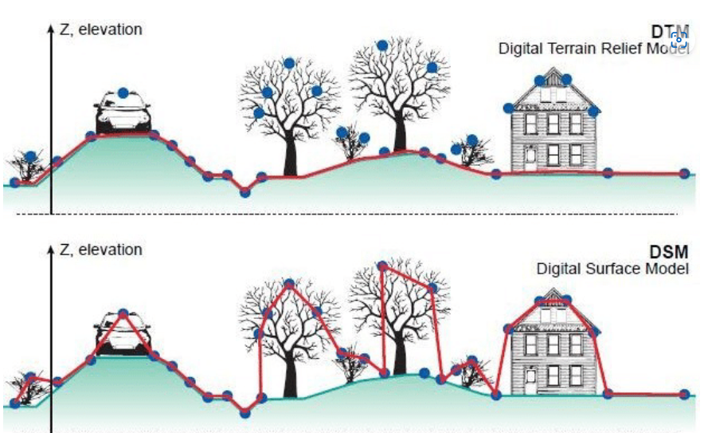
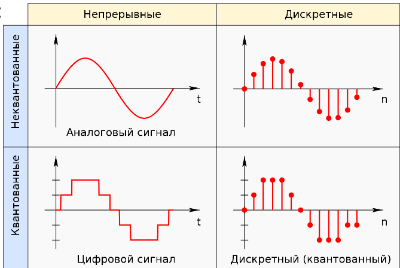
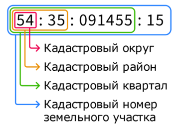

## Аэрокосмические съёмки.

Основано на лекциях Дрыги Данилы Олеговича, Мочалова Александра Валерьевича.

### ДЗЗ, АКС, АФС. Результаты аэрофотосъёмки.

#### ДЗЗ, АКС, АФС

Дистанционное зондирование - совокупность методов получения информации по результатам измерений без прямого контакта с объектом.

Дистанционное зондирование Земли (ДЗЗ) — наблюдение поверхности Земли *наземными*, авиационными и космическими средствами, оснащёнными различными видами съёмочной аппаратуры. *Включать ли наземные средства в определение ДЗЗ - вопрос дискуссионный.*

Аэрокосмическая съемка (АКС) — совокупность методов исследований атмосферы, земной поверхности, океанов, верхнего слоя земной коры с воздушных и космических носителей путем дистанционной регистрации и последующего анализа идущего от Земли электромагнитного излучения.

Аэрофотосъёмка (АФС) — фотографирование территории с определённой высоты от поверхности Земли при помощи аэрофотоаппарата, установленного на атмосферном летательном аппарате с целью получения, изучения и представления объективных пространственных данных на участках произведенной съемки. *Объективный - трудно подделать.*

Топографическая аэрофотосъёмка - это специализированный технологический процесс фотографирования земной поверхности с целью получения аэрофотоснимков с целью получения аэрофотоснимков, используемых для создания топографических карт и планов. Такие снимки должны отвечать геометрическому подобию изображения земной поверхности и геометрической точности.

#### Результаты съёмки

Материалы фотосъёмки:
- Снимки, облака точек;
- Ортофотопланы, ЦММ, ЦМР, 3D модели;
- Карты, планы, чертежи.

Топографический план — это вид крупномасштабного чертежа, изображающий на плоскости в условных знаках какой-либо участок земной поверхности. Топографический план строится без учета кривизны уровневой поверхности.

Ортофотоплан ― это фотографический план местности на точной геодезической основе, полученный путем аэрофотосъемки или космической съемки с последующим преобразованием снимков из центральной проекции в ортогональную с помощью метода ортотрансформирования.

Топографический план - это вид крупномасштабного чертежа, изображающий на плоскости в условных знаках какой-либо участок земной поверхности. Топографический план строится без учёта кривизны уровневой поверхности.

ЦММ ― математическое представление участка местности, которое получается в результате обработки материалов воздушной или космической съемки. Она состоит из цифровой модели рельефа местности и цифровой модели контуров (ситуации) местности, включая растительность.

ЦМР ― представляет собой математическое представление участка местности, которое получается в результате обработки материалов воздушной или космической съемки. Она состоит из цифровой модели рельефа местности (зачастую после фильтрации контуров (ситуации) местности, включая растительность).

Преобразование ЦММ в ЦМР затруднительно. Можно использовать лазерное сканирование или трассировку горизонталей.

*Геодезические методы точнее определяют координаты отдельных точек, а методы АКС точнее и нагляднее могут показать площади и объёмы.*

### Фотоаппарат и его составляющие. Треугольник экспозиции.

#### Матрица, кроп-фактор, ISO, EI

Классификация фотоаппаратов по типу приёмника излучения: плёночный, пластиночный, матричный, линейка ПЗС (прибор с зарядовой связью)

Классификация фотоаппаратов по размеру сенсора: среднеформатные (>36x24 mm), полнокадровые (36x24 mm), APS-H, APS-C (23x16 mm), 4/3", 1" (13x9 mm), 2/3", 1/2.5" и т.д.

**Кроп-фактор** — это условный коэффициент, отражающий изменение поля зрения объектива при его использовании с кадровым окном уменьшенного размера (отношение диагонали стандартного кадра к диагонали используемого 24×36 мм ≈ 43,3 мм).
$$КРОП=\frac{d_{35}}{d_{\phi}}$$

Малоформатная фотография — фотография, основанная на использовании кадра размером 24×36 мм на 35-мм фотоплёнке с двухсторонней перфорацией.

**Матрица (ПИ)** — прибор, преобразующий световой поток в электрический сигнал. Матрица поглощает фотоны, преобразует их в заряд, накапливает его, преобразует в напряжение, передаёт его. 

Светочувствительность цифровой фотокамеры ISO — способность определённым образом реагировать на световое излучение. Единицы ISO, использующиеся для обозначения светочувствительности в настоящее время, являются международными, и стандартизированы одноимённой организацией.

Экспозиционный индекс EI (Exposure Index, эквивалентная светочувствительность ISO) — зависимость между значениями сигналов матрицы и соответствующими параметрами цветового пространства.  Большинство цифровых фотоаппаратов имеет несколько значений EI, между которыми можно переключаться. Значения EI выбираются таким образом, чтобы получаемое цифровое изображение было сопоставимо с получаемым на плёнке такой же чувствительности ISO, с теми же экспозиционными параметрами.

#### Объектив и его составляющие, эквивалентное фокусное расстояние, угол поля зрения, угловое поле, абберации.

**Объектив** — это оптическое устройство, служащее для построения изображения в плоскости пространства изображений по закону центральной проекции (действительное изображение).

**Фокусировка** — процесс регулирования положения объектива или иной оптической системы, для достижения совпадения плоскости сопряжённого фокуса с плоскостью матрицы.

Объектив состоит из:
1.  Линз/зеркал. Линза — это кусок стекла или другого прозрачного материала со сферическими или плоскими поверхностями. Параметры линзы: радиусы, главные плоскости, узловые и фокальные точки, фокусное расстояние и др.
2.  Диафрагма. Диафрагма — это элемент оптической системы, ограничивающий проходящие через нее световые пучки. Диафрагмирование увеличивает глубину резкости.
3.  Оправы

**Бленда** — трубчатое приспособление, устанавливающееся перед входным окном оптических приборов для защиты от попадания постороннего света.

Байонет объектива — разновидность байонетного соединения (соединение деталей посредством осевого перемещения и поворота одной из них относительно другой), предназначенная для крепления оправы объектива к фотоаппарату.

Главное фокусное расстояние — это расстояние вдоль оптической оси от задней главной точки объектива до задней фокальной плоскости. Может быть постоянным (фиксированным) или переменным;

Эквивалентное фокусное расстояние — это условная характеристика системы из объектива и светочувствительного элемента, дающая информацию об угле обзора этой системы. Она показывает, какое фокусное расстояние имел бы объектив для кадра размером 24×36 мм
$$f_{efl}=f\cdot\frac{d_{35}}{d_\phi}=f\cdot КРОП$$

Кратность вариообъективов — это диапазон между наименьшим и наибольшим фокусным расстоянием. $Zoom=\frac{f_{max}}{f_{min}}$.

Относительное отверстие — это отношение диаметра входного отверстия, ограниченного диафрагмой, к фокусному расстоянию оптической системы. Относительное отверстие бывает геометрическое: $\frac1n=\frac{d_{вх}}{f}$ и эффективное (учитывает потери на поглощение и рассеяние света в стекле).

*ГРИП* — глубина резко изображаемого пространства — расстояние вдоль оптической оси объектива между двумя плоскостями в пространстве предметов, в пределах которого объекты отображаются в сопряжённой фокальной плоскости субъективно резко.
$$P=R_2-R_1$$
$$R_1=\frac{R\cdot f^2}{f^2-Kfz+KRz};\quad R_2=\frac{R\cdot f^2}{f^2+Kfz-KRz}$$
$R_1$ — дистанция до передней границы резко изображаемого пространства; $R$ — дистанция фокусировки; $R_2$ — дистанция до задней границы резко изображаемого пространства; $f$ — заднее главное фокусное расстояние объектива; $K$ — диафрагменное число; $z$ — диаметр кружка нерезкости или допустимый кружок рассеяния.

**Угловое поле объектива в пространстве предметов** — плоский угол между двумя лучами, проходящими через центр входного зрачка объектива к наиболее удалённым от оптической оси точкам объекта в пространстве предметов, отображающимся на противоположных краях кадрового окна. Угловое поле может быть измерено по горизонтали, вертикали и диагонали кадра.

Максимальное угловое поле всегда меньше, чем **угол поля зрения**, который равен плоскому углу между линиями, соединяющими центр входного зрачка объектива с наиболее удалёнными от оптической оси точками, отображаемыми с приемлемой резкостью и допустимым виньетированием.

**Аберрации** — ошибки или погрешности изображения в оптической системе, вызываемая отклонением луча от того направления, по которому он должен был бы идти в идеальной оптической системе. Аберрации бывают хроматические и геометрические.

**Ортоскопический объектив** — объектив или оптическая система, свободные от дисторсии, или такие, в которых дисторсия пренебрежимо мала и не влияет на характер изображения.

#### Затвор, выдержка, классификация затворов. КПД затвора.

**Затвор** — устройство, ограничивающее продолжительность действия света на светочувствительный слой (матрицу).

Выдержка — интервал времени, в течение которого свет экспонирует участок светочувствительного материала или светочувствительной матрицы.

Стандартные ряды выдержки: 2с, 1с, 1/2с, 1/4с, 1/8с, 1/15с, 1/30с, 1/60с, 1/125с, 1/250с и т.д.

Классификация затворов:
- По расположению в камере: фокальные и апертурные, межлинзовые, залинзовые, фронтальные; 
- По принципу действия и способу пропускания света:  
    - Механические центральные: минимум искажений, равномерное распределение освещённости, синхронизация со вспышкой, термоустойчивость, ограниченная максимальная скорость затвора 1/4000с;   
    - Механические шторные (шторно-щелевые/ламельные): ограниченная максимальная скорость затвора 1/8000с, искажения по полю изображения, сложности синхронизации со вспышкой.
    - Электронно-механические: уменьшение вибрации при съёмке, уменьшение износа механизма, искажения и ошибки экспозиции на коротких выдержках (1/2000);
    - Электронный шторный: бесшумный, не изнашивается, искажения по полю изображения, максимальная скорость до 1/32000с;
    - Электронный глобальный: не имеет искажений по полю кадра;
- По принципу действия: механические, электронные, электронно-механические, ЖК.

КПД затвора - отношение количества света, прошедшего за время работы затвора, к количеству света, прошедшего за тот же период через идеальный затвор.

#### Процессор

Процессор: управление фокусировкой объектива, АЦП, формирование файла и сжатие изображения, запись на карту памяти. АЦП:
- Дискретизация — преобразование исходного аналогового сигнала в последовательность дискретных значений, получаемых через заданные временные интервалы. В цифровой фотографии дискретизация характеризуется количеством пикселей на кадр;
- Квантование — замена действительного мгновенного значения сигнала округлённым значением, равным ближайшему фиксированному значению; 
- Кодирование — образование кодовых комбинаций импульсов.

Сигналы: аналоговые, дискретные, цифровые.

#### Треугольник экспозиции, LV, EV

**Экспозиция** — количество излучения, получаемого светочувствительным элементом. Для видимого излучения может быть рассчитана как произведение освещённости на выдержку, в течение которой свет воздействует на светочувствительный элемент (матрицы).

Треугольник экспозиции: диафрагма, выдержка, ISO.

Световое число (LV – Light Value) однозначно характеризует яркость какого-либо объекта или сцены в целом. Световое число указывает на абсолютную, реальную яркость объекта. шкала световых чисел логарифмическая, т.е. каждое световое число обозначает яркость вдвое большую яркости предшествующего числа и вдвое меньшую яркости последующего. Например LV 11 означает яркость в 256 кд/м2, а LV 12 уже 512 кд/м2.

Экспозиционное число (англ. Exposure Value, EV) — условное целое число, однозначно характеризующее экспозицию при фото- и киносъёмке. Одному и тому же экспозиционному числу могут соответствовать различные комбинации выдержки и диафрагмы (экспопары). Шаг логарифмической шкалы экспозиционных чисел, соответствующий двукратному изменению экспозиции, принято называть экспозиционной ступенью.

### Фотограмметрия. Перекрытие, базис. Элементы ориентирования. Высоты.

**Фотограмметрия** — направление, занимающееся определением формы, размеров, положения и иных характеристик объектов по их фотоизображениям. Одним из современных направлений фотограмметрии является создание трёхмерных копий объектов по фотографиям.

Маршрут съёмки - траектория движения носителя (или камеры) спроектированная в целях выполнения фотосъёмки объекта.

Перекрытие снимка - доля площади снимка, перекрываемая смежным снимком. Виды перекрытий:
- Продольное - это перекрытие смежных фотоснимков одного маршрута в направлении полёта летательного аппарата. Обозначается Px;
- Поперечное перекрытие - это перекрытие снимков между соседними маршрутами. Обозначается Py.

Триплет - зона тройного продольного перекрытия. Используется для связи смежных стереопар по общим точкам и передачи от одной из них к другой системе координат и масштаба фотограмметрических построений.

**Базис фотографирования** — расстояние между соседними точками фотографирования. $Bx=Lx\cdot\frac{100-Px}{100}$, $Lx$ - продольный размер снимка на местности.
- Продольный базис - расстояние между главными точками двух соседних аэрофотоснимков одного маршрута.
- Поперечный базис - расстояние между двумя соседними маршрутами. Это не расстояние между главными точками, так как начальные точки маршрутов могут быть смещены.

Элементы внутреннего ориентирования снимка позволяют найти положение центра проекции относительно снимка и восстановить связку лучей, существовавшую в момент фотографирования:
1. фокусное расстояние
2. координаты главной точки. Смещение главной точки это смещение оптической оси. Может происходить даже из-за смещения матрицы. В некоторых камерах матрица демпфированная.
3. при помощи калибровки получают значения калибровки коэффициентов степенного полинома радиальной дисторсии, а также коэффициентов тангенциальной дисторсии (при наличии).

Методы калибровки камеры:
1. Первый метод основан на решении обратной фотограмметрической засечки по снимкам пространственного тест-объекта;
2. Второй метод - калибровка на основе уравнивания блока фототриангуляции, построенного по аэрофотоснимкам испытательного полигона

Элементы взаимного ориентирования позволяют установить снимки в то положение относительно друг друга, которое они занимали при фотографировании объекта.

Элементы взаимного ориентирования характеризуют положение снимка в момент фотографирования в системе координат объекта.
- координаты центра проекции $s$: $x_s$, $y_s$, $z_s$;
- продольный и поперечный углы наклона снимка $a$, $w$ и угол поворота $c$.
- В случае модели добавляется масштабный коэффициент $t$.

Высоты:
- Абсолютная высота полёта над уровенной поверхностью моря. Абсолютная высота измеряется с помощью барометрических высотомеров;
- Относительная высота полёта относительно аэродрома;
- Истинная высота полёта относительно точки, находящейся в данный момент под самолётом. Измеряется с помощью радио;
- Высота фотографирования - высота полёта относительно средней плоскости снимаемого участка.

Разрешение - количественные показатели, характеризующие изобразительное качество снимков, их детальность. Под пространственным разрешением обычно понимают минимальную линейную величину изображающихся на снимке деталей местности. Показателями могут быть GSD, радиометрическое разрешение, смаз, контрасты объектов и т.д.

Сдвиг (смаз) - это смещение оптического изображения при формировании его в плоскости фотограмметрического снимка за время полной выдержки, вызванное поступательным или угловым перемещением съёмочной камеры или объекта фотограмметрической съёмки. Продольный сдвиг изображения не должен ухудшать линейное разрешение изображения более чем на 0.3 пикселя (ГОСТ). $\delta_{доп}=0.3\cdot GSD$

### Беспилотное воздушное судно и его составляющие.

[Согласно ВЗК РФ](http://www.consultant.ru/document/cons_doc_LAW_13744/769b1039af2bbe0206b860c00dc12b379cc91553/), **беспилотное воздушное судно** — воздушное судно, управляемое, контролируемое в полете пилотом, находящимся вне борта такого воздушного судна (внешний пилот).

**Воздушное судно** - летательный аппарат, поддерживаемый в атмосфере за счет взаимодействия с воздухом, отличного от взаимодействия с воздухом, отраженным от поверхности земли или воды.

Основные типы БВС:
1. Самолёт — класс воздушных судов тяжелее воздуха, предназначенных для полётов в атмосфере с помощью силового агрегата, создающего тягу и неподвижного относительно других частей аппарата крыла, создающего подъёмную силу;
2. Мультикоптер или мультиротор (англ. Multirotor, multicopter, многороторный вертолёт) — летательный аппарат, построенный по вертолётной схеме, с тремя и более несущими винтами;
3. Вертолёт — винтокрылый летательный аппарат вертикального взлёта и посадки, у которого подъёмная и движущая силы на всех этапах полёта создаются одним или несколькими несущими винтами с приводом от одного или нескольких двигателей;
4. Конвертоплан — винтокрылый летательный аппарат с поворотными двигателями (как, правило, винтовыми), которые на взлёте и при посадке работают как несущие винты, а в горизонтальном полёте — как тянущие или толкающие; при этом подъёмная сила обеспечивается крылом самолётного типа. Обычно двигатели поворачиваются вместе с винтами, но могут поворачиваться одни лишь винты;

| Тип | Время полёта | Максимальная и минимальная скорости | Конфигурации |
|-|-|-|-|
| Мультироторные системы | 5-60 минут | 0-60 км/ч | 4 винта; 6 винтов; 8 винтов; коаксиальные |
| Вертолётные | 1-4 часа | 0-60 км/ч | 1 винт; 2 винта |
| Самолётные | 30-300 минут | 40-150 км/ч | Фюзеляжный; крыло |
| Конвертоплан | 30-120 минут | 0-100 км/ч | Фюзеляжный; крыло; количество винтов |

Способы взлёта/посадки:
- Вылет: с рук; с катапульты; вертикально.
- Посадка:
	- с парашютом: неконтроллируемо из-за ветра, вероятность повреждения;
	- на брюхо: вероятность повреждения камеры;
	- вертикально.

Типы двигателей:
- Электрический: 40 мин - 4 часа. 50-250 км;
- Бензиновый: 6-10 часов. 600-1000 км. Вибрирует, менее безопасен и сложнее в использовании.

Габариты:
- Мультироторные системы: расстояние между двигателями по диагонали;
- Самолётные: размах крыла и длина фюзеляжа

Взлётная масса:
- Сверхлёгкие (< 250 г);
- Лёгкие (< 3 кг);
- Средние (3-10 кг);
- Тяжёлые (10-30 кг).

Беспилотная авиационная система — комплекс взаимосвязанных элементов, включающий в себя одно или несколько беспилотных воздушных судов, средства обеспечения взлета и посадки, средства управления полетом одного или нескольких беспилотных воздушных судов и контроля за полетом одного или нескольких беспилотных воздушных судов.

Наземная станция управления БВС — это наземный или морской центр управления, который предоставляет средства для управления беспилотными летательными аппаратами человеком. Включает в себя приёмник и передатчик. Характеристики: рабочая частота, количество каналов; мощность; протокол; телеметрия. Количество каналов зависит от имеющихся функций: полёт вверх, вниз, влево, вправо, вперёд, назад, поворот, передача данных, спуск затвора, настройка параметров камеры и т.д.

Составляющие БВС:
1. Полетный контроллер – электронное устройство, управляющая полетом беспилотного летательного аппарата. Функции полетного контроллера могут определяться установленной на борту мультикоптера дополнительной периферией (GPS, модем, OSD, подвес для фото/видеокамеры, датчики тока и напряжения, поисковые средства и тд.).
2. Двигатель — устройство, преобразующее какой-либо вид энергии в механическую работу. Обязательно необходим источник энергии (АКБ, топливо).
3. Электронный регулятор хода (англ. ESC, Electronic Speed Controller) — устройство для управления оборотами электродвигателя, применяемое на радиоуправляемых моделях с электрической силовой установкой.
4. Аэрофотоустановка - служит для крепления аэрофотоаппарата на борту носителя, ориентирования его в пространстве и предохранения от толчков и вибрации. Характеризуется наличием демпфера, количеством осей, IMU (Inertial measurement unit, гиростабилизатор).
5. Полезная нагрузка: фотокамера, видеокамера, тепловизор, ИК камера, мультиспектральная камера, лазерный сканер.

GNSS приемник – это радиоприемные устройства, предназначенные для точного определения координат местоположения приемника на основе данных спутниковых навигационных систем.
- Навигационный: точность определения местоположения около 5 м;
- Геодезический: точность определения местоположения около 5 см.

Статикой называется метод позиционирования, при котором приёмник ставится на некоторое время (например, на час) и получает множество измерений, благодаря чему точность позиционирования сильно возрастает. На летательных аппаратах такой метод использовать не имеет смысла, но можно использовать близко стоящий приёмник для корректировки данных летательного аппарата.

При высокой температуре возможно плавление контактов, перегрев двигателей, перегрев аккумуляторов. При низкой температуре падает ёмкость аккумулятора, появляется конденсат и замыкаются контакты, обледеняются корпуса и элементы управления.

### Правовые аспекты использования БВС в РФ.

#### Основные нормативные документы и секретность материалов АФС

Основные нормативные документы:
- "Воздушный кодекс Российской Федерации";
- Закон РФ "О государственной тайне";
- Федеральные правила использования воздушного пространства РФ.

Государственная тайна - защищаемые государством сведения в области его военной, внешнеполитической, экономической, разведывательной, контрразведывательной, оперативно-розыскной деятельности, распространение которых может нанести ущерб государству.
- II. Сведения в области экономики, науки и техники.
	- п.п. 60. Геопространственные сведения по территории РФ и другим районам Земли, раскрывающие результаты топографической, геодезической, картографической деятельности, имеющие важное оборонное или экономическое значение.
	- п.п. 61. Геопространственные сведения по территории РФ и другим районам Земли, раскрывающие результаты деятельности по дистанционному зондированию Земли (кроме данных дистанционного зондирования Земли из космоса, получаемых с зарубежных космических аппаратов или российских космических аппаратов гражданского назначения), имеющие важное оборонное или экономическое значение.

Например:
- АФС выполняется в секретных СК, её результаты являются секретными;
- Выполняется АФС застроенной территории с площадью более $25 км^2$;

Контрольный просмотр выполняется региональным Управлением ФСБ РФ, после которого выдаётся заключение о возможности использования материалов и предписание о распространении грифа секретности на объекты съёмки. Срок ответа от 14 дней. После проверки некоторые объекты на снимках будут замазаны.

#### Постановка БВС на учёт и страхование

Постановка на учёт:
- БВС с массой до 0,15 кг не подлежит постановке на учёт.
- БВС с массой от 0,15 до 30 кг обязателен к регистрации (не позднее 10 дней с момента покупки или ввоза).
- БВС с массой более 30 кг требует сертификат лётной годности БВС.

Для постановки БВС на учёт пишется заявление федеральному агентству воздушного транспорта с указанием информации о воздушном судне и его владельце. При подтверждении придёт уведомление с учётным номером. После регистрации нужно нанести номер на беспилотник по определённым правилам.

Страхование ответственности владельца воздушного судна перед третьими лицами является обязательным. Обычно его требуют при получении разрешения от администрации населённого пункта.

#### Получение разрешения на проведение АФС.

Лицензия пилота для управления БВС не требуется. Любые требования любых органов на наличие каких-либо сертификатов незаконны.

Для того, чтобы начать АФС, требуются разрешения:
1. Разрешение Генерального Штаба Вооружённых Сил РФ. Для этого направляется письмо. Срок ответа от 7 дней. К письму должны быть приложены:
	1. Лицензия ФСБ на работу с гостайной;
	2. Лицензия на геодезическую деятельность;
	3. Лицензия на картографическую деятельность;
	4. Схема выполнения аэрофотосъёмочных работ.
2. Разрешение Штаба Округа. Для получения разрешения направляется письмо с приложенным разрешением от ГШ ВС РФ. Срок ответа до 30 дней.
3. Разрешение Управления Федеральной Службы Безопасности РФ региона. Для получения разрешения направляется письмо с приложенным разрешением от ГШ ВС РФ и ШО. Срок ответа до 30 дней.
4. Уведомление о планируемых полётах в Пограничное Управление ФСБ РФ региона (в случае выполнения АФС в приграничной зоне (25 км до границы)). Направляется уведомительное письмо о планируемых полётах с приложенным разрешением от ФСБ РФ.

За нелегальный запуск беспилотного воздушного судна Кодекс об административных нарушениях (ст. 11.4) предусматривает штрафы: для физических лиц от 20 до 50 тыс. рублей, а для юридических - от 250 до 300 тыс. рублей. За причинение в результате несанкционированного полёта БВС по неосторожности лёгкого либо средней тяжести вреда здоровью предусмотрен штраф: для физических лиц до 2,5 тыс. рублей, для юридических - до 100 тыс. рублей.

#### Уведомление зональных центров.

Полёты без уведомления зональных центров:
1. Полёт происходит в светлое время суток, в пределах прямой видимости оператора и на высоте не более 150 метров. Понятие прямой видимости и высоты варьируется. Прямая видимость - возможность оценить положение БВС и возможность корректировки полёта;
2. Полёт происходит вне диспетчерских зон аэродромов, запретных и специальных зон, зон ограничения полётов и посадочных площадок.
3. Полёт происходит вне массовых мероприятий.
4. Полёт происходит не над населённым пунктом.

При невыполнении этих условий устанавливается либо местный, либо временный режим.
- Местный режим устанавливается зональным центром Единой системы в нижнем воздушном пространстве для выполнения полётов беспилотным летательным аппаратом в воздушном пространстве классов C и G. Местный режим на воздушных трассах и местных воздушных линиях, открытых для международных полётов, а также в районах аэродромов, открытых для выполнения международных полётов, не устанавливается.
	- Обязательно согласование со всей структурой ЕС ОрВД (бенефициар зоны, районный центр, зональный центр, главный центр ЕС ОрВД). Все свои действия подтверждать по телефону.
	- Предоставление на установление временного режима подаётся не позднее чем за 3 дня до даты полётов.
- Временный режим устанавливается главным центром Единой системы для выполнение полётов беспилотных летательных аппаратов в воздушном пространстве классов A и C.
	- Представление на установление местного режима подаётся не позднее чем за 5 дней до даты полётов и отправляется в орган, в чьей зоне ответственности выполняется полёт.

После получения разрешения при выполнении съёмки уведомление зональных центров происходит в следующих случаях:
1. За 1 час до вылета звонок в диспетчерскую органа, в чьей зоне ответственности выполняется полёт;
2. После выполнения полётов тоже необходимо сообщить в диспетчерскую об окончании работ;
3. Если в рамках установленного режима полёты больше не планируются необходимо снять режим в органе, который его согласовал.

Необходимо незамедлительно сообщать обо всех происшествиях и изменениях в рамках работы в установленном режиме.

### Проектирование аэрофотосъёмочных работ на БВС.

#### Подготовка технического задания

Объект аэрофотосъемки - территория площадного характера с заданными в техническом задании границами, для которых проектируется и выполняется аэрофотосъемка в рамках одного технического проекта.

Для определения границ объекта аэрофотосъемки в работе используются кадастровые номера земельных участков. Это связано с тем, что заказчику зачастую необходимо снять конкретный земельный участок для дальнейших работ (проектирования, согласования и т.п.).

Кадастровый номер по структуре своей состоит из 4 составляющих:  кадастрового номера округа, кадастрового номера района, кадастрового  номера квартала и кадастрового номера земельного участка.

Пространственное разрешение цифрового аэрофотоснимка (Ground Sample Distance, GSD) - размер пикселя на местности, или расстояние на местности между двумя точками, соответствующим центрам соседних пикселей изображения.

Номинальный размер пикселя на плоскости можно вычислить по формуле:
$$GSD=\frac{H_\Phi\cdot\text{pxl}}{f}$$
где $H_\Phi$ - расстояние от центра проекции до плоскости; $\text{pxl}$ - физический размер пикселя матрицы; $f$ - физическое фокусное расстояние. Отсюда можно найти и высоту фотографирования.

Величина продольного и поперечного перекрытий должна быть уточнена исходя из колебаний рельефа местности, масштаба фотографирования, применяемого навигационного оборудования. Величина расчетного продольного и поперечного перекрытия определяется формулой:
$$P_X=P_{X0}+\Delta P_{X};\quad P_Y=P_{Y0}+\Delta P_{Y}$$
где $P_{X0}$ и $P_{Y0}$ - заданные перекрытия.
$$\Delta P_X=\frac{h_{max}-h_{min}}{H_\Phi}\cdot(100-P_{X0})$$
$$\Delta P_Y=\frac{h_{max}-h_{min}}{H_\Phi}\cdot(100-P_{Y0})$$

#### Подготовка полевых работ

Снятые фотоснимки после выравнивания дают модель. модель находится в какой-то своей (локальной) системе координат. Обычно нужно перейти к местной системе координат.

На практике для этого нужно взять минимум три точки (опорные опознаки). Координаты опознаков определяют с помощью GPS. При обработке изображений опознаки совмещаются и получается смасштабированная модель в заданной системе координат.

При обработке большого количества снимков, их разбивают на подблоки. В каждом подблоке ставят пять опознаков: четыре по углам и один в центре. Угловые опознаки желательно ставить между подблоками, чтобы увеличить их связанность.

Контрольные опознаки ставятся между опорными, желательно подальше от них, так как при удалении от них точность снижается, и можно будет оценить точность в наиболее слабом месте.

#### Оценка качества
