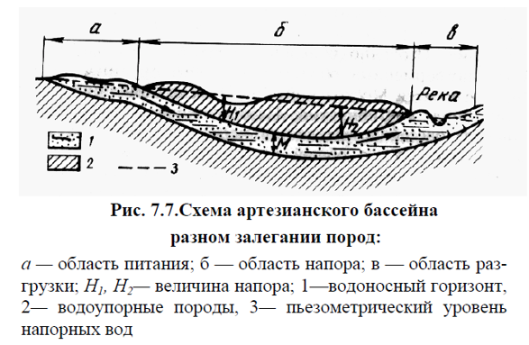
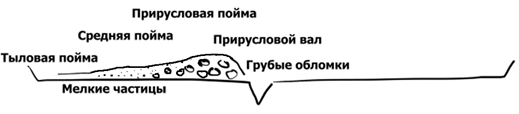

## Экзогенные процессы

Основано на лекциях Зверева Анатолия Тихоновича.

### 25. Аэрокосмические методы исследований. Свойства космических снимков.

Сегодня все полевые работы проводятся с использованием аэроснимков или космических снимков. Основные свойства таких снимков:
1. Обзорность;
2. Естественная генерализация (упрощение форм). В отличие от картографической генерализации, упрощение происходит из-за разрешения спутниковых камер, а не вручную;
3. Рентгеноскопичность (просвечиваемость). Например: когда делали снимки пустыни Сахары, заметили на снимках чёрные пятна. Когда пробурили эти места, обнаружили воду.

### 26. Процессы выветривания горных пород. Коры выветривания. Элювий.

**Процессы выветривания** – это процессы разрушения горных пород без их переноса. Не связаны с ветром или водой. Выветривание идёт постепенно сверху вниз.

Типы выветривания:
1. Физическое – делится на:
	1. Температурные. Горные породы при повышении температуры расширяются по-разному. И при колебании температуры (суточном, сезонном), приводит к образованию трещин и дезинтеграции горных пород.
	2. Морозные. На поверхности все горные породы трещиноватые. Если вода в них замерзает, то увеличивается на 10%.
	3. В жарких пустынных областях механическое выветривание осуществляются также ростом кристаллов солей, образующихся из вод, которые попадают в капиллярные трещины в виде растворов.
2. Химическое происходит за счёт грунтовых вод, атмосферных агентов. Половина глин образовалась за счёт химического выветривания.
	1. Окисление (особенно в минералах с железом);
	2. Гидрация (закрепление молекул воды на поверхности участков кристаллической структуры минерала), например, переход ангидрита в гипс;
	3. Растворение. Наибольшей растворимостью обладают хлориды, затем сульфаты и карбонаты. Ускорению процессов растворения способствуют высокая концентрация водородных ионов и содержание в воде кислорода, углекислого газа и органических кислот;
	4. Гидролиз, при котором структура кристаллических минералов разрушается благодаря действию воды и растворенных в ней ионов и заменяется новой.
3. Органическое (биологическое): корни деревьев, мхи, норы кротов, микроорганизмы.

**Кора выветривания** (или зона гипергенеза) – это часть литосферы, на которой происходят процессы выветривания. Кора выветривания сложена из элювия.

**Элювий** — это конечные продукты выветривания, которые остаются на месте их первоначального образования.

### 27. Формы рельефа, образованные плоскостным стоком воды. Делювий.

**Плоскостной сток** – стекающие по склонам в виде сплошной тонкой пелены дождевые или снеговые талые воды. Плоскостной сток производит **плоскостной смыв** – захват частичек грунта и снос их вниз. У подошвы течение воды замедляется, и переносимый материал откладывается как непосредственно у подножья, так и в прилегающей части склона. Такие отложения, называются делювиальными отложениями или **делювием**.

Ха­рак­тер­ны­ми при­зна­ка­ми вод­ной сор­ти­ров­ки яв­ля­ют­ся па­рал­лель­ная скло­ну слои­стость и умень­ше­ние круп­но­сти об­ло­моч­но­го ма­те­риа­ла в на­прав­ле­нии ос­но­ва­ния де­лю­ви­аль­ных шлей­фов, в при­скло­но­вой зо­не ко­то­рых делювий наи­бо­лее гру­бый, в сре­дин­ной зо­не – бо­лее мел­кий, с чёт­кой слои­сто­стью, в пе­ри­фе­ри­че­ской – са­мый тон­кий. Мощ­ность делювия в верх­ней и ниж­ней час­тях шлей­фов ми­ни­маль­ная (1–2 м); в сре­дин­ной час­ти, над по­гре­бён­ной по­дош­вой скло­на, мо­жет дос­ти­гать 10–15 м.

### 28. Формы рельефа, образованные временными русловыми потоками воды. Типы поперечных профилей оврагов. Конусы выноса. Пролювий.

Плоскостной сток, встречая различные неровности, образует мощные струи, которые начинают линейную эрозию и приводят к образованию следующих эрозионных форм:
1. **Эрозионная борозда** – форма флювиального рельфа, образующаяся на делювиальных склонах при переходе плоскостного смыва в линейный. Глубина борозд от 3 до 30 см, а длина в несколько раз превосходит ширину;
2. **Промоина**. Обычно имеет длину в несколько десятков метров, ширину до нескольких метров и глубину один-два метра. От оврага промоина отличается тем, что её продольный профиль следует форме склона (овраг имеет самостоятельный профиль). Иногда оврагом считают промоину, глубина которой достигла 20 метров;
3. **Овраг**. Длина оврагов составляет от нескольких метров до нескольких километров. В зависимости от стадии развития оврага выделяют несколько профилей:
	1. Поперечный профиль оврага на начальной стадии называется V-образной. Преобладает донная (глубинная) эрозия.
	2. Прочность пород уравновешивает энергию текучей воды и овраг достигает поперечного профиля равновесия в виде трапеции. Такой профиль называется трапециевидным. Донная эрозия больше не работает. Работает боковая (бортовая) эрозия.
	3. Далее и боковая и донная эрозии прекращают работать, начинает работать плоскостной смыв, и профиль оврага становится U-образным.

**Регрессивная эрозия** – распространение глубинной эрозии вверх по течению водотока.

Если овраг не впадает ни в какие реки, то образуются **конусы выноса**. У вершин конусов выноса материал грубообломочный — галька и щебень с песчано-глинистым заполнением, а к периферии он мельчает до глин. Конусы выноса могут иметь широкий диапазон размеров — от нескольких метров в основании до сотен километров.

**Пролювий** – материал, накопившийся в устье оврага в результате действия временных русловых потоков. В отличие от делювия обломочный материал более окатан.

Местами в областях лесостепи и степи наблюдаются оврагоподобные формы с расширенным дном и мягкими пологими склонами, покрытыми плащом делювия и в ряде случаев растительностью. Такие формы называют **балками**. Длина балок обычно от сотен метров до 20—30 километров, глубина от нескольких метров до десятков метров, ширина до сотен метров.

### 29. Речные системы. Режимы рек. Гидрограф. Расход воды, объём стока, модуль стока, слой стока.

- **Речная система** — это река со всеми её притоками.
- **Речной бассейн** — это площадь, занимаемая речной системой.
- **Водоразделы** — это линии, отделяющие речные бассейны друг от друга.
- **Режим реки** — закономерное изменение во времени состояния воды (скорость течения, уровень воды, температура).
- **Живое сечение** русла реки — это площадь поперечного сечения водного потока.
- **Расход воды** — это объём воды, протекающий за единицу времени.
- **Объём стока** — это объём воды, протекающей в год.
- **Модуль стока** — это отношение расхода воды к площади речного бассейна.
- **Слой стока** – это слой воды в миллиметрах, который мог бы равномерно залить речной бассейн.
- **Гидрограф** – график изменения во времени расхода воды в реке за год, несколько лет или часть года.

Режимы рек зависят от областей питания. Различают следующие фазы водного режима:
- **Половодье** — разлив реки. В основном происходит весной при таянии снега и вскрытии ото льда. Может быть и летом – от таяния ледников в горах. Во время половодья часто происходит разлив воды на пойму;
- **Паводок** — сравнительно кратковременное и непериодическое поднятие уровня воды, возникающее в результате быстрого таяния снега при оттепели, обильных дождей.
- **Межень** — ежегодно повторяющееся сезонное стояние низких уровней воды в реках. В умеренных и высоких широтах различают летнюю (или летне-осеннюю) и зимнюю межень.
- **Ледостав** — период, когда наблюдается неподвижный ледяной покров на водотоке или водоёме.
- **Ледоход** — движение льдин и ледяных полей на реках.

### 30. Формы рельефа, обусловленные постоянными русловыми потоками (флювиальные формы рельефа). Аллювий.

**Флювиальные (флювий от лат. река) формы рельефа** – формы рельефа, связанные с поверхностными текучими водами (постоянными и временными водотоками). Бывают эрозионными (овраги, речные долины…) и аккумулятивными (конусы выноса).

Условия образования рек:
1. Естественные понижения. Здесь собирается вся вода и образуется русло.
2. Генеральный уклон местности
3. Разломы. Все речные долины закладываются в разломах. Скорость вращения планеты на экваторе составляет 1.5 тысячи километров в час. Отсюда огромная инерционная сила, и возникают разломы, параллельные оси вращения (меридиональная система разломов) и трещины скалывания под 45 градусов (диагональная система разломов).
4. Силы Кориолиса (в северном полушарии реки больше подмывают правый берег, а реки южного полушария — левый).

В начальных стадиях развития реки преобладает донная эрозия, которая стремится выработать профиль равновесия применительно к базису эрозии — уровню бассейна, куда она впадает. В процессе регрессивной эрозии река, углубляя свое русло, стремится преодолеть различные неровности, которые со временем сглаживаются, и постепенно вырабатывается более плавная кривая, или профиль равновесия реки. По мере выработки профиля равновесия и уменьшения уклонов русла донная эрозия постепенно ослабевает и все больше начинает сказываться боковая эрозия, направленная на подмыв берегов и расширение долины.

Влекомые по дну и взвешенные переносимые материалы называют **твердым стоком** рек.

**Аллювий** – это речные наносы, несцементированные отложения постоянных водных потоков. Общая мощность аллювиальных отложений в долинах рек различна — от нескольких метров до десятков метров.

**Излучина** – крутой поворот, изгиб русла реки.

**Меандры** – излучины русла реки, образующиеся при закономерном плановом развитии русла. В отличие от излучин, извилистость меандр не может быть обусловлена обтеканием препятствия, а также во врезанных и адаптированных реках. Когда вода протекает по изогнутому руслу реки, образуется поперечная циркуляция воды, увеличивающая перенос отложений от внешнего берега к внутреннему.

При спрямлении меандрирующего русла или при замыкании петли образуется **старица** – участок прежнего русла реки.

### 31. Типы речных долин и их происхождение.

1. Теснина. Работает в основном глубинная эрозия. Ширина 5-7 м. Глубина до километра.
2. Ущелье. Работают и донная и боковая эрозия;
3. Каньон — то же самое ущелье, но со ступенчатыми стенами. Если стенки ущелья сложены породами разной прочности, то образуется каньон. Когда вода встречает прочную породу то боковая эрозия преобладает над глубинной. Далее вода может пробить прочный слой и устремиться вглубь.
4. Корытообразная. Река достигает продольного профиля равновесия и глубинная эрозия прекращается.
5. Ящикообразная.
6. Террасированная речная долина.

### 32. Абразионные процессы. Формы абразионного рельефа. Морские террасы.

**Абразионные процессы** – это процессы, связанные с ветровыми волнами, налегающими на берег в водоёмах и крупных реках.

Волны, ударяясь о крутой берег, образуют волноприбойную нишу, над которой остаётся карниз нависающих пород. При разрастании ниши наступает момент, когда карниз обрушается, и берег вновь представляет собой отвесный обрыв, называемый **клиффом**. В дальнейшем процесс может повторяться.

**Пляж** – это аккумулятивная форма рельефа, сложенная галькой, гравием или песком.

**Подводный вал (бар)** образуется когда волна не доносит гальку или другой материал до берега. Бары представляют длинные полосы, поднятые над уровнем моря, протягивающиеся параллельно берегу на десятки и сотни километров.

**Береговые валы** образуются когда волны приносят материал со дна на пляж. Или когда бары выходят на берег.

**Лагуна** образована либо барами, поднявшимися над уровнем воды, либо вдольбереговым переносом.

**Морская терраса** – это бывшая пойма, оставленная водоёмом или рекой когда вода ушла на более низкий уровень. Морские террасы, как и речные, бывают аккумулятивными, абразионно-аккумулятивными (цокольными) и абразионными.

### 33. Устья рек. Типы морских берегов и их происхождение.

Устьевые части рек делят на:
1. *Дельта* фактически представляет собой конус выноса обломочного материала, приносимого рекой. При относительно небольшой глубине моря русло реки быстро загромождается наносами и уже не может пропустить через себя все количество поступающей речной воды. В результате возникают прорывы берегов, и образование дополнительных русел, называемых рукавами или протоками, которые разбивают дельту на отдельные острова. Отдельные протоки постепенно отчленяются, мелеют, превращаются в озера.
2. *Эстуарии* — воронкообразные заливы, глубоко вдающиеся в долину реки. Для их образования необходимы наличие приливов и отливов, вдольбереговые течения и прогибание земной коры, превышающее скорость накопления осадков.
3. *Лиманы* – наиболее редкий тип. Нередко они рассматриваются как разновидность эстуариев, полностью находящиеся вне зоны влияния приливно-отливных течений.

1. Берега, сформированные субаэральными и тектоническими процессами и мало изменённые морем:
	1. Тектонического расчленения:
		1. *Далматинский*. Образуется при затоплении складчатой суши, рельеф которой в основных чертах сохранил соответствие тектоническим структурам.
		2. *Сбросовый*. Образованы в районах интенсивных тектонических движений.
		3. *Бухтовый*
	2. Эрозионного расчленения:
		1. *Риасовые*. Образуются в условиях поперечного распо­ложения структур при затоплении и превращении в заливы ниж­них участков впадающих горных рек. *Риасы* – это заливы, возникшие в результате подтопления горных эрозионных долин.
		2. *Лиманные*. Являются результатом ингрессии моря в устья рек в условиях прибрежной равнины. Возникающие при этом узкие заливы открываются эстуариями в сторону моря.
	3. Ледникового расчленения:
		1. *Фьордовые*. Это берега, глубоко прорезанные фьордами, то есть узкими, длинными, извитыми и нередко глубокими морскими заливами с высокими скалистыми стенами.
		2. *Шхерные*. Это берег, сильно изрезанный, с узкими заливами, окаймленный многочисленными небольшими островами, разделенными неширокими проливами.
	4. Вулканического расчленения;
	5. Эолового расчленения.
2. Берега, формирующиеся преимущественно под воздействием неволновых факторов:
	1. Дельтовые;
	2. Приливные;
	3. Биогенные;
	4. Термоабразионные.
3. Берега, формирующиеся преимущественно волновыми процессами:
	1. Абразионные;
	2. Аккумулятивные;
	3. Абразионно-аккумулятивные.

### 34. Материковые покровные ледники и их влияние на рельеф. Ледниковые и межледниковые эпохи. Морена.

Накопляясь в больших количествах, снег под действием давления и сублимации становится плотным и зернистым (фирн). Затем под увеличивающимся давлением фирн превращается в глетчерный лёд.

Зарождаются ледники выше снеговой границы, где располагаются их области питания (аккумуляции). Но при движении ледники выходят ниже снеговой границы в область абляции. В случае существенного усиления питания и превышения его над таянием, край ледника продвигается вперед — ледник наступает, при обратном соотношении ледник отступает.

**Материковые (покровные) ледники** – это ледники, покрывающие огромные территории. Нижние слои ледника под давлением верхних толщ приобретают пластичность и начинают двигаться в радиальных от центральной части направлениях. Покровные ледники под своей массой разрушают горные породы и переносят их в пониженные участки.

Классическими примерами ныне существующих материковых ледников служат покровы Антарктиды и Гренландии. Мощность антарктического ледяного покрова в центральных частях достигает нескольких километров. Средняя мощность ледникового покрова Гренландии – 1,5 км.

**Экзарация** – процесс разрушения ледником слагающих его ложе горных пород.

**Бараньи лбы** — округлые или овальные скалистые бугры, сглаженные движением ледника. Скопление бараньих лбов называют **курчавыми скалами**.

**Морена** — весь обломочный материал, как переносимый ледниками, так и отложенный ими (гляциальные отложения).

**Друмлины** — холмы эллиптической формы, сложенные мореной. Когда лёд встречает скалу то начинает её обходить и за скалой начинает накапливаться морена. Часть друмлин слагается целиком моренами, в других наблюдается ядро из скальных пород.

**Сельги** — грядообразные формы ледникового рельефа

Флювиогляциальные (водно-ледниковые, связанные с таянием льдов) отложения образуют:
- Внутриледниковые отложения:
	- **Озы** — вытянутые узкие грунтовые валы высотой до нескольких десятков метров;
	- **Камы** — куполовидные беспорядочно разбросанные холмы.
- Приледниковые отложения:
	- **Зандр** — пологая волнистая равнина, расположенная перед внешним краем конечных морен;
	- **Лимногляциальные (озёроледниковые) отложения**;
	- **Лёссы**.

**Моренная** равнина — обширная почти ровная или слегка волнистая поверхность, сложенная основной (донной) мореной.

За 700 тысяч лет (граница Матуямы-Брюнеса, последняя магнитная инверсия) было пять ледниковых эпох, объединённых в ледниковый период. В каждую ледниковую эпоху уровень океана понижается на 120-150 м. Когда эпоха заканчивалась, то уровень повышался обратно. Если за две тысячи лет уровень поднялся на 120 м, то скорость подъёма уровня воды составит 6 см в год.

На Восточно-Европейской равнине выделяют следующие эпохи оледенения и межледниковья:
1.  Донская эпоха оледенения 700-580 тыс. лет назад;
	1. Беловежское межледниковье 580-520 тыс. лет назад.
2. Окское оледенение 520-450 тыс. лет назад;
	1. Лихвинское межледниковье 450-320 тыс. лет назад.
3. Днепровское оледенение 320-240 тыс. лет назад;
	1. Одинцовское межледниковье 240-190 тыс. лет назад.
4. Московское оледенение 190-140 тыс. лет назад;
	1. Микулинское межледниковье 140-80 тыс. лет назад.
5. Валдайское оледенение 80-10 тыс. лет назад;
	1. С окончанием валдайского оледенения начинается голоцен – вторая эпоха четвертичного периода.

### 35. Горные ледники и их влияние на рельеф. Типы моренных гряд.

На склоне накапливается снег. Он тает, вода попадает в горные породы, начинается морозное выветривание и появляется углубление. Снег накапливается дальше, под давлением нижние слои становятся пластичными и выдавливают себя из углубления.

Большое распространение имеют горные ледники альпийского типа. В верхней части гор располагаются области питания, а областями стока являются горные долины. Горные долинные ледники бывают простыми, обособленными друг от друга, каждый с четко выраженной областью питания и собственной областью стока. Но в ряде случаев наблюдаются сложные ледники, выходящие из различных областей питания, сливающиеся друг с другом в области стока, образуя единый поток, представляющий настоящую реку льда с притоками, заполняющую на многие километры горную долину.

Характерна также неодинаковая скорость движения отдельных частей ледников. Реперные наблюдения в горных ледниках показывают, что скорость движения в их центральной части большая, в то время как в бортовых и придонных частях она уменьшается.

В горных ледниках выделяют:
1. Поверхностные морены, которые находятся на поверхности движущегося ледника
	1. Боковая морена образуется за счёт выветривания и гравитационных процессов со склонов гор;
	2. Срединная морена образуется при слиянии двух ледников и объединении их боковых морен.
2. Внутренние морены образуются как в пределах фирнового поля, так и в области стока в результате проникновения обломочного материала в трещины.
3. **Донные морены** – это обломочный материал, образованный при экзарации и вмёрзший в придонную часть ледника.
4. Отложенные морены: основные (донные), абляционные и конечные.

**Конечные (фронтальные) морены** — это образования на участке максимального распространения ледника.

**Трог** – это долина в ледниковой или древнеледниковой области с корытообразным (U-образным) поперечным профилем, широким дном и крутыми вогнутыми бортами, которые связаны с выпахивающей деятельностью ледников.

### 36. Нивальные процессы. Снежные лавины.

**Нивальные процессы** обусловлены разрушительным действием снега на подстилающие горные породы.

Необходимым условием формирования нивальных форм является наличие многолетних снежников, обусловивших процесс нивации, который активизируется при колебаниях температуры воздуха около точки замерзания воды и поступление воды от тающих снежников. Снежники резко усиливают интенсивность физического выветривания, увеличивают влажность.

Снежные лавины бывают сырые (пластовые) и сухие.
-   Сырые (пластовые) лавины захватывают обломочный материал и переносят его к подножию;
-   Сухие лавины стремительно сваливаются вниз, иногда достигая скорости 50-60 км/час, и сносят всё на своём пути.

### 37. Эоловые процессы. Формы эолового рельефа.

Все процессы, обусловленные деятельностью ветра, создаваемые ими формы рельефа и отложения называют эоловыми. Наиболее ярко эта деятельность проявляется в пустынях, занимающих около 20% поверхности континентов.

Геологическая работа ветра состоит из следующих видов:
1. Захват обломочного материала (дефляция (выдувание) и корразия (обтачивание песчаными частицами));
2. Транспортировка/перенос. Перенос осуществляется или скачкообразно (сальтация), или перекатыванием их по дну, или во взвешенном состоянии;
3. Аккумуляция/накопление. Одна из теорий происхождения лёссов – эоловый перенос песка за пределы пустынь и его накопление.

Формы эолового рельефа:
- Бархан. Наветренный склон их длинный и пологий поверхности, а подветренный — короткий и крутой. При переходе от пологого склона к крутому образуется острый гребень.
- Парные барханы и барханные цепи. При большом количестве оголенного песка в пустынях барханы в большинстве случаев сливаются друг с другом, образуя крупные барханные цепи, напоминающие морские волны. Их высота может достигать 60—70 м и более.
- Барханные гряды. В тропических пустынях местами формируются продольные ветру барханные гряды. 
- Продольные песчаные гряды. распространены во всех пустынях мира, всюду, где господствуют ветры одного или близких направлений и где им нет никаких тормозящих препятствий.
- Дюны. Вне пустынь, при взаимодействии ветра с полузакреплённым песком (например, туман пропитывает массу песка) верхний слой песка высыхает и переносится ветром. Могут возникать на побережьях.
- Различные экзотические формы. Например, если ветер, несущий песок, встречает скалу, то песок бьёт в стену и обтачивает её. Песчаные частицы поднимаются ветром на различную высоту, но наибольшая их концентрация в нижних приземных частях воздушного потока (до 1,0—2,0 м). Таким образом, могут появиться арки и грибообразные формы.

### 38. Подземные воды (происхождения, форма нахождения, условия залегания). Грунтовые и артезианские воды.

Вода, испаряясь с поверхностей морей и океанов, начинает гидрологический круговорот. Часть влаги сразу выпадает обратно в океан, совершая малый круговорот. Большой же круговорот обусловлен водообменом между океанами и сушей. В пределах большого круговорота выделяется внутренний, или внутриконтинентальный.

Происхождение:
1. *Вадозные* подземные воды (атмосферные осадки, просочившиеся внутрь земли);
2. *Захоронённые* (*реликтовые*, *седиментогенные*) воды. Это вода, которая ушла под землю вместе с морскими отложениями;
3. *Возрождённые* (*метаморфогенные*, *дегидрационные*) воды. Образуются при метаморфизме минералов, содержащих кристаллизационную воду. Например, при переходе гипса в ангидрит;
4. *Ювенильные* (*магматогенные*) воды. Когда магма кристаллизуется, то выделяется вода. Вся вода на земле когда-то была ювенильной;
5. *Конденсационная вода*. Например, в пустыне образуется роса и уходит под землю.

Условия залегания:
1.  Зона аэрации:
	1. **Почвенные воды**;
	2. **Верховодка**, вода накапливающаяся на линзах, летом сильно или полностью высыхает. Линзы могут состоять, например, из глин или кристаллического известняка.
2.  Зона насыщения:
	1. **Грунтовые воды** – основная масса вод – это подземные гравитационные воды, накопившиеся на первом выдержанном по площади (большая площадь) водоупорном горизонте;
	2. **Межпластовые безнапорные воды**. Эти воды располагаются в водопроницаемых породах, которые сверху и снизу ограничены водонепроницаемыми пластами;
	3. **Артезианские воды**. это межпластовые напорные воды, по закону сообщающихся сосудов обладающие избыточным внутренним давлением. Размеры артезианских бассейнов могут достигать сотен тысяч квадратных километров.

Формы нахождения подземных вод:
1. Пар;
2. Гигроскопическая. Песчинка окружена слоем воды толщиной в одну молекулу. У воды и этой частички есть химическая связь;
3. Плёночная. Песчинка окружена слоем воды в две или более молекул. Обычные химические свойства;
4. Капиллярная вода заполняет тонкие капиллярные поры и трещинки горных пород и удерживается в них силами поверхностного натяжения;
5. Гравитационная вода. Под действием гравитации может свободно течь по трещинам;
6. Лёд;
7. Кристаллизационная вода входит в состав кристаллической решётки минералов. Например, гипс, лимонит. Эта вода может выделяться при повышении температуры.

По минерализации и химическому составу часто выделяют следующие группы подземных вод:
1. Пресные: с общей минерализацией до 1 г/л;
2. Солоноватые: от 1 до 10 г/л;
3. Солёные: от 10 до 50 г/л;
4. Рассолы: свыше 50 г/л.

### 39. Динамика подземных вод. Гидравлический градиент. Плывуны. Зыбучие пески.

Движение грунтовых вод подчиняется силе тяжести и осуществляется в виде потоков по сообщающимся порам или трещинам движутся от повышенных участков к пониженным участкам (оврагам, рекам, озерам, морям).

Гидравлический градиент равен отношению потери напора (разность высот) к пройденному расстоянию. То есть потеря напора на единицу длины пути фильтрации: $J=\Delta H/L$.
- Скорость движения воды будет равна произведению гидравлического градиента на коэффициент проницаемости (коэффициент фильтрации): $V=K\cdot J$, коэффициент фильтрации зависит от типа грунта и определяется экспериментально;
- Расход грунтовых равен произведению скорости к площади поперечного сечения: $Q=V\cdot F$.

Динамика подземных вод связана с тремя показателями:
1. Влагоёмкость – сколько в горной породе может содержаться или задерживаться воды.
	1.  Глинистые породы воду не отдают;
	2.  Полувлагоёмкие: мелкозернистые пески, алевролиты;
	3.  Невлагоёмкие: грубые обломки.
2. Водоотдача – какую часть воды порода отдаёт. Грубые породы отдают почти всю воду.
3. Водопроницаемость – фильтрующие свойства горных пород. Наибольшая – у галечника, гравии, закарстованных известняках и сильно трещиноватых породах. Наименее – глины, тяжёлые суглинки, сцементированные и нетрещиноватые породы.

**Гидравлический градиент** — величина (безразмерная) потерь напора на единице длины пути движения жидкости. Отражает степень сопротивления среды при движении воды.

**Коэффициент фильтрации** — это скорость прохождения воды при гидравлическом градиенте, равном единице.
-   k < 1 мм/сутки – непроницаемые (водоупорные) породы. Глина, скалы;
-   1 < k < 1000 мм/сутки – полупроницаемые породы. Тонкозернистые пески, алевролиты;
-   k > 1000 мм/сутки — проницаемые породы.

Плывуны бывают истинные и ложные
1.  Ложный плывун: выкопали карьер, стена карьера поплыла, карьер наполнился водой;
2.  Если в стенах карьера есть частички глины, то они обволакиваются водой и начинают плыть. k = 5-10 мм/сутки. Вода в карьере мутная, светлая.

**Зыбучие пески** — это пески, перенасыщенные воздухом или влагой восходящих источников, и способные вследствие этого засасывать вглубь попадающие на них предметы.

### 40. Карстовые процессы. Формы карстового рельефа.

**Карстовые процессы** — это процессы преобразования рельефа, связанные с выщелачиванием горных пород.

Галогены растворяются быстрее всего. Затем растворяются гипс, ангидрит (сотни лет), мрамор, доломит. Некоторые частички не успевают растворяться и проникают вглубь. **Выщелачивание** — в самом общем смысле перевод в раствор, как правило водный, одного или нескольких компонентов твердого материала.

Формы карстового рельефа:
- Поверхностные: *карры*, *поноры*, *карстовые воронки*, *карстовые котловины*, *полья*, *карстовые колодцы* и *шахты*;
- Подземные: *каналы* и *пещеры*.

Идёт дождь, проникает в трещины, растворяет известняки и образует *карры*. Далее образуются карстовые колодцы.

Вода доходит до глины и начинает растворять породы и образует подземные *галереи* и *гроты*.

Своды грота могут не выдержать и обрушиться, образовав провальные *карстовые воронки*.

### 41. Суффозионные процессы. Формы суффозионного рельефа.

**Суффозионные процессы** — это процессы преобразования рельефа при растворении и механическом выносе минеральных веществ. Бывает двух типов: химическая суффория и механическая.
1. Механическая суффозия: грунтовая вода захватывает песчинки, выносит их, грубые обломки остаются, образуется пустота, обломки немного опускаются;
2. Химическая: вода растворяет частицы породы (соли, гипс) и выносит продукты разрушения.

### 42. Склоновые процессы и их влияние на рельеф (обвалы, оползни, селевые потоки, лахары).

Гравитационный перенос, или перемещение обломков горных пород, происходит под действием силы тяжести из возвышенных мест в пониженные. Ввиду того что данные процессы очень часто наблюдаются на склонах, они иногда носят название склоновых процессов. Этот процесс действует тогда, когда материал перемещается вниз по склону в твердом или полужидком состоянии.

Горные породы, участвующие в гравитационных процессах, образуют отложения, которые называются коллювием. Коллювиальные отложения состоят из разнообразных по составу и размеру обломков пород: глыб, щебня, песков, алевритов, глин. Для них характерны плохая сортированность материала, неясно выраженная слоистость и очень изменчивая мощность. В редких случаях коллювиальные образования могут быть сцементированы.

Большую роль в гравитационных процессах кроме гравитации играют подземные и поверхностные воды. Насыщая рыхлые образования, они способствуют их скольжению по склону в виде вязких или жидких потоков. Под землей они выщелачивают и вымывают отдельные минералы, создают пустоты и ослабляют связь между толщами нижележащих пород с вышележащими.

Склоновые процессы:
- *Оползни*, медленное оплывание почвы, приводящее к образованию пьяного леса;
- Медленное течение свойственно и *осыпям*. Они возникают вследствие медленного перемещения скопившихся на склонах и у подошвы возвышенностей продуктов выветривания.
	- том случае, когда осыпи состоят из очень крупных обломков, их называют *курумниками*, или *каменными потоками*;
- *Солифлюкция* — медленное пластично-вязкое течение на склонах почв и увлажненных рыхлых масс дисперсных отложений.
- *Сели* или *грязекаменные потоки*, по своей природе похожи на солифлюкцию, но перемещаются быстрее. Нередко сели для своего движения используют русла и долины ранее существовавших водотоков.
- *Лахары* хотя и похожи на сели, но отличаются от них своим происхождением. Они возникают на склонах вулканов, которые покрыты слоем пепла, во время сильных грозовых ливней.
- *Обваливание*. Ярким примером гравитационного движения является перемещение обломков горных пород в форме обваливания и осыпания (камнепада).

### 43. Криогенные процессы. Формы криогенного рельефа.

**Криолитозона** – зона распространения многолетнемёрзлых горных пород. Мощность ММП до километра.

**Криогенные (криос – от лат. холод) процессы** — это процессы, протекающие в зоне развития многолетнемёрзлых грунтов.

**Сезонная мерзлота**— промерзание почвогрунтов за холодный сезон года, в том числе с образованием ледяных включений, которые оттаивают за лето.

**Солифлю́кция** — При протаивании грунты сильно переувлажняются и стекают вниз по склону;

Формы криогенного рельефа:
- **Бугры пучения** — положительные замкнутые формы криогенного рельефа, которые возникают в криолитозоне. Образуются из-за замерзания и расширения воды.
- **Гидролаколитами** часто называют бугры пучения с ледяным ядром.
- **Термокарстовые воронки** — это воронки, образующиеся при уменьшении объёма воды при её таянии.
- **Байджарахи** - бугры, образованные вмещающей породой, оставшейся в центральных частях полигонов в результате вытаивания жил льда в процессе термокарста. Как правило, достигают в высоту 5—10 м.

### 44. Биогенные и антропогенные формы рельефа.

**Биогенный рельеф** — это совокупность неровностей земной поверхности, созданных вследствие деятельности организмов (животных, растений и микроорганизмов).
- Осадкообразование (известняки, каустобиолиты);
- Биологическое выветривание горных пород;
- Усиление эрозии корнями деревьев, кротами;
- Термитники;
- Коралловые рифы, образованные колониальными коралловыми полипами и некоторыми видами водорослей, умеющими извлекать известь из морской воды.
	- Окаймляющие (береговые) рифы;
	- Барьерные рифы;
	- Атоллы.

Антропогенные формы рельефа: карьеры, насыпи, шахты, изменение русел рек, бетонирование берегов, выравнивание дорог, прокладывание тоннелей, траншеи, воронки от бомб и др.

### 45. Денудация. Пенеплен, педиплен, педимент.

**Денудация** — это все экзогенные процессы по разрушению рельефа и образованию равнин.

Поверхности выравнивания - участки земной поверхности со сглаженным рельефом различного генезиса, формирующиеся в условиях преобладания экзогенных процессов над эндогенными. Различают поверхность выравнивания денудационного происхождения (пенеплен, педиплен, педимент), а также абразионные, абразионно-аккумулятивные и денудационно-эрозионные. Денудационные поверхности выравнивания, как правило, сочленяются с аккумулятивными морскими и аллювиальными равнинами, которые могут считаться элементами сложных полигенетических (денудационно-аккумулятивных) поверхностей выравнивания.

**Педимент** — выровненная наклонная (до 5°) поверхность возле основания горных склонов, нагорий и плато, покрытая часто плащом рыхлого материала, обычно местного петрографического состава. Поверхность педиментов осложнена небольшими денудационными останцами, а также эрозионными ложбинами, которые могут трансформироваться в большие овраги и даже формировать (на древних педиментах) овражно-балочную сеть. Площади педиментов варьируют от нескольких квадратных метров (небольшие конусы выноса) до нескольких квадратных километров (полигенетические предгорные равнины).

**Педиплен** — выровненная, слабонаклонённая (около 3°) от гор к предгорной равнине поверхность, обрамляющая периферию горных систем или отдельных хребтов и холмов. Педиплен может являться последующей стадией развития педимента, сливая их в единую поверхность. Является ли педиплен стадией пенепленизации, или они являются образованиями равного таксономического ранга, - вопрос открытый.

**Пенеплен** — практически ровная, местами слабовсхолмлённая поверхность, которая была сформирована на месте древних гор. Пенеплен часто перекрыт корой химического выветривания, мощность которой может достигать десятков метров.

### 46. Цикличность рельефообразования.

**Суперконтинентальный цикл** – интервал времени между последовательными объединениями всей суши планеты в единый континент. Один суперконтинентальный цикл продолжается от 300 до 500 миллионов лет. Выделяются суперконтиненты Пангея, Лавруссия, Паннотия, Родиния, Колумбия, Кенорланд, Ур и Ваальбара.

Связан с предполагаемым суперконтинентальным циклом, описывающим объединение земных материков в суперконтиненты и их последующий распад, но не тождественен ему: цикл Вильсона для конкретного океана может не закончиться формированием суперконтинента (закрытие океана Тетис, например, произошло в результате коллизии Индийского субконтинента и Евразии, но к формированию суперконтинента не привело).

Складчатые пояса зародились в позднем протерозое. С тех пор в их пределах происходило множество масштабных процессов. Одни и те же процессы даже в разных частях одного пояса могли происходить в разное время. Тем не менее прослеживаются эпохи, когда эти процессы были особенно масштабными: Байкальская, Каледонская, Герцинская, Киммерийская, Альпийская.

Каждая эпоха горообразования (тектономагматическая эпоха) — лишь заключительная часть одного из циклов истории соответствующего участка складчатого пояса. Они называются **циклами Бертрана**. Полный цикл длится 150—200 млн лет, что соответствует одному галактическому году (период времени, за который Солнечная система совершает один оборот вокруг центра нашей Галактики). Циклы Бертрана проявляются только на отдельных частях складчатого пояса; они составляют циклы Уилсона, затрагивающие весь пояс.

**Циклы Миланковича** – колебания достигающего Земли количества солнечного света. В результате этих колебаний происходят эпохи оледенения имежледниковые периоды. Явления, служащие причиной колебаний, являются:
1. Прецессия Земли с периодом 26 тыс. лет.
2. Изменение угла наклона Земной оси с периодом 41 тыс. лет

Изменение орбиты Земли с периодом 93 тыс. лет.

### 48. Пойменный рельеф. Поперечный профиль поймы.

**Пойма** – это часть речной долины, заливаемая водой во время половодья. Поймы делят на высокие, средние и низкие. Поймы разных уровней заполняются в разных условиях: при сильном дожде, раз в год, раз в несколько лет, раз в десятки лет.

В аллювиальных отложениях пойм равнинных рек четко выделяются три фации: русловая, пойменная и старичная.

**Речная долина** – это часть рельефа, выработанная рекой.

Речная долина отделяется от поймы **коренными берегами**.

**Коренные берега** – это границы речных долин. Могут быть в виде обрыва либо с выполаживанием склона.

Когда вода выходит из берегов, она несёт с собой песок, гравий, гальку. Когда вода выходит на пойму, скорость падает, и этот материал начинает сыпаться вниз. Сначала грубый материал, потом смесь грубого с тонким, и затем тонкий. Крупный материал сразу же отлагается у самого берега, образуя прирусловой вал.

### 49. Типы речных террас. Базис эрозии.

**Надпойменная речная терраса** – это древняя пойма, брошенная рекой, когда она ушла на новый продольный профиль равновесия. Образуется при изменении скорости или массы реки $mV^2/2$, (тектонические движения, изменения климата, изменение базиса эрозии). Надпойменные террасы никогда не заливаются водой. Склон молодых террас направлен от реки. Затем под склоновым стоком склон поворачивается к реке.

Классификации речных террас:
1. Аллювиальная (по веществу) или аккумулятивная (по процессу) терраса. Сложена аллювием. Аккумулятивные террасы имеют широкое распространение в пределах низменных платформенных равнин, а также в межгорных и предгорных впадинах.
   
2. Цокольная или эрозионно-аккумулятивная терраса. Сложена наполовину из аллювия и наполовину из коренных пород. приурочены чаще к переходным зонам от поднятий к погружениям, но встречаются местами и в пределах равнин.
   
3. Эрозионная (скульптурная) терраса. Сложена только из коренных пород. Происходит размыв без накопления. встречаются главным образом в молодых горных сооружениях, где имеют место импульсы нарастания и спада тектонических движений.
   

**Базис эрозии** — уровень, на котором водный поток теряет свою энергию и ниже которого не может углубить своё русло. Общим базисом эрозии считается уровень Мирового океана. Местные базисы эрозии — уровни озер, в которые впадают реки, уровень главной реки для впадающего в неё притока и т. д.

Профиль равновесия — продольный профиль русла, выработанный рекой при длительном тектоническом покое, неизменном климате и стабильном базисе эрозии. В этих условиях по длине реки уклоны распределяются так, что удельная транспортирующая способность потока становится постоянной от истока до устья. Форма профиля равновесия зависит от смены на протяжении реки ряда факторов (расхода воды, характера наносов, особенностей русла и др.), влияющих на эрозионно-аккумулятивные и русловые процессы. Например, если вниз по течению расход воды увеличивается, то уклон в этом направлении убывает и профиль равновесия образует вогнутую кривую. При уменьшении расхода к устью (в реках аридных стран) профиль равновесия может иметь форму выпуклой кривой.

### 50. Механизмы и условия образования оползней.

Под оползнями понимают крупные смещения различных горных пород по склону.

Оползневые процессы протекают под влиянием многих факторов, к числу которых относятся:
1. Увеличение крутизны склона в результате подмыва водой;
2. Выветривание или переувлажнение;
3. Подземные воды:
	1. Суффозия, или подкапывание, вызываемое выходящими на склоне источниками подземных вод и вызывающее разрыхление грунта;
	2. Гидродинамическое давление. Например, выдавливание присклоновой части водоносного слоя после половодий;
4. Сейсмические силы. Землетрясения вызывают образование крупных оползней, обвалов и других форм сейсмодислокаций. Объем таких оползней может достигать сотен тысяч м, длина — нескольких километров, а площадь — десятков км.;
5. Антропогенное воздействие на склоны, например, постройки, увеличивающие нагрузку на склон, или подрезка сконов.

Часто оползни бывают очень сложного строения, они могут представлять серию блоков, сползающих вниз по плоскостям скольжения с запрокидыванием слоев смещенных горных пород в сторону коренного несмещенного склона. Такие оползни, соскальзывающие под влиянием силы тяжести, называются деляпсивными. Нижняя же часть такого оползня бывает представлена сместившимися породами, значительно раздробленными, перемятыми в результате напора выше расположенных движущихся блоков. Эта часть оползня называется детрузивной. Местами под давлением оползневых масс на прилежащие части речных долин и различных водоемов возникают бугры пучения.

Размер, а следовательно, и объем оползневых тел бывают различны, а иногда просто огромны. Известен случай, когда на склоне Кавказских гор, в Дагестане сполз на 2 км горный массив объемом более 200 млн кубических метров.