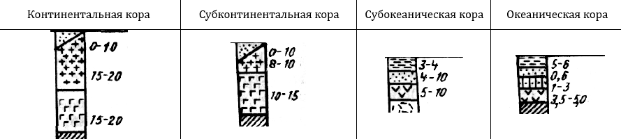
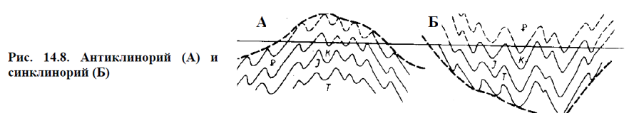

## Основы геологии

Основано на лекциях Зверева Анатолия Тихоновича.

### 1. Геология, геоморфология, инженерная геология. Задачи и методы исследования.

**Геология** – это наука, изучающая строение (вещество и структуру) земной коры и закономерности её развития. Задачи геологии: изучить вещественный состав и структуру земной коры.

**Геоморфология** – это наука, изучающая рельеф и закономерности его распространения и развития. Задачи геоморфологии – изучить влияние поверхностных процессов.

**Инженерная геология** – это наука, изучающая геологическую среду с целью оценки её пригодности для проведения строительных работ. Геологическая среда – это часть литосферы и поверхности, вовлечённая в хозяйственную деятельность человека.

Методы бывают *полевые* (в том числе с использованием дистанционных методов) и *лабораторные*.

### 2. Общее строение Земли (атмосфера, гидросфера, внутреннее строение Земли, литосфера, биосфера).

Деление слоёв атмосферы по термическому режиму: тропосфера (до 11 км), стратосфера (11-50 км), мезосфера (50-90 км), термосфера. Верхняя граница термосферы и, соответственно, нижняя граница экзосферы - экзобаза, определяется по равенству длины свободного пробега атомов высоте однородной атмосферы, зависит от солнечной активности и находится на высоте 500-1000 км.

Информация о внутреннем строении Земли получена при интерпретации сейсмологических данных. По ним выделяют:
1. *Кора* (океаническая от 5 до 30 км, континентальная от 30 до 50 км);
4. *Граница Мохоро́вичича* (сокр. граница Мохо) — нижняя граница земной коры, отделяющая земную кору от мантии, на которой происходит скачкообразное увеличение скоростей продольных и поперечных сейсмических волн. Поверхность Мохоровичича прослеживается по всему земному шару на глубине от 5 до 10 км под океанической корой и от 20 до 90 км под континентальной корой.
5. *Мантия*. Вещество мантии в основном находится в твёрдом состоянии.
	1. Верхняя мантия. Основными минералами вещества верхней мантии являются оливин и пироксены.
		- *Астеносфера* – слой в верхней мантии. Более пластичный, чем соседние слои.
	2. *Слой Голицына* - переходная зона между верхней мантией и нижней мантией, находящаяся в интервале глубин 410-670 км. Верхняя граница этой зоны устанавливается по интенсивному росту скоростей сейсмических волн.
	3. *Нижняя мантия*.
7. *Граница Гутенберга*, или *граница Вихерта-Гутенберга* - зона разделения слоёв Земли, расположенная на глубине примерно 2900 км и отделяющая мантию от ядра. Сейсмические волны разных типов по-разному ведут себя при взаимодействии с границей: S-волны отражаются от неё, а P-волны преломляются ей с резким уменьшением скорости их распространения. Это позволило сделать вывод, что ниже границы Гутенберга лежит жидкая область.
8. *Ядро*. Состоит в основном из силикатов.
	1. *Внешняя часть* (до 5100 км) расплавлена;
	2. *Твёрдое ядро* (средний радиус около 1300 км). Предположительно, температура на поверхности твёрдого ядра составляет около 6000°C, а давление - 3 млн атмосфер.

**Литосфера** – земная кора и твёрдая верхняя часть мантии. Инертная и холодная;

**Гидросфера** — водная оболочка Земли от облаков до подземных вод.

**Биосфера** – часть литосферы и атмосферы, в которой наблюдается жизнедеятельность организмов. Толщина от -10км до +20км.

### 3. Химический состав и строение земной коры. Типы земной коры. Кларки.

В начале XX вв. американский геохимик Франк Уиглсуорт Кларк попросил геологов мира прислать образцы горных пород. Проанализировав их, учёный определил среднее содержание элементов в горных породах. Эти содержания назвали **кларками**. Таблицы кларков составляют для разных областей: для земной коры, гидросферы, отдельного региона и др.

Состав земной коры определяется продуктами силикатных минералов и продуктами их разрушения. 85% земной коры состоит из трёх элементов: *кислород, кремний и алюминий*. 99% составляется двенадцатью элементами: *кислород, кремний, алюминий, железо, магний, натрий, калий, кальций, сера, фосфор, водород, углерод*.

1. Континентальная кора. Состоит из осадочного, гранитного, и базальтового слоёв. Если осадочного слоя нет, то эти части платформ называют щитами. Если есть – плитами. Средняя мощность 30-40 км, а под горами достигает 70 км.
2. Субконтинентальная кора. Отличается от континентальной уменьшенным гранитным слоем. Обычно связывают с островными дугами.
3. Субокеаническая кора. Приурочен к котловинным частям морей. От океанской коры отличается повышенной мощностью осадочного слоя.

Гранитный (гранитометаморфический) и базальтовый (гранулито-базальтовый) слои называются так, потому что по расчётам скорости прохождения сейсмических волн в этих слоях, предполагают, что они состоят из гранитов и базальтов.

Поверхность Конрада — условная граница, разделяющая гранитный и базальтовый слои земной коры, выявляемая по увеличению скорости прохождения сейсмических волн. Поверхность Конрада встречается в различных районах континентальной коры на глубине 15-20 км, однако отсутствует под океанической корой.

### 5. Аномальные геофизические поля и их использование для поисков и разведки полезных ископаемых.

Земля обладает своими физическими полями. Их интенсивность зависит от фигуры Земли, координат точки, в которой производится замер, от распределения вещества по объёму Земли и множества других признаков.

**Аномальное геодезическое поле** – это отличие реального поля (измеренного прибором) от нормального поля (рассчитанного теоретически). Аномальные геодезические поля связаны с полезными ископаемыми.

Поиск и разведка полезных ископаемых:
- С помощью гравиразведки находят, где сила тяжести больше или меньше, чем ожидаемая;
- С помощью магниторазведки находят, где магнитное поле отличается от ожидаемого (образуются от намагниченности земной коры и меняют поле образованное токами в Земле и ионосфере с магнитосферой). Все минералы по магнитным свойствам делятся на:
	- Ферромагнетики (минералы группы железа, усиливают поле Земли);
	- Диамагнетики (магнитятся в другую сторону, цветные и благородные металлы);
	- Парамагнетики (соли, слабо магнитятся).
- Тепловые, радиоактивные признаки…

### 6. Рельеф Земли. Геотектуры, морфоструктуры, морфоскульптуры. Формы и элементы форм рельефа. Основные формы рельефа. Типы рельефа. Гипсографическая кривая.

**Рельеф Земли** – неровности твёрдой земной поверхности.

По размерам формы рельефа делятся на:
- Геотектуры – самые крупные формы рельефа. Геотектурные элементы рельефа обусловлены силами общепланетарного масштаба.
	- Рельефы первого порядка — материковые глыбы и океанические жёлоба.
	- Рельефы второго порядка — горные пояса и крупные равнины.
- Морфоструктуры – более мелкие формы рельефа, созданные преимущественно тектоническими процессами (глубинными силами). Это горные хребты, горные долины, впадины больших озёр.
- Морфоскульптуры – формы рельефа, сформированные на поверхности земли под действием внешних сил (вода, ледники, ветры...) – это речные долины, овраги, ущелья, дюны, барханы.

**Формы рельефа** бывают:
- Положительные и отрицательные;
- Линейные (горные хребты), изометричные (курганы, впадины), брахиформы (овальные);
- Открытыми (речные долины, овраги..) и закрытыми(озёра).

**Элементы формы рельефа**:
- Горные вершины, днища конусообразных воронок;
- Водораздел – линия, соединяющая наивысшие точки рельефа;
- Тальвег – линия, соединяющая наинизшие точки рельефа;
- Склоны – поверхности между водоразделами и тальвегами;
- Бровка – линия перегиба, где склон выполаживается.

**Основные формы рельефа:** гора, котловина, хребет, лощина, седловина, равнина.

**Типы рельефа по генетическому признаку** бывают тектонические и бывают связанные с внешними силами: эрозионные, ледниковые, карстовые...

**Гипсографическая (гипсометрическая) кривая** – это кривая, показывающая распространённость на Земле различных высот и глубин. Согласно гипсографической кривой, суша занимает 29.7% всей поверхности Земли. Средняя высота материков – 875м. Средняя глубина океана – 3650 м.

### 7. Геохронология.  Методы определения возраста горных пород.

**Геохронология** -  комплекс методов определения абсолютного и относительного возраста горных пород или минералов.

В разрезе нормально залегающие отложения отражают последовательность геологических событий, хотя понятие «нормально залегающие» точно не сформулировано. **Стратиграфический метод** применим только для осадочных горных пород при их спокойном залегании.

Одновозрастность слоёв пород по окаменелостям можно определить и по окаменелостям, названным руководящими ископаемыми (**палеонтологический метод**).

**Палеомагнитный метод** основан на том, что горные породы, содержащие ферромагнитные минералы, образовались в магнитном поле Земли и, обладая свойством магнитной восприимчивости, запечатлели положение векторов существовавшего в момент своего образования магнитного поля. Это свойство называют остаточной намагниченностью.

**Радиометрический метод** основан на изучении распада радиоактивных элементов или радиоактивных изотопов. Позволяет определить абсолютный возраст горных пород. В абсолютной геохронологии применяется обычная астрономическая система летосчисления — астрономический год — период времени полного обращения Земли вокруг Солнца. Надо иметь в виду, что продолжительность современного астрономического года не полностью соответствует продолжительности года в палеозое и тем более в протерозое или архее. Поэтому лучше говорить не об абсолютном, а о радиогеохронологическом или радиометрическом возрасте.

В истории развития Земли выделяются несколько крупных этапов:
1. *Этап аккреции* вещества газопылевой туманности;
2. *Догеологический этап*. горных пород этого времени практически не сохранилось, а процессы, протекавшие на данном этапе, приводили к дифференциации вещества внутри планеты, образованию какой-то первичной земной коры основного состава, выделению внешнего, жидкого ядра Земли и, соответственно, появлению магнитного поля;
3. *Докембрийский супер-эон (криптозой)* (4,0 — 0,5 млрд. лет назад). Включает в себя три эона: протерозой, архей и катархей. Криптозой — время скрытой жизни, в нём существовали только мягкотелые организмы, не оставляющие следов в осадочных породах.
4. *Фанерозойский эон* включает в себя палеозойскую, мезозойскую и кайнозойскую эру. Фанерозой начался с появлением множества видов моллюсков и других организмов, остатки которых сохранились до наших дней.

Стратиграфическая последовательность слоев и их относительное время образования называют одними и теми же именами. Для того чтобы отличать время образования слоев от последовательности напластований, необходимо давать название времени (*период*, *эпоха*, *век*) или название напластования (*система*, *отдел*, *ярус*).

### 8. Фации и формации. Фациальные и формационные анализы. Метод актуализма.

**Метод актуализма** – “познавая современность, познаём древность”. Он опирается на принцип однообразия, по которому геологические процессы, происходящие в прошлые геологические эпохи, и явления, вызывавшиеся этими процессами, имеют много общего с современными.

**Фация** – осадки (или горные породы), возникающие в определённой физико-географической обстановке и отличающиеся от состава и условий образования смежных одновозрастных пород.
- Континентальные фации: горная, равнинная, речная, русловая, озёрная, болотная и т.д.
- Морские: береговые, шельфовые, фации подножия материкового склона, фации ложа мирового океана…
- Переходные фации: лагунные и дельтовые фации.

Фациальный анализ - метод реконструкции палеогеографических обстановок по выделенным фациям.
- Пример горизонтального фациального ряда: берег – грубые породы – галечники – галька с песком – чисто песок – песок с глиной – глина…
- Пример вертикального ряда — трансгрессия моря (наступление моря): сначала была береговая фация – уровень моря повышается – накапливается песок – уровень моря повышается – накапливается глина.

**Формация** – это комплекс пород, образовавшихся в сходных тектонических условиях. Если фация касается поверхностной географии, то формации касаются глубинной структуры коры. 

### 9. Геологическая карта и её виды. Собственно геологические карты, тектонические карты, инженерно-геологические карты.

**Геологическая карта** — карта, отображающая на топографической основе, геологическое строение определённого участка земной коры. В зависимости от содержания и предназначения различают: *собственно геологические карты*, *карты антропогеновых (четвертичных) отложений*, *тектонические*, *литологические*, *палеогеографические*, *гидрогеологические*, *инженерно-геологические*, *карты полезных ископаемых*, *прогнозные* и *геохимические*.

Наибольшее значение имеют **собственно геологические карты**, на которых с помощью качественного фона (цветного и штрихового), буквенных, цифровых и других условных знаков показываются возраст, состав и происхождение горных пород, условия их залегания и характер границ между отдельными комплексами.
- Цветной фон служит для обозначения возраста осадочных, вулканогенных и метаморфических пород;
- Штриховыми знаками обозначается состав пород;
- Исключение представляют интрузивные и некоторые вулканогенные породы, состав которых условно изображается цветом или буквами.
Существуют также одноцветные геологические карты, показывающие и состав пород, и их возраст штриховыми обозначениями.

**Тектоническая карта** — геологическая карта, отображающая историю тектонических движений и строение земной коры. В мелких масштабах на тектонических картах изображаются платформы, щиты, плиты, геосинклинали, складчатые области; в крупных масштабах — отдельные складки, разломы, горсты, грабены и т. д.

**Инженерно-геологические карты** - вид геологических карт, на которых показаны все важнейшие геологические факторы, учитываемые при планировании, проектировании, строительстве, эксплуатации сооружений и проведении других инженерных мероприятий.

### 10. Эндогенные и экзогенные процессы и их влияние на рельеф.

**Эндогенные процессы** – это процессы, связанные с внутренними силами. К эндогенным процессам относят магматические, метаморфические, тектонические и сейсмические процессы. Эндогенные процессы обусловлены влиянием внутреннего тепла Земли и гравитации.

**Экзогенные процессы** – это процессы на поверхности. К ним относят эрозионные, эоловые, гляциальные, криогенные, гравитационные, нивальные процессы. Экзогенные процессы обусловлены действием силы тяжести и солнечной энергии.

Эндогенные процессы создают неровности рельефа, а экзогенные пытаются их нивелировать.

### 11. Магматические процессы и их влияние на рельеф. Магма и её образование. Формы магматических тел.

**Магматические** **интрузивные процессы** – это процессы зарождения магмы на глубине и её перемещения к поверхности. Магма образует положительные формы рельефа.

**Магма** — это флюидно-силикатный расплав, содержащий в своем составе соединения с кремнеземом (Si02) и летучие вещества, присутствующие в виде газа (пузырьков) либо растворенные в расплаве. При затвердевании магматический расплав теряет летучие компоненты. В зависимости от изменения температуры, давления, состава газов меняются расплав и образовавшиеся в нем ранее кристаллы минералов — одни растворяются, другие возникают вновь, и весь объем магмы непрерывно эволюционирует. Подобный процесс называют магматической дифференциацией. 

В настоящее время считается, что различные по составу магмы образуются за счет плавления пород мантии и земной коры в результате трех основных механизмов: привноса тепла и нагрева пород, уменьшения давления или привноса летучих компонентов, преимущественно воды.

Источники тепла в Земле:
1.  Распад радиоактивных изотопов;
2.  Приливные и отливные силы, создающие трение внутри Земли;
3.  Гравитационная дифференциация.

Самый главный фактор, вызывающий понижение температуры кристаллизации, — это флюидное давление. Повышенное содержание летучих (флюидов) компонентов способствует сохранению расплавов в жидком состоянии до более низких температур, чем у расплавов, не содержащих их.

Некоторые виды интрузивных магматических тел:
- *Дайки*. Магма раздвигает разломы, застывает и образует стены. Дайки обладают длиной от десятков метров до сотен километров и шириной от нескольких сантиметров до 5—10 км;
- *Штоки*. Столбообразные интрузивы изометричной формы. Магма поднимается через пересечения разломов. Площадь выхода штока, как правило, не превышает 100 км²;
- *Батолиты*. Крупный интрузивный массив, имеющий площадь более 100 км² и мощность 3—15 км;
- *Силлы*. Пластовые тела. Протяженность силлов может достигать 300 км. Мощность силлов колеблется от десятков сантиметров до 600 м, но чаще встречаются силлы мощностью от 10 до 50 м;
- *Лополиты*. Чашеобразные интрузивы;
- *Лакколиты*. Грибообразные интрузивы.

### 12. Вулканические процессы и их влияние на рельеф. Типы вулканов и их извержений. 

**Вулканические процессы** – это процессы, сопровождающиеся извержением магмы на поверхность.

Вулканические процессы порождают как положительные формы рельефа (горы и горные гряды), так и отрицательные (*маары*, образовавшиеся при взрыве, и *кальдеры*, образующиеся при истощении магматического очага и проваливании горных пород).

Одной из самых важных причин извержений магмы является ее дегазация. Именно газы, заключенные в расплаве, служат тем «движителем», который вызывает извержение.
Дегазация магмы - процесс отделения газов от магм, расплава, происходящий как в вулканическом канале, так и на поверхности Земли. Способ и скорость отделения летучих определяют три главные формы извержений: эффузивное, эксплозивное и экструзивное.

Классификация вулканических извержений:
- *Гавайский* тип  характеризуется выбросами очень жидкой, высокоподвижной базальтовой лавы;
- *Стромболианский* тип связан с более вязкой лавой, которая выбрасывается разными по силе взрывами из жерла, образуя сравнительно короткие и более мощные потоки;
- *Плинианский* тип: мощные редкие взрывы, способные выбросить тефру на высоту до нескольких десятков километров;
- *Пелейский* тип. Извержения этого типа характеризуются очень вязкой лавой, затвердевающей до выхода из жерла с образованием одного или нескольких экструзивных куполов, выжиманием над ним обелиска, выбросами палящих туч;
- *Газовый* тип – извержения, при которых кратера достигают только вулканические газы и происходит выброс твёрдых пород;
- *Подводный* тип – извержения, происходящие под водой.

Классификация вулканов по форме:
- *Щитовые вулканы*. Образуются в результате многократных выбросов жидкой лавы. Лава равномерно растекается на многие километры; постепенно из этих наслоений формируется широкий «щит» с пологими краями.
- *Шлаковые конусы*. Во время извержения вулкана, большие куски шлаков накладываются вокруг кратера в виде конуса, а мелкие образуют пологие склоны, в результате с каждым последующим извержением вулкан быстро растет в высоту.
- *Стратовулканы* периодически извергают лаву и пирокластическое вещество — смесь горячего газа, пепла и раскалённых камней; в результате отложения на их конусе чередуются.
- *Купольные вулканы*. Образуются, когда вязкая магма не может стечь по склонам и застывает вверху, образуя купол. Она закупоривает его жерло, как пробка, которую со временем вышибают накопившиеся под куполом газы.
- *Сложные* (смешанные, составные) вулканы.

### 13. Метаморфические процессы и их влияние на рельеф. Типы метаморфизма.

**Метаморфические процессы** – процесс твердофазного минерального и структурного изменения горных пород под воздействием температуры и давления в присутствии химически активного флюида.

Типы метаморфизма:
- Изохимический, без изменения химического состава;
- Аллохимический, с привносом или выносом компонентов (метасоматоз).

Факторы метаморфизма:
- Температура. Возрастание температуры приводит к обезвоживанию (дегидратации) минералов, формированию более высокотемпературных минеральных ассоциаций, лишенных воды, декарбонатизации известняков и т. д.
- Давление. Одностороннее стрессовое давление лучше всего проявляется в верхней части земной коры складчатых зон и выражается в образовании определенных структурно-текстурных особенностей породы;
- Флюиды, к которым относятся H2O, CO2, CO, CH4, H2, H2S, SO2 и другие переносят тепло, растворяют минералы горных пород, переносят химические элементы, активно участвуют в химических реакциях и играют роль катализаторов.

По размеру ареалов и их положению различают метаморфизм:
1. Региональный (на огромных площадях): кварциты, мраморы, филлиты, сланцы, гнейсы и др. Для регионального метаморфизма была создана схема фаций по температуре и давлению;
   
2. Локальный (метаморфические изменения захватывают ограниченные участки), например контакт магмы с вмещающими породами;
3. Динамометаморфизм (крупные разломы, сдвиги, при образовании которых всегда возникает сжатие);
4. Ударный метаморфизм, вызванный падением на землю метеоритов.

### 14. Сейсмические процессы, цунами. Шкала балльности и магнитуд. Прогнозирование землетрясений.

**Сейсмические** (сейсмос – от лат. землетрясение) явления проявляются в виде упругих колебаний земной коры. Любое землетрясение — это тектонические деформации земной коры или верхней мантии, происходящие вследствие того, что накопившиеся напряжения в какой-то момент превысили прочность горных пород в данном месте. «Спусковой крючок», вызывающий разрядку напряжений, может быть, на первый взгляд, самым незначительным, например заполнение водохранилища, быстрое изменение атмосферного давления, океанские приливы и т.д.
- **Гипоцентр** (очаг) - область возникновения подземного удара. Большинство землетрясений происходят на глубине 100-200 км. Однако есть очаги, находящиеся и на глубине 600-700 км. Большинство землетрясений возникает на окраинах тектонических плит.
- **Эпицентр** - проекция гипоцентра на земную поверхность.
- **Изосейсты**—линии, соединяющие точки, в которых землетрясение проявилось с одинаковой интенсивностью.

Основные причины (типы) землетрясений:
1.  Тектонические: смещение горных плит, столкновение материковой и океанической платформ.
2.  Вулканические: из-за лавы образуются вулканические газы, повышающие давление под землёй. Вулканические землетрясения слабые, но могут длиться месяцами.
3.  Ударные: метеориты
4.  Обвальные: обвал карьера, большие оползни
5.  Техногенные (антропогенные): атомная бомба, заполнение водохранилищ.

**Цунами** — это огромная волна, порождаемая подводным землетрясением. Когда в океане происходит землетрясение, то во все стороны от эпицентра распространяются подводные волны. В открытом океане эти волны почти незаметны, но с приближением к берегам высота волн увеличивается. Распространяясь со скоростью до 800 км/ч, при подходе к побережью на мелководье волна становится круче, достигая 15— 20 м,

**Магнитуда** – безразмерная логарифмическая величина характеризующая энергию, выделившуюся при землетрясении в виде сейсмических волн. Значение магнитуды вычисляется по показаниям сейсмографа. Значение магнитуды часто называют шкалой Рихтера.

**Интенсивность землетрясения** – балльная мера величины сотрясения земной поверхности при землетрясении на охваченной им территории. Расчёт интенсивности проводится по внешним проявлениям (дрожание предметов, трещины, обвалы и др.). В России принята 12-балльная шкала интенсивности землетрясений Медведева-Шпонхойера-Карника. В Японии принята 7-балльная шкала.

Карты сейсмического районирования показывают, какие районы могут быть наиболее опасными и какой проектной силы следует ожидать здесь землетрясения. В зависимости от сейсмической опасности применяют различные строительные нормы.

Для предсказания даты и времени землетрясения используют множество самых разных явлений: изменение магнитного поля, поведение животных, изменение наклона поверхности, уровень грунтовых вод, содержание газа в горных породах и т. д. Иногда такие прогнозы успешны, однако до сих пор даже мощные землетрясения оказываются непредсказанными.

### 15. Тектонические процессы и их влияние на рельеф. Типы тектонических движений. Тектонические циклы. Несогласное залегание.

**Тектонические процессы** – это процессы перемещения вещества внутри земной коры, сопровождаемое изменением структуры земной коры и рельефа её поверхности (положительные и отрицательные, складчатые и разрывные дислокации, например).

Типы тектонических движений:
1.  По направлению: *вертикальные* и *горизонтальные*;
2.  По возрасту методам изучения:
	1.  *Современные* (~до нескольких веков) – регистрация этих движений связана с появлением геодезии и развитием сейсмологических, астрономических и других наук;
	2.  *Молодые* (*голоценовые*) –  движения земной коры текущего межледникового периода, начавшегося 12 тысяч лет назад;
	3.  *Новейшие* (*неотектонические*) – до ~40 млн. лет назад. Эти движения привели к формированию современного облика Земли. Изучаются геолого-геоморфологическими методами;
	4.  *Древние*.

Учитывая эндогенную активность литосферы и верхней мантии, введено обобщающее понятие тектоносферы. *Тектоносфера* — верхняя оболочка Земли, основная область проявления тектонических движений и деформаций (магматизм, метаморфизм, сейсмичность). Это понятие объединяет земную кору и верхнюю мантию.

В одни отрезки геологического времени преобладало высокое стояние континентов (регрессии моря), происходил значительный магматизм и осуществлялись как горизонтальные, так и вертикальные движения континентальных блоков. Такие фазы носят название геократических. Они сменялись более продолжительными по времени талассократическими фазами, когда области платформ активно прогибались и затапливались морем, т.е. развивались крупнейшие трансгрессии.

В истории Земли выделяются около 20 тектономагматических эпох, каждая из которых характеризуется своеобразной магматической и тектонической активностью и составом возникших горных пород. В фанерозойское время таких этапов выделяется несколько:
- *Байкальский цикл* (~900-600 млн. лет назад). Результатом проявления ранне- и позднебайкальской тектономагматических эпох стало сближение и соединение в единый сверхгигантский материк Гондвану пяти крупнейших континентальных платформ южного полушария. В свою очередь, в северном полушарии стали сближаться северные континенты;
- *Каледонская тектономагматическая эпоха* (~300-250 млн. лет назад) характеризовалась не только усилением магматизма, но и привела к подъему над уровнем моря и объединению северных материков в новый подобный южной Гондване суперматерик — Лавразии. Последний отделился от Гондваны крупным океаном Тетис;
- В *Герцинскую* тектономагматическую эпоху (~250-150 млн. лет назад) произошло крупнейшее событие в истории Земли. Существовавший между Гондваной и Лавразией океан прекратил свое существование. Тогда эти гигантские материки объединились и на планете возник один материк, который А. Вегенером в начале XX столетия был назван Пангеей.
- *Киммерийский цикл* (~150-60 млн. лет назад). В киммерийскую тектономагматическую эпоху произошли внедрения различных по составу интрузий, но все-таки главным событием был распад Пангеи. После ее распада вначале вновь возникли Лавразия и Гондвана, так как между ними образовался новый океанский бассейн — Тетис, который простирался субширотно, а затем стал формироваться новый океан меридионального направления. Сначала это была Южная Атлантика, отделившая Южную Америку от Африки, а затем Северная Атлантика, которая разделила Северную Америку и Евразию. В течение киммерийской эпохи возникли Крымские горы и горные системы Приверхоянья.
- *Альпийский цикл*. Действия Альпийской эпохи которой продолжаются и в настоящее время. С ними связаны внедрения интрузий кислого, основного и щелочного составов в подвижных поясах, расширение древних и возникновение нового, Индийского, океана, закрытие океана Тетис. Постепенно континенты приобретают современные очертания и создаются величайшие горные системы — Альпы, Динариды, Карпаты, Кавказ, Памир, Гималаи, Анды, Кордильеры. Подъем этих горных сооружений продолжается и в наши дни. Некоторые океаны и окраинные моря продолжают сокращаться в размерах. Так, в результате сближения Африки с Евразией сужается Средиземноморский бассейн, который представляет собой реликт океана Тетис.

Не во всех районах Земли эти этапы начинались и заканчивались одновременно, но в целом последовательность примерно такая, как показано выше.

Начало этапов характеризовалось раскрытием бассейнов с корой океанского типа, а конец — сближением литосферных плит и формированием горно-складчатых поясов.

**Несогласное залегание** отражает перерыв осадконакопления, который фиксируется по резкому изменению состава осадков и изменению первичного их залегания. Возникает, если под воздействием тектонических движений участок земной коры сначала выводится из зоны осадкообразования и может подвергаться процессам денудации, а затем опускается и на нем накапливаются более молодые осадки. Бывает параллельное и угловое несогласие. Например, регрессия моря приводит к подъёму морских отложений выше уровня моря, и они разрушатся процессами эрозии, а затем море трансгрессирует и зона размыва снова начнут накапливаться морские осадки.

### 16. Складчатые дислокации и их влияние на рельеф. Формы складок.

**Складчатые дислокации** – это деформация уже отложенных пород, приводящая к их изгибам, происходит в основном из-за тектонических процессов. На рельефе создают положительные и отрицательные формы.

Основные элементы складки:
1. Крыло складки – боковые участки, на которых кривизна меняет знак;
2. Ядро – внутренняя часть, ограниченная каким-либо пластом;
3. Замок складки – верхняя или нижняя часть складки с наибольшей кривизной;
4. Шарнир – линия, вдоль которой слой изгибается;
5. Осевая плоскость – образуется шарнирами соседних слоёв;
6. Ось складки – линия пересечения осевой плоскости с плоскостью, касательной к замку складки.

Формы простых складок:

Выделяют два типа основных складок:
1. Антиклинальная, в ядре которой залегают древние породы;
2. Синклинальная, в ядре которой залегают более молодые породы по сравнению с крыльями.

Эти определения не меняются даже в том случае, если складки оказываются перевернутыми или опрокинутыми. Если невозможно определить кровлю или подошву слоев, например, в глубоко метаморфизованных породах, для определения изгиба слоев используют термины: антиформа, если слои изогнуты вверх, и синформа, если они изогнуты вниз.

Сочетание антиклинальных и синклинальных складок создает более сложные складчатые формы. Так, если наблюдается преобладание антиклинальных складок и зеркало складчатости (плоскость, соединяющая высшие точки складок) образует выпуклую кривую, такая структура называются антиклинорием и, наоборот, преобладание синклинальных складок и вогнутая кривая зеркала складчатости характерна для синклинория.

**Синеклиза** – сводовое опускание поверхности кристаллического фундамента поверхностных плит, имеющие в горизонтальном плане неправильно округлые или овальные очертания (до нескольких сотен, иногда более тысячи километров в поперечнике) и глубину обычно до 3—5 км (реже больше). Обычно вызывается таянием подземных ледников. Её противоположностью является антеклиза.

### 17. Разрывные дислокации и их влияние на рельеф. Типы разрывных нарушений.

**Дизъюнктивные (разрывные) дислокации** – это дислокации (смещения) слоёв горных пород, сопровождающиеся нарушением их сплошности.

1. Зоны дробления слоёв горных пород (зона, разбитая несколькими системами трещин);
2. Зоны трещиноватости, в которых трещины сильно развиты;
2. Разрывные нарушения: сдвиг, сброс, взброс, грабен, горст.

В разрывных нарушениях выделяют плоскость разрыва (сместитель) и крылья разрыва. Крыло, находящееся выше сместителя, называется висячим, а ниже – лежачим.

Основные типы тектонических разрывов:
- Сброс. Угол падения сброса может быть разным, но чаще всего составляет от 40 до 60°. Сбросы образуются в условиях тектонического растяжения.
- Взброс. Сместитель наклонен в сторону поднятого крыла с углами больше 45°.
- Надвиг. Сместитель наклонен в сторону поднятого крыла с углами меньше 45°. Надвиги и взбросы образуются в условиях тектонического сжатия, и поэтому их формирование сопровождает процессы складчатости.
- Раздвиг. Разрыв с перемещением крыльев перпендикулярно сместителю.
- Сдвиг. Разрыв с перемещением крыльев по простиранию сместителя.
- Покров, или шарьяж, — разрыв с почти горизонтальным положением сместителя. У покрова различают собственно тело покрова, или аллохтон, т.е. ту его часть, которая перемещается; автохтон— породы, подстилающие покров. Известны покровы с доказанной амплитудой более 200 км.

Сочетания тектонических разрывов:
- Ступенчатые сбросы, грабены, горсты, сложные рифты, рамы.

### 18. Платформы (континентальные, океанские). Рельеф и возраст платформ.

**Платформами** называют малоподвижные участки земной коры, которые закончили геосинклинальный путь развития. На платформах сейчас отсутствуют складки образующие процессы и вулканическая деятельность: они характеризуются характеризующиеся довольно ровным рельефом, и относительно спокойным тектоническим режимом.

Платформы делят на:
- Древние платформы с докембрийским (архей и протерозой) кристаллическим фундаментом;
- Молодые платформы с фанерозойским (палеозой, мезозой и кайнозой) фундаментом.

На территории древних платформ могут встречаться все виды равнин: низменности, возвышенности и плоскогорья, а на территории молодых платформ преобладают низменности.

### 19. Подвижные пояса (рифтогены, вулканические дуги, геосинклинали, периконтинентальные прогибы).

В океанах выделяются срединно-океанские подвижные пояса, представленные хребтами и рифтовыми зонами. В этих зонах происходит спрединг.

**Срединно-океанские хребты** — самые протяжённые подводные горные сооружения, образующие единую глобальную систему общей протяжённостью свыше 60 тыс. км.

**Рифты** – крупные разломы в сотни и тысячи километров, образованные при расхождении плит, а **рифтогены** – это процессы, формирующие рифтовые долины.

**Спрединг** – это процессы подъёма вещества мантии, раскалывания земной коры, раздвижения в разные стороны и образования новой океанической коры. Скорость раздвижения – примерно 3-10 см в год.

**Геосинклинали** – относительно узкий и глубокий прогиб земной коры, заполненный разнообразными морскими отложениями. Названы так, потому что общая форма этих прогибов была синклинальной, а масштабы прогибов огромны.

С точки зрения теории литосферных плит геосинклинальные пояса возникают на границах взаимодействия различных литосферных плит. Океанская кора уходит под континентальную и расплавляется, давая место новообразованной океанской коре и образовывая вулканические дуги. Этот процесс называется **субдукцией**.

**Вулканические дуги** — цепочки вулканических островов над зоной субдукции. Различают островные дуги, сформировавшиеся на океаническом фундаменте — энсиматические, и на материковой земной коре — энсиалические.

**Периконтинентальные прогибы** – линейная отрицательная тектоническая структура в океанах. Заполняется мощной (до 10-20 км) толщей осадочных или вулканогенных пород.

### 20. Геотектонические гипотезы мобилизма и фиксизма.

**Фикси́зм** – концепция о фиксированном положении континентов земной поверхности, развитие земной коры происходит благодаря вертикальным движениям. В середине XX века фиксизм начал терять популярность, уступая место теориям мобилизма. Примеры теорий и гипотез фиксизма:
- *Контракционная гипотеза* объясняет процессы горообразования уменьшением объёма Земли при её остывании. Эта гипотеза подвергалась критике с самого появления;
- *Теория геосинклиналей* развила контракционную гипотезу. Объясняет тектонические процессы в истории Земли цикличными колебательными движениями земной коры, которые обнаруживали себя в появлении складчатых областей — синклиналей. Согласно ей, развитие складчатой области начинается с образования прогиба, в котором накапливается большой объём осадков, а затем прогиб сжимается и происходит горообразование.

**Мобилизм** — концепция, допускающая значительные (до тысяч километров) горизонтальные перемещения участков земной коры или литосферы, в том числе континентов. Примеры мобилистических теорий и гипотез:
- *Гипотеза дрейфа материков*, связанная с совпадением очертаний побережий континентов. Однако силы приливного действия, Кориолиса и др., которыми пытались объяснить движение континентов, были недостаточны, и потому гипотеза не была популярна.
- *Теория тектоники плит* (*новая глобальная тектоника*) выделяет 8 крупных литосферных плит и множество более мелких, перемещающихся по астеносфере. При этом в зонах расширения в результате спрединга образуется новая океаническая кора, а старая поглощается в зонах субдукции. Горизонтальное движение плит происходит за счёт мантийных теплогравитационных течений — конвекции. Современные континенты образовались в мезозое при расколе суперконтинента Пангеи, при этом образование и раскол суперконтинентов, вероятно, происходит 300-600 млн лет.

### 21. Современные движения земной поверхности. Методы изучения.

Для выявления современных вертикальных движений используют повторное высокоточное нивелирование. Измерение современных горизонтальных движений на небольших площадях производится повторной геодезической триангуляцией.  Перемещение литосферных плит установлено с помощью методов космической геодезии.

*Современные вертикальные движения*. Сегодня, например, Малый Кавказ поднимается со скоростью от 8 до 13.5 мм в год, в Байкальской рифтовой зоне скорость современных вертикальных движений составляет 10-20 мм/год. Во многих районах происходят современные опускания.

*Современные горизонтальные движения*. Разлом Сан-Андреас представляет собой сложную тектоническую зону, по ней в целом установлено перемещение блоков со скоростью 30-80 мм/год. Вместе с тем направление перемещений может кардинально меняться. Одни участки смещаются непрерывно, а другие – скачкообразно.

### 22. Новейшие движения земной коры и их влияние на рельеф. Карты неотектоники.

Неотектонические движения, начавшись около 40 млн. лет назад, привели к созданию современного облика Земли. Для изучения неотектоники применяют разные методы, фиксирующие в основном геоморфологические особенности и эволюцию рельефа. 

Неотектонические движения выявляются по изучению речных террас в их продольном и поперечном сечении. Составление продольных профилей по речным долинам — один из главных методов изучения неоген-четвертичных тектонических движений. При поднятии реки врезаются, так как возрастает живая сила потока, при опускании накапливаются аллювиальные отложения, слагающие аккумулятивные террасы.

В последнее время все шире в геологии используются дистанционные методы, в том числе и космофотоснимки, дешифрирование которых позволяет выявить многие особенности структур, в том числе и неотектонические, ранее ускользавшие от внимания исследователя. По существу все, что дешифрируется на космическом снимке, так или иначе, проявляется неотектонически, иначе это просто не было бы видно.

По разрывам, испытывающим сжатие, растяжение, смещение и т. д., могут подниматься глубинные газы, флюиды, что сказывается на характере растительного покрова и, следовательно, опять-таки на фототоне. Повышенный тепловой поток по сетке разломов в условиях Западно-Сибирской плиты приводит к более раннему таянию снегов вдоль разломов, поэтому космическая съемка весной дает прекрасный материал для обнаружения линеаментов.

**Неотектонические карты** показывают неотектоническую активность и амплитуды вертикальных и горизонтальных неотектонических движений.

### 23. Молодые движения земной коры. Гляциоизостатические движения.

Движения земной коры, происходившие в интервале от первых сотен и примерно до 10 000 лет, называют молодыми, или голоценовыми. Могут изучаться главным образом геолого-геоморфологическими методами.

Гляциоизостатические движения — это движения земной коры, связанные с появлением и таянием ледниковых покровов. Например: поднятие земной коры в результате разгрузки от ледникового покрова.

### 24. Антропогенные движения земной коры.

Антропогенные движения земной коры — это движения земной коры, вызванные деятельностью человека.

Антропогенное прогибание земной коры может быть связано с добычей полезных ископаемых (карьеры), откачкой флюидов (воды, нефти, газов), созданием водохранилищ, строительством высотных зданий.