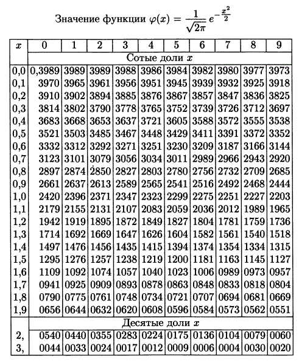
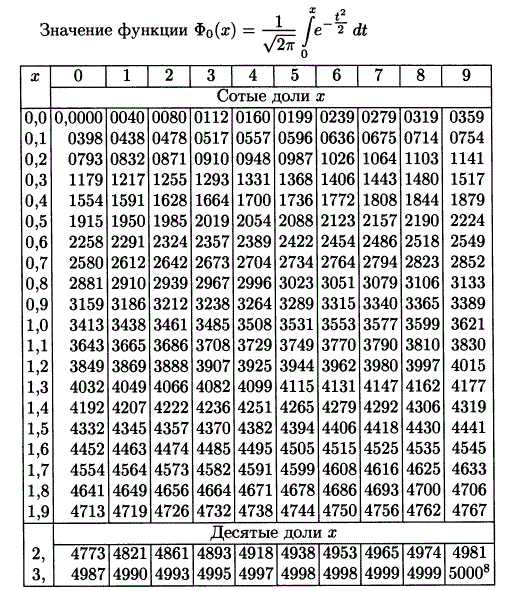

## Теория вероятностей

Основано на лекциях Чанги Мориса Евгеньевича.

### Аннотация

**Множество элементарных исходов** - множество, содержащее все возможные результаты эксперимента, из которых в результате происходит только один. **Событие** - множество, состоящее из элементарных исходов.

Пусть **условная вероятность** $P_A(B)$ - вероятность события $B$ при условии, что произошло событие $A$. Тогда вероятность произведения событий:
$$P(A_1\cdot A_2\cdot\ldots\cdot A_n)=P(A_1)\cdot P_{A_1}(A_2)\cdot P_{A_1A_2}(A_3)\cdot\ldots\cdot P_{A_1A_2\ldots A_{n-1}}(A_n)$$

**Формула Байеса** позволяет рассчитать вероятность события, если причину и следствие поменять местами
$$P_A(B)=\frac{P(AB)}{P(A)}=P_B(A)\cdot\frac{P(B)}{P(A)}$$
**Схема Бернулли** - последовательность независимых испытаний, в каждом из которых возможны два исхода - успех и неудача. Вероятность $m$ успехов в $n$ испытаниях равна:
$$P_n(m)=С_n^mp^mq^{n-m}$$
При большом количестве испытаний используют теорему Пуассона или теоремы Муавра-Лапласа. При большом количестве испытаний и не слишком малой вероятности ($npq>10$) можно использовать **интегральную теорему Муавра-Лапласа**:
$$P_n(m_1\leq m\leq m_2)\rightarrow\Phi(x_2)-\Phi(x_1)$$
$$\Phi(x)=\frac{1}{\sqrt{2\pi}}\int_0^xe^{-\frac{t^2}{2}}dt;\quad x_1=\frac{m_1-np}{\sqrt{npq}};\quad x_2=\frac{m_2-np}{\sqrt{npq}}$$
**Функцией распределения** случайной величины $\xi$ называется функция
$$F(x)=P(\xi<x)$$
**Математическое ожидание**:
$$M\xi=\sum_kx_k\cdot p_k,\quad\xi\text{ - дискретная}$$
$$M\xi=\int_{-\infty}^{\infty}x\cdot p(x)\;dx,\quad\xi\text{ - непрерывная}$$
**Дисперсия**:
$$D\xi=M(\xi-M\xi)^2$$

**Ковариация** является мерой совместной изменчивости двух случайных величин. Для случайных величин $\xi$ и $\eta$ формула ковариации:
$$cov(\xi,\eta)=M((\xi-M\xi)(\eta-M\eta))=M\xi\eta-M\xi M\eta$$
Нормализованная версия ковариации, **коэффициент корреляции** случайных величин $\xi$ и $\eta$, показывает силу линейной зависимости.
$$r_{\xi,\eta}=\frac{cov(\xi,\eta)}{\sqrt{D\xi}\cdot\sqrt{D\eta}}$$

**Неравенство Чебышёва**. $\forall\varepsilon>0$:
$$P(|\xi-M\xi|>\varepsilon)\leq\frac{D\xi}{\varepsilon^2}$$

**Закон больших чисел**. Пусть $\xi_1,\xi_2,\ldots,\xi_n$ - независимые одинаково распределённые случайные величины. Тогда $\forall\varepsilon>0$
$$P\left(\left|\frac{\xi_1+\xi_2+\ldots+\xi_n}{n}-M\xi\right|<\varepsilon\right)\rightarrow 1$$

### Элементарный исход, событие, относительная частота события, классическая и геометрическая вероятности.

**Множество элементарных исходов** $\Omega$ - множество, содержащее все возможные результаты эксперимента, из которых в результате происходит ровно один.

**Элементарный исход** - элемент множества элементарных исходов. $\omega\in\Omega$.

**Событие** - подмножество множества элементарных исходов. $A\subset\Omega$.

**Относительная частота события** $A$ - отношение количества опытов, в которых произошло событие $A$, к общему числу испытаний.

**Классическая вероятность события** - отношение количества элементов множества события к количеству элементов в множестве элементарных исходов.

Пусть $\mu$ - мера множества (длина, площадь, объём или др.). Тогда:
**Геометрическая вероятность** события $A$ равна отношению $\mu(A)$ к $\mu(\Omega)$.

### Аксиоматика алгебры событий, аксиомы вероятности. Вероятностное пространство.

Множество событий называется алгеброй событий, если $\forall A,B\in\mathscr{A}$ выполняются следующие аксиомы:
1. $A+B\in\mathscr{A}$;
2. $A\cdot B\in\mathscr{A}$;
3. $A\backslash B\in\mathscr{A}$;
4. $\Omega\in\mathscr{A}$.

Числовая функция $P(A)$, определённая для любого события из алгебры событий, называется вероятностью события $A$, если:
1. Аксиома неотрицательности: $\forall A\in\mathscr{A} P(A)\geq0$;
2. Аксиома нормированности: $P(\Omega)=1$;
3. Аксиома аддитивности: $A\cdot B=0\Rightarrow P(A+B)=P(A)+P(B)$. То есть вероятность суммы несовместных событий равна сумме их вероятностей;
4. Аксиома непрерывности: если $A_1\supset A_2\supset\ldots A_n\supset\ldots$ и $\prod_1^\infty A_n=\varnothing$, то $\lim_{n\rightarrow\infty}P(A_n)=0$.

Тройка $(\Omega,\mathscr{A},P)$ называется вероятностным пространством.

### Условная вероятность, умножение событий. Независимые, несовместные события.

Пусть $N$ - число опытов; $N_A$ - число опытов, в которых произошло $A$; $N_{AB}$ - число опытов, в которых произошли и $A$, и $B$.
$$\frac{N_{AB}}{N_A}=\frac{\frac{N_{AB}}{N}}{\frac{N_A}{N}}\Rightarrow P_A(B)=\frac{P(AB)}{P(A)}$$
Условной вероятностью $P_A(B)$ называется вероятность события $B$ при условии, что произошло событие $A$.

Теорема об умножении событий:
$$P(A_1\cdot A_2\cdot\ldots\cdot A_n)=P(A_1)\cdot P_{A_1}(A_2)\cdot P_{A_1A_2}(A_3)\cdot\ldots\cdot P_{A_1A_2\ldots A_{n-1}}(A_n)$$
События $A$ и $B$ называются независимыми, если $A\cdot B=0$.
События $A$ и $B$ называются несовместными, если $A+B=0$.

### Полная группа событий, формула полной вероятности. Формула Байеса.

События $H_1,H_2,\ldots,H_n$ составляют полную группу событий, если они попарно несовместны, а их сумма равна множеству элементарных исходов.

Формула полной вероятности:
$$P(A)=\sum_{i=1}^nP(H_i)\cdot P_{H_i}(A)$$
Формула Байеса:
$$P_A(H_i)=\frac{P(AH_i)}{P(A)}=\frac{P(H_i)P_{H_i}(A)}{P(H_1)P_{H_1}(A)+\ldots+P(H_n)P_{H_n}(A)}$$

### Схема Бернулли, теорема Бернулли. Теорема Пуассона.

**Схема Бернулли** - последовательность независимых испытаний, в каждом из которых возможны два исхода - успех и неудача.

Пусть $n$ - количество испытаний; $p$ - вероятность успеха в одном испытании; $q=1-p$ - вероятность неудачи в одном испытании, $P_n(m)$ - вероятность $m$ успехов в $n$ испытаниях.

Теорема Бернулли:
$$P_n(m)=С_n^mp^mq^{n-m}$$
Теорема Пуассона:
Пусть $n\rightarrow\infty$, $p\rightarrow0$, $np\rightarrow\lambda$. Тогда:
$$P_n(m)=\frac{\lambda^m}{m!}e^{-\lambda}$$
Доказательство:
$$P_n(m)=С_n^mp^mq^{n-m}=\frac{n!}{m!(n-m)!}\left(\frac{\lambda}{n}\right)^m(1-p)^{(n-m)}=\frac{\lambda^m}{m!}\left(1-\frac{\lambda}{n}\right)^{n-m}\prod\nolimits_{i=n-m+1}^{n}\frac{i}{n}$$
$$\lim_{n\rightarrow\infty}\left(1-\frac{\lambda}{n}\right)^{n-m}=e^{-\lambda},\quad\lim_{n\rightarrow\infty}\prod\nolimits_{i=n-m+1}^{n}\frac{i}{n}=1$$
$$\lim_{n\rightarrow\infty}P_n(m)=\frac{\lambda^m}{m!}e^{-\lambda}$$

### Локальная и интегральная теоремы Муавра-Лапласа. Отклонение относительной частоты.

Локальная теорема Муавра-Лапласа:
$$\lim_{n\rightarrow\infty}P_n(m)=\frac{1}{\sqrt{npq}}\cdot\varphi(x)$$
где $\varphi$ - функция Гаусса
$$\varphi(x)=\frac{1}{\sqrt{2\Pi}}\cdot e^{-\frac{x^2}{2}}$$

$$x_m=\frac{m-np}{\sqrt{npq}}$$
Интегральная теорема Муавра-Лапласа:
$$P_n(m_1\leq m\leq m_2)\rightarrow\Phi(x_2)-\Phi(x_1)$$
где $\Phi$ - функция Лапласа
$$\Phi(x)=\frac{1}{\sqrt{2\pi}}\int_0^xe^{-\frac{t^2}{2}}dt$$
Доказательство:
$$P_n(m_1\leq m\leq m_2)=\sum_{i=m_1}^{m_2}P_n(i)=\sum_{i=m_1}^{m_2}\frac{1}{\sqrt{npq}}\varphi(x_i)+R$$
При постоянных $n$ и $p$, функция $x(m,n,p)$ - постоянная.
$$\Delta x=x_{m+1}-x_{m}=\frac{m_{i+1}-np}{\sqrt{npq}}-\frac{m_{i}-np}{\sqrt{npq}}=\frac{m_{i+1}-m_i}{\sqrt{npq}}=\frac{1}{\sqrt{npq}}$$
$$P_n(m_1\leq m\leq m_2)=\sum\Delta x\varphi(x_m)\longrightarrow\int_{x_1}^{x_2}\varphi(t)dt=\Phi(x_2)-\Phi(x_1)$$
Следствие 1:
$$P\left(|\frac{m}{n}-p|\leq\varepsilon\right)=P\left(p-\varepsilon\leq\frac{m}{n}\leq p+\varepsilon\right)=P\left(np-n\varepsilon\leq m\leq np+n\varepsilon\right)$$
$$x_1=\frac{m_1-np}{\sqrt{npq}}-\frac{-n\varepsilon}{\sqrt{npq}}=-\varepsilon\sqrt{\frac{n}{pq}}$$

$$x_2=\frac{m_2-np}{\sqrt{npq}}=\frac{n\varepsilon}{\sqrt{npq}}=\varepsilon\sqrt{\frac{n}{pq}}$$

$$P\left(|\frac{m}{n}-p|\leq\varepsilon\right)=2\Phi\left(\varepsilon\sqrt{\frac{n}{pq}}\right)$$
Следствие 2:
Пусть $P\left(|\frac{m}{n}-p|\leq\varepsilon\right)=\gamma$. Тогда
$$\varepsilon=\frac{\Phi^{-1}(\frac{\gamma}{2})}{\sqrt{\frac{n}{pq}}}$$

### Случайная величина. Функция распределения и её свойства. Дискретные и непрерывные случайные величины.

Случайная величина $\xi$ - числовая функция, определённая на множестве элементарных исходов, такая, что событие $\xi(\omega)<x$ принадлежит $\mathscr{A}$ при $x\in\mathbb{R}$.

Функцией распределения случайной величины $\xi$ называется функция
$$F(x)=P(\xi<x)$$
Свойства функции распределения:
1. $P(x_1\leq\xi <x_2=F(x_2)-F(x_1)$;
2. $F(x)$ - неубывающая функция;
3. $\lim_{x\rightarrow-\infty}=\lim_{x\rightarrow-\infty}P(\xi-x)\lim_{x-\rightarrow\infty}P(\xi<-x)=0$ (по аксиоме непрерывности);
4. $\lim_{x\rightarrow+\infty}=\lim_{x\rightarrow+\infty}P(\xi-x)\lim_{x-\rightarrow\infty}P(1-P(\xi\geq x))=1-0=0$ (по аксиоме непрерывности);
5. $\lim_{x\rightarrow a-0} F(x)=F(a)$ ($F(x)$ непрерывна слева);
6. $P(\xi=a)=F(a+0)-F(a)$.

Случайная величина называется дискретной, если существует конечный или счётный набор чисел $x_1,x_2,\ldots$ такой, что
$$\sum_k P(\xi=k)=1$$
Случайная величина называется абсолютно непрерывной, если существует неотрицательная интегрируемая функция $p(x)$ такая, что
$$F(x)=\int_{-\infty}^xp(t)dt$$
$p(x)$ называется плотностью распределения.

### Некоторые виды распределений: биномиальное, геометрическое, Пуассона, равномерное, показательное, нормальное.

#### Биномиальное распределение
$$P(\xi=k)=C_n^kp^kq^{n-k}$$

$$M\xi=0\cdot q+1\cdot p=np$$

$$D\xi=npq$$

#### Геометрическое распределение
$$p(\xi=k)=p\cdot q^{k-1}$$

$$M\xi=\frac{1}{p}$$

$$D\xi=\frac{q}{p^2}$$

#### Распределение Пуассона
Распределение Пуассона - последовательность чисел $\frac{\lambda^k}{k!}e^{-\lambda}, k\in\mathbb{N}$.
$$M\xi=\lambda$$

$$D\xi=\lambda$$

#### Равномерное распределение

$$p(x)=\begin{cases}\frac{1}{b-a},x\in[a;b]\\\ 0,x\notin[a;b]\end{cases}$$

$$M\xi=\frac{a+b}{2}$$

$$D\xi=\frac{(b-a)^2}{12}$$

#### Показательное распределение

$$p(x)=\begin{cases}0,x<0\\\ \lambda e^{-\lambda x},x\geq0\end{cases}$$

$$M\xi=\frac{1}{\lambda}$$

$$D\xi=\frac{1}{\lambda^2}$$

#### Нормальное распределение
$$p(x)=\frac{1}{\sigma}\cdot\varphi\left(\frac{x-a}{\sigma}\right)$$

$$M\xi=a$$

$$D\xi=\sigma^2$$

### Функция совместного распределения. Независимость случайных величин.

Пусть $\xi$, $\eta$ - случайные величины.
$$F_{\xi,\eta}=P(\xi<x;\;\eta<y)$$
Утверждение:
$$P(x_1\leq\xi<x_2;y_1\leq\eta<y_2)=F(x_2,y_2)-F(x_1,y_2)-F(x_2,y_1)+F(x_1,y_1)$$
Случайные величины $\xi$ и $\eta$ называются независимыми, если
$$F_{\xi,\eta}(x,y)=F_\xi(x)\cdot F_\eta(y)$$
Утверждение. Для дискретных $\xi$, $\eta$:
$$P(\xi=x_i;\eta=y_j)=P(\xi=x_i)P(\eta=y_j)$$
Утверждение. Для абсолютно непрерывных $\xi$, $\eta$:
$$p_{\xi,\eta}(x,y)=p_\xi(x)\cdot p_\eta(y)$$

### Математическое ожидание и его свойства. Математическое ожидание квадрата.

Для дискретной случайной величины $\xi$:
$$M\xi=\sum_kx_k\cdot p_k$$
Для абсолютно непрерывной случайной величины $\xi$:
$$M\xi=\int_{-\infty}^{\infty}x\cdot p(x)\;dx$$
Свойства математического ожидания:
1. $Mc=c$;
2. $\xi\geq0\Rightarrow M\xi\geq0$;
3. $M(c\xi)=cM\xi$;
4. $M(\xi+\eta)=M\xi+M\eta$;
5. Если $\xi$ и $\eta$ независимы, то $M(\xi\eta)=M\xi\cdot M\eta$.

Математическое ожидание квадрата:
$$M\xi^2=\int_{-\infty}^{+\infty}x^2\cdot p_\xi(x)\;dx$$

### Дисперсия и её свойства. Ковариация и её свойства. Коэффициент корреляции.

Дисперсия случайной величины определяется как
$$D\xi=M(\xi-M\xi)^2$$
Свойства дисперсии:
1. $D\xi=M(\xi-M\xi)^2=M(\xi^2-2\xi\cdot M\xi+M^2\xi)=M\xi^2-2M\xi M\xi+M^2\xi=M\xi^2-M^2\xi$;
2. Дисперсия неотрицательна;
3. $Dc=0$;
4. $D(c\xi)=c^2D\xi$;
5. Если $\xi$ и $\eta$ независимы, то $D(\xi+\eta)=D\xi+D\eta$.

Ковариация случайных величин $\xi$ и $\eta$:
$$cov(\xi,\eta)=M((\xi-M\xi)(\eta-M\eta))$$
Свойства ковариации:
1. $cov(\xi,\xi)=D\xi$;
2. $cov(\xi,\eta)=M(\xi\eta-\eta M\xi-\xi M\eta_M\xi V\eta)=M\xi\eta-M\xi M\eta-M\eta M\xi+M\xi M\eta=M\xi\eta-M\xi M\eta$;
3. $D(\xi+\eta)=D\xi+D\eta+2cov(\xi,\eta)$;
4. Если $\xi$ и $\eta$ независимы, то $cov(\xi,\eta)=0$;
5. $cov(\xi,\eta)=cov(\eta,\xi)$;
6. $cov(c\xi,\eta)=c\cdot cov(\xi,\eta)$;
7. $cov(\xi_1+\xi_2,\eta)=cov(\xi_1,\eta)+cov(\xi_2,\eta)$;
8. $|cov(\xi,\eta)|\leq\sqrt{D\xi}\cdot\sqrt{D\eta}$.

Коэффициент корреляции случайных величин $\xi$ и $\eta$
$$r_{\xi,\eta}=\frac{cov(\xi,\eta)}{\sqrt{D\xi}\cdot\sqrt{D\eta}}$$
Свойства коэффициента корреляции:
1. $|r_{\xi,\eta}|\leq1$;
2. Если $\xi$ и $\eta$ независимы, то $r_{\xi,\eta}=0$;
3. Если $\eta=a\xi+b$, то $|r_{\xi,\eta}|=1$.

### Моменты распределения. Уравнение регрессии. Корреляционная матрица.

Более общей числовой характеристикой являются моменты распределения.
- Начальным моментом порядка $s$ называется $$d_s=M(X^s)$$
- Центральным моментом порядка $s$ называется $$\mu_s=M\left((\xi-M\xi)^s\right)$$
- Абсолютным моментом порядка $s$ называется $$\nu_s=M\left(|\xi-M\xi|^s\right)$$
- Смешанный начальный момент порядка $s$, $t$ $$d_{s,t}=M(\xi^s,\eta^t)$$
- Смешанный центральный момент порядка $s$, $t$ $$\mu_{s,t}=M\left((\xi-M\xi)^s(\eta-M\eta)^t\right)$$

Примеры моментов распределения:
- *Дисперсия* является центральным моментом второго порядка;
- Средние отклонения - это абсолютный момент первого порядка;
- *Асимметрия* $S_k=A_s=\frac{\mu_3}{\sigma^3}$. Для симметричного распределения асимметрия равна нулю; при положительной асимметрии будет искажена правая ветвь распределения, а при отрицательной - левая;
- *Эксцесс* $E=\frac{\mu_4}{\sigma^4}-3$ характеризует вытянутость распределения. Для нормального распределения эксцесс нулевой; при положительном эксцессе кривая вытягивается, а при отрицательном - становится пологой.
- *Корреляционный момент* - центральный смешанный момент второго порядка. Корреляционный момент равен нулю, если между случайными величинами отсутствует корреляционная зависимость. Но из равенства нулю корреляционного момента не следует вывод о полной отсутствии зависимости. Только в случае нормального закона распределения понятия зависимости и коррелированности совпадают.

Уравнение регрессии имеет вид:
$$y=\rho_{y/x}x+(My-\rho_{y/x}Mx)$$

$$\rho_{y/x}=r_{x,y}\cdot\frac{\sigma_y}{\sigma_x}$$

Обобщённым понятием дисперсии для случайного вектора $x$ будет корреляционная матрица
$$K=M\left((x-Mx)(x-Mx)^T\right)=$$
$$=\begin{pmatrix}\sigma_1^2&k_{12}&k_{13}&\cdots&k_{1n}\\\ k_{21}&\sigma_2^2&k_{23}&\cdots&k_{2n}\\\ k_{31}&k_{32}&\sigma_3^2&\cdots&k_{3n}\\\ \vdots&\vdots&\vdots&\ddots&\vdots\\\ k_{n1}&k_{n2}&k_{n3}&\cdots&\sigma_n^2\end{pmatrix}$$
где $Mx$ - вектор математических ожиданий случайных величин.

Свойства корреляционной матрицы:
1. По диагонали стоят дисперсии;
2. Недиагональные элементы являются корреляционными моментами;
3. Симметричность.

Если элементы корреляционной матрицы разделить построчно на соответствующие дисперсии, получим нормированную корреляционную матрицу.
$$\overline{K}=\begin{pmatrix}1&r_{12}&r_{13}&\cdots&r_{1n}\\\ r_{21}&1&r_{23}&\cdots&r_{2n}\\\ r_{31}&r_{32}&1&\cdots&r_{3n}\\\ \vdots&\vdots&\vdots&\ddots&\vdots\\\ r_{n1}&r_{n2}&r_{n3}&\cdots&1\end{pmatrix}$$

### Неравенство Чебышёва. Закон больших чисел.

Утверждение. Пусть $\xi$ - неотрицательная случайная величина. Тогда $\forall\varepsilon>0$
$$P(\xi>\varepsilon)\leq\frac{M\xi}{\varepsilon}$$
Доказательство. Для дискретных:
$$M\xi=\sum x_ip_i\geq\sum_{x_i>\varepsilon}\geq\varepsilon\sum_{x_i>\varepsilon}p_i=\varepsilon\cdot P(\xi>\varepsilon)$$
Для абсолютно непрерывных:
$$M\xi=\int_0^\infty x\cdotp(x)\;dx\geq\int_\varepsilon^\infty x\cdotp(x)\;dx\geq\varepsilon\int_\varepsilon^\infty p(x)\;dx=\varepsilon\cdot P(\xi>\varepsilon)$$
Теорема. **Неравенство Чебышёва**. $\forall\varepsilon>0$:
$$P(|\xi-M\xi|>\varepsilon)\leq\frac{D\xi}{\varepsilon^2}$$
Доказательство:
$$P(|\xi-M\xi|>\varepsilon)=P((\xi-M\xi)^2>\varepsilon^2)\leq\frac{M(\xi-M\xi)^2}{\varepsilon^2}=\frac{D\xi}{\varepsilon^2}$$
Теорема. **Закон больших чисел**. Пусть $\xi_1,\xi_2,\ldots,\xi_n$ - независимые одинаково распределённые случайные величины. Тогда $\forall\varepsilon>0$
$$P\left(\left|\frac{\xi_1+\xi_2+\ldots+\xi_n}{n}-M\xi\right|<\varepsilon\right)\rightarrow 1$$
Доказательство. Пусть $\sum\xi_i\cdot\frac{1}{n}$, тогда.
$$D\xi=\frac{1}{n^2}\sum D\xi_i=\frac{\sigma^2}{n}$$
$$P(|\xi-M\xi|>\varepsilon)\leq\frac{\sigma^2}{n\varepsilon^2}$$
$$P(|\xi-M\xi|\leq\xi)=1-P(|\xi-M\xi|>\varepsilon)>1-\frac{\sigma^2}{n\varepsilon^2}\longrightarrow 1$$

### Выборка, оценка параметра. Несмещённые и состоятельные выборки. Выборочное среднее. Выборочная дисперсия. Исправленная дисперсия.

Выборкой объёма $n$ называется набор $n$ независимых одинаково распределённых случайных величин $x_1,x_2,\ldots,x_n$.

Пусть $F(x,\Theta)$ - функция распределения величин $x_1,x_2,\ldots,x_n$; $\Theta_n(x_1,x_2,\ldots,x_n)$ - оценка параметра $\Theta$ (точечная оценка).

Если $M\Theta_n=\Theta$, то оценка называется несмещённой.

Если $P(|\Theta_n-\Theta|\leq\varepsilon)\rightarrow1\quad\forall\varepsilon>0$, то оценка называется состоятельной.

**Выборочное среднее** - несмещённая и состоятельная оценка математического ожидания.
$$\overline{x}=\frac{x_1+x_2+\ldots+x_n}{n}$$
**Выборочная дисперсия**, вычисленная с использованием выборочного среднего вместо математического ожидания, является состоятельной оценкой дисперсии, но не несмещённой.
$$D_{в}=\frac{\sum(x_i-\overline{x})^2}{n}$$
**Исправленная выборочная дисперсия** - несмещённая и состоятельная оценка дисперсии.
$$S_{в}=\frac{\sum(x_i-\overline{x})^2}{n-1}$$

Покажем, что выборочная дисперсия является смещённой оценкой:
Пусть $a=Mx$ и $y_i=x_i-a$, тогда $\overline{y}=\overline{x}-a$; $My=0$; $\sum My_i^2=\sigma^2$ и:
$$D_в=\frac{1}{n}\sum(x_i-\overline x)^2=\frac{1}{n}\sum(x_i-a-(\overline{x}-a))=\frac{1}{a}\sum(y-\overline{y})^2=$$

$$=\frac{1}{n}\left(\sum y_i^2-2\overline{y}\sum y_i+n\overline{y}^2\right)=\frac{1}{n}\left(\sum y_i^2-2\overline{y}\cdot\overline{y}+\overline{y}^2\right)=\frac{1}{n}\sum\left(y_i^2-\overline{y}^2\right)$$
Рассчитаем теперь математическое ожидание:
$$MD_в=\frac{1}{n}M\left(\sum y_i^2-\left(\frac{\sum y_i}{n}\right)^2\right)=\frac{1}{n}\sum My_i^2-\frac{1}{n^2}M\left(\sum y_i\right)^2=\\\ =\sigma^2-\frac{1}{n^2}M(\sum y_i^2+\sum_{i\neq j}y_iy_j)=\sigma^2-\frac{1}{n}\sigma^2-\frac{1}{n^2}\sum_{i\neq j}My_iMy_j=\sigma^2-\frac{\sigma^2}{n}=\frac{n-1}{n}\sigma^2$$
Следовательно, выборочная дисперсия является смещённой оценкой. И для того, чтобы её исправить, её следует умножить на $\frac{n}{n-1}$.

## Приложение

### Таблица функции Гаусса

### Таблица функции Лапласа

