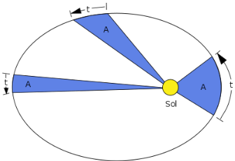
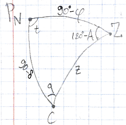
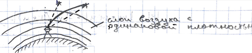
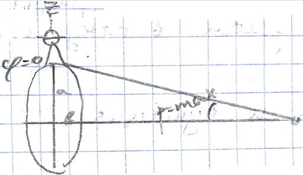

## Сферическая астрономия.

Основано на лекциях Суслина Василия Ивановича, Хохлова Дмитрия Андреевича, Сухарева-Крылова Ивана Александровича.

### Небесная сфера. Круги, оси и точки небесной сферы.

В сферической астрономии вводят небесную сферу сколь угодно большого радиуса. Она позволяет убрать из рассмотрения высоту светила и тем самым облегчает использование сферических систем координат.

Отвесная линия пересекает сферу в двух точках. Точка над головой наблюдателя называется *зенитом* ($Z$), а противоположная - *надиром* ($Z'$).

Видимое движение небесных светил происходит вокруг некоторой оси которую называют *осью мира* $PP'$. Ось мира пересекает небесную сферу в двух точках: северном ($P$) и южном  $P'$ полюсах мира.

Если секущая плоскость проходит через центр сферы, в сечении образуется *большой круг небесной сферы*. Если не проходит через центр - то круг сечения называется *малым кругом небесной сферы*.

*Истинный (небесный, математический) горизонт* - большой круг небесной сферы, перпендикулярный оси зенит-надир. *Видимый горизонт* - малый круг небесной сферы.

*Небесный экватор* - большой круг небесной сферы, проходящий через её центр и перпендикулярный оси мира.

*Полуденная линия* - проекция точек экватора на горизонт.

Верхняя и нижняя точки экватора (*север* и *юг*), находятся на оси, перпендикулярной к оси мира $PP'$. Точки пересечения экватора и горизонта называются точками *востока* и *запада*.

*Небесный меридиан* - большой круг, проходящий через полюса мира, зенит и надир.

*Первый вертикал* - это вертикальный (проходящий через зенит и надир) круг, проходящий через точки востока и запада.

*Суточная параллель* - малый круг небесной сферы, по которому происходит видимое движение звёзд.

Момент прохождения светила через небесный меридиан называется *кульминацией* светила. Точки пересечения суточной параллели с небесным меридианом называются точками *верхней* и *нижней кульминации*.
- *Незаходящая звезда* - это звезда, которая оба раза кульминирует в первом полушарии.
- *Заходящая звезда* - это звезда, пересекающая плоскость горизонта.
- Невосходящая звезда кульминирует оба раза в противоположном полушарии.

Круг склонений - это большой круг небесной сферы, который проходит через данную звезду и полюса мира.

Точка весеннего равноденствия $\gamma$ - это точка, в которой Солнце переходит из южного полушария в северное.

Эклиптика - большой круг небесной сферы, по которому происходит видимое с Земли годичное движение Солнца относительно звёзд. Угол между плоскостями эклиптики и экватора составляет $23^\circ26'$.

### Системы координат в астрономии.

#### Горизонтальная система координат

*Горизонтальная система координат* - астрономическая система координат, в которой положение звезды на небесной сфере описывается зенитным расстоянием и азимутом.

*Зенитное расстояние светила* $z$ - это расстояние от зенита до светила по вертикалу. $z\in[0^\circ;180^{\circ}]$.

*Высота светила* $h$ - это дуга вертикала от горизонта до светила. $h\in[0^\circ;\pm90^\circ]$.
$$z+h=90^\circ$$
*Азимут светила* $A$ - дуга от точки юга до основания вертикала. Или двугранный угол между плоскостью заданного меридиана точки наблюдения и вертикальной плоскостью, проходящей через эту точку и наблюдаемый объект. $A\in[0^\circ;360^\circ]$ и измеряется по часовой стрелке.

#### Первая экваториальная система координат

Первая экваториальная система координат - астрономическая система координат, в которой положение звезды на небесной сфере описывается склонением $\delta$ и часовым углом $t^h$.

*Склонение звезды* $\delta$ или $dec$ - угловое расстояние от плоскости небесного экватора до светила. Оно положительно для объектов в северном полушарии и отрицательно - в южном.

*Часовой угол* $t^h$ - это двугранный угол между плоскостью небесного меридиана и кругом склонения. Часовой угол звезды в момент верхней кульминации равен нулю, а в нижней - $12^h$. Измеряется в часах. $12^h=180^\circ$, $1^h=15^\circ$.

#### Вторая экваториальная система координат

Первая экваториальная система координат - астрономическая система координат, в которой положение звезды на небесной сфере описывается склонением $\delta$ и прямым восхождением $\alpha$.

Прямое восхождение $\alpha$ - это дуга небесного экватора от точки весеннего равноденствия до круга склонений. 

#### Эклиптическая система координат

Эклиптическая система координат — это система небесных координат, в которой основной плоскостью является плоскость эклиптики, а полюсом — полюс эклиптики.

Все известные планеты Солнечной системы и большинство других тел в ней движутся вблизи плоскости эклиптики в том же направлении, что и Земля. Созвездия, лежащие в плоскости эклиптики, называются зодиакальными созвездиями.

#### Галактическая система координат

Галактическая система координат — это система небесных координат, имеющая начало отсчёта в Солнце и направление отсчёта от центра галактики Млечный Путь. 

### Звёздное время. Истинное солнечное время. Законы Кеплера. Эклиптическое Солнце. Экваториальное Солнце. Уравнение времени.

Звёздное время - часовой угол точки весеннего равноденствия.
$$s=t_\gamma=\alpha+t$$
В верхней кульминации $t=0$, $s=\alpha$.
В нижней кульминации $t=12^h$, $s=\alpha\pm12^h$.

В основе истинного солнечного времени лежит истинное движение Солнца.
$$m_\odot=t_\odot+12^h$$
где $t_\odot$ - часовой угол Солнца, а $12^h$ добавляется для того, чтобы смена даты не приходилась на полдень.

*Истинные солнечные сутки* - это промежуток времени между двумя последовательными нижними кульминациями истинного Солнца.

Законы Кеплера:
1. Орбита всякого тела есть кривая второго порядка (эллипс, парабола), в одном из фокусов которой находится притягивающее тело;
2. В равные промежутки времени радиус-вектор планеты описывает равные площади;
3. Квадраты периодов обращения планет вокруг Солнца относятся, как кубы больших полуосей орбит планет. Ньютон позже показал , что третий закон Кеплера не совсем точен — в действительности в него входит и масса планеты: $$\frac{T_1^2(M_\odot+m_1)}{T_2^2(M_\odot+m_2)}=\frac{a_1^3}{a_2^3}$$

*Афелий* - наиболее удалённая от Солнца точка орбиты планеты; *Перигелий* - ближайшая к Солнцу точка орбиты; *Линия апсид* - отрезок, соединяющий апсиды (экстремальные точки эллиптической орбиты).

Из законов Кеплера выходит, что Скорость движения Солнца по небесной сфере выше, когда Земля вблизи перицентра, и ниже вблизи афоцентра. То есть Солнце движется по небесной сфере неравномерно. Было предложено ввести фиктивное эклиптическое Солнце, которое бы равномерно двигалось по эклиптике.
$$m_{\odot_\varepsilon}\sim m_\odot$$
Однако введение среднего эклиптического Солнца не привело к постоянной единице времени, так как проекция дуг эклиптики на экватор меняется в течение года. Тогда предложили среднее экваториальное Солнце.

*Средние солнечные сутки* - это промежуток времени между двумя последовательными нижними кульминациями среднего Солнца.

Уравнением времени называется следующее уравнение:
$$m_\circ-m=\eta$$
где $\eta$ - поправка, которую добавляют для того, чтобы истинное и среднее солнечные времена совпадали в точках равноденствия, солнцестояния и апсид.
$$\eta\in[-14^m;+16^m]$$
Отрицательные величины неудобны, и поэтому с 1965 г. поправку записывают в виде:
$$E=\eta+12^h$$
### Вторая главная теорема астрономии. Часовые пояса. Гномон.

Вторая главная теорема астрономии: разность часовых углов одного и того же светила, измеренных в разных точках земной поверхности в один и тот же физический момент времени равняется разности долгот этих точек.
$$t_A=t_B=\lambda_A-\lambda_B=s_A-s_B=m_{\odot_A}-m_{\odot_B}=m_A-m_B$$
Принимая Гринвич за начальный пункт, запишем:
$$\lambda=s-S=m_\odot-M_\odot=m-M$$
где $S$ - звёздное время на Гринвиче, $M_\odot$ - истинное солнечное время на Гринвиче, $M$ - среднее солнечное время на Гринвиче.

Чтобы разные регионы не жили по разному времени, и не было необходимости при каждом шаге переводить стрелку часов, было предложено разделить Землю на часовые пояса (с учётом административных границ). Поясное время $T_п$ в зависимости от номера пояса выражается следующим образом:
$$T_п=M+n^h$$
Для Москвы поясное время составляет $T_{моск.поясн.}=M+2^h$. С 1930 г. стрелки часов были переведены на 1 час. Такое время стали называть декретным. Поэтому
$$T_{МСК}=M+3^h$$

### Связь среднего солнечного времени и звёздного времени.

Эклиптическое и экваториальные Солнца движутся с разными скоростями. И за эклиптические сутки среднее экваториальное Солнце не успевает сделать полный оборот и задерживается на $4^m$.

Тропический год - это отрезок времени, за который Солнце совершает один цикл смены времён года. То есть от точки весеннего равноденствия до точки весеннего равноденствия.
$$1\text{троп.год}=366.2422\ldots\text{звёздных суток}=265.2422\ldots\text{средних солнечных суток}$$

<video controls>
  <source src="media/astro-0-sider-80.mp4" type="video/mp4">
</video>

Переход от средних солнечных суток к звёздным совершается по следующей формуле:
$$s=s_0+m+m\mu=s_0+m(1+\mu)$$
где $\mu=\frac{3600}{365.2422}\approx9,856^{s/h}$, $s_0=S_o\pm\lambda m$ (к востоку -, к западу +).

Переход от звёздных суток к средним солнечным совершается по следующей формуле:
$$m=(s-s_0)-(s-s_0)\nu=(s-s_0)(1-\nu)$$
где $\nu=\frac{3600}{366,2422}\approx9,830^{s/h}$.

### Эфемеридное время, динамическое время. Всемирное время.

**Эфемеридное время** (ET) - введённое как стандарт в 1952 году, исходно разрабатывалось как приближение к однородной временной шкале, освобождённой от эффектов нерегулярности вращения Земли. Так как тропический год не является постоянным, то за эталон принята продолжительность тропического года в фундаментальную эпоху 1900.0 янв. В 1967 году в СИ было введено другое определение секунды, основанное на атомных часах. $$ET=M+\Delta T$$где $\Delta T$ - поправка к среднему солнечному времени.

С 1984 года шкала эфемеридного времени ЕТ заменена двумя шкалами **динамического времени** DT: земное динамическое время TDT и барицентрическое динамическое время TDB. Динамическое время - понятие времени, которое используется как переменная в гравитационных уравнениях движения.

За период 1991—2006 гг. из-за сложностей и несогласованностей базовых определений шкалы TDB и TDT были переопределены и заменены, соответственно, на Геоцентрическое координатное время (TCG) и Барицентрическое координатное время (TCB). Эти шкалы отражают темп времени, скорректированного в соответствии с общей теорией относительности к часам, покоящимся относительно соответствующей нуль-точки вне гравитационного колодца Земли и Солнечной системы, соответственно. Из-за этого темп хода времени в данных шкалах несколько выше, чем скорость хода атомных часов на поверхности Земли, и соответственно они расходятся с локально определённым Международным атомным временем (TAI) линейно с некоторым колебаниями. Для учёта этого обстоятельства определена также шкала Земного времени (Terrestrial Time, TT), заменяющая TDT.

**Всемирное время** или UT (англ. Universal Time) — шкала времени, основанная на вращении Земли. Всемирное время является современной заменой среднего времени по Гринвичу (GMT), которое сейчас иногда некорректно используется в качестве синонима для всемирного координированного времени (UTC).

Фактически термин «всемирное время» является многозначным, так как существует несколько версий всемирного времени. Все версии всемирного времени основаны на вращении Земли относительно далёких небесных объектов (звёзд и квазаров), используя коэффициент масштабирования и другие подстройки для того, чтобы быть ближе к солнечному времени.

Основные версии всемирного времени:
- UT0 — время на мгновенном гринвичском меридиане, определённое по мгновенному положению полюсов Земли;
- UT1 — время на среднем гринвичском меридиане, учитывающее движение земных полюсов (по сути, современная версия среднего времени по Гринвичу);
- UT2 — время, исправленное на сезонную неравномерность вращения Земли.

Шкала наблюдаемого всемирного времени UT1, из-за её неравномерности, неудобна для использования в гражданской жизни. Поэтому с 1964 года ввели равномерно-переменную шкалу времени UTC — всемирного координированного времени, связывающую шкалу UT1 и шкалу строго равномерного Международного атомного времени (TAI). Масштабы UTC и TAI равны, а нульпункт меняется скачком. Дополнительная секунда при необходимости добавляется 30 июня или 31 декабря после 23:59:59.

Часовые пояса по всему миру выражаются с использованием положительных или отрицательных смещений по UTC. Самый западный часовой пояс использует UTC−12, отставая на 12 часов, а самый восточный часовой пояс использует UTC+14, опережая UTC на четырнадцать часов.

### Сферический треугольник. Параллактический треугольник.

**Сферический треугольник** - это геометрическая фигура, образованная тремя дугами окружностей больших кругов, попарно пересекающихся между собой. Для решения сферических треугольников используют сферические формулы.

Косинус стороны сферического треугольника равен произведению косинусов двух других сторон, сложенному с произведением синусов этих сторон, умноженного на косинус угла между ними.
$$\cos a=\cos b\cos c+\sin B\sin C\cos a$$
Косинус угла сферического треугольника:
$$\cos A=-\cos B\cos C+\sin B\sin C\cos a$$
Сферическая теорема синусов:
$$\frac{\sin a}{\sin A}=\frac{\sin b}{\sin B}=\frac{\sin c}{\sin C}$$
Формула пяти элементов. Произведение синуса стороны сферического треугольника на косинус прилежащего к ней угла равно произведению косинуса стороны противолежащей, на синус третьей стороны и равно синусу противолежащей стороны на косинус третьей стороны на синус угла между ними.
$$\sin a\cos C=\cos c\sin b=\sin c\cos b\cos A$$

**Параллактический треугольник** - это сферический треугольник, вершинами которого являются зенит, полюс мира и данная звезда.

Применив сферическую теорему синусов, мы сможем связать горизонтальную и первую экваториальную системы координат:
$$\frac{\sin z}{\sin t}=\frac{\sin(90-\delta)}{\sin(180-A)}=\frac{\cos\delta}{\sin A}$$

### Астрономическая рефракция. Методы расчёта рефракции. Способ Талькотта определения широты.

Астрономическая рефракция - изменение направления луча светила при прохождении через атмосферу. Чем ближе луч проходит к поверхности Земли, тем сильнее он искривляется в сторону нормали. В зените рефракция будет равна нулю.

Величина рефракции зависит от высоты наблюдаемого объекта над горизонтом и меняется от 0 в зените до приблизительно 35 минут дуги на горизонте. Рефракция на горизонте несколько превышает видимый угловой диаметр Солнца. Поэтому в тот момент, когда солнечный диск касается горизонта нижним краем, мы видим его только благодаря рефракции.

Формула Блажко для приближённого вычисления поправки:
$$\rho=21,55''\cdot\frac{B_\text{мм рт. ст.}}{273+t^\circ C}\cdot\tan z$$
Если звёзды наблюдать на одном зенитном расстоянии, то влияние рефракции практически исключится.

Способ Та́лькотта в астрономии и в геодезии — метод определения астрономической широты места наблюдения. При измерении широты способом Талькотта наблюдаются две звезды с известными склонениями, кульминации которых в данной местности проходят по разные стороны от зенита, приблизительно на одной высоте и с небольшим интервалом времени. Для нахождения широты достаточно измерить разность зенитных расстояний звёзд в кульминациях.

### Параллактическое смещение светил.

Разность между топоцентрическими и геоцентрическими направлениями называется параллаксом.

Параллакс минимален, когда наблюдаемая звезда находится в зените, и максимальна, когда наблюдаемая звезда находится у горизонта.
$$\sin p=\frac{R_{\oplus}}{\text{а.е.}}$$
Астрономическая единица (а.е.) - единица измерения расстояний в астрономии, примерно равная среднему расстоянию от Земли до Солнца. В настоящее время принята равной в точности 149 597 870 700 метрам.

Горизонтный экваториальный параллакс Солнца
$$p_\odot=8,79''$$
Годичный параллакс звёзд возникает из-за вращения Земли вокруг Солнца.
$$\pi_{max}\approx0,77''$$
В качестве единицы измерения расстояний в астрономии приняты парсеки (пк). Парсек равен расстоянию до объекта, годичный параллакс которого равен одной угловой секунде. Название образовано из сокращений слов «параллакс» и «секунда». Либо расстояние, на котором радиус Земной орбиты виден под углом в одну секунду.
$$пк=\frac{1rad}{1''}\cdot a.e.\approx3,1⋅10^{16}м$$

### Прецессия и нутация.

Явление векового — медленного — движения северного и южного полюсов мира по небесной сфере называется прецессией. Она возникает в связи с тем, что Земля имеет форму геоида — сплюснута у полюсов и ось её суточного вращения не перпендикулярна к плоскости эклиптики.

Нутация — слабое нерегулярное движение вращающегося твёрдого тела, совершающего прецессию. Напоминает «подрагивание» оси вращения и заключается в слабом изменении так называемого угла нутации между осями собственного и прецессионного вращения тела. Нутация Земли обусловлена гравитационным воздействием массивных тел Солнечной системы. Основной вклад вносит Луна, а точнее наклон её орбиты на 5° относительно плоскости эклиптики.

### Геоцентрическая широта, геодезическая широта, астрономическая широта.

Пусть точка M находится на поверхности Земли.

Геоцентрическая широта - угол между экватором и радиус-вектором от центра эллипсоида к точке M.

Геодезическая широта - угол между экватором и нормалью к эллипсоиду.

Астрономическая широта - угол между экватором и отвесной линией.

Астрономическая широта на небесной сфере - это угол между горизонтом и осью мира.