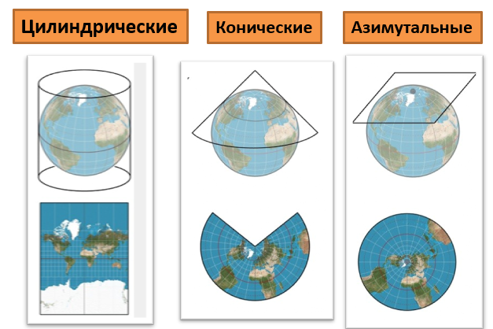
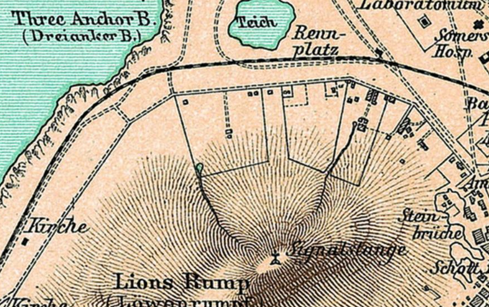

## Основы картографии.

Основано на лекциях/семинарах Николаевой Ольги Николаевны.

### Классификация карт. Специальные карты. Лесоустроительные карты.

Общегеографические карты изображают земную поверхность и находящиеся на ней основные природные и социально-экономические объекты. Включают в себя топографические карты;

Тематические карты раскрывают определённую тему. Для привязки содержания тематических карт обычно используют общегеографические карты. Классификация тематических карт:
- По тематике:
	- Карты природы:
		- Карты водных ресурсов: гидрографические, океанографические, карты режима вод, карты оценки водных ресурсов;
		- Карты земельных ресурсов: карты земельного фонда (семь категорий земельного фонда РФ), карты земельных угодий (пашни, залежи, многолетние насаждения, сенокосы), карты сельскохозяйственного использования земель;
		- Карты полезных ископаемых (минеральных ресурсов): карты металлических ПИ, неметаллических ПИ, карты горючих ПИ, комплексные карты ПИ, регистрационные карты, карты закономерностей размещения ПИ, прогнозные карты.
	- Социально-экономические (карты общественных явлений): карты населения, экономические, карты социальной инфраструктуры, политические, административные, исторические и др.
	- Специальные карты: навигационные (аэронавигационные, морские, дорожные), кадастровые, технические (инженерно-строительные карты, карты подземных коммуникаций), проектные карты (мелиоративные, лесоустроительные, землеустроительные).
- По приёмам исследования:
	- Аналитические, изображают отдельно взятое явление или одну сторону этого явления;
	- Комплексные, изображают комплекс взаимосвязанных явлений и процессов;
	- Синтетические, изображают результаты районирования или зонирования территории по синтетическому (интегральному) показателю.
- По степени объективности:
	- Документальные карты показывают реально существующие объекты и явления;
	- Прогнозные карты показывают результаты научного прогнозирования;
	- Гипотетические показывают возможное состояние каких-либо объектов или явлений согласно какой-либо научной теории или гипотезе;
	- Тенденциозные карты показывают заведомо несуществующие в реальной жизни объекты и явления.
- По практической направленности:
	- Инвентаризационные карты показывают современное, сложившееся на сегодняшний день, состояние территории, объекта, явления;
	- Оценочные карты показывают сопоставления современного состояния объекта или явления с каким-либо критерием или нормативом;
	- Прогнозные карты показывают, как может измениться территория или объект в будущем при различных сценариях развития событий;
	- Рекомендательные карты показывают, какие мероприятия целесообразно провести для изменения (улучшения) сложившейся на территории ситуации.
- По широте раскрытия темы.

Лесоустроительные карты включают в себя:
- Лесоустроительные планшеты (1:10 000 - 1:25 000). Первичный документ планово-картографических лесоустроительных материалов, содержащий план группы лесных кварталов. Составляется по результатам аэрофотосъемки, геодезической, топографической съемки и таксации леса.
- Планы лесонасаждений (1:25 000 - 1:50 000). Картографическое изображение территориального размещения насаждений в пределах конкретного лесничества.
- В более мелких масштабах составляются карты лесничеств и лесопарков, карты лесов субъектов федерации, обзорные карты лесного фонда регионального ли федерального уровня.

### Картографические проекции

**Картографическая проекция** — это математическое выражение, согласно которому трехмерная поверхность Земли переносится (проецируется) на плоскость.
- По положению полюса проекции:
	- Нормальная (линия касания расположена на экваторе), поперечная, косая.
- По характеру искажений:
	- Равноугольные, равновеликие, произвольные.
- По виду сети меридианов и параллелей:
	- Цилиндрические, конические, азимутальные, псевдоцилиндрические, псевдоконические, псевдоазимутальные, поликонические.

### Способы картографического отображения. Способы показа рельефа на картах.

Выбор способа картографического отображения зависит от пространственной локализации объекта или явления:
- Точечная локализация:
	- Способ значков. Величина знака передаёт количественные характеристики, а структура/цвет/форма значка - качественные;
	- Способ локализованных диаграмм. Используются столбчатые или круговые диаграммы.
- Линейная: способ линейных условных знаков. Ширина передаёт количественные показатели, а цвет/рисунок линии - качественные различия;
- На ограниченной площади:
	- Способ ареалов. В основном передаёт качественные характеристики с помощью цвета или штриховки ареалов. Если надо показать количественные различия, на карту наносят ареалы разных оттенков одного цвета.
- На всей территории:
	- Данные собирались в пределах административных единиц:
		- Способ картограмм: каждая административная единица раскрашивается в определённый оттенок, передающий величину картографируемого явления.
		- Способ картодиаграмм: к каждой административной границе привязывается значок, передающий параметры картографируемого явления. От способа значков отличается тем, что значки привязаны не к конкретным точкам, а к конкретной административной единице.
		- Часто используют оба способа.
	- Данные собирались в пределах природных границ:
		- Способ количественного или количественного фона. Территория разбивается на ряд небольших площадей (фоновых разностей), которые качественно или количественно отличаются между собой.
		- Способ изолиний. Используется, когда данные привязаны к серии точек наблюдения. Заключается в построении по всей территории изолиний - линий, соединяющих точки с одинаковым количеством картографируемого показателя. Часто между изолиниями на карту наносится дополнительная окраска, помогающая отличать изолинии друг от друга, а в легенде обязательно указывается шкала сечения изолиний. Способ изолиний отличается от способа качественного/количественного фона тем, что изолинии никогда не пересекаются.
		- Точечный способ.

Способы показа рельефа на картах:
- Перспективные изображения. Схематические перспективные рисунки в виде отдельных возвышенностей, хребтов, холмов и прочих положительных форм рельефа. Наглядно, но детальные характеристики рельефа получить невозможно.
- Способ штрихов. Рельеф изображают с помощью оттенения штрихами изображённых на карте склонов. Наглядно изображена пластика, но невозможно передать абсолютные и относительные отметки.
  
  - Гипсометрический способ. Рельеф изображается с помощью изолиний. Изолинии делятся на:
	- Изогипсы - линии, соединяющие на карте точки с равными высотами земной поверхности над уровнем моря;
	- Горизонтали - изогипсы с постоянной высотой сечения рельефа;
	- Изобаты - изолинии равных глубин.
- Отмывка рельефа - это создание полутонового изображения рельефа, имитирующего игру света и тени на склонах форм рельефа при определённом падении света. Направление освещения обычно принимают северо-западным. Часто его сочетают с гипсометрическим способом.

### Способы картографической генерализации.

**Генерализация** - это отбор и обобщение объектов и элементов местности при изображении их на карте.
- Отбор картографируемых объектов и явлений:
	- Ценз отбора - значение, указывающее величину или значимость объектов, сохраняемых на карте при генерализации. Цензы могут быть избирательными или исключающими.
	- Норма отбора - характеризует принятую меру (степень) отбора, среднее значение сохраняемых при генерализации объектов. Нормы отбора регулируют нагрузку карты, т.е. количество объектов на единицу площади карты.
- Обобщение геометрической формы;
- Обобщение количественной характеристики;
- Обобщение качественной характеристики (объединение таксономических подразделений карты путём перехода от видов к родам и типам).
- Переход от отдельных объектов к их собирательным обозначениям.