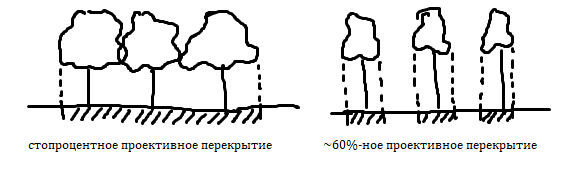
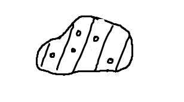

## Определение формулы леса

### Теория

Проективное перекрытие &mdash; процент площади, которую занимает крона.

Если проективное покрытие составляет менее 40%, то участок считается редколесьем.

### Определение формулы леса

1. Выбирают наиболее характерный участок местности размером 20x20 м;

2. Считают количество деревьев (всего и по породам);

3. Определяют процентное соотношение.

Примеры:

- На участке насчитали 12 (60%) сосен и 8 (40%) берёз. Тогда формула леса будет следующей: **6С4Б**, где
  
  - 6 &mdash; десятки процентов сосен;
  
  - С &mdash; сосна;
  
  - 4 &mdash; десятки процентов берёз;
  
  - Б &mdash; берёза.

- Насчитали 13 (65%) дубов, 5 (25%) лип и 2 (10%) сосны. Формула леса: **7Д3Л+С**. В основной части формулы леса не учитываются деревья, составляющие менее 15%. Они записываются после знака плюса.

### Цветовые обозначения типов лесов по составу

- берёза &mdash; голубой;

- осина &mdash; зелёный;

- липа &mdash; жёлтый;

- дуб &mdash; грязно-зелёный/хаки;

- ива &mdash; розовый;

- тополь &mdash; сиреневый;

- сосна &mdash; оранжевый;

- вяз &mdash; горчичный;

- ель &mdash; красный.

Если лес состоит из нескольких разных пород, то используется следующее обозначение:

- Цвет фона &mdash; цвет основной породы;

- Цвет штриховки &mdash; цвет вторичной породы, толщина зависит от процентного соотношения основной и вторичной пород;

- Кружочками обозначаются породы, составляющие менее 15% от общего числа деревьев.

