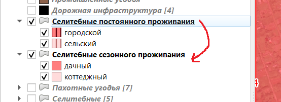
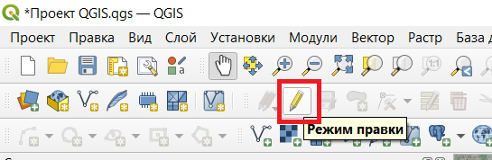
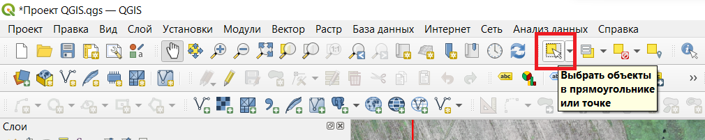
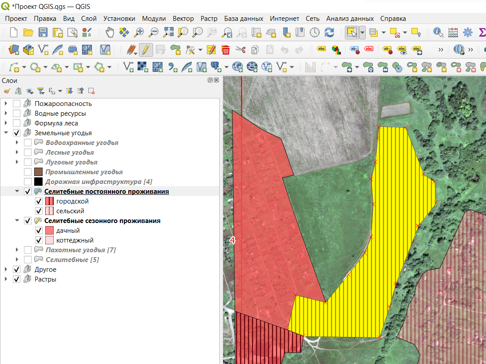
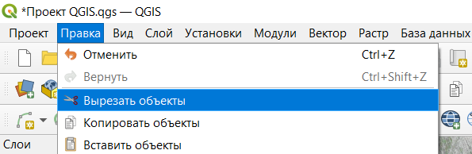
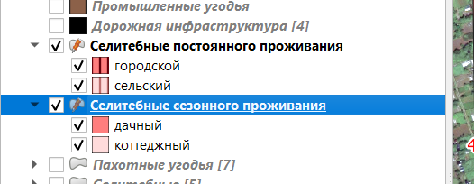
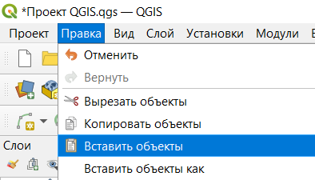
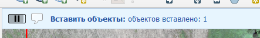
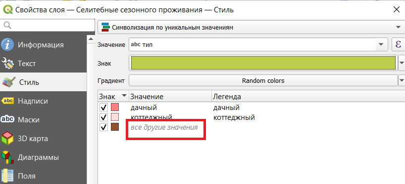

# Перемещение из слоя в слой

Допустим, необходимо перенести объект из слоя "Селитебные постоянного проживания" в слой "Селитебные сезонного проживания".

1. Оба слоя должны быть в режиме правки;
   
   

2. С помощью инструмента "Выбрать объекты..." необходимо выделить нужный объект в слое "Селитебные постоянного проживания";
   
   

3. Выделенный объект подсветится жёлтым цветом;
   
   

4. Правка -> Вырезать объекты (или просто Ctrl+X);
   
   

5. Активируем слой "Селитебные сезонного проживания";
   
   

6. Правка -> Вставить объекты (или просто Ctrl+V);
   
   

7. Должно появиться сообщение о том, что объекты были успешно вставлены;
   
   

Если QGIS говорит, что объекты были вставлены, но Вы их не видите, то, возможно, для них нет подходящего стиля.

Нужно зайти в свойства слоя и настроить стили для новых объектов:

