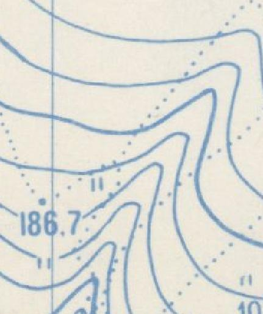
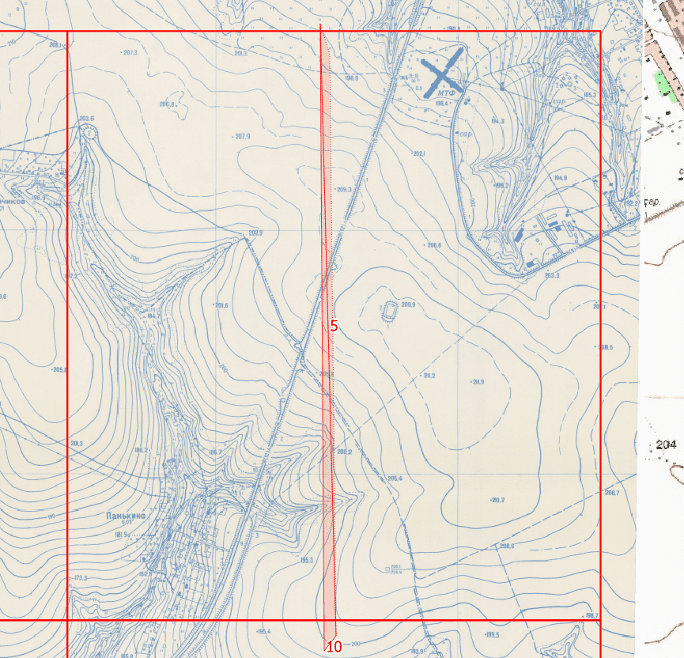
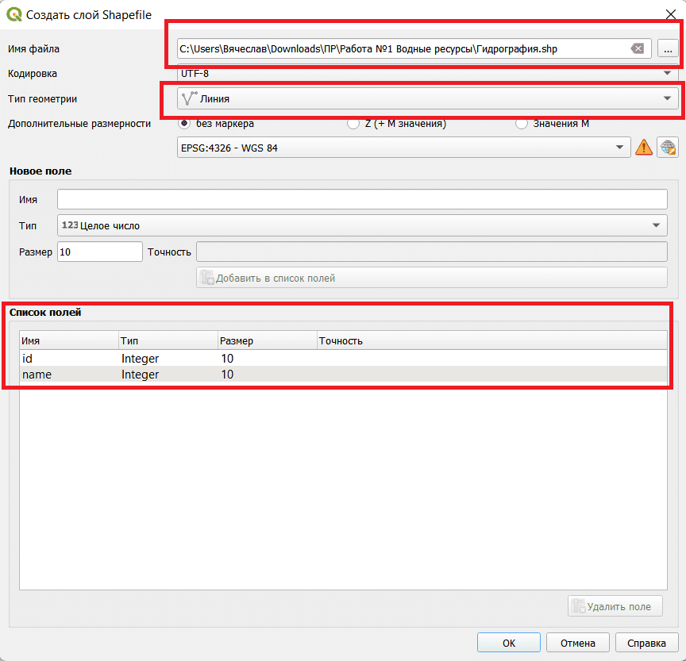
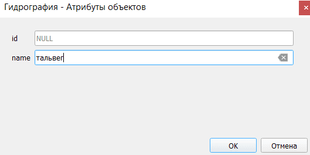
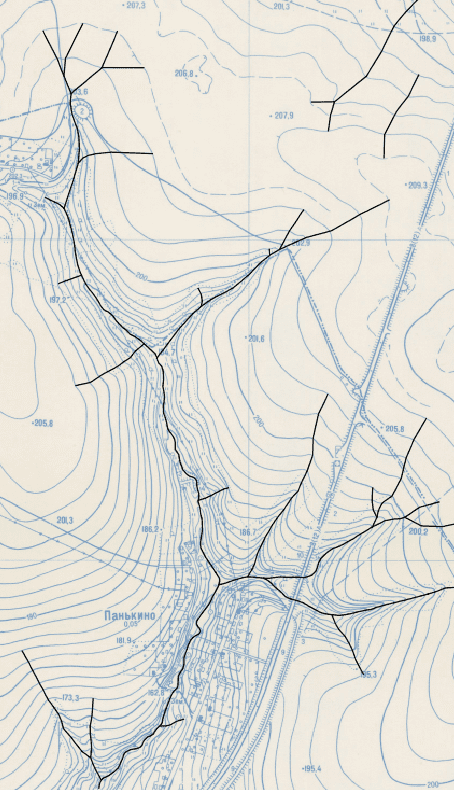
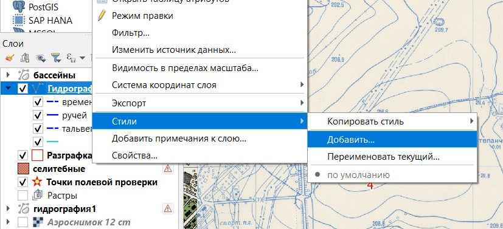
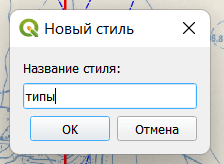
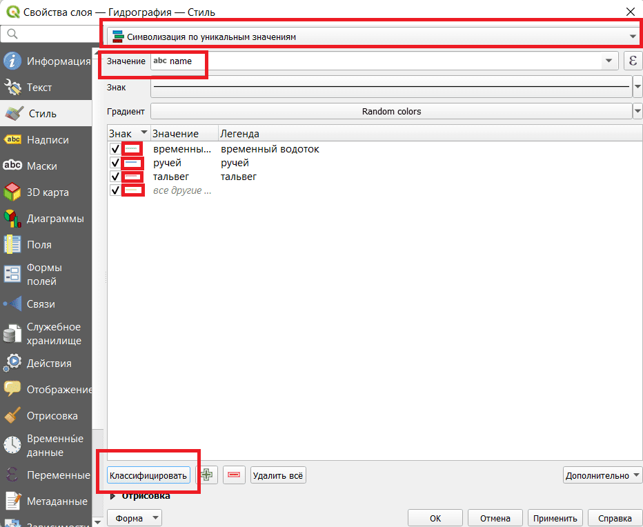
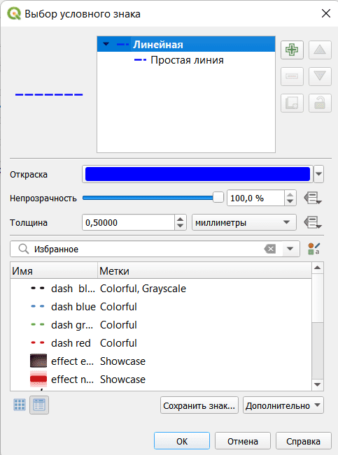
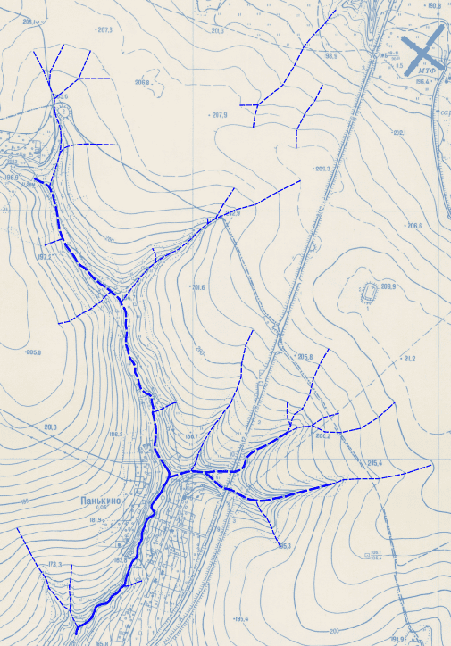

## Водотоки. Часть 1: Выделение водотоков

## Теория

Все водные ресурсы можно разделить по генезису:

1. Мировой океан;

2. Воды суши (делятся на водотоки и озёра);

3. Подземные воды.

**Ручьи** характеризуются узкой поймой, слабо выраженной долиной и часто представляют истоки рек ~~(Википедия)~~. На топографических картах обозначены сплошной линией без названия, скорости или направления течения.

**Река** – это постоянный водный поток, находящийся в движении бОльшую часть времени. На топографических картах обозначены сплошной линией с названием и скоростью и направлением течения.

**Временный водоток** – это водоток, который возникает периодически в течение года. Например, полгода течёт, полгода сухой. На топографических картах обозначены пунктирной линией.

**Тальвег** – это водоток, возникающий эпизодически. Они могут возникать, например, после дождя. На топографических картах никак не обозначаются. Их следует искать по таким изгибам горизонталей:

## Лабораторная

Для начала работы нужно открыть файл проекта. Если файл был скопирован в другую папку, то [могут возникнуть ошибки](../other/copy-project-file/page.html).

Ищем нужный полуквадрат. Для примера используется западная часть квадрата №5. В слое разграфка [добавляем многоугольник](../other/add-polygon/page.html) чтобы отделить полуквадраты. Атрибуты можно не заполнять. Необязательно рисовать границу точно по середине, можно примерно.

[Создаём слой](../other/add-layer/page.html), на котором будем обводить водотоки.

- Тип геометрии &mdash; линия;

- В "Список полей" нужно добавить поле с именем "name" и типом "Целое число";

- Поле id можно удалить, а можно и оставить.

Для удобства можно [включить привязку](../other/binding-parameters/page.html) к вершинам и линиям.

Теперь нужно обвести водотоки, опираясь на топокарту. То есть просто [провести линии](../other/add-linear/page.html) по тальвегам, ручьям и др. После создания каждой линии будет открываться окно атрибутов. В поле "name" нужно вписать одно из следующих значений в соответствии с типом водотока:

1. тальвег;

2. временный водоток;

3. ручей;

4. река.

Поле id можно оставить пустым.

В результате должно получиться что-то подобное:

Теперь нужно создать стиль для слоя. Назовём его "типы"

Затем входим в свойства слоя. Выбираем символизацию по уникальным значениям. Значение выбираем "name". Нажимаем "Классифицировать".

Двойным кликом по маленькому знаку можно перейти к окну изменения стиля для данного знака. Можно установить следующие значения:

1. Тальвег: цвет синий, толщина 0,26, линия пунктир;

2. Временный водоток: цвет синий, толщина 0,5, линия пунктир;

3. Ручей: цвет синий, толщина 0,5, линия сплошная;

4. Река: цвет синий, толщина 1, линия сплошная.

Подтверждаем изменения. В итоге должно получиться что-то подобное:

[Следующая часть](../p2-watercourses-rangs/page.html)

[На главную](../index.html)
