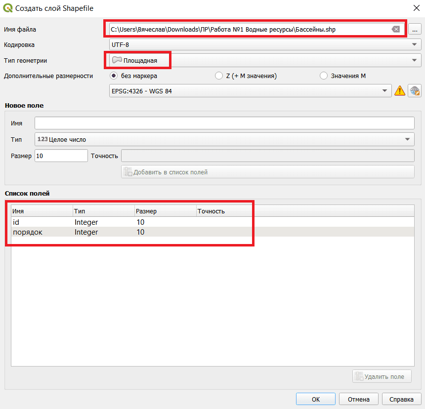
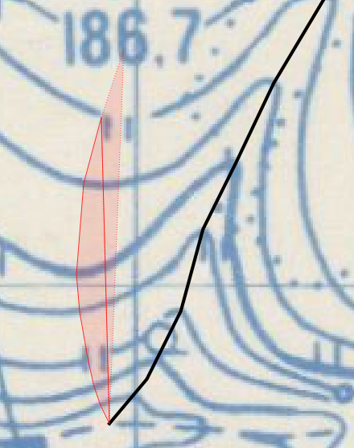
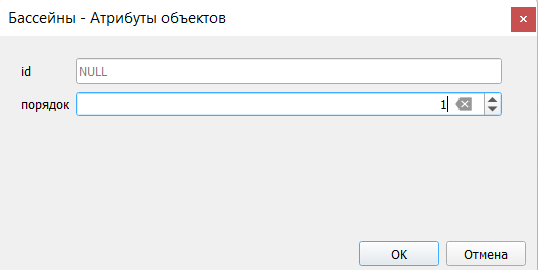
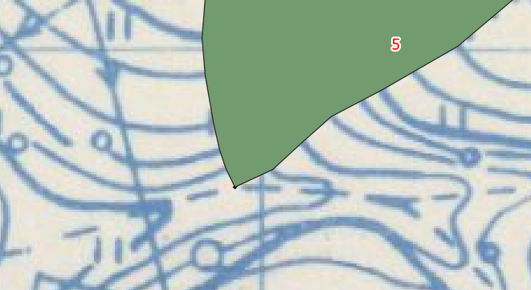
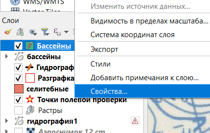
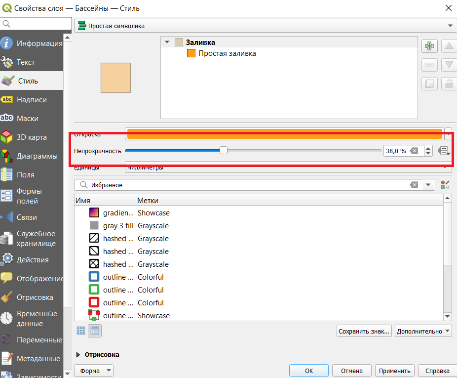
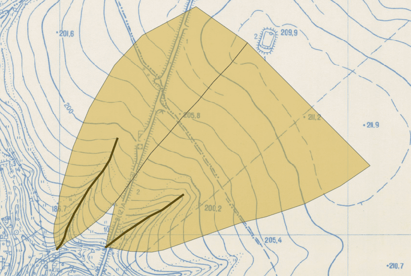
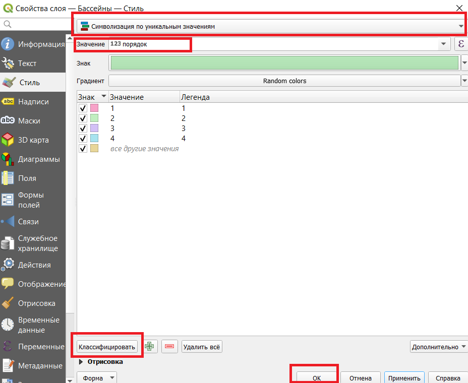
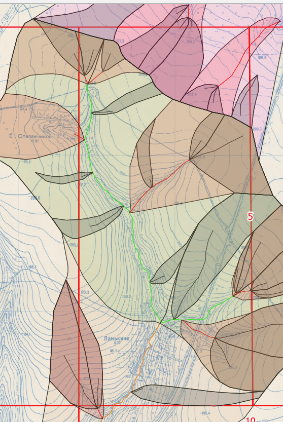
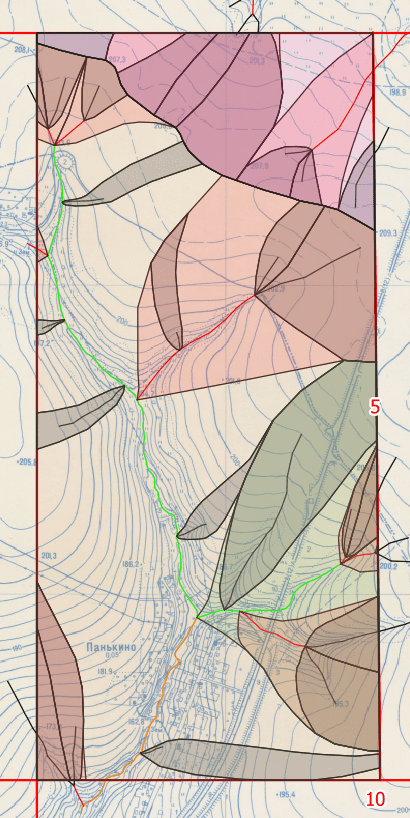

## Выделение бассейнов

### Теория

**Бассейн** – это территория, на которой вся вода попадает в данный водоток. Порядок бассейна соответствует порядку его водотока.

### Лабораторная

[Создаём новый слой](../other/add-layer/page.html) с названием "Бассейны" и типом геометрии "Площадная". Ещё создаём поле "порядок" (тип "целое число"). 

Также стОит [включить привязку](../other/binding-parameters/page.html) к вершинам созданного слоя.

Теперь начнём выделять бассейны ([создавать полигоны](../other/add-polygon/page.html)). Начинать нужно от "устья" каждого водотока и идти наверх, перпендикулярно горизонталям, пока линии с обеих сторон не сойдутся или пока не дойдут до водораздела.

Порядок бассейна соответствует порядку его водотока.

После создания объекта скорее всего окажется что он непрозрачный и за ним ничего не видно.

Заходим в стили слоя и устанавливаем подходящую прозрачность.

Пример ситуации, когда линии не сходятся, их прерывает водораздел:

После создания бассейнов нужно создать стили для каждого порядка. Заходим в свойства слоя, устанавливаем следующие настройки:

- "Символизацию по уникальным значениям"

- Значение "порядок"

Нажимаем "классифицировать", "ок".

В итоге должно получиться что-то подобное:

- На полуквадрате не должно остаться пустых мест;

- Линии должны быть плавными;

- Контуры бассейнов должны быть перпендикулярны к горизонталям;

- Бассейны более высокого порядка включают в себя бассейны низших порядков.

За границами своего полуквадрата можно, конечно, и не рисовать.

На этом с водными ресурсами всё.

[Следующая работа](../p4-landuse/page.html)

[Вернуться на главную](../index.html)
