## Определение формулы леса

### Теория

Проективное перекрытие &mdash; процент площади, которую занимает крона.

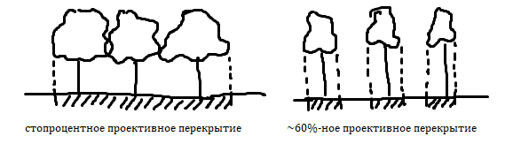

Если проективное покрытие составляет менее 40%, то участок считается редколесьем.

### Определение формулы леса

1. Выбирают наиболее характерный участок местности размером 20x20 м;

2. Считают количество деревьев (всего и по породам);

3. Определяют процентное соотношение.

Примеры:

- На участке насчитали 12 (60%) сосен и 8 (40%) берёз. Тогда формула леса будет следующей: **6С4Б**, где
  
  - 6 &mdash; десятки процентов сосен;
  
  - С &mdash; сосна;
  
  - 4 &mdash; десятки процентов берёз;
  
  - Б &mdash; берёза.

- Насчитали 13 (65%) дубов, 5 (25%) лип и 2 (10%) сосны. Формула леса: **7Д3Л+С**. В основной части формулы леса не учитываются деревья, составляющие менее 15%. Они записываются после знака плюса.

### Цветовые обозначения типов лесов по составу

- берёза (Б) &mdash; голубой;

- осина (Ос) &mdash; зелёный;

- липа (Л) &mdash; жёлтый;

- дуб (Д) &mdash; грязно-зелёный/хаки;

- ива (И) &mdash; розовый;

- чёрная ольха (Оч) — фиолетовый;

- тополь (Т) &mdash; сиреневый;

- сосна (С) &mdash; оранжевый;

- вяз (В) &mdash; горчичный;

- ель (Е) &mdash; красный.

Если лес состоит из нескольких разных пород, то используется следующее обозначение:

- Цвет фона &mdash; цвет основной породы;

- Цвет штриховки &mdash; цвет вторичной породы, толщина зависит от процентного соотношения основной и вторичной пород;

- Кружочками обозначаются породы, составляющие менее 15% от общего числа деревьев.

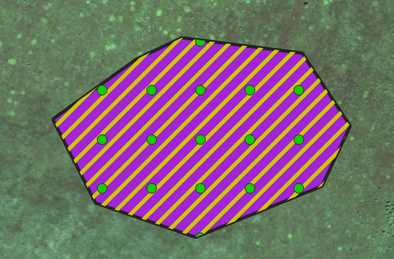

## Лабораторная

### Просмотр точек полевой проверки

Чтобы получить представление о том, как выглядят на космическом снимке разные породы деревьев, можно посмотреть на деревья, отмеченные как "Точки полевой проверки".

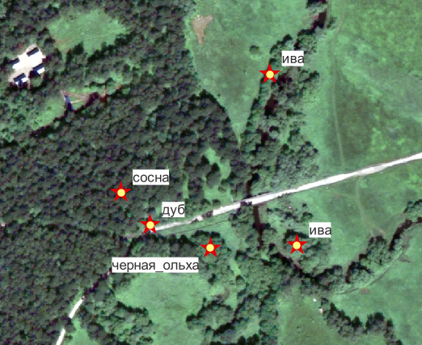

Выделим слой "Точки полевой проверки".

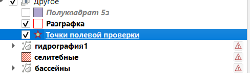

Включаем инструмент "Определить объекты" и нажимаем на любую из точек полевой проверки. Должно высветиться окно, в котором будет отображена порода дерева.

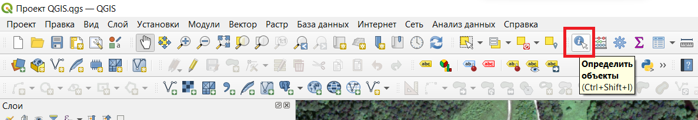

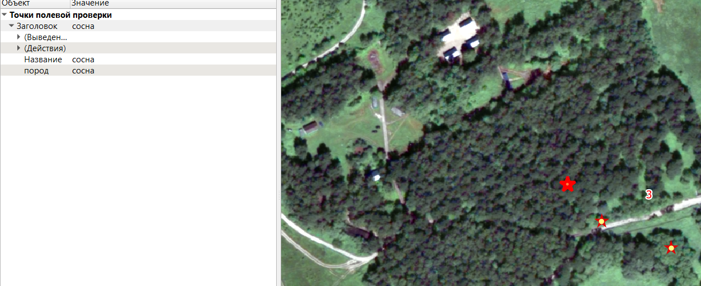

Для более точной классификации можно использовать числовые значения цвета каждой породы. Наш космоснимок состоит из трёх каналов: красного, зелёного и синего. Для разных пород характерны различные значения этих каналов.

Чтобы увидеть числовые значения пикселя на космоснимке, нужно сначала выделить слой "Космоснимок 50 cm"

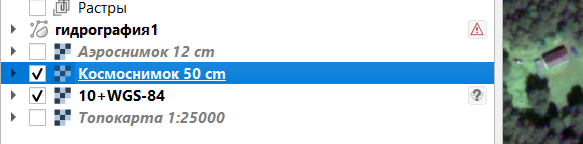

Затем всё тем же инструментом "Определить объекты" нажимаем на любой пиксель на космоснимке. Должно высветиться окно со значениями каждого канала.

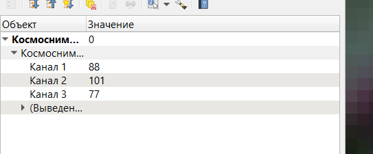

- Канал 1 &mdash; красный канал;

- Канал 2 — зелёный канал;

- Канал 3 — синий канал.

Используйте эту информацию как хотите.

### Выборки лесов

Для определения формулы леса нам необходимы выборки. Это участки леса, которые хорошо репрезентуют остальной лес.

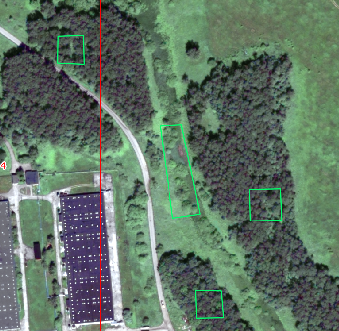

Так как в формуле леса максимум указываются три породы, можно [создать слой](../other/add-layer/page.html) со следующими полями:

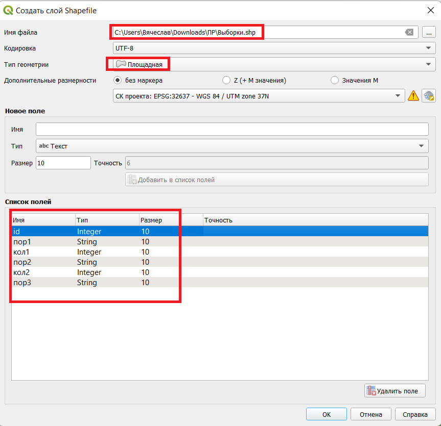

То есть:

- пор1 &mdash; первая порода; кол1 — количество деревьев этой породы;

- пор2 — вторая порода; кол2 — количество деревьев этой породы;

- пор3 — третья порода.

Однако, конечно, выбор способа выполнения задания остаётся за Вами. Можно делать даже в экселе. Главное &mdash; показать, что Вы умеете выражать формулу леса.

Нарисовав выборки, необходимо определить породы деревьев в площади выборки, их количество, посчитать формулу.

При определении породы дерева необходимо опираться не только на цвет кроны, но и на её размер, на обозначения на топографических картах и на интуицию.

### Раскрашивание знаков и подписи к ним

После определения формул необходимо раскрасить леса в соответствующие цвета.

Чтобы не обводить леса заново, можно [скопировать слой](../other/copy-layer/page.html) из предыдущей работы (по земельным угодьям).

Все леса необходимо [раскрасить](../other/styling/page.html) соответственно их формуле. Ещё можно [добавить подписи](../other/add-captions/page.html) формул:

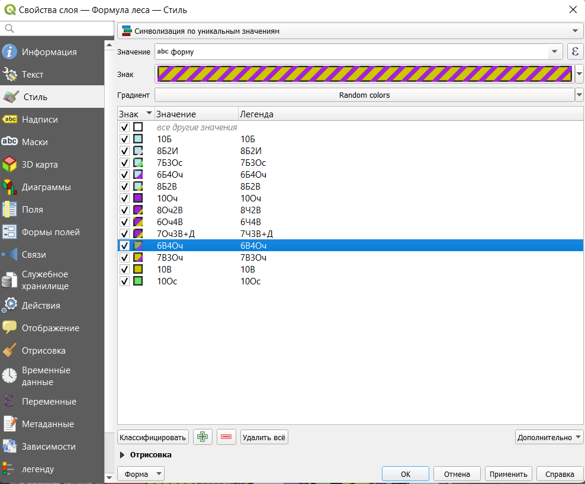

В результате должно получиться что-то такое:

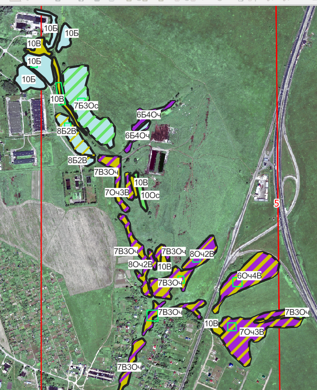

Или такое:

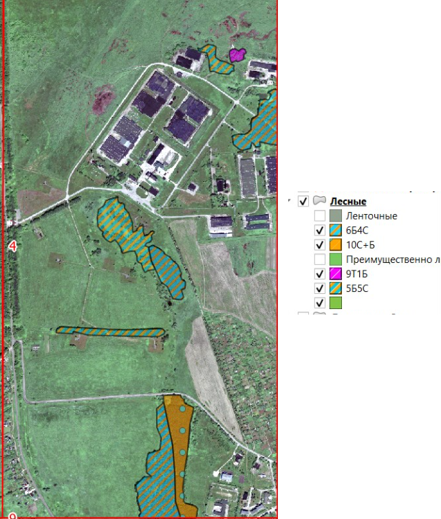

Или такое:

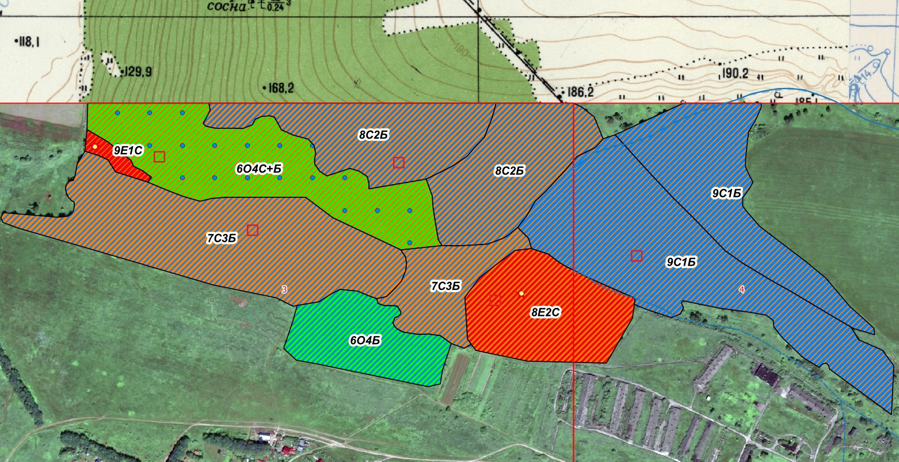

[На главную](../index.html)
